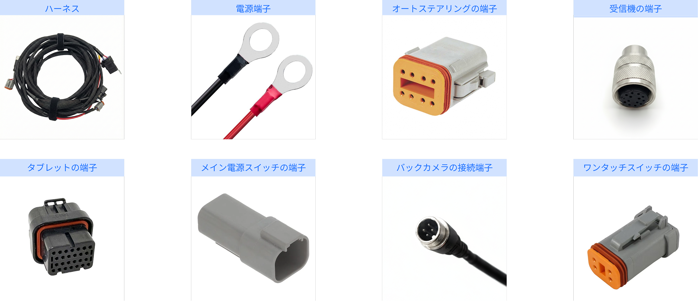
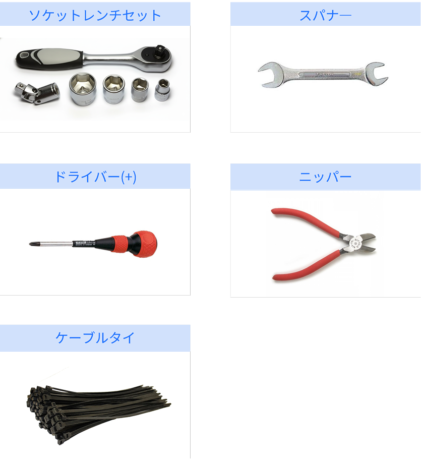

---
layout:
  width: default
  title:
    visible: true
  description:
    visible: false
  tableOfContents:
    visible: true
  outline:
    visible: true
  pagination:
    visible: true
  metadata:
    visible: true
  tags:
    visible: true
metaLinks:
  alternates:
    - >-
      https://app.gitbook.com/s/256Umh24fJVf6zNkZpSa/order-installation/product-installation/harness
---

# ハーネス

PLUVA iONの自動操舵に必要なハーネスを取り付けます。

***

### 必要な工具及び用意する物

#### 🔩 用意する物

<figure><figcaption></figcaption></figure>

#### 🛠️ 必要な工具

<figure><figcaption></figcaption></figure>

<table><thead><tr><th width="138.2777099609375">名称</th><th>規格</th><th>数量</th></tr></thead><tbody><tr><td>ソケットレンチ</td><td>8~13mm</td><td>1</td></tr><tr><td>スパナ－</td><td>8~13mm</td><td>1</td></tr><tr><td>ドライバー(+)</td><td>-</td><td>1</td></tr><tr><td>ニッパー</td><td>200mm 8"</td><td>1</td></tr><tr><td>インシュロック</td><td>6 X 150</td><td>15</td></tr></tbody></table>

***

### 取り付け方法


{% column width="83.33333333333334%" %}
**1. ハーネスの配線取り回し位置を確認します。**

<figure><figcaption></figcaption></figure>


{% column width="16.666666666666657%" %}





{% column width="83.33333333333334%" %}
**2. バッテリーが配置されているボンネットを開けます。**

<figure><figcaption></figcaption></figure>


{% column width="16.666666666666657%" %}





{% column width="83.33333333333334%" %}
**3. エンジンルームの保護カバーを取り外します。**

<figure><figcaption></figcaption></figure>


{% column width="16.666666666666657%" %}





{% column width="83.33333333333334%" %}
**4. 電源コネクターをバッテリー付近まで引き回します。**

<figure><figcaption></figcaption></figure>


{% column width="16.666666666666657%" %}





{% column width="83.33333333333334%" %}
**5. バッテリーに電源コネクターを接続します。**

<figure><figcaption></figcaption></figure>


{% column width="16.666666666666657%" %}





{% column width="83.33333333333334%" %}
**6. 取り外したエンジンルーム保護カバーを元通りに取り付けます。**

<figure><figcaption></figcaption></figure>


{% column width="16.666666666666657%" %}





{% column width="83.33333333333334%" %}
**7. ハーネスを挟み込まないよう注意しながら、ボンネットを閉めます。**

<figure><figcaption></figcaption></figure>


{% column width="16.666666666666657%" %}





{% column width="83.33333333333334%" %}
**8. 受信機のコネクターをトラクターの屋根上部へ引き回します。**

<figure><figcaption></figcaption></figure>


{% column width="16.666666666666657%" %}





{% column width="83.33333333333334%" %}
**9. ハーネス先の受信機コネクターを受信機本体に接続します。**

<figure><figcaption></figcaption></figure>


{% column width="16.666666666666657%" %}





{% column width="83.33333333333334%" %}
**10. 走行の妨げにならないよう、ハーネスをまとめます。**

<figure><figcaption></figcaption></figure>


{% column width="16.666666666666657%" %}





{% column width="83.33333333333334%" %}
**11. 電源ハーネスと受信機ハーネスを、走行の妨げにならないよう取り回します。**

<figure><figcaption></figcaption></figure>


{% column width="16.666666666666657%" %}





{% column width="83.33333333333334%" %}
**12. ステアリングモーターのコネクターをステアリングモーターに接続します。**

<figure><figcaption></figcaption></figure>


{% column width="16.666666666666657%" %}





{% column width="83.33333333333334%" %}
**13. ステアリング操作の妨げにならないよう、モーターハーネスを取り回します。**

<figure><figcaption></figcaption></figure>


{% column width="16.666666666666657%" %}





{% column width="83.33333333333334%" %}
**14. ブレーキペダルの操作に支障が出ないよう、配線を整理します。**

<figure><figcaption></figcaption></figure>


{% column width="16.666666666666657%" %}





{% column width="83.33333333333334%" %}
**15. タブレットのコネクターをタブレットの取り付け位置まで引き回します。**

<figure><figcaption></figcaption></figure>


{% column width="16.666666666666657%" %}





{% column width="83.33333333333334%" %}
**16. タブレットのコネクターをタブレット本体に接続します。**

<figure><figcaption></figcaption></figure>


{% column width="16.666666666666657%" %}





{% column width="83.33333333333334%" %}
**17. リレーの配線を整理します。**

<figure><figcaption></figcaption></figure>


{% column width="16.666666666666657%" %}





{% column width="83.33333333333334%" %}
**18. 各種操作の妨げにならないよう、最終的な配線整理を行います。**

<figure><figcaption></figcaption></figure>


{% column width="16.666666666666657%" %}



