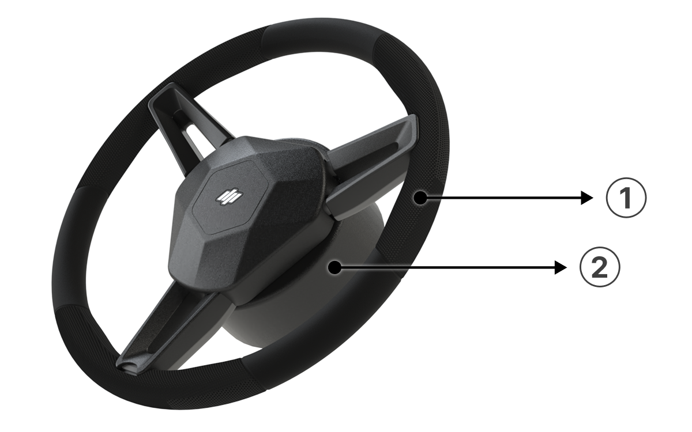
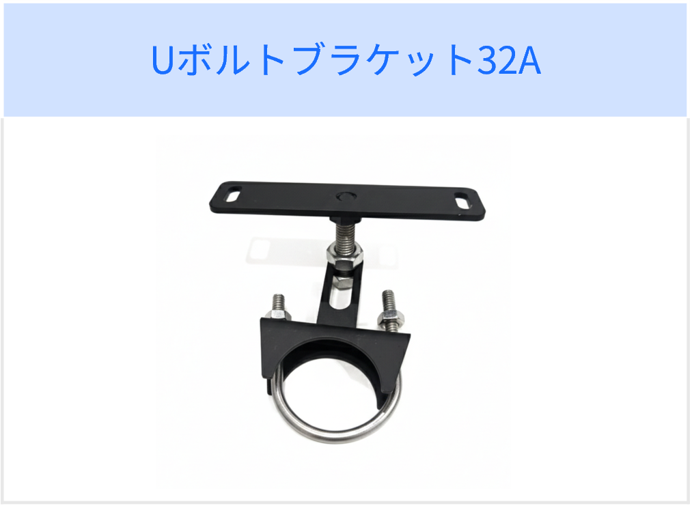
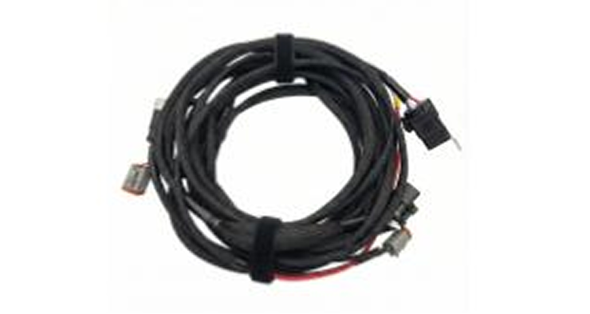

---
metaLinks:
  alternates:
    - >-
      https://app.gitbook.com/s/256Umh24fJVf6zNkZpSa/order-installation/product-installation/preparing-components
---

# 構成品の準備

### 構成品の準備

製品取付のために必要構成品を用意して下さい。

***

#### GNSS受信機

GNSS受信機は、RTKを基盤とした高精度位置情報を利用し、農業機械の位置を精密に把握できます。\
補正データを用いて位置補正が行われ、設定内容は使用環境により変更される場合があります。&#x20;

<figure><figcaption></figcaption></figure>

<table><thead><tr><th width="154.2626953125"></th><th></th></tr></thead><tbody><tr><td>用途 </td><td>GNSSを測位するためのデータ受信機器</td></tr><tr><td>寸法 </td><td>208 × 189 × 73 mm</td></tr><tr><td>RTK測位精度</td><td>水平: ±8mm + 1ppm RMS, 垂直: ±15mm + 1ppm RMS</td></tr><tr><td>
接続可能な

人工衛星
</td><td>GPS, GLONASS, Galileo, BDS, QZSS, SBAS (複数帯域に対応)</td></tr><tr><td>防水レベル</td><td>IP67</td></tr></tbody></table>

 LED表示ランプ

1. 左側のLED
   1. 電源及びシステムのハードウェアにおける異常有無

<figure><figcaption></figcaption></figure>

ステータス区分

<table data-header-hidden><thead><tr><th width="124.4921875"></th><th></th><th></th></tr></thead><tbody><tr><td>色</td><td>青（点灯）</td><td>黄色で点滅</td></tr><tr><td>ステータス</td><td>正常</td><td>エラー発生</td></tr><tr><td>イメージ</td><td></td><td></td></tr></tbody></table>

2. 中央のLED
   1. GNSS補正情報の受信有無

<figure><figcaption></figcaption></figure>

ステータス区分

<table data-header-hidden><thead><tr><th width="132.2408447265625"></th><th></th><th></th><th></th></tr></thead><tbody><tr><td>色</td><td>青（点灯）</td><td>青で点滅</td><td>OFF</td></tr><tr><td>ステータス</td><td>正常</td><td>5秒以上未受信</td><td>60秒以上未受信 （または受信記録なし）</td></tr><tr><td>イメージ</td><td></td><td></td><td></td></tr></tbody></table>

3. 右側のLED
   1. GNSS RTKのステータス

<figure><figcaption></figcaption></figure>

ステータス区分

<table data-header-hidden><thead><tr><th width="126.7890625"></th><th></th><th></th><th></th></tr></thead><tbody><tr><td>色</td><td>青（点灯）</td><td>青で点滅</td><td>OFF</td></tr><tr><td>ステータス</td><td>RTK信号良好</td><td>RTK信号普通</td><td>その他のステータス</td></tr><tr><td>イメージ</td><td></td><td></td><td></td></tr></tbody></table>

 QRコード：製品登録時に使用されるQRコードです。

***

#### 電動ステアリングホイール

農業機械の従来のハンドルを取り外し、ステアリング位置に取り付ける電動モーター式のステアリング装置です。生成された走行経路に基づきステアリングを制御し、一定の条件下で運転者のステアリング作業を補助します。

<figure><figcaption></figcaption></figure>

 ハンドル

 モーター

<table><thead><tr><th width="154.2626953125"></th><th></th></tr></thead><tbody><tr><td>用途</td><td>生成された仮想ラインに沿って物理的な操舵をするための機器</td></tr><tr><td>寸法</td><td>380 × 380 × 118 mm</td></tr><tr><td>定格トルク</td><td>7 Nm</td></tr><tr><td>最大トルク</td><td>13 Nm</td></tr><tr><td>防水レベル</td><td>IP65</td></tr></tbody></table>

#### フロントブラケット

<figure><figcaption></figcaption></figure>

***

#### タブレット

タブレットは、自動操舵システムを制御するためのディスプレイ装置です。
作業経路の設定や走行状態のモニタリング、システム制御及び各種設定ができ、リアルタイムでの位置情報や走行情報及びエラー状態を確認できます。

<figure><figcaption></figcaption></figure>

<figure><figcaption></figcaption></figure>

<table><thead><tr><th width="154.2626953125"></th><th></th></tr></thead><tbody><tr><td>用途</td><td>PLUVA iONの使用及び操作、圃場や経路を管理するためのタブレット</td></tr><tr><td>寸法</td><td>271 × 173 × 30 mm</td></tr><tr><td>解像度</td><td>1280 × 800 px</td></tr><tr><td>明るさ</td><td>750 nits</td></tr><tr><td>防水レベル</td><td>IP66</td></tr></tbody></table>

***

 メイン電源スイッチ

* 電動ステアリングホイールやGNSS受信機、タブレットなど、接続されたすべてのデバイスの電源を一回でオン/オフできます。

<figure><figcaption></figcaption></figure>

 タブレットスリープボタン

* タブレットの電源をオン、またはオフにします。

<figure><figcaption></figcaption></figure>

 右側(▶)

* 設定画面：選択項目を右へ移動します。
* 自動操舵中：等間隔のラインを右側に一定間隔で移動させます。
* ターン中：右側へ即時ターンします。

<figure><figcaption></figcaption></figure>

 左側(◀)

* 設定画面：選択項目を左へ移動します。
* 自動操舵中：等間隔ラインを左側に一定間隔で移動させます。
* ターン中：左側へ即時ターンします。

<figure><figcaption></figcaption></figure>

 選択 / 自動操舵ON・OFF

* 設定画面：選択項目を確定させます。
* 自動操舵中：自動操舵を開始、または解除します。

<figure><figcaption></figcaption></figure>

 キャンセル/前へ

* 前の画面に移動、または実施中の動作を中断します。

<figure><figcaption></figcaption></figure>

 お気に入り機能

* お客様がよく使う機能をお気に入りに登録し、ボタンを押すとその機能へ移動します。

<figure><figcaption></figcaption></figure>

 メインコネクター

* タブレットに電源やGNSS受信機、電動ステアリングホイールなどの各種製品を接続する装置です。

<figure><figcaption></figcaption></figure>

***

### ハーネス

ハーネスは、タブレットやGNSSなどの各デバイスを接続し、**電源および信号を伝達する**接続部品です。取付の際は、各デバイスが正常に動作するよう、ハーネスを正確に接続してください。

<figure><figcaption></figcaption></figure>

<table><thead><tr><th width="154.2626953125"></th><th></th></tr></thead><tbody><tr><td>用途</td><td>GNSS受信機、タブレット、ステアリングホイール、ワンタッチスイッチ、バックカメラから電源及びデータを受信するためのハーネス</td></tr><tr><td>ヒューズの規格</td><td>MIni fuse 30A</td></tr><tr><td>定格電圧</td><td>12V</td></tr><tr><td>リレー仕様</td><td>12V, 40A</td></tr><tr><td>その他</td><td>メイン電源スイッチとの接続必要</td></tr></tbody></table>

#### 各種端子の形

<figure><figcaption></figcaption></figure>

***

### カメラ

PLUVA iONには、周辺環境をモニタリングするためのカメラが構成品として含まれています。

<figure><figcaption></figcaption></figure>

<table><thead><tr><th width="154.2626953125"></th><th></th></tr></thead><tbody><tr><td>用途</td><td>後方の作業確認及び安定性を確保するためのカメラ</td></tr><tr><td>画質</td><td>1080p 720p CVBS</td></tr><tr><td>視野角</td><td>120</td></tr><tr><td>作動温度</td><td>-30°C ~ +80°C</td></tr><tr><td>防水レベル</td><td>IP67</td></tr></tbody></table>

トラクターの後部上側にカメラが取り付けられ、後方作業をモニタリングします。

<figure><figcaption></figcaption></figure>

***

#### ワンタッチスイッチ (オプション品)

ワンタッチスイッチは作業者が操作しやすい位置に取り付けられ、自動操舵システムの開始や停止などの主要機能を簡単に制御できます。


オプション品のため別途ご購入が必要となり、モデルタイプによっては外観や色がイメージと異なる場合があります。

<figure><figcaption></figcaption></figure>

<table><thead><tr><th width="154.2626953125"></th><th></th></tr></thead><tbody><tr><td>用途</td><td>タブレットを操作しやすくするためのリモコン</td></tr><tr><td>寸法</td><td>76 x 151 x 18 mm</td></tr><tr><td>重さ</td><td>0.144kg</td></tr><tr><td>素材</td><td>ABS</td></tr><tr><td>防水レベル</td><td>IP67</td></tr></tbody></table>

 状態

* 機能
  * 測位システムのステータス表記
* ステータス
  * 基本 - 未点灯
  * GPS信号良好 - 緑で点灯
  * GPS信号普通 - 緑で点滅

<figure><figcaption></figcaption></figure>

 お気に入り機能

* 機能
  * お気に入り機能
* ステータス
  * 基本 - 未点灯
  * ボタン動作 - 緑で点灯

<figure><figcaption></figcaption></figure>

 キャンセル  or　前へ

* 機能
  * 状況に応じたキャンセル/前のメニューへ移動
* ステータス
  * 基本 - 未点灯
  * ボタン動作 - 緑で点灯

<figure><figcaption></figcaption></figure>

 Enterキー

* 機能
  * A/B設定
  * メニュー内のOK/確定動作
* ステータス
  * 基本 - 未点灯
  * ボタン動作 - 緑で点灯

<figure><figcaption></figcaption></figure>

 左側(◀)

* 機能
  * 設定画面：選択項目を左へ移動します。
  * 自動操舵中：等間隔のラインを左側に一定間隔で移動させます。
  * ターン中：左側へ即時ターンします。
* ステータス
  * 基本 - 未点灯
  * ボタン動作 - 緑で点灯

<figure><figcaption></figcaption></figure>

 右側(▶)

* 機能
  * 設定画面：選択項目を右へ移動します。
  * 自動操舵中：等間隔のラインを右側に一定間隔で移動させます。
  * ターン中：右側へ即時ターンします。
* ステータス
  * 基本 - 未点灯
  * ボタン動作 - 緑で点灯

<figure><figcaption></figcaption></figure>

 自動操舵のON/OFF

* 機能
  * 自動操舵モードの開始及び解除
* ステータス
  * 基本 - 未点灯
  * ボタン動作 - 緑で点灯

<figure><figcaption></figcaption></figure>

