---
layout:
  width: default
  title:
    visible: true
  description:
    visible: false
  tableOfContents:
    visible: true
  outline:
    visible: true
  pagination:
    visible: true
  metadata:
    visible: true
  tags:
    visible: true
metaLinks:
  alternates:
    - /broken/spaces/YgZGmmCCfllSmVLHO3Uz/pages/De1T5eJZWNrq0VZoStCz
---

# 構成品のご用意

製品を取り付けるための各構成品を用意してください。

***

#### GNSS受信機

GNSS受信機は、RTK高精度位置情報を基に農業機械の位置を精密に把握します。補正データを通じて位置補正が行われ、設定内容は作業環境に合わせて調整が必要な場合があります。

<figure>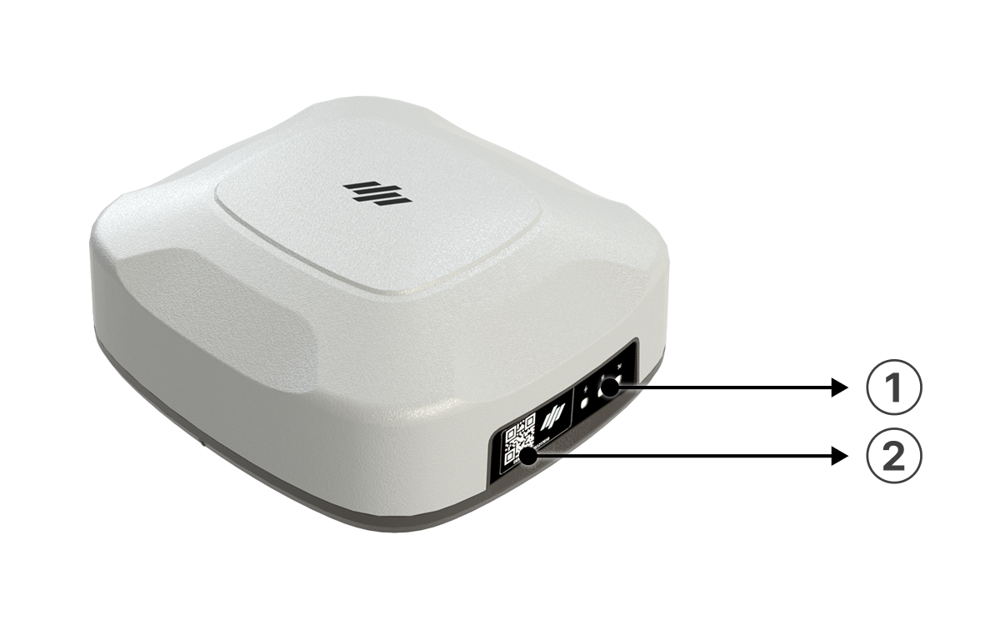<figcaption></figcaption></figure>

<table data-header-hidden><thead><tr><th width="154.2626953125"></th><th></th></tr></thead><tbody><tr><td>用途</td><td>GNSS測位用のデータ受信機</td></tr><tr><td>寸法</td><td>208 × 189 × 73 mm</td></tr><tr><td>RTK位置精度</td><td>水平：±8mm + 1ppm RMS、垂直：±15mm + 1ppm RMS</td></tr><tr><td>接続する衛星</td><td>GPS、GLONASS、Galileo、BDS、QZSS、SBAS（多帯域信号の受信に対応）</td></tr><tr><td>防水レベル</td><td>IP67</td></tr></tbody></table>

 ステータス表示LED

1. 左側LED
   1. 電源及びシステムのH/W異常の

<figure><figcaption></figcaption></figure>

ステータス区分

<table data-header-hidden><thead><tr><th width="118.2698974609375"></th><th></th><th></th></tr></thead><tbody><tr><td>色</td><td>青色（点灯）</td><td>黄色で点滅</td></tr><tr><td>ステータス</td><td>正常</td><td>エラー発生</td></tr><tr><td>画像</td><td></td><td>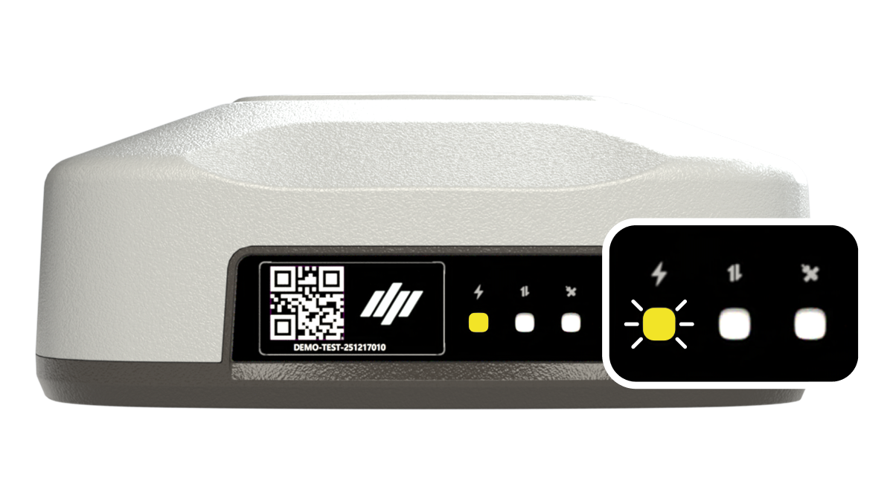</td></tr></tbody></table>

2. 真ん中のLED
   1. GNSS補正情報の受信

<figure>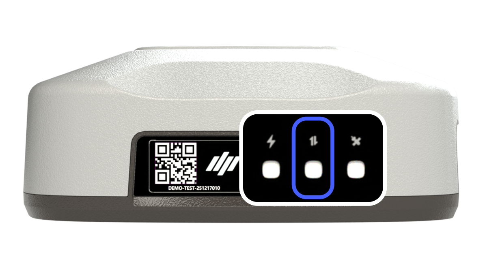<figcaption></figcaption></figure>

ステータス区分

<table data-header-hidden><thead><tr><th width="105.1297607421875"></th><th></th><th></th><th></th></tr></thead><tbody><tr><td>色</td><td>青色（点灯）</td><td>青色で点滅</td><td>OFF</td></tr><tr><td>ステータス</td><td>正常</td><td>5秒以上未受信</td><td>60秒以上未受信（または受信したことなし）</td></tr><tr><td>画像</td><td></td><td>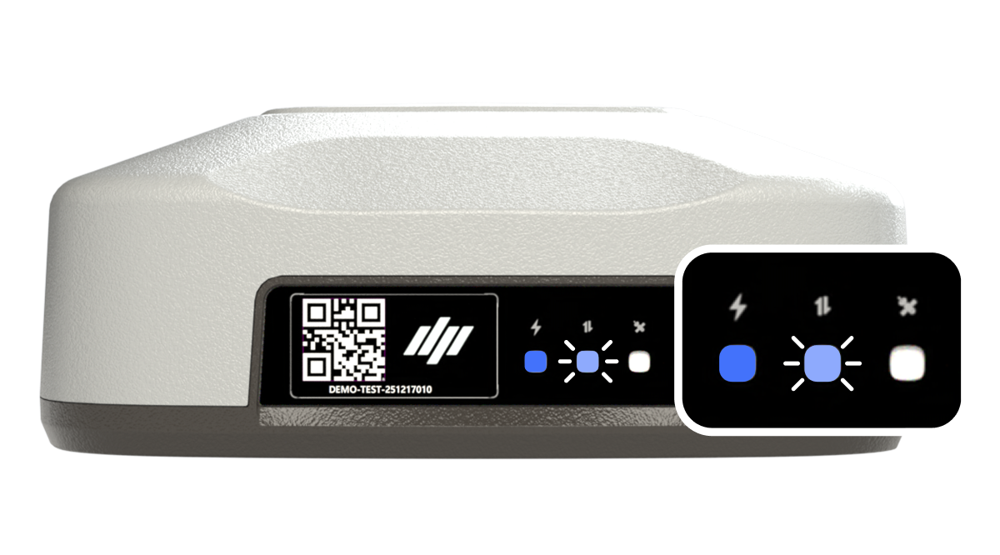</td><td>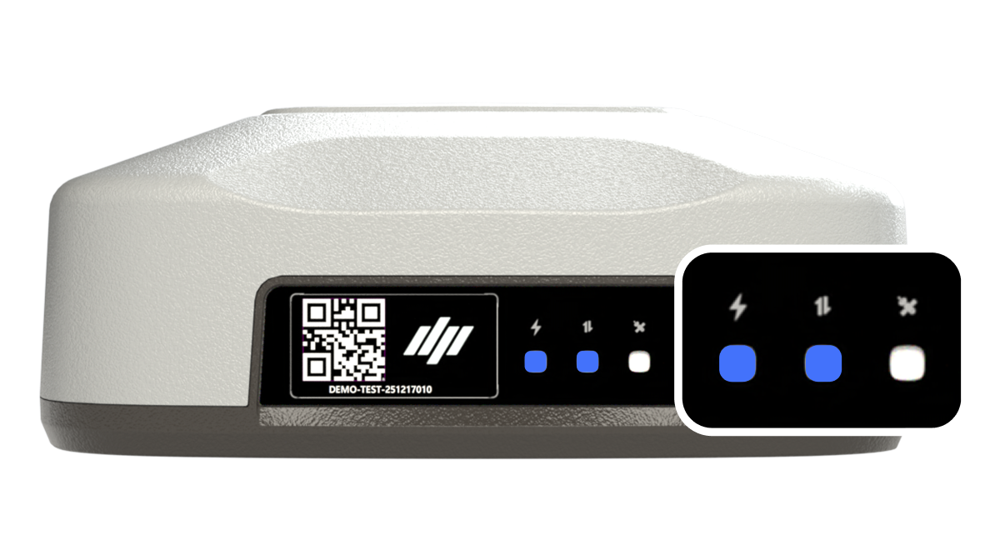</td></tr></tbody></table>

3. 右側LED
   1. GNSS RTKのステータス

<figure>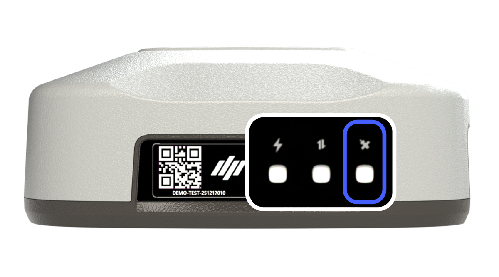<figcaption></figcaption></figure>

ステータス区分

<table data-header-hidden><thead><tr><th width="126.7890625"></th><th></th><th></th><th></th></tr></thead><tbody><tr><td>色</td><td>青色（点灯）</td><td>青色で点滅</td><td>OFF</td></tr><tr><td>ステータス</td><td>RTK Fixed</td><td>RTK Fixed Float</td><td>その他のステータス</td></tr><tr><td>画像</td><td>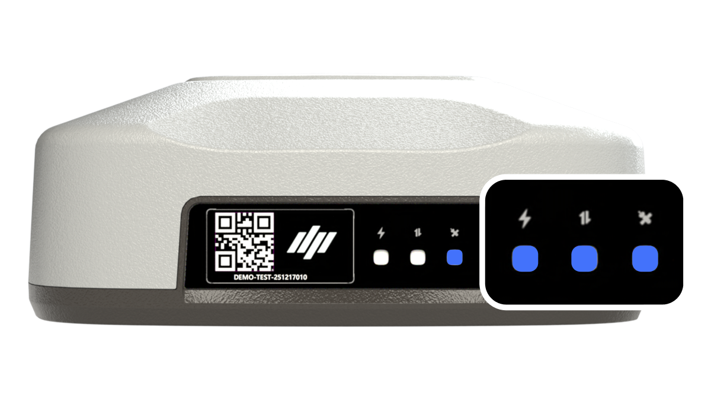</td><td></td><td></td></tr></tbody></table>

 QRコード：製品登録時に使用されるQRコードです。

***

#### 電動ステアリングホイール

電動ステアリングホイールは、農業機械の既存のハンドルを取り外した後、ステアリング位置に取り付ける電動モーター式のステアリング機器です。生成された走行経路を基にステアリングを制御し、一定の　条件下でドライバーのステアリング作業をサポートします。

<figure>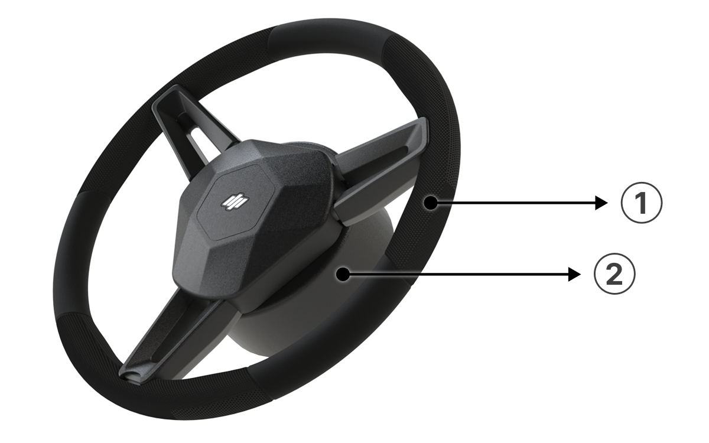<figcaption></figcaption></figure>

 ハンドル

 モーター

<table data-header-hidden><thead><tr><th width="154.2626953125"></th><th></th></tr></thead><tbody><tr><td>用途</td><td>生成された仮想ラインを追従するための物理的操舵に必要な機器</td></tr><tr><td>寸法</td><td>380 × 380 × 118 mm</td></tr><tr><td>定格トルク</td><td>7 Nm</td></tr><tr><td>最大トルク</td><td>13 Nm</td></tr><tr><td>防水レベル</td><td>IP65</td></tr></tbody></table>

#### フロントブラケット

<figure>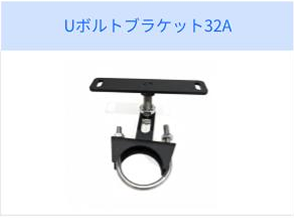<figcaption></figcaption></figure>

***

#### タブレット

タブレットは、自動操舵システムのディスプレイ機器です。作業経路の設定や走行状況のモニタリング、システム制御及び設定を行い、リアルタイムで位置・走行情報・エラー状態を確認できます。

<figure>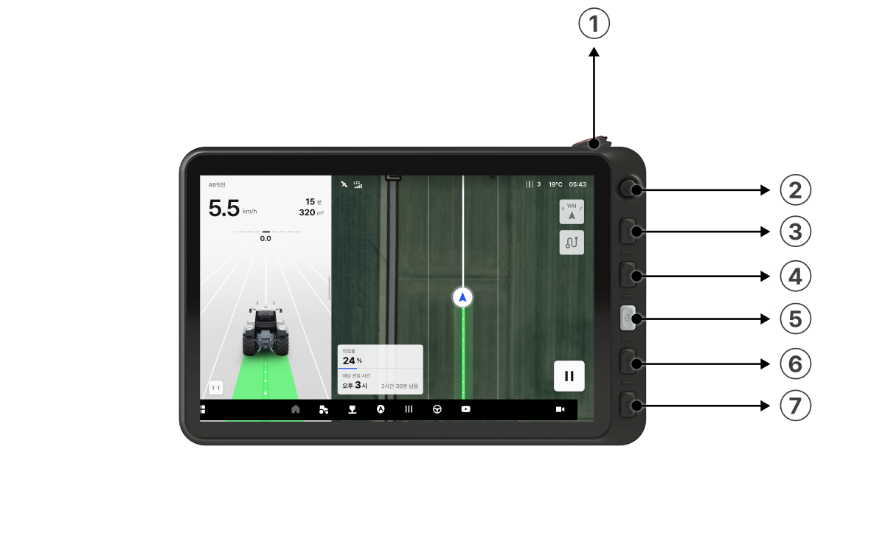<figcaption></figcaption></figure>

<figure>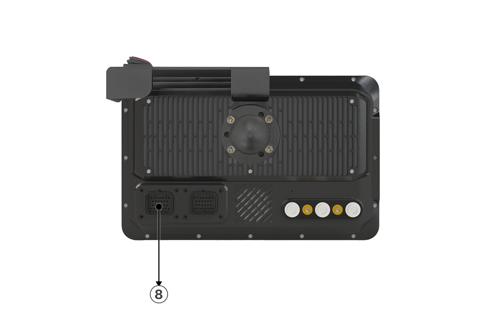<figcaption></figcaption></figure>

<table data-header-hidden><thead><tr><th width="154.2626953125"></th><th></th></tr></thead><tbody><tr><td>用途</td><td>PLUVA iONの使用及び操作、圃場、経路管理用のタブレット</td></tr><tr><td>寸法</td><td>271 × 173 × 30 mm</td></tr><tr><td>解像度</td><td>1280 × 800 px</td></tr><tr><td>明るさ</td><td>750 nits</td></tr><tr><td>防水レベル</td><td>IP66</td></tr></tbody></table>

***

 メイン電源スイッチ

* 電動ステアリングホイール、GNSS受信機、タブレットなど、接続されたすべての機器の電源及び暗電流を一括でオン・オフします。

<figure>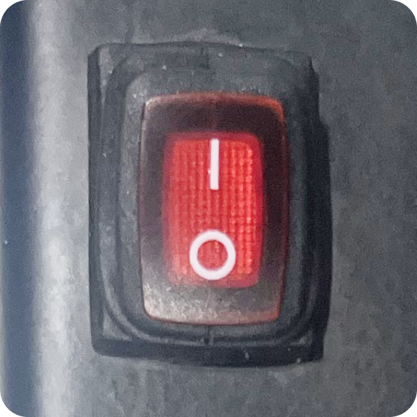<figcaption></figcaption></figure>


タブレットの電源ON/OFF

タブレットを安定してご使用いただくため、以下の手順に従って電源のオン・オフを行てください。

* **電源を入れるとき：メイン電源スイッチをONに設定します。**
* **電源を切るとき：タブレットのスリープボタンを3\~5秒間長押しし、画面が消えたことを確認します。その後、メイン電源スイッチをOFFに設定してください。**



メイン電源スイッチのみで電源を切ると、タブレットがシャットダウンされない場合があります。必ずタブレットのスリープボタンで画面を消してから、メイン電源スイッチをOFFに設定してください。



タブレットを終了した後も、暗電流が流れるため、トラクターのバッテリーが上がる恐れがあります。長時間使用しない場合は、使用後に必ずメイン電源スイッチで電源を遮断してください。


 タブレットのスリープボタン

* タブレットの電源をオン・オフします。

<figure><figcaption></figcaption></figure>

 右へ（▶）

* 設定画面：選択項目を右へ動かします。

<figure><figcaption></figcaption></figure>

 左へ（◀）

* 設定画面：選択項目を左へ動かします。

<figure>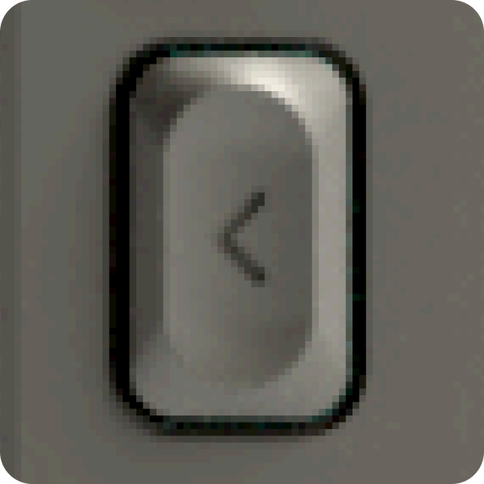<figcaption></figcaption></figure>

 選択・自動操舵ボタン

* 設定画面：選択を確定させます。
* 自動操舵中：自動操舵を開始、または解除します。

<figure><figcaption></figcaption></figure>

 キャンセル・戻る

* 前の画面に戻る、または実行中の操作を取り消します。

<figure><figcaption></figcaption></figure>

 マルチ機能（お気に入り）

* お客様が主に使う機能をお気に入り登録し、ボタンを押すとその機能へアクセスします。

<figure><figcaption></figcaption></figure>

 メインコネクター

* タブレットに電源やGNSS受信機、電動ステアリングホイールなどの各構成品を接続します。

<figure>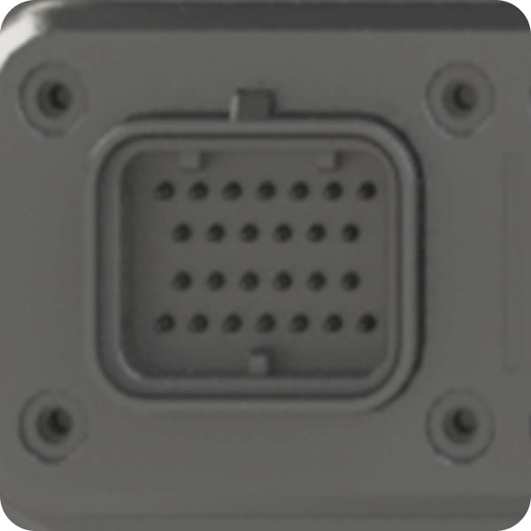<figcaption></figcaption></figure>

***

### ハーネス

ハーネスは、タブレットやGNSS受信機などの各構成品を接続し、**電源および信号を送信**するための部品です。取り付けの際には、各装置が正常作動するよう、ハーネスを正確に接続してください。

<figure>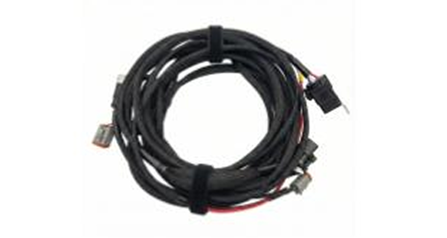<figcaption></figcaption></figure>

<table data-header-hidden><thead><tr><th width="154.2626953125"></th><th></th></tr></thead><tbody><tr><td>用途</td><td>GNSS受信機、タブレット、電動ステアリングホイール、ワンタッチスイッチ、バックカメラに電源供給およびデータ受信</td></tr><tr><td>ヒューズ定格</td><td>MIni fuse 30A</td></tr><tr><td>定格電圧</td><td>12V</td></tr><tr><td>リレー定格</td><td>12V, 40A</td></tr><tr><td>その他</td><td>メイン電源スイッチとの接続必要</td></tr></tbody></table>

#### コネクターの外観図

<figure>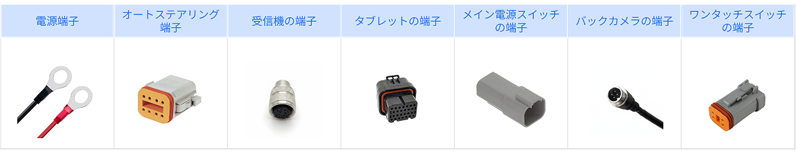<figcaption></figcaption></figure>

***

### カメラ

PLUVA iONには、周囲の環境をモニタリングするカメラが構成品として含まれています。

<figure>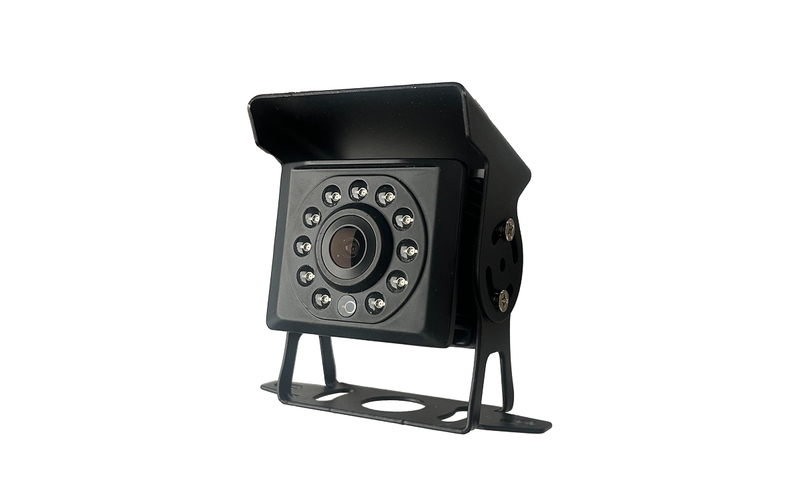<figcaption></figcaption></figure>

<table data-header-hidden><thead><tr><th width="154.2626953125"></th><th></th></tr></thead><tbody><tr><td>用途</td><td>後方作業の様子をモニタリング及び安全確保</td></tr><tr><td>画質</td><td>1080p 720p CVBS</td></tr><tr><td>視野角</td><td>120</td></tr><tr><td>作動温度</td><td>-30°C ~ +80°C</td></tr><tr><td>防水レベル</td><td>IP67</td></tr></tbody></table>

トラクターの後方の上部にカメラを取り付け、後方作業の様子をモニタリングします。

<figure>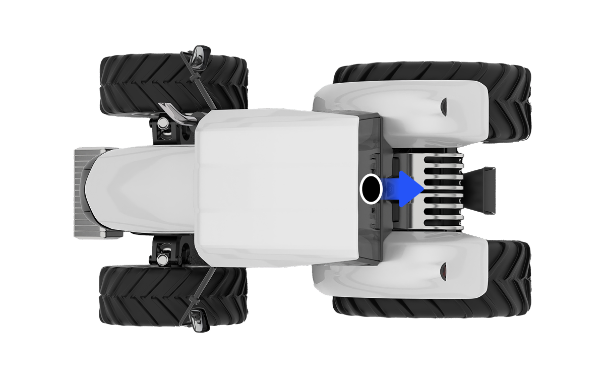<figcaption></figcaption></figure>

***

#### ワンタッチスイッチ（オプション品）

ワンタッチスイッチは、作業者が操作しやすい位置に取り付け、自動操舵の開始及び解除などの主な機能を手軽に制御できる機器です。オプション品のため、別途購入する必要があり、型番によって外観や色が画像と異なる場合があります。

<figure>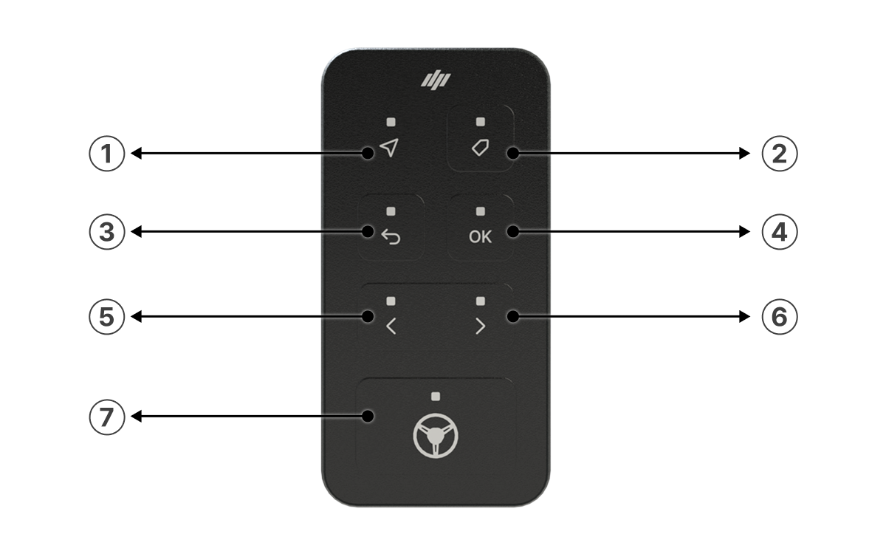<figcaption></figcaption></figure>

<table data-header-hidden><thead><tr><th width="154.2626953125"></th><th></th></tr></thead><tbody><tr><td>用途</td><td>タブレットの操作をより快適にするための専用リモコン</td></tr><tr><td>寸法</td><td>76 x 151 x 18 mm</td></tr><tr><td>重量</td><td>0.144kg</td></tr><tr><td>素材</td><td>ABS</td></tr><tr><td>防水レベル</td><td>IP67</td></tr></tbody></table>

 ステータス

* 機能
  * 測位システムのステータス表示
* ステータス
  * 通常 ‐ 未点灯
  * GPS信号良好 ‐ 緑色で点灯
  * GPS信号普通 - 緑色で点滅

<figure><figcaption></figcaption></figure>

 マルチ機能

* ​機能
  * お気に入り機能
* ステータス
  * 通常 - 未点灯
  * ボタン作動 - 緑色で点灯

<figure><figcaption></figcaption></figure>

 キャンセル or
戻る

* 機能
  * 状況に応じてキャンセル・前のメニューへ戻る
* ステータス
  * 通常 - 未点灯
  * ボタン作動 - 緑色で点灯

<figure><figcaption></figcaption></figure>

 確定

* 機能
  * A/Bの設定
  * メニュー内でOK・確定の作動
* ステータス
  * 通常 - 未点灯
  * ボタン作動 - 緑色で点灯

<figure><figcaption></figcaption></figure>

 左へ（◀）

* 機能
  * 設定画面：選択項目を左へ動かします。
* ステータス
  * 通常 - 未点灯
  * ボタン作動 - 緑色で点灯

<figure><figcaption></figcaption></figure>

 右へ（▶）

* 機能
  * 設定画面：選択項目を右へ動かします。
* ステータス
  * 通常 - 未点灯
  * ボタン作動 - 緑色で点灯

<figure><figcaption></figcaption></figure>

 自動操舵ON・OFF

* 機能
  * 自動操舵モードを開始及び解除
* ステータス
  * 通常 - 未点灯
  * ボタン作動 - 緑色で点灯

<figure><figcaption></figcaption></figure>

