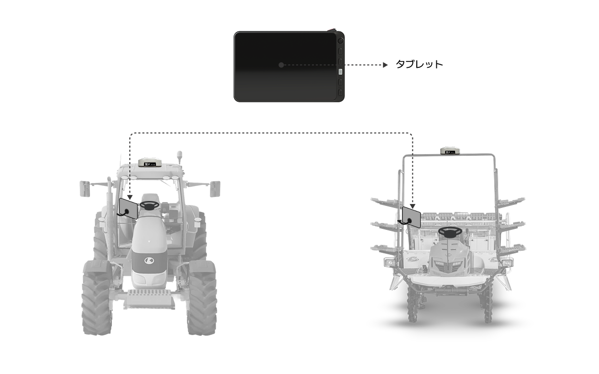

---
layout:
  width: default
  title:
    visible: false
  description:
    visible: false
  tableOfContents:
    visible: true
  outline:
    visible: true
  pagination:
    visible: true
  metadata:
    visible: true
  tags:
    visible: true
metaLinks:
  alternates:
    - >-
      https://app.gitbook.com/s/256Umh24fJVf6zNkZpSa/order-installation/product-installation/product-location
---

# 製品の取り付け位置 (제품 설치 위치

### 製品の取り付け位置

各構成品は、農業機械の指定された位置に取り付けられます。\
ただし、実際の取り付け位置は、車両モデル及び取り付けキットの構成によって異なる場合があります。

<figure><figcaption></figcaption></figure>

***

### エクスパンションキット使用方法

エクスパンションキット（Expansion Kit）を活用することで、1台のタブレットで複数台の農機の自動操舵が可能になります。

<figure><figcaption></figcaption></figure>


\[エクスパンションキット]
\
タブレットを除いた経済的なキットです。GNSS受信機、電動ステアリングホイール、カメラが含まれています。ご注文の前に、PLUVA iONタブレットをお持ちであることをご確認ください。

