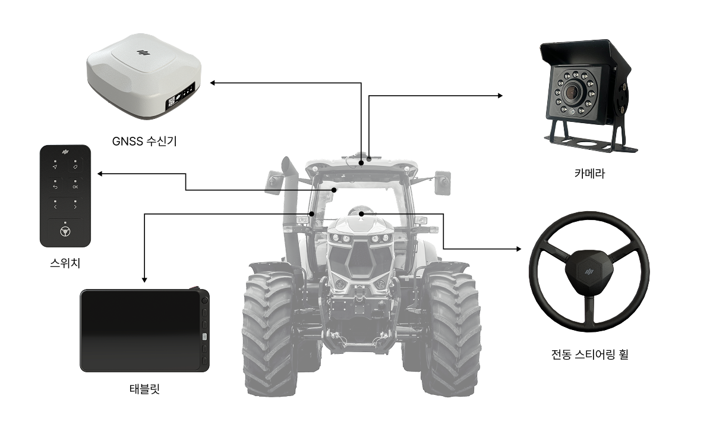
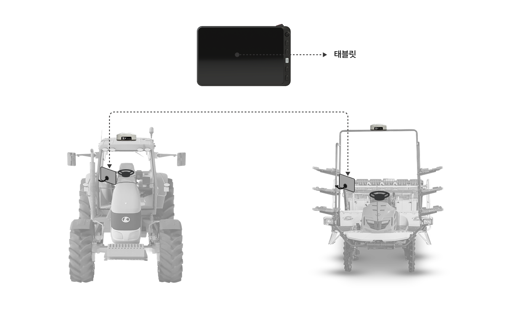

---
layout:
  width: default
  title:
    visible: true
  description:
    visible: false
  tableOfContents:
    visible: true
  outline:
    visible: true
  pagination:
    visible: true
  metadata:
    visible: true
  tags:
    visible: true
metaLinks:
  alternates:
    - >-
      https://app.gitbook.com/s/YgZGmmCCfllSmVLHO3Uz/order-installation/product-installation/product-location
---

# 構成品の取り付け位置

各構成品は、農業機械の指定された位置に取り付ける必要があります。\
ただし、実際の取り付け位置は、車両の型番及び取り付けるキット内容によって変更になる場合があります。

<figure><figcaption></figcaption></figure>

***

### エクスパンションキット（拡張キット）の導入ガイド

エクスパンションキットを導入することで「1台のタブレット」を複数の農業機械で共有し、自動操舵機能を活用できます。

<figure><figcaption></figcaption></figure>


**\[エクスパンションキット（拡張キット）]** \
タブレットを除いた、経済的な拡張型パッケージです。\
GNSS受信機、電動ステアリングホイール、カメラが含まれます。注文前にPLUVA iONのタブレットを保有していることをご確認ください。

