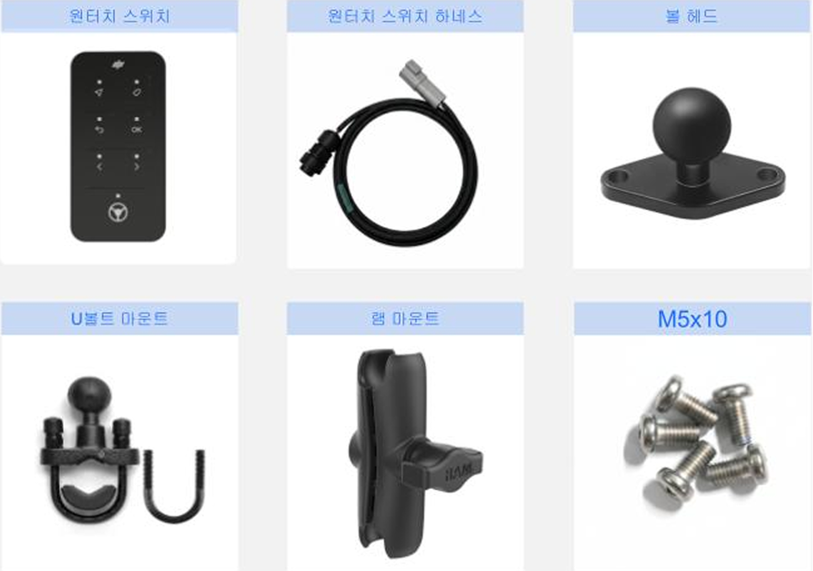
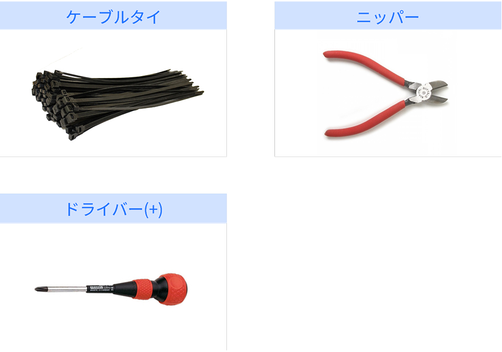

---
metaLinks:
  alternates:
    - >-
      https://app.gitbook.com/s/256Umh24fJVf6zNkZpSa/order-installation/product-installation/switch
---

# 스위치

## 스위치

플루바 아이온 자율주행에 필요한 스위치를 설치합니다.

***

### 필요 공구 및 준비물

#### 🔩 준비물

<figure><figcaption></figcaption></figure>

<table><thead><tr><th width="173.3984375">이름</th><th>규격</th><th>수량</th></tr></thead><tbody><tr><td>원터치 스위치</td><td>-</td><td>1</td></tr><tr><td>원터치 스위치 하네스</td><td>-</td><td>1</td></tr><tr><td>U볼트 마운트</td><td>-</td><td>1</td></tr><tr><td>테블릿 고정 볼트</td><td>M5 X 10</td><td>2</td></tr><tr><td>램마운트 볼</td><td>-</td><td>1</td></tr></tbody></table>

#### 🛠️ 필요 공구

<figure><figcaption></figcaption></figure>

<table><thead><tr><th width="130.5">이름</th><th>규격</th><th>수량</th></tr></thead><tbody><tr><td>케이블타이</td><td>6 X 150</td><td>10</td></tr><tr><td>드라이버(+)</td><td>4mm, 5mm</td><td>1</td></tr><tr><td>니퍼</td><td>200mm 8"</td><td>1</td></tr></tbody></table>

***

### 설치 방법


{% column width="58.333333333333336%" %}
#### 1. 스위치에 볼 헤드를 결합합니다.

<figure><figcaption></figcaption></figure>



{% column width="41.666666666666664%" %}





{% column width="58.333333333333336%" %}
#### **2.** U볼트 마운트를 손잡이 봉에 결합합니다.&#x20;

<figure><figcaption></figcaption></figure>



{% column width="41.666666666666664%" %}





{% column width="58.333333333333336%" %}
#### **3.** U볼트 마운트에 램 마운트를 결합합니다.

<figure><figcaption></figcaption></figure>



{% column width="41.666666666666664%" %}





{% column width="58.333333333333336%" %}
#### **4.** 램 마운트에 스위치를 결합합니다.

<figure><figcaption></figcaption></figure>



{% column width="41.666666666666664%" %}





{% column width="58.333333333333336%" %}
#### **5.** 스위치에 하네스를 결합합니다.

<figure><figcaption></figcaption></figure>



{% column width="41.666666666666664%" %}





{% column width="58.333333333333336%" %}
#### **6.** 스위치 하네스와 메인 하네스를 결합합니다.

<figure><figcaption></figcaption></figure>



{% column width="41.666666666666664%" %}




