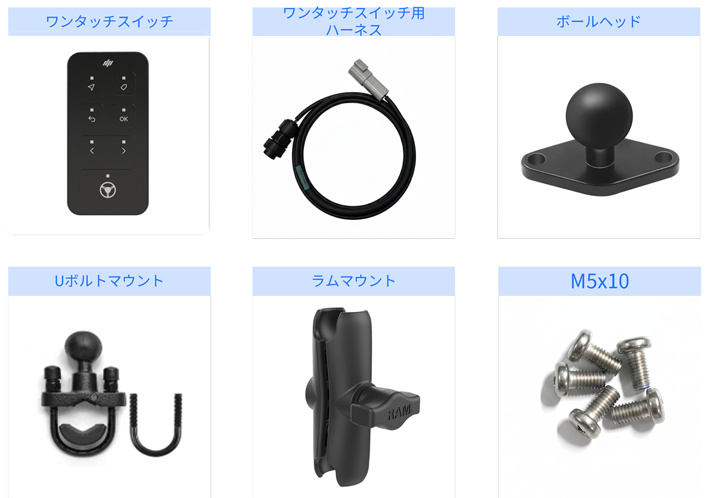
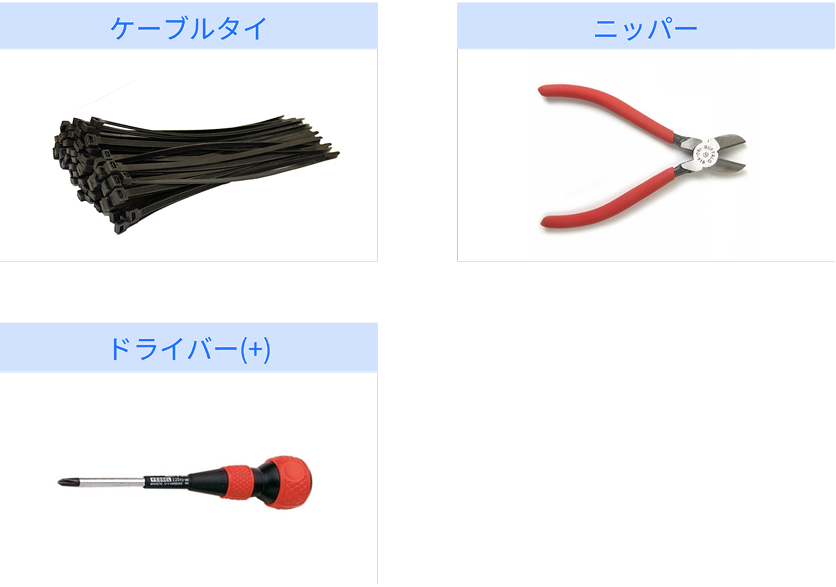

---
layout:
  width: default
  title:
    visible: true
  description:
    visible: false
  tableOfContents:
    visible: true
  outline:
    visible: true
  pagination:
    visible: true
  metadata:
    visible: true
  tags:
    visible: true
metaLinks:
  alternates:
    - >-
      https://app.gitbook.com/s/256Umh24fJVf6zNkZpSa/order-installation/product-installation/switch
---

# ワンタッチスイッチ

PLUVA iONの操作性を向上させる、ワンタッチスイッチを取り付けます。

***

### 必要な工具及び用意する物

#### 🔩 用意する物

<figure><figcaption></figcaption></figure>

<table><thead><tr><th width="186.7318115234375">名称</th><th>規格</th><th>数量</th></tr></thead><tbody><tr><td>ワンタッチスイッチ</td><td>-</td><td>1</td></tr><tr><td>ワンタッチスイッチ用ハーネス</td><td>-</td><td>1</td></tr><tr><td>Uボルトマウント</td><td>-</td><td>1</td></tr><tr><td>
ワンタッチスイッチ用

固定ボルト
</td><td>M5 X 10</td><td>2</td></tr><tr><td>ラムマウントボール</td><td>-</td><td>1</td></tr></tbody></table>

#### 🛠️ 必要な工具

<figure><figcaption></figcaption></figure>

<table><thead><tr><th width="139.388916015625">名称</th><th>規格</th><th>数量</th></tr></thead><tbody><tr><td>インシュロック</td><td>6 X 150</td><td>10</td></tr><tr><td>ドライバー(+)</td><td>4mm, 5mm</td><td>1</td></tr><tr><td>ニッパー</td><td>200mm 8"</td><td>1</td></tr></tbody></table>

***

### 取り付け方法


{% column width="83.33333333333334%" %}
#### 1. ワンタッチスイッチにボールヘッドを取り付けます。

<figure><figcaption></figcaption></figure>



{% column width="16.666666666666657%" %}





{% column width="83.33333333333334%" %}
#### **2.** Uボルトマウントをグリップ棒に固定します。&#x20;

<figure><figcaption></figcaption></figure>



{% column width="16.666666666666657%" %}





{% column width="83.33333333333334%" %}
#### **3.** Uボルトマウントにラムマウントを結合します。

<figure><figcaption></figcaption></figure>



{% column width="16.666666666666657%" %}





{% column width="83.33333333333334%" %}
#### **4. ラムマウントにワンタッチスイッチを固定します。**

<figure><figcaption></figcaption></figure>



{% column width="16.666666666666657%" %}





{% column width="83.33333333333334%" %}
#### **5. ワンタッチスイッチにハーネスを接続します。**

<figure><figcaption></figcaption></figure>



{% column width="16.666666666666657%" %}





{% column width="83.33333333333334%" %}
#### **6. ワンタッチスイッチのハーネスとメインハーネスを接続します。**

<figure><figcaption></figcaption></figure>



{% column width="16.666666666666657%" %}




