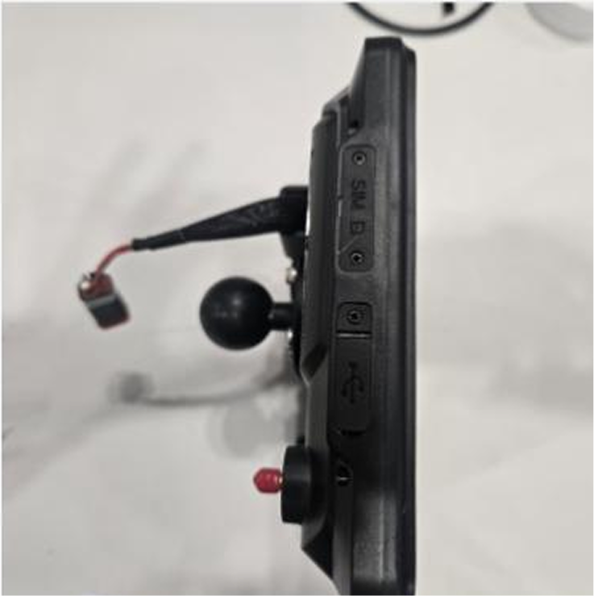

---
metaLinks:
  alternates:
    - >-
      https://app.gitbook.com/s/256Umh24fJVf6zNkZpSa/order-installation/product-installation/tablet
---

# タブレットの取り付け&#x20;

## タブレットの取り付け

플루바 아이온 자율주행에 필요한 태블릿를 설치합니다.

***

### 必要工具および準備物

#### 🔩 用意する物

<figure><figcaption></figcaption></figure>

<table><thead><tr><th width="161.1815185546875">名前</th><th>規格</th><th>数量</th></tr></thead><tbody><tr><td>タブレット</td><td>-</td><td>1</td></tr><tr><td>ハーネス</td><td>-</td><td>1</td></tr><tr><td>
Uボルト

マウント
</td><td></td><td></td></tr><tr><td>ラムマウント</td><td></td><td></td></tr></tbody></table>

#### 🛠️ 必要な工具

<figure><figcaption></figcaption></figure>

<table><thead><tr><th width="130.5">名前</th><th>規格</th><th>数量</th></tr></thead><tbody><tr><td>
ソケット

レンチ
</td><td>11mm</td><td>1</td></tr><tr><td>スパナ―</td><td>4mm, 5mm</td><td>1</td></tr><tr><td>ドライバー(+)</td><td>4mm, 5mm</td><td>1</td></tr></tbody></table>

***

### タブレットの取り付け


{% column width="66.66666666666666%" %}
#### 1. タブレットの取り付け位置を確認する

<figure><figcaption></figcaption></figure>



{% column width="33.33333333333334%" %}





{% column width="66.66666666666666%" %}
#### **2.** 同梱のボルト(M5x10/4EA)で固定ボールを結合する

<figure><figcaption></figcaption></figure>



{% column width="33.33333333333334%" %}





{% column width="66.66666666666666%" %}
#### **3.** マウントボールとタブレットを結合する

<figure><figcaption></figcaption></figure>



{% column width="33.33333333333334%" %}





{% column width="66.66666666666666%" %}
#### **4.** 使いやすい位置にタブレットを調整する

<figure><figcaption></figcaption></figure>



{% column width="33.33333333333334%" %}



