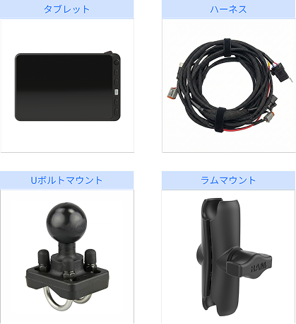

---
metaLinks:
  alternates:
    - >-
      https://app.gitbook.com/s/256Umh24fJVf6zNkZpSa/order-installation/product-installation/tablet
---

# 태블릿

## 태블릿

플루바 아이온 자율주행에 필요한 태블릿를 설치합니다.

***

### 필요 공구 및 준비물

#### 🔩 준비물

<figure><figcaption></figcaption></figure>

<table><thead><tr><th width="161.1815185546875">이름</th><th>규격</th><th>수량</th></tr></thead><tbody><tr><td>태블릿</td><td>-</td><td>1</td></tr><tr><td>하네스</td><td>-</td><td>1</td></tr><tr><td>U볼트 마운트</td><td></td><td></td></tr><tr><td>램 마운트</td><td></td><td></td></tr></tbody></table>

#### 🛠️ 필요 공구

<figure><figcaption></figcaption></figure>

<table><thead><tr><th width="130.5">이름</th><th>규격</th><th>수량</th></tr></thead><tbody><tr><td>소켓 렌치</td><td>11mm</td><td>1</td></tr><tr><td>스패너</td><td>4mm, 5mm</td><td>1</td></tr><tr><td>드라이버(+)</td><td>4mm, 5mm</td><td>1</td></tr></tbody></table>

***

### 설치 방법


{% column width="58.333333333333336%" %}
#### 1. 태블릿 설치 위치를 확인합니다.

<figure><figcaption></figcaption></figure>



{% column width="41.666666666666664%" %}





{% column width="58.333333333333336%" %}
#### **2.** 동봉된 볼트(M5x10 / 4EA)를 이용하여 고정 볼을 결합합니다.&#x20;

<figure><figcaption></figcaption></figure>



{% column width="41.666666666666664%" %}





{% column width="58.333333333333336%" %}
#### **3.** 마운트볼에 태블릿을 결합합니다.

<figure><figcaption></figcaption></figure>



{% column width="41.666666666666664%" %}





{% column width="58.333333333333336%" %}
#### **4.** 사용하기 편하게 태블릿을 조정합니다.

<figure><figcaption></figcaption></figure>



{% column width="41.666666666666664%" %}



