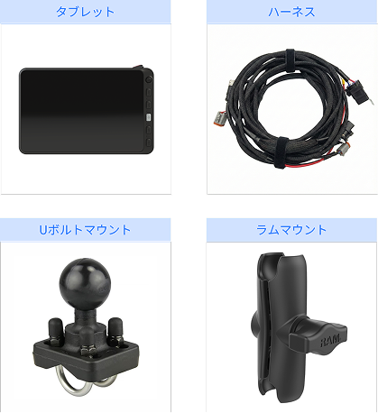
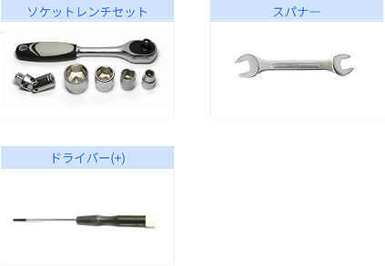
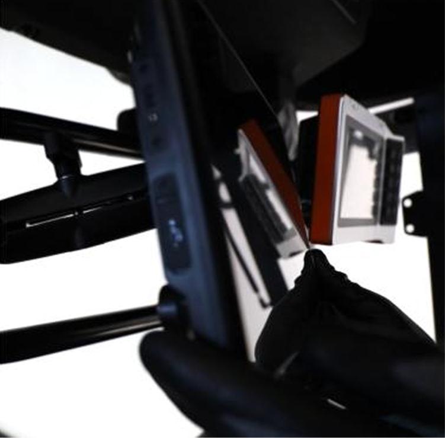

---
layout:
  width: default
  title:
    visible: true
  description:
    visible: false
  tableOfContents:
    visible: true
  outline:
    visible: true
  pagination:
    visible: true
  metadata:
    visible: true
  tags:
    visible: true
metaLinks:
  alternates:
    - >-
      https://app.gitbook.com/s/YgZGmmCCfllSmVLHO3Uz/order-installation/product-installation/tablet
---

# タブレット

pluva ionの自動操舵に必要なタブレットを取り付けます。

***

### 必要な工具及び用意する物

#### 🔩 用意する物

<figure><figcaption></figcaption></figure>

<table><thead><tr><th width="161.1815185546875">名称</th><th>規格</th><th>数量</th></tr></thead><tbody><tr><td>タブレット</td><td>-</td><td>1</td></tr><tr><td>ハーネス</td><td>-</td><td>1</td></tr><tr><td>Uボルトマウント</td><td>-</td><td>1</td></tr><tr><td>ラムマウント</td><td>-</td><td>1</td></tr></tbody></table>

#### 🛠️ 必要な工具

<figure><figcaption></figcaption></figure>

<table><thead><tr><th width="143.8333740234375">名称</th><th>規格</th><th>数量</th></tr></thead><tbody><tr><td>ソケットレンチ</td><td>11mm</td><td>1</td></tr><tr><td>スパナ－</td><td>4mm, 5mm</td><td>1</td></tr><tr><td>ドライバー(+)</td><td>4mm, 5mm</td><td>1</td></tr></tbody></table>

***

### 取り付け方法


{% column width="83.33333333333334%" %}
**1. 精密ドライバーを用い、タブレット側面のSIMポートカバーを開けます。**

<figure><figcaption></figcaption></figure>


{% column width="16.666666666666657%" %}





{% column width="83.33333333333334%" %}
**2. SIMカードの向きに注意して差し込み、ポートカバーを元通りに結合します。**

<figure><figcaption></figcaption></figure>


{% column width="16.666666666666657%" %}





{% column width="83.33333333333334%" %}
**3. タブレットの取り付け位置を確認します。**

<figure><figcaption></figcaption></figure>


{% column width="16.666666666666657%" %}





{% column width="83.33333333333334%" %}
**4. 同梱のボルト（M5x10 / 4EA）を使用し、固定ボールを締結します。**

<figure><figcaption></figcaption></figure>


{% column width="16.666666666666657%" %}





{% column width="83.33333333333334%" %}
**5. マウントボールにタブレットを取り付けます。**

<figure><figcaption></figcaption></figure>


{% column width="16.666666666666657%" %}





{% column width="83.33333333333334%" %}
**6. 操作しやすい位置にタブレットを調整します。**

<figure><figcaption></figcaption></figure>


{% column width="16.666666666666657%" %}



