---
layout:
  width: default
  title:
    visible: true
  description:
    visible: false
  tableOfContents:
    visible: true
  outline:
    visible: true
  pagination:
    visible: true
  metadata:
    visible: true
  tags:
    visible: true
metaLinks:
  alternates:
    - >-
      https://app.gitbook.com/s/256Umh24fJVf6zNkZpSa/order-installation/product-registration
---

# 取り付けチケットでの製品開通

取り付けチケットに製品を登録し、開通キーを発行します。取り付けを円滑に進めるため、取り付け前に開通することを推奨します。


取り付けチケットとは？

注文製品ごとの**取り付け状況を確認できる管理チケット**です。


***

#### 注文製品ごとの開通に必要な構成品

注文いただいた製品ごとに、下記の構成品を予めご用意ください。

1. **pluva ion**

* 全ての主な構成品を登録します。
  * タブレット
  * GNSS受信機
  * 電動ステアリングホイール

2. **pluva ion エクスパンションキット（拡張キット）**

* タブレット以外の構成品を登録します。
  * GNSS受信機
  * 電動ステアリングホイール

3. 追加オプション

* ワンタッチスイッチ

***

#### シリアル番号の登録（梱包番号）

製品の登録は、製品に付着してあるQRコード（シリアル番号、または梱包番号）をスキャンして進めます。

* 梱包番号（外箱のQRコード）を登録すると、構成品を**一括登録**できます。

#### QRコードの位置

#### 梱包箱のシリアル番号


{% column width="58.333333333333336%" %}
外箱側面のQRコードを確認して下さい。

<figure><figcaption></figcaption></figure>


{% column width="41.666666666666664%" %}




#### 各構成品のシアリアル番号



**タブレット**

裏面のQRコードを確認してください。

<figure><figcaption></figcaption></figure>



**GNSS受信機**

右側面、または底面のQRコードを確認してください。

<figure>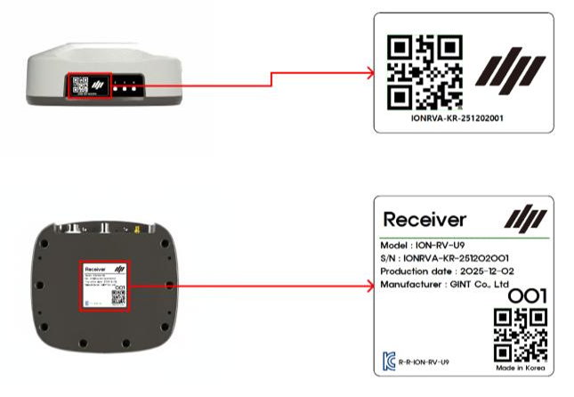<figcaption></figcaption></figure>





**電動ステアリングホイール**

モーター側面のQRコードを確認してください。

<figure>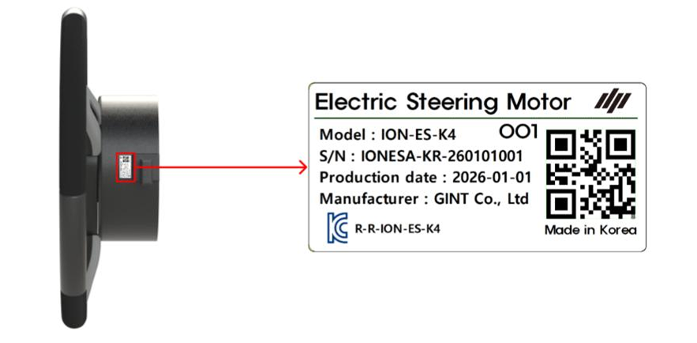<figcaption></figcaption></figure>



**ワンタッチスイッチ**

裏面のQRコードを確認してください。

<figure>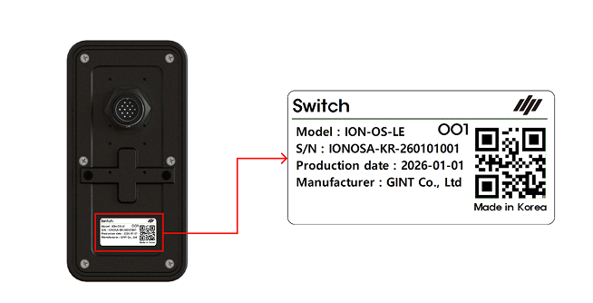<figcaption></figcaption></figure>



***

#### 取り付けチケットへのアクセス方法



[アドミンページ](https://gint-admin.pluva.jp/)にログインします。

<figure><figcaption></figcaption></figure>



取り付けチケット一覧\
​\
取り付けチケット一覧にアクセスし、ご希望のチケットを選択します。

<figure><figcaption></figcaption></figure>


左上のメニュー（三）をクリックし「注文及び取り付け管理」 > 「取り付けチケット一覧」へアクセスできます。

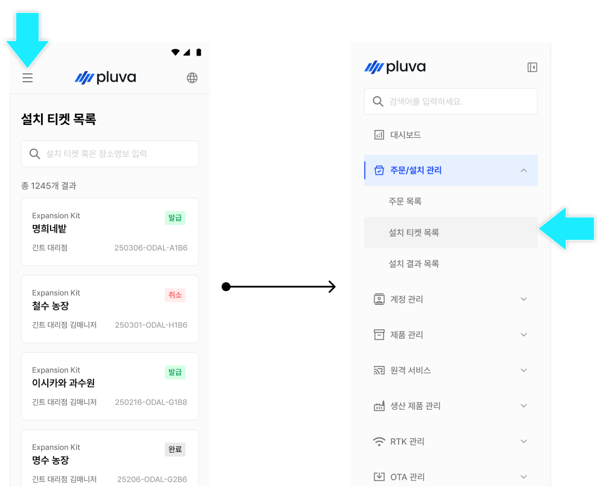




***

#### 製品の開通方法



取り付けチケットから\[製品の開通開始]を選択します。

<figure>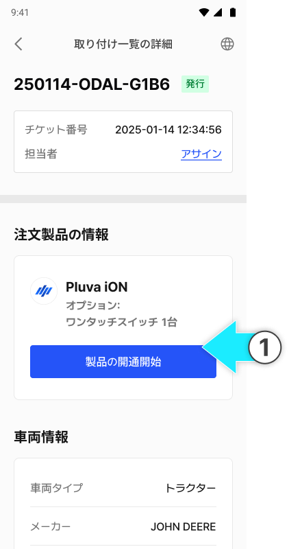<figcaption></figcaption></figure>



\[パッケージでまとめて開通する]をタップします。

<figure>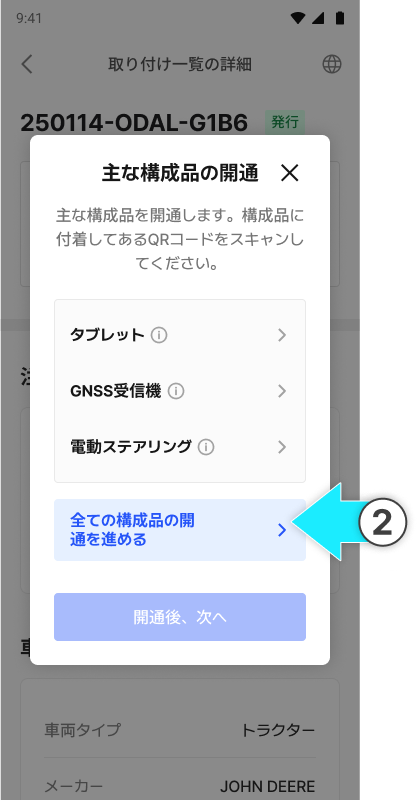<figcaption></figcaption></figure>


各構成品を選択すると、個別での登録もできます。




梱包番号のQRコードをスキャンします。

<figure>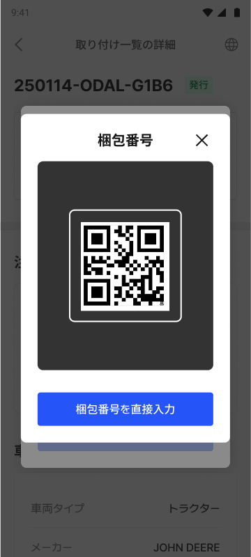<figcaption></figcaption></figure>


カメラのスキャンで正しくコードが入力されない場合は、入力欄をタップし、直接入力してください。

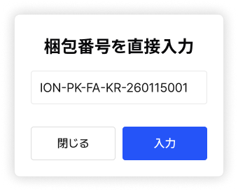




梱包番号を確認し\[確認完了]をタップします。

<figure>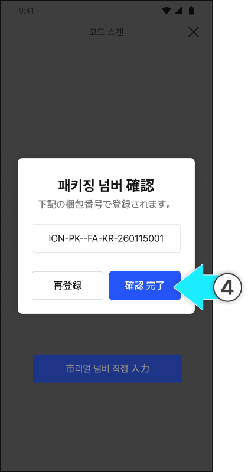<figcaption></figcaption></figure>



登録が完了したら、「主な製品の開通」ポップアップから\[開通完了]をタップします。

<figure>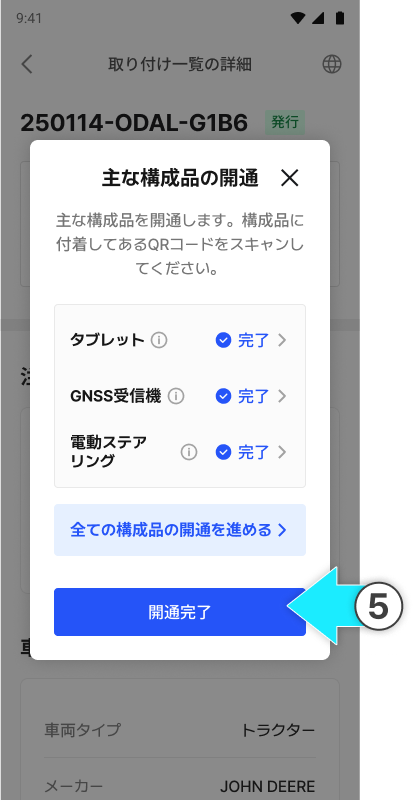<figcaption></figcaption></figure>


無効な梱包番号（シリアル番号）の場合、QRスキャン画面に戻ります。

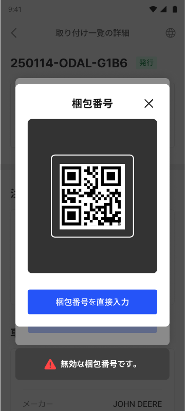



追加オプション品をご注文の場合は、主な製品の開通後に追加オプションの開通を進めることで、開通が完了します。

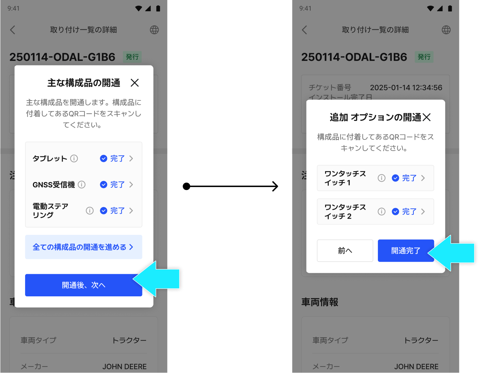




製品の開通が完了します。

<figure>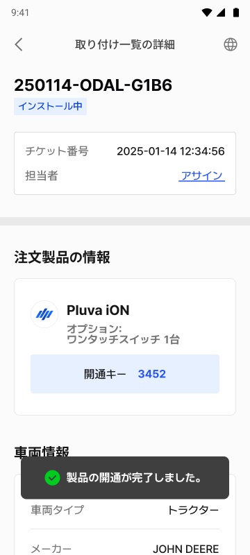<figcaption></figcaption></figure>


