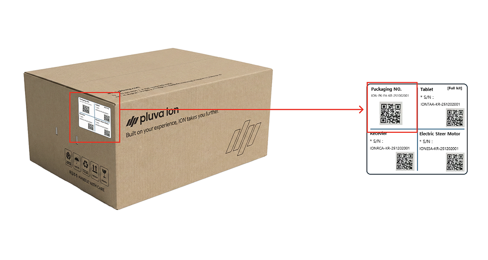

---
layout:
  width: default
  title:
    visible: true
  description:
    visible: false
  tableOfContents:
    visible: true
  outline:
    visible: true
  pagination:
    visible: true
  metadata:
    visible: true
  tags:
    visible: true
metaLinks:
  alternates:
    - >-
      https://app.gitbook.com/s/YgZGmmCCfllSmVLHO3Uz/order-installation/product-registration
---

# 取り付けチケットでの製品開通

取り付けチケットに製品を登録し、開通キーを発行します。取り付けをスムーズに進めるため、予め開通手続きを進めることを推奨します。


取り付けチケットとは？

注文した製品ごとの**取り付け状況を確認できるチケット**です。


***

#### 注文製品ごとの開通すべき構成品

ご注文いただいた製品ごとに、下記の構成品を用意してください。

1. **Pluva iON**

* 全ての構成品を登録します。
  * タブレット
  * GNSS受信機
  * 電動ステアリングホイール

2. **Pluva iONのエクスパンションキット（拡張キット）**

* タブレット以外の構成品を登録します。
  * GNSS受信機
  * 電動ステアリングホイール

3. **追加オプション**

* ワンタッチスイッチ

***

#### シリアル番号の登録（梱包番号）

製品登録は、製品に付着してあるQRコード（シリアル番号、または梱包番号）をスキャンして進めます。&#x20;

* 梱包番号（外箱のQRコード）を登録すると、構成品の**一括登録**ができます。

#### QRコードの位置

#### パッケージのシリアル番号


{% column width="58.333333333333336%" %}
外箱の側面に付着してあるQRコードを確認してください。

<figure><figcaption></figcaption></figure>


{% column width="41.666666666666664%" %}




#### 各構成品のシリアル番号



**タブレット**

背面のQRコードをご確認ください。

<figure><figcaption></figcaption></figure>



**GNSS受信機**

右側面、または底面のQRコードをご確認ください。

<figure><figcaption></figcaption></figure>





**電動ステアリングホイール**

モーターの側面のQRコードをご確認ください。

<figure><figcaption></figcaption></figure>



**ワンタッチスイッチ**

背面のQRコードをご確認ください。

<figure><figcaption></figcaption></figure>



***

#### 取り付けチケットへのアクセス方法



[アドミンページ](https://gint-admin.pluva.kr/auth/operators/login)へログインします。

<figure><figcaption></figcaption></figure>



取り付けチケット一覧にアクセスし、対象のチケットを選択します。

<figure><figcaption></figcaption></figure>


左上の「詳細をみる」をタップし、「注文および取り付け管理」 > 「取り付けチケット一覧」にアクセスできます。





***

#### 製品の開通方法



取り付けチケットから\[製品の開通開始]をタップします。

<figure><figcaption></figcaption></figure>



\[パッケージでまとめて開通する]をタップします。

<figure><figcaption></figcaption></figure>


各構成品の項目を選択すると、個別登録もできます。




梱包番号のQRコードをスキャンします。

<figure><figcaption></figcaption></figure>


カメラでコードを読み取れない場合は、入力欄をタップして梱包番号を直接入力します。





梱包番号を確認し、\[確認完了]をタップします。

<figure><figcaption></figcaption></figure>



スキャンが終わると、画面上に表示される製品登録のポップアップから\[開通完了]をタップします。

<figure><figcaption></figcaption></figure>


梱包番号（シリアル番号）が無効な場合、QRスキャン画面に戻ります。




追加オプションをご注文いただいた場合は、主な製品の開通後に追加オプションの開通を進めて下さい。全ての構成品の開通手続きを行ってこそ開通が完了します。





製品の開通が完了します。

<figure><figcaption></figcaption></figure>




製品の開通が完了すると、取り付けチケットに登録された製品のシリアル番号や構成品の情報を確認できます。


