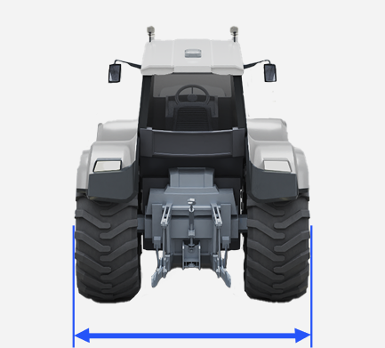
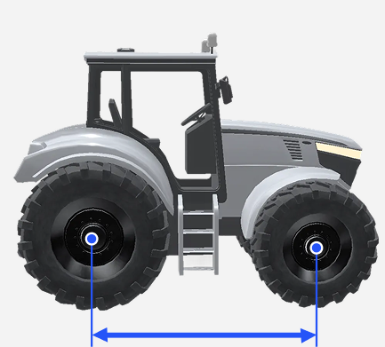
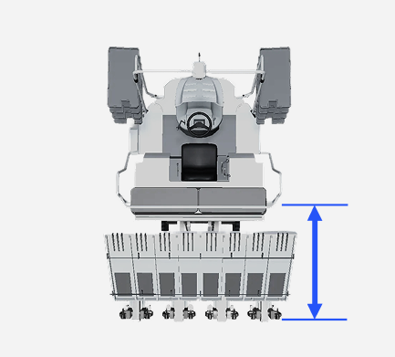
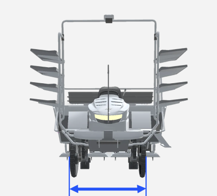

---
metaLinks:
  alternates:
    - >-
      https://app.gitbook.com/s/256Umh24fJVf6zNkZpSa/order-installation/quick-setup/add-vehicle
---

# 車両の追加 (차량 추가)

### 차량 추가

作業に使う車両を追加します。


설정된 차량 수치 값은 태블릿의 [내 차량](../../usage/vehicle-settings/modifying-vehicle-information.md)에서 확인하고 변경할 수 있습니다.


***

#### 車両の追加



登録したい車両タイプを選択してから\[選択完了]を押します。

<figure><figcaption></figcaption></figure>



別名、メーカー、モデル、年式、車両の寸法を入力&#x3057;**\[車両の追加完了]**&#x3092;押して下さい。

<figure><figcaption></figcaption></figure>


배속턴 차량은 배속턴 특성에 맞춘 보정값이 필요하므로, \[배속턴 차량] 토글을 반드시 켜고 진행해 주세요.




배속턴은 트랙터에만 적용되는 옵션입니다. 이앙기에는 배속턴 옵션이 없습니다.




車両が追加されました。**\[次のステップへ]**&#x3092;押し、作業機の追加にアクセスしてください。

<figure><figcaption></figcaption></figure>



***

#### 차량 치수 설정 항목


차량 치수 측정은 평평한 바닥에서 측정해야합니다.

경사지나 흙바닥에서 측정 시 정확하지 않을 수 있습니다.


#### トラクター

<figure><figcaption></figcaption></figure>

&#x20; 全幅

* 車両後輪のサイドウォールから反対側の後輪のサイドウォールまでの距離を測定します。
* 

&#x20; 前方-前輪軸

* 車両のボンネットから前輪軸までの距離を測定します。
* 

&#x20; ホイールベース

* 前輪軸から後輪軸までの距離を測定します。
* 

&#x20; 後輪軸-ヒッチ

* 後輪軸から下部のヒッチまでの距離を測定します。
* 

&#x20; 地面-後輪軸

* 地面から後輪軸までの距離を測定します。
* 

&#x20; 地面-トップリンク

* 地面からトップリンクまでの距離を測定します。
* 

#### 田植機

<figure><figcaption></figcaption></figure>

&#x20; ホイールベース

* 前輪軸から後輪軸までの距離を測定します。
* 

&#x20; 前方-前輪軸

* 車両のボンネットから前輪軸までの距離を測定します。
* 

&#x20; 後輪軸-車両の端

* 後輪軸から移植部の端までの距離を測定します。
* 

&#x20; 全幅

* 後輪のラグから反対側のラグまでの距離を測定します。
* 

&#x20; 地面-後輪軸

* 地面から後輪軸までの距離を測定します。
* 

&#x20; 間隔偏差

* 移植作業部の偏差発生時に入力する数値です。

