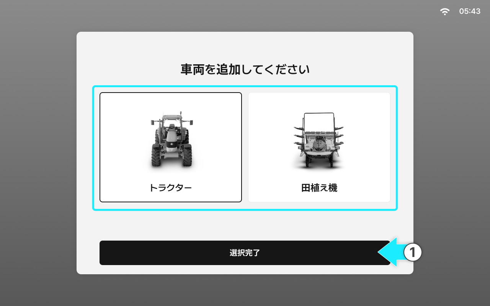
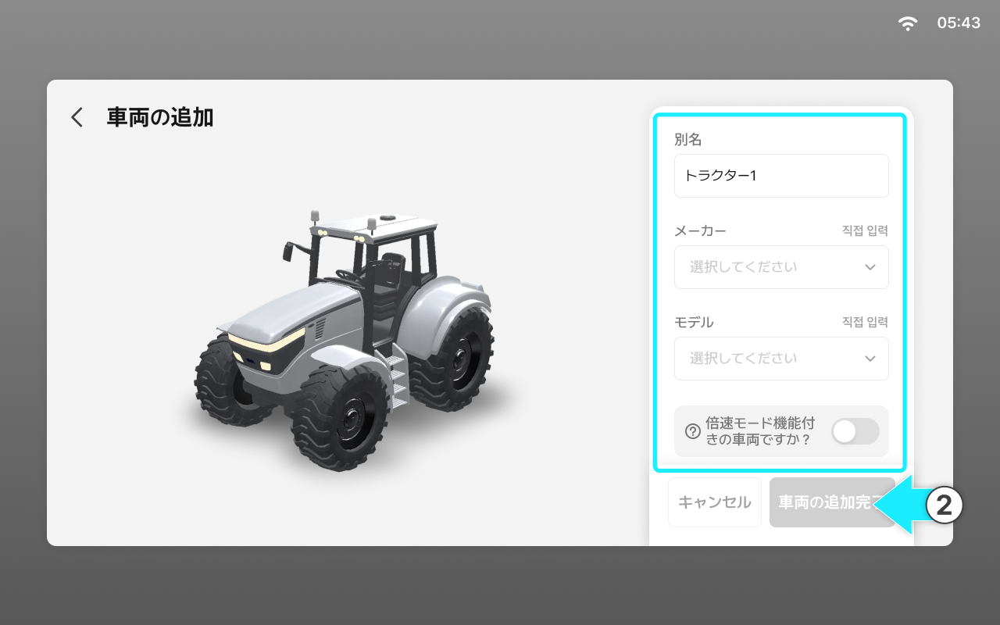
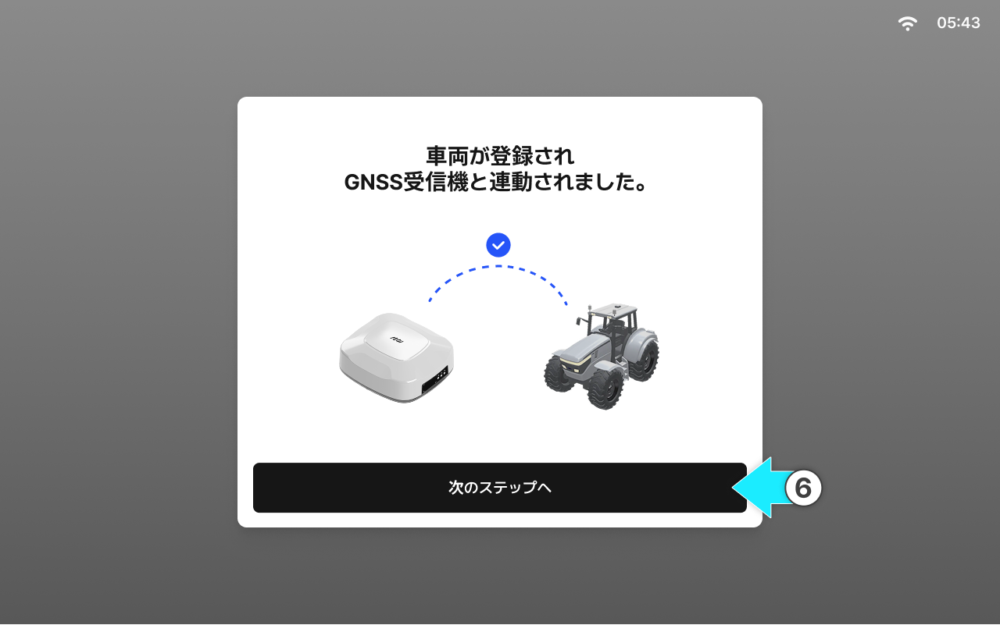
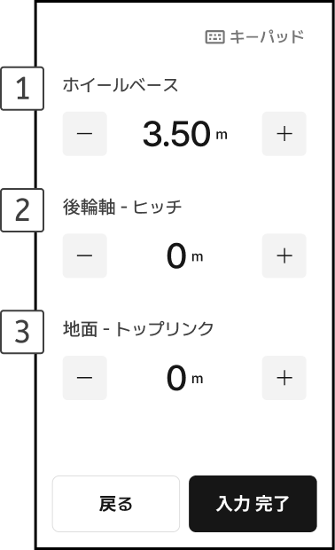
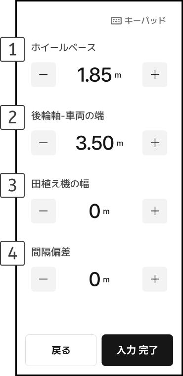
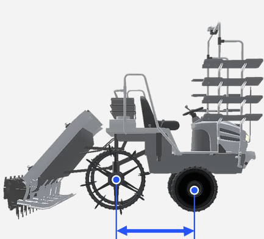
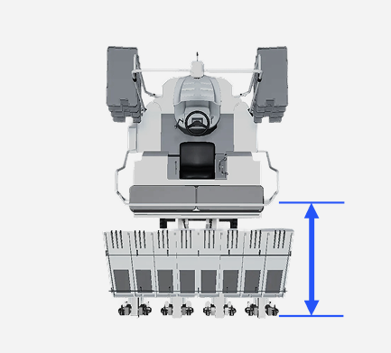

---
layout:
  width: default
  title:
    visible: true
  description:
    visible: false
  tableOfContents:
    visible: true
  outline:
    visible: true
  pagination:
    visible: true
  metadata:
    visible: true
  tags:
    visible: true
metaLinks:
  alternates:
    - >-
      https://app.gitbook.com/s/YgZGmmCCfllSmVLHO3Uz/order-installation/quick-setup/add-vehicle
---

# 車両の追加

作業に使用する車両を追加します。


設定された車両の寸法は、タブレットの車両管理メニューから確認及び変更が可能です。


***

#### 車両の追加方法



登録する車両タイプを選択し、\[選択完了]をタップします。

<figure><figcaption></figcaption></figure>



別名、メーカー、型番、年式、車両寸法を入力し、\[車両の追加完了]をタップします。

<figure><figcaption></figcaption></figure>


倍速モード機能付き車両は、その特性に合わせた補正値が必要なため、必ず\[倍速モード車両]のトグルをオンにした状態で進めてください。




倍速モードは、トラクター専用のオプションです。田植え機に倍速モードオプションはありません。




\[次のステップへ]をタップすると、車両登録及びGNSS受信機の連動が完了します。

<figure><figcaption></figcaption></figure>



***

#### 車両寸法の設定項目


車両寸法の測定は、必ず平らな場所で行ってください。

傾斜地や土の上で測定すると、正確な数値が得られない場合があります。


#### トラクター

<figure><figcaption></figcaption></figure>

.svg>) ホイールベース

* トラクターの前輪軸から後輪軸までの距離です。
* .png>)

.svg>) 後輪軸 - ヒッチ

* トラクターの後輪軸からヒッチまでの水平距離です。
* .png>)

.svg>) 地面 - トップリンク

* 地面からトラクターのトップリンクまでの垂直距離です。
* .png>)

#### 田植え機

<figure><figcaption></figcaption></figure>

.svg>) ホイールベース

* 田植え機の前輪軸から後輪軸までの距離です。
* 

 後輪軸 - 車両の端

* 田植え機の後輪軸から車両の端までの水平距離です。
* 

.svg>) 田植え機の幅

* 田植え機の幅を表し、タイヤの幅も含みます。
* .png>)

.svg>) 間隔偏差

* 往復作業時に走行間隔が一定でない場合、その誤差を補正するための設定値です。（走行間隔の誤差の絶対値を4で割った値を入力してください。）

#### 管理機

<figure><figcaption></figcaption></figure>

.svg>) ホイールベース

* 管理機の前輪軸から後輪軸までの距離です。
* .png>)

 後輪軸 - 車両の端

* 管理機の後輪軸から車両の端までの水平距離です。
* .png>)

.svg>) 管理機の幅

* 管理機の幅を表し、タイヤの幅も含みます。
* .png>)

.svg>) 間隔偏差

* 往復作業時に走行間隔が一定でない場合、その誤差を補正するための設定値です。（走行間隔の誤差の絶対値を4で割った値を入力してください。）
