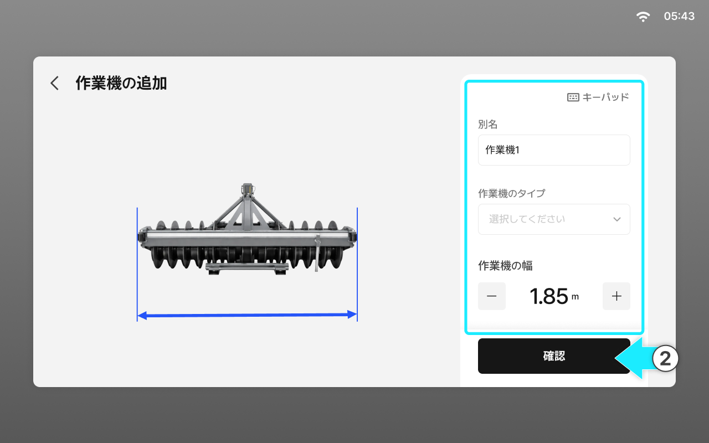
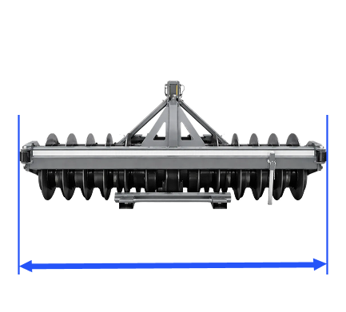
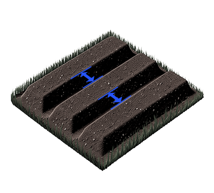

---
metaLinks:
  alternates:
    - >-
      https://app.gitbook.com/s/256Umh24fJVf6zNkZpSa/order-installation/quick-setup/add-worker
---

# 作業機の追加 (작업기 추가)

### 作業機の追加(オプション)

作業に使う作業機を追加します。

***

#### 作業機の追加方法 (작업기 추가 방법)



**\[追加する]**&#x3092;押します。

<figure><figcaption></figcaption></figure>



別名、作業機のタイプなどを入力してか&#x3089;**\[確認]**&#x3092;押します。

<figure><figcaption></figcaption></figure>



***

#### 作業機寸法の項目説明 (작업기 치수 항목 설명)

<figure><figcaption></figcaption></figure>

 **作業機タイプ**

* 作業機タイプを選択してください。

&#x20; **作業機の幅**

* 作業機の幅を入力してください。
* 

&#x20; **溝幅**

* 溝幅の幅を入力してください。
* 

