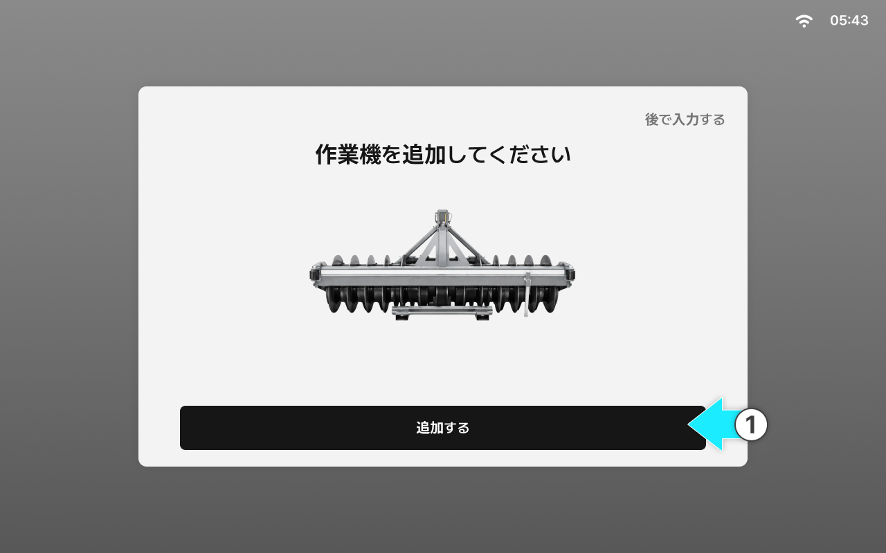
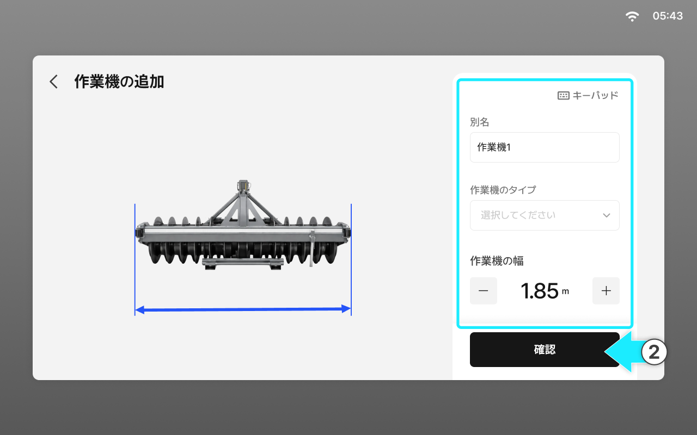
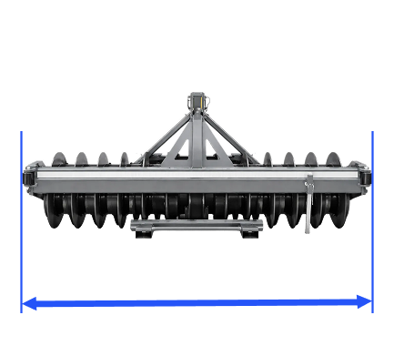
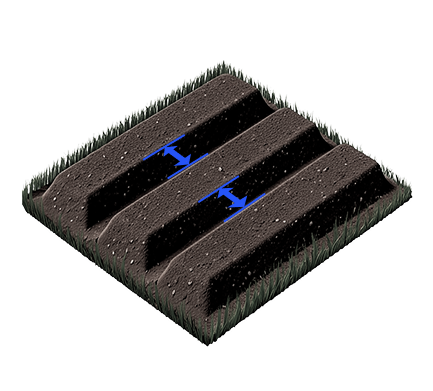
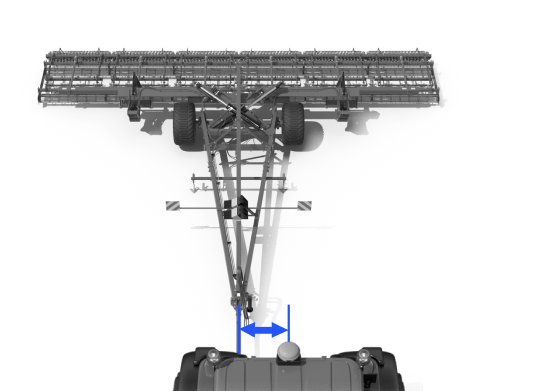

---
layout:
  width: default
  title:
    visible: true
  description:
    visible: false
  tableOfContents:
    visible: true
  outline:
    visible: true
  pagination:
    visible: true
  metadata:
    visible: true
  tags:
    visible: true
metaLinks:
  alternates:
    - >-
      https://app.gitbook.com/s/YgZGmmCCfllSmVLHO3Uz/order-installation/quick-setup/add-worker
---

# 作業機の追加（任意）

作業に使用する作業機を追加します。

***

#### 作業機の追加方法



\[追加する]をタップします。

<figure><figcaption></figcaption></figure>



別名、作業機タイプ、作業機の幅、畝間、リンク‐作業機の距離、作業機偏差を入力し\[確認]をタップします。

<figure><figcaption></figcaption></figure>



\[次のステップへ]をタップすると、作業機の登録が完了します。

<figure><figcaption></figcaption></figure>



***

#### 作業機寸法の項目に関するご案内

<figure><figcaption></figcaption></figure>

.svg>) **作業機の幅**

* 作業機の幅を入力します。
* 

.svg>) **畝間**

* 畝間を入力します。
* 

.svg>) **作業機の偏差**

* 作業機の偏差を入力します。
* 

.svg>) **作業機の偏差計算**

* 3本のラインを走行し、ライン間隔を入力することで、作業機の偏差が自動的に計算されます。
*   図の案内方向に従って3本のラインを走行し、各ライン間の距離を測定して入力してください。 

    <figure><figcaption></figcaption></figure>

    * S1：1本目と2本目のライン間の距離

    * S2：2本目と3本目のライン間の距離 
