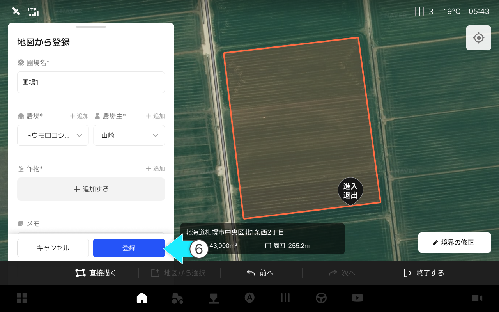

---
metaLinks:
  alternates:
    - >-
      https://app.gitbook.com/s/256Umh24fJVf6zNkZpSa/order-installation/quick-setup/farm-setting
---

# 農場設定&#x20;

### 農場設定&#x20;

農場設定はお客様がご使用する農場、農場主、圃場、枕地を登録・設定する段階です。 &#x20;

作業地設定は下記の順で実施します。 &#x20;

***

#### **1.** 農場**登録**

* 農場は、基本的に現在地を基準に登録されます。&#x20;

<figure><figcaption></figcaption></figure>

#### **2.** 農場主**登録**&#x20;

* 農場主は、基本的にお客様のアカウントを基準に登録されます。

<figure><figcaption></figcaption></figure>

#### **3. 圃場の登録**&#x20;

* 作業を開始するには、圃場の登録が必要です。
* 下の [圃場登録](farm-setting.md#id-3-no-1)をご参考にして下さい。

#### **4. 枕地の生成**&#x20;

* 作業環境に合わせて、枕地を登録します。
* 下の [枕地](farm-setting.md#id-4-no-1)ををご参考にして下さい。

***

### **3. 圃場の登録**

**圃場とは？**

> 圃場とは、実際に作業を行うエリアのことです。地図上から選択するか、境界を直接作成して登録することができます。



圃場タブを選択してください。

<figure><figcaption></figcaption></figure>



 圃場の追加を押して下さい。

<figure><figcaption></figcaption></figure>



地図から登録を選択してから\[確認]を押して下さい。

<figure><figcaption></figcaption></figure>



地図上で圃場を選択してください。

<figure><figcaption></figcaption></figure>



境界が生成されたら、\[進入口の設定]を押しご希望の位置を選択してください。

<figure><figcaption></figcaption></figure>



進入・退出口の位置設定ポップアップから\[同じ場所に設定]を選択してください。

<figure><figcaption></figcaption></figure>


\[退出口を別途設定]を選択した場合は、進入口と退出口の場所をそれぞれ指定する必要があります。

*

    <figure><figcaption></figcaption></figure>





進入退出口の設定を終え圃場情報を入力してから\[登録]を押して下さい。&#x20;

<figure><figcaption></figcaption></figure>



圃場の登録が終了します。

<figure><figcaption></figcaption></figure>


圃場登録の種類&#x20;

&#x20; **住所を検索して圃場を選択**&#x20;

* 住所を検索して圃場を選択します。&#x20;
  *

      <figure><figcaption></figcaption></figure>

 **直接描く**&#x20;

* 直接点を打って圃場エリアを生成します。&#x20;
  *

      <figure><figcaption></figcaption></figure>




***

### 4. **枕地の生成**&#x20;

> * 枕地は、圃場の端で安全にUターンしたり、作業機を操作するための空きスペースです。&#x20;
> * 圃場の境界から設定した距離分だけ内側に作られ、作業環境に合わせて幅(長さ)を調整できます。  &#x20;



My Farmの枕地を選択してください。 &#x20;

<figure><figcaption></figcaption></figure>



 枕地の生成を選択してください。 &#x20;

<figure><figcaption></figcaption></figure>



ご希望のオプションを選択し確認を押すと、枕地の生成が始まります。 &#x20;

<figure><figcaption></figcaption></figure>



枕地の設定モーダルから
詳細設定項目を入力し\[確認]を押して下さい。&#x20;

<figure><figcaption></figcaption></figure>



枕地が生成されました。

<figure><figcaption></figcaption></figure>


