---
layout:
  width: default
  title:
    visible: true
  description:
    visible: false
  tableOfContents:
    visible: true
  outline:
    visible: true
  pagination:
    visible: true
  metadata:
    visible: true
  tags:
    visible: true
metaLinks:
  alternates:
    - >-
      https://app.gitbook.com/s/256Umh24fJVf6zNkZpSa/order-installation/quick-setup/farm-setting
---

# 圃場の設定

圃場の設定は、お客様が作業する農場、農場主、圃場、枕地を登録および設定するプロセスです。

圃場の設定は、以下のプロセスで行われます。

1. **農場の登録**

* 現在地をもとに初期設定されます。
*

    <figure>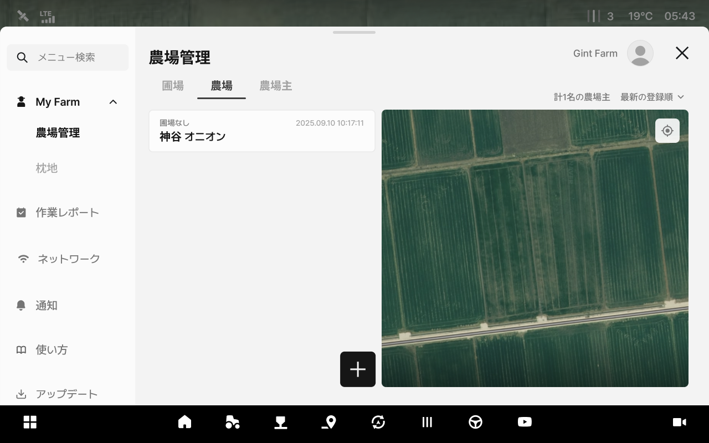<figcaption></figcaption></figure>

2. **農場主の登録**

* お客様アカウントをもとに初期設定されます。
*

    <figure><figcaption></figcaption></figure>

3. **圃場の登録**

* 作業を開始するためには、圃場を登録する必要があります。
* 下記の[圃場の登録](farm-setting.md#field)をご参照ください。

4. **枕地の登録**

* 作業環境に合わせて枕地を登録します。
* 下記の[枕地](farm-setting.md#headland)をご参照ください。

***

### 圃場の登録 

**圃場とは？**

> 圃場は、実際の作業が行われる作業エリアのことです。地図から登録、または境界を直接描いて登録できます。

#### 「圃場の登録」機能へのアクセス



\[登録する]をタップします。

<figure>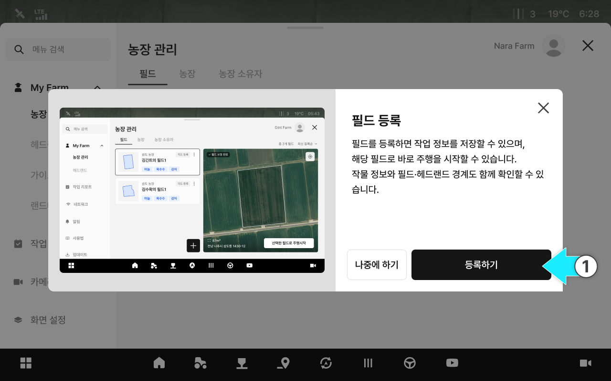<figcaption></figcaption></figure>


「後で登録」を選択した場合、農場管理 > 圃場へ接続し、\[+]をタップして登録できます。

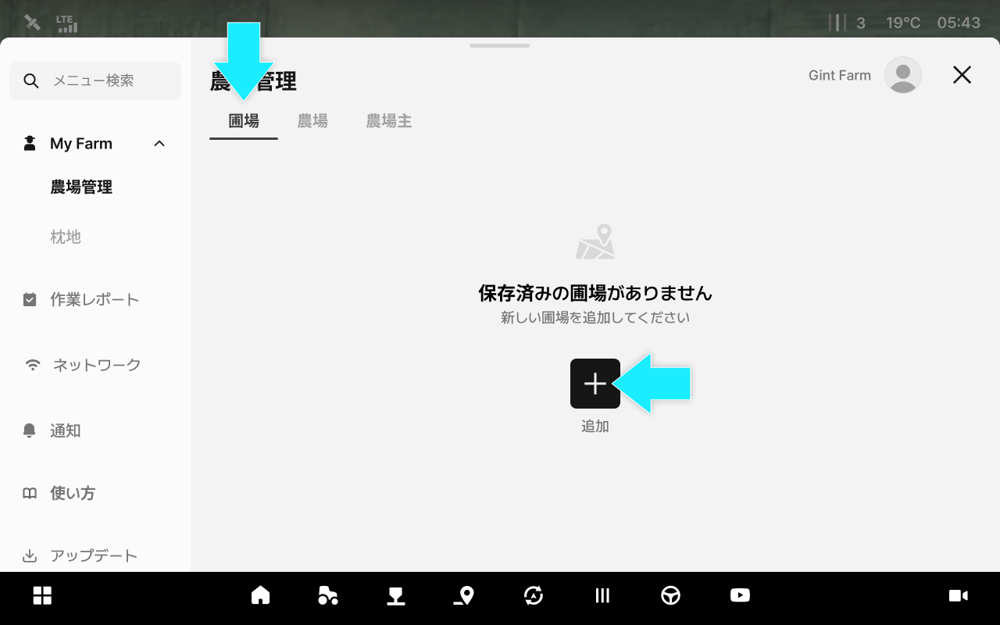




「地図から登録」を選択し\[確認]をタップします。

<figure>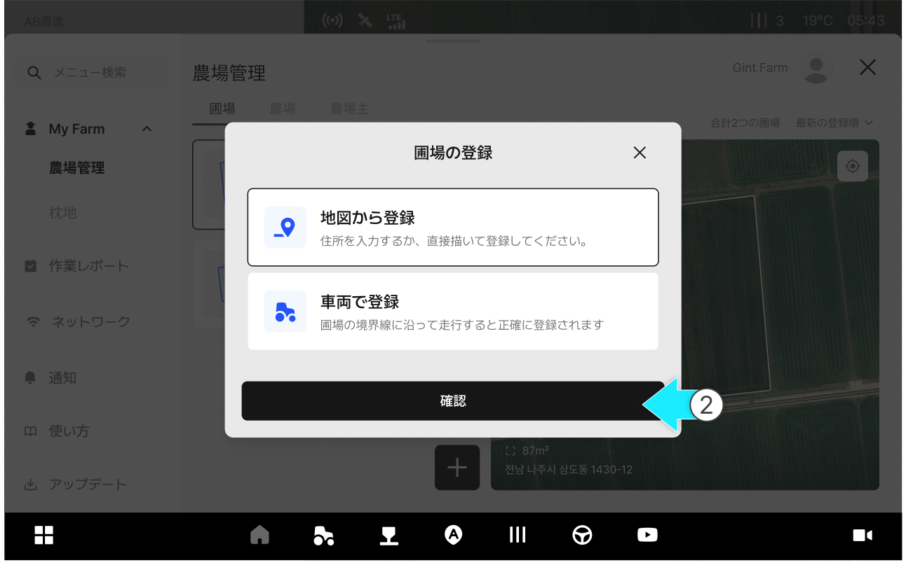<figcaption></figcaption></figure>



地図上で圃場を選択します。

<figure>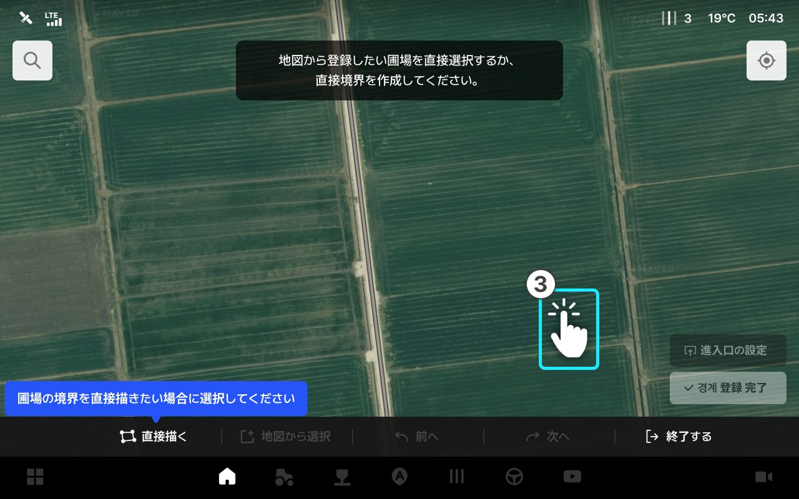<figcaption></figcaption></figure>


圃場登録の初期設定は\[地図から登録]になっています。境界を直接作成するためには、\[直接描く]をタップしてください。




境界が作成されたら\[進入口の設定]をタップし、ご希望の位置を選択します。

<figure>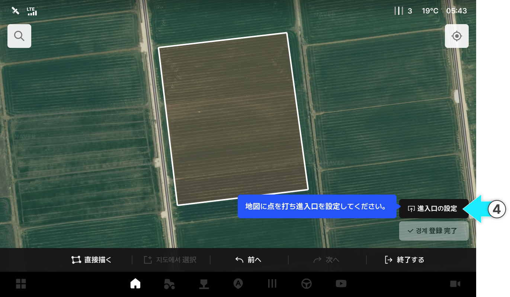<figcaption></figcaption></figure>



進入口・退出口の位置設定に関するポップアップから、\[同じ場所に設定]を選択します。

<figure>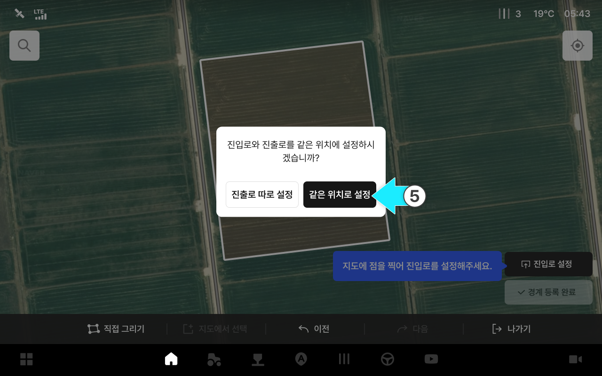<figcaption></figcaption></figure>


進入・退出口の位置が異なる場合は、\[退出口を別途設定]をタップします。

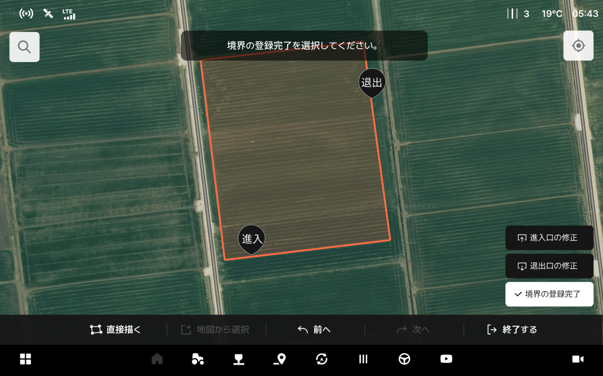




進入・退出口の設定が完了したら、圃場情報を入力し\[登録]をタップします。

<figure>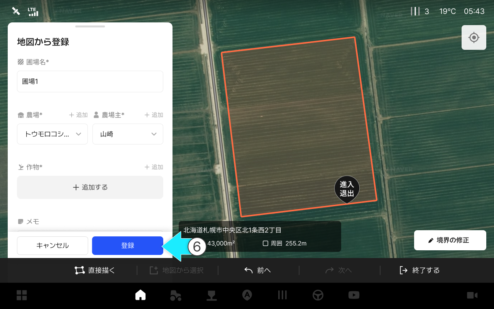<figcaption></figcaption></figure>



圃場登録が完了します。

<figure>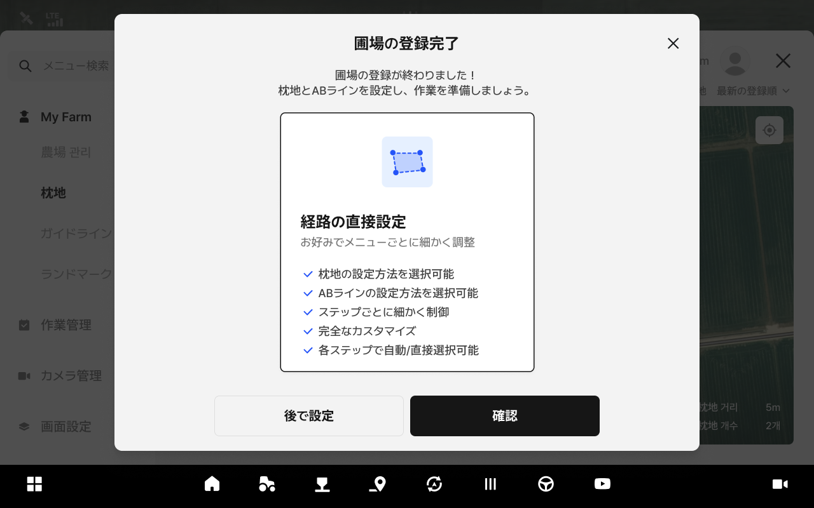<figcaption></figcaption></figure>



***

#### 「地図から圃場登録」画面のご案内

<figure><figcaption></figcaption></figure>

&#x20; **住所検索による圃場登録**

* 住所を検索し、圃場を登録します。
  *

      <figure>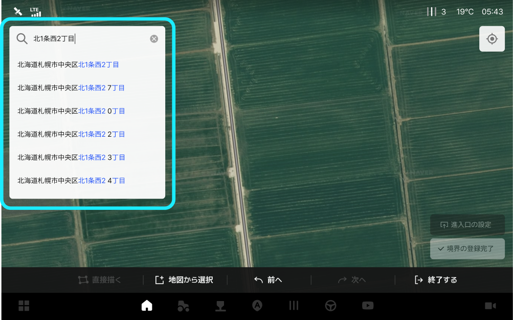<figcaption></figcaption></figure>

&#x20; **直接描く**

* 地図上で直接点を打ち、圃場エリアを作成します。
  *

      <figure><figcaption></figcaption></figure>

&#x20; **地図から登録**

* 地図上の圃場をタップし選択します。初期設定は\[地図から登録]になっています。

&#x20; **戻る**

* 前の画面に戻ります。

&#x20; **次へ**

* 次のステップへ進みます。

&#x20; **終了する**

* 圃場の登録画面を終了します。

&#x20; **現在地へ**

* 現在地を表示します。

&#x20; **進入・退出口の設定**

* 進入・退出口の位置を設定します。圃場を登録すると、このボタンが使用可能になります。進入・退出口は同じ場所に設定することも、それぞれ別々に設定することも可能です。また、「修正」ボタンから位置変更ができます。

&#x20; **境界登録の完了**

* 境界登録を完了します。進入・退出口を選択すると、このボタンが使用可能になります。

***

#### 「地図から登録」モーダルのご案内

<figure>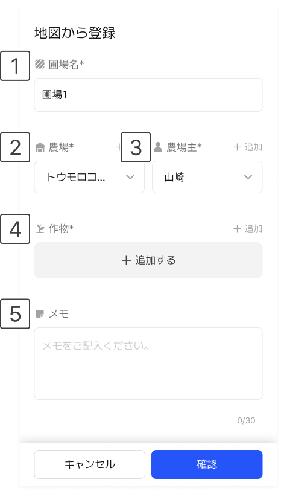<figcaption></figcaption></figure>

&#x20; **圃場名**

* 表示名を入力します。

&#x20; **農場**

* 圃場と紐づける農場を選択します。

&#x20; **農場主**

* 圃場と紐づける農場主を選択します。

&#x20; **作物**

* この圃場で作業中の作物を追加します。

&#x20; **メモ**

* 追加情報をメモします。

***

### 枕地の登録 

**枕地とは？**

> 枕地は、圃場の端で安全に旋回したり、作業機を操作したりするために確保する余白エリアです。圃場の境界から設定した距離の内側に作成され、作業環境に合わせて幅を調整することができます。

***

#### 「枕地の登録」へのアクセス



My Farmから「枕地」を選択します。

<figure>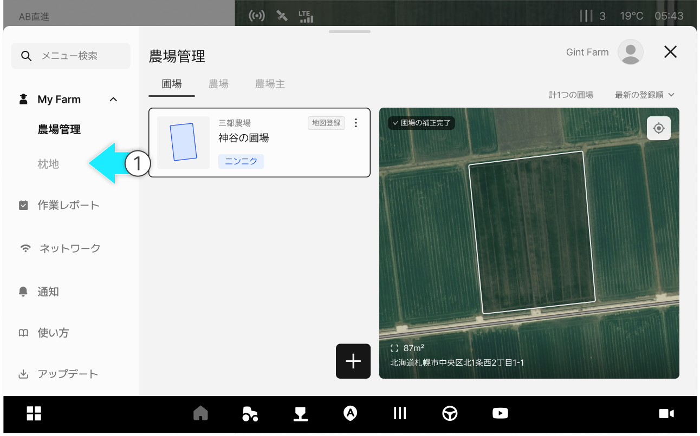<figcaption></figcaption></figure>



 「枕地の追加」ボタンをタップします。

<figure>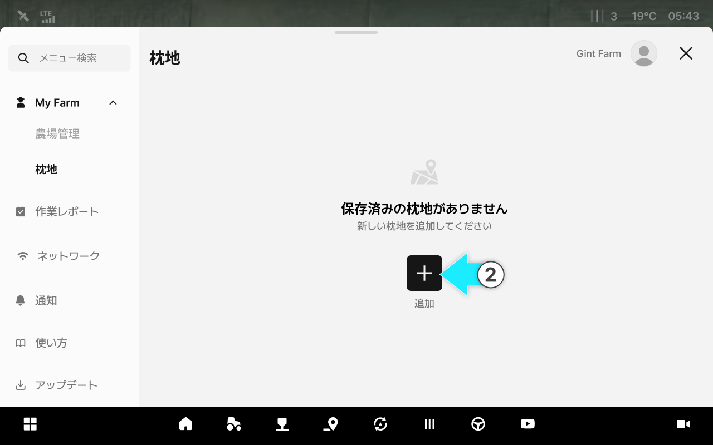<figcaption></figcaption></figure>



ご希望の設定オプションを選択し確認を押すと、枕地の作成に入ります。

<figure>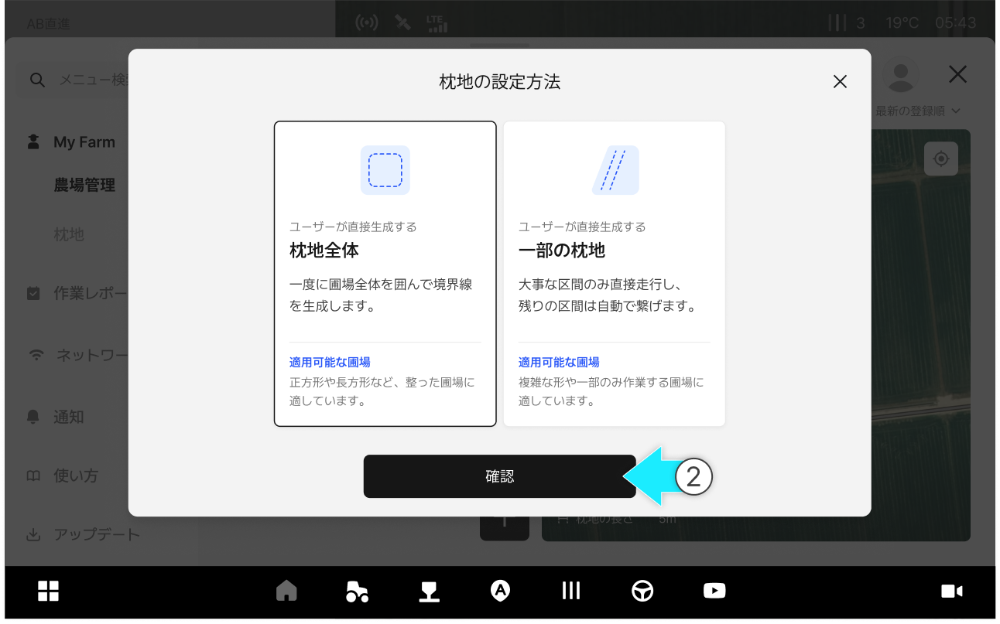<figcaption></figcaption></figure>



枕地の設定モーダルから、詳細設定を入力後\[確認]をタップします。

<figure>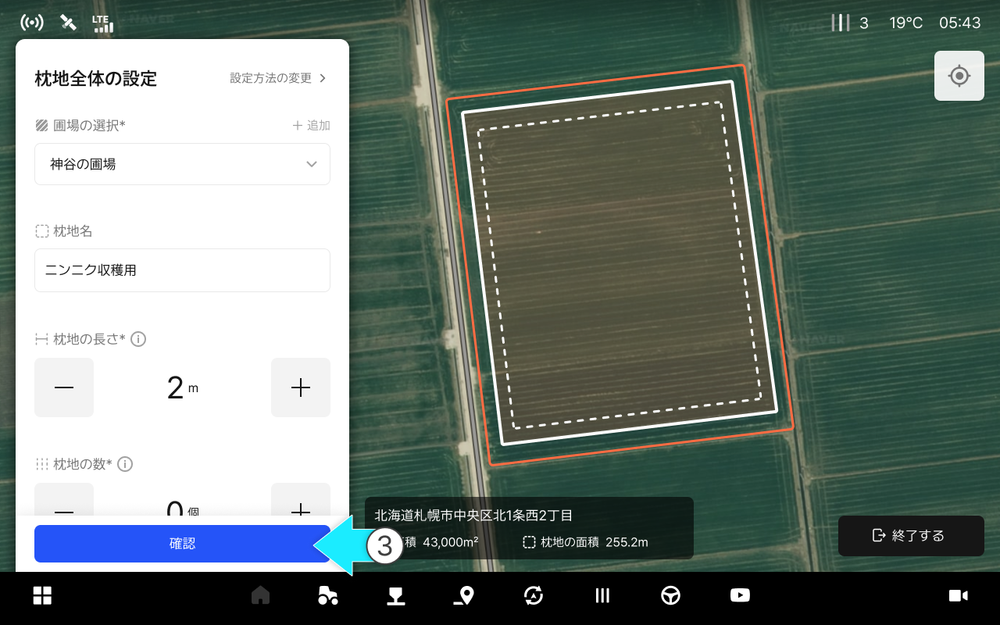<figcaption></figcaption></figure>



枕地の作成が完了します。

<figure>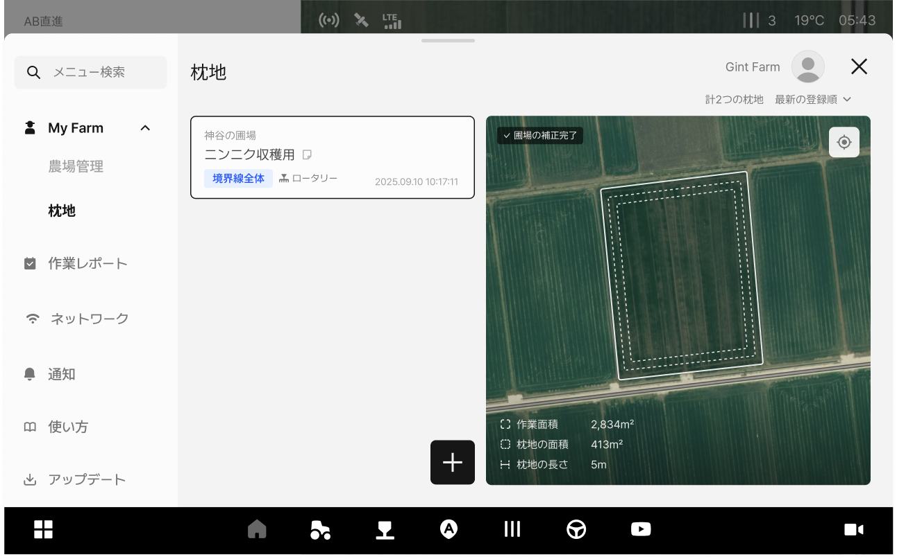<figcaption></figcaption></figure>



***

#### 枕地の設定オプション

<figure>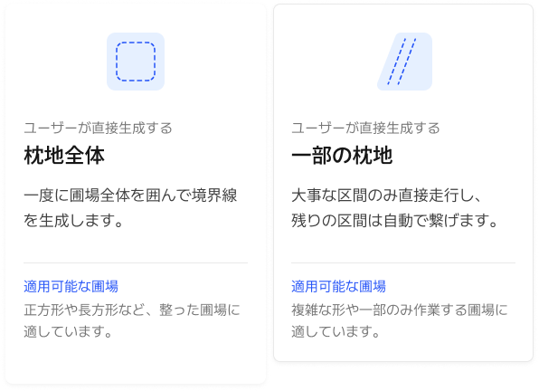<figcaption></figcaption></figure>

#### 枕地の表示ラインのご案内

<figure>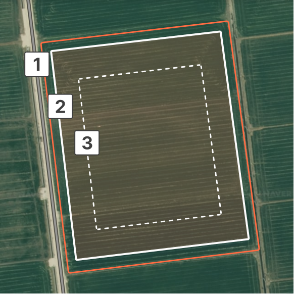<figcaption></figcaption></figure>

&#x20; **圃場の境界オフセットの表示ライン**

* 赤の実線で表示されます。

&#x20; **圃場の境界線**

* 白の実線で表示されます。

&#x20; **枕地の表示ライン**

* 白の点線で表示されます。

***

#### 枕地全体

全方向に同一の枕地を適用します。スピーディーに設定を完了できます。

<figure>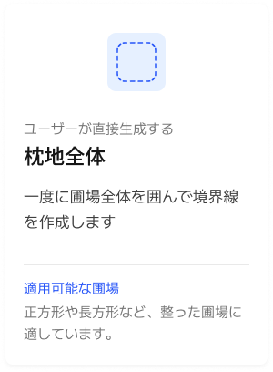<figcaption></figcaption></figure>

**枕地全体の設定モーダル**

<figure>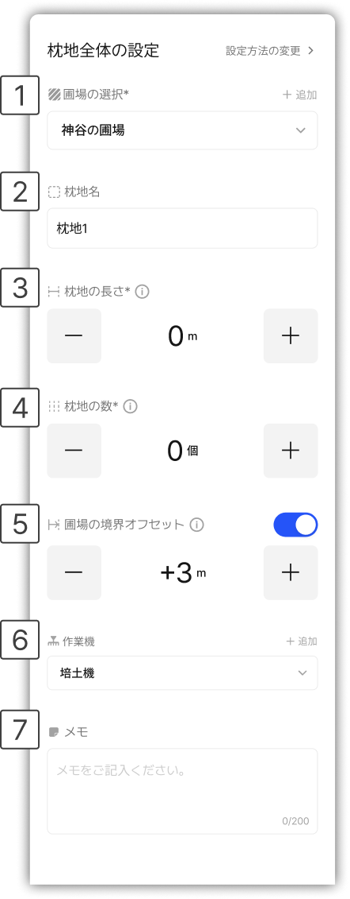<figcaption></figcaption></figure>

&#x20; **圃場の選択**

* 枕地を適用する圃場を選択します。

&#x20; **枕地名**

* 識別するための枕地名を入力します。

&#x20; **枕地の長さ**

* 枕地の幅を数値入力で設定します。
  * 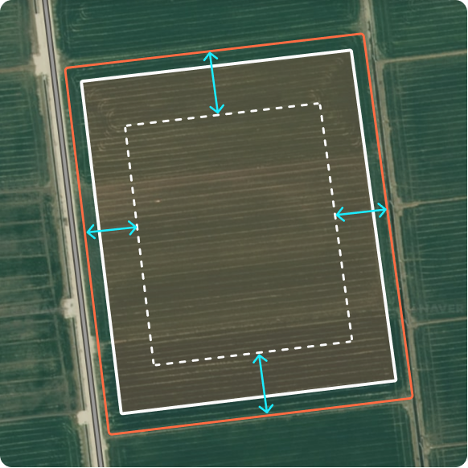

&#x20; **枕地の数**

* 枕地の周回数を設定します。
  * 枕地を1周に設定した場合\
    
  * 枕地を2周に設定した場合\
    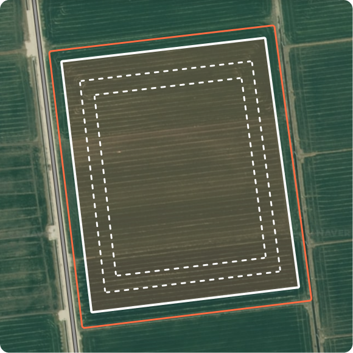

&#x20; **圃場の境界オフセット**

* 数値入力で圃場境界を調整します。ON/OFFの切り替えが可能で
* +は外側、-は内側へ境界線が移動します。
  * プラス（+）で数値設定の場合\
    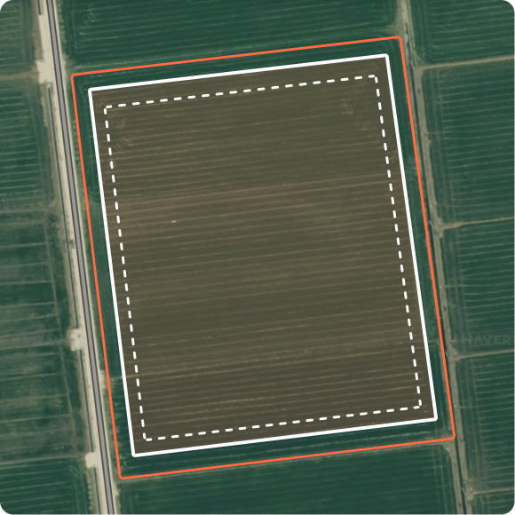
  * マイナス（-）で数値設定の場合\
    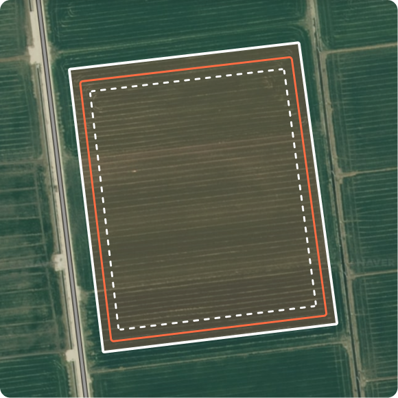

&#x20; **作業機**

* 作業に使用する作業機を選択します。

&#x20; **メモ**

* 追加情報をメモします。

***

#### 一部の枕地

設定したい場所だけ枕地を作れます。危険な場所は安全に注意して、それ以外の場所は作業面積を最大限に確保して作成できます。

<figure>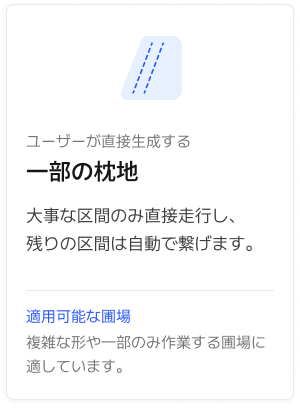<figcaption></figcaption></figure>

**一部の枕地の設定モーダル**

<figure>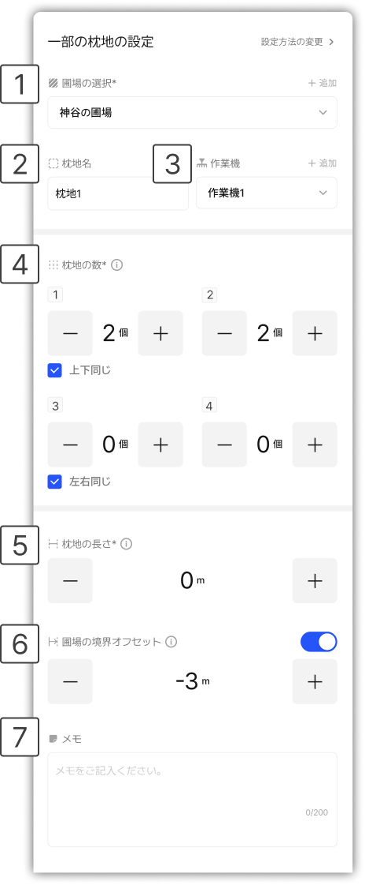<figcaption></figcaption></figure>

&#x20; **圃場の選択**

* 枕地を適用する圃場を選択します。

&#x20; **枕地名**

* 識別するための枕地名を入力します。

&#x20; **作業機**

* 作業に使う作業機を選択します。

&#x20; **枕地の本数**

* 枕地の本数を設定します。
  *  番ラインに枕地を1本設定の場合\
    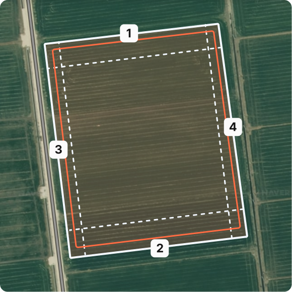
  *  番ラインに枕地を3本設定の場合\
    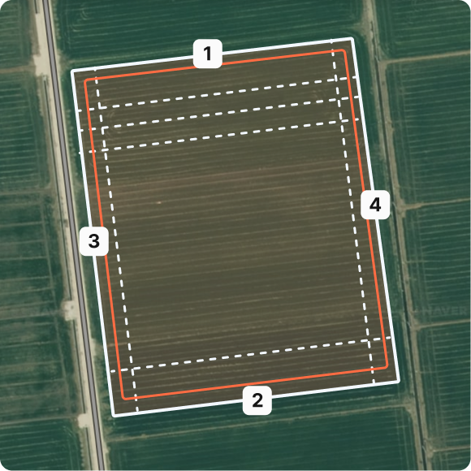

&#x20; **枕地の長さ**

* 枕地の幅を数値入力で設定します。
  * 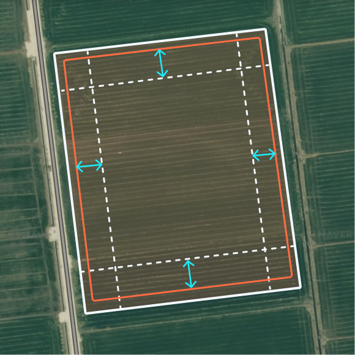

&#x20; **圃場の境界オフセット**

* 数値入力で圃場境界を調整します。ON/OFFの切り替えが可能で、
* +は外側、-は内側へ境界線が移動します。
* プラス（+）で数値設定の場合\
  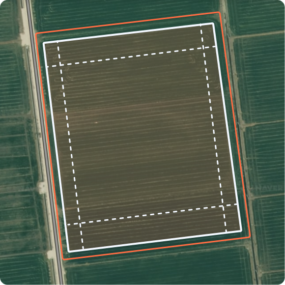
* マイナス（-）で数値設定の場合\
  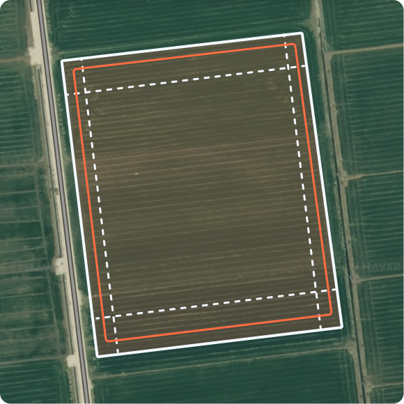

&#x20; **メモ**

* 追加情報をメモします。
