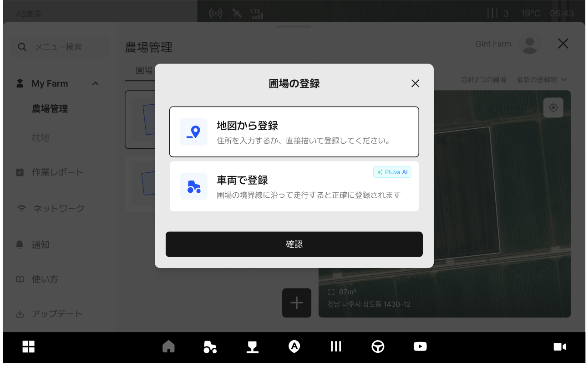
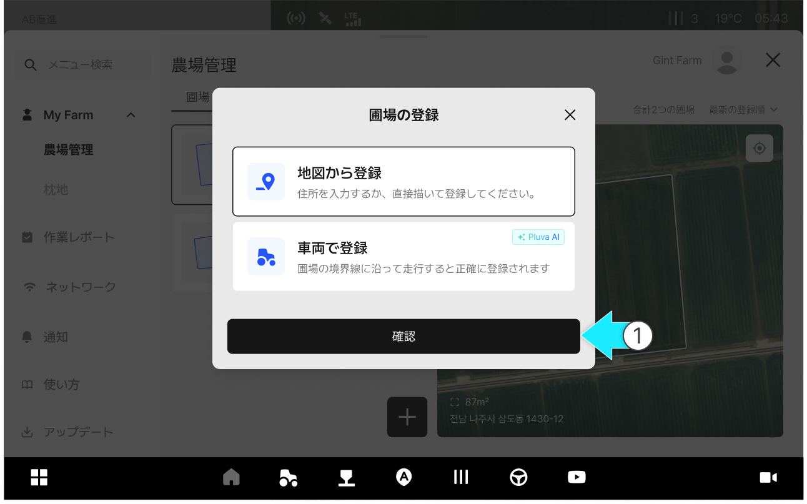
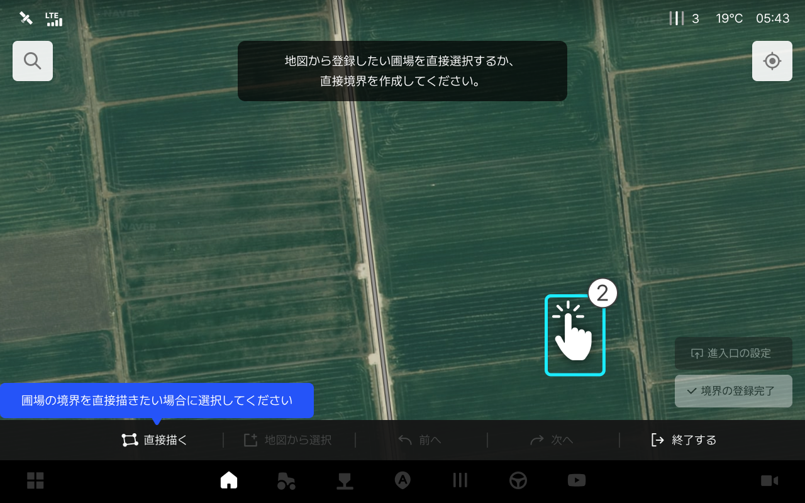
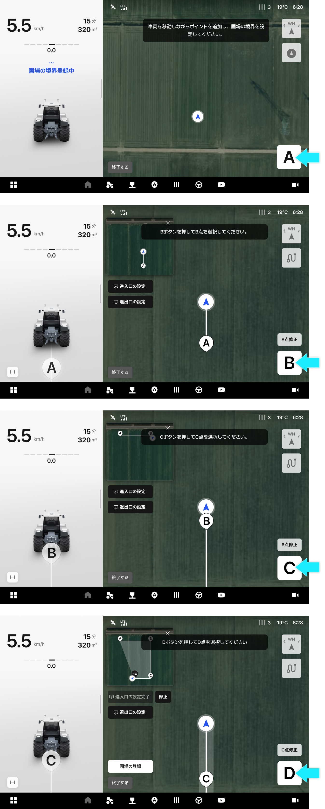
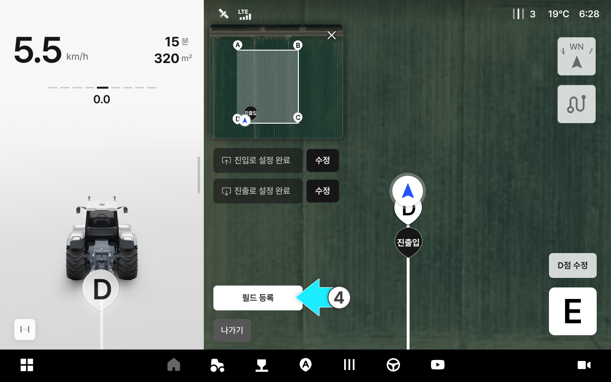
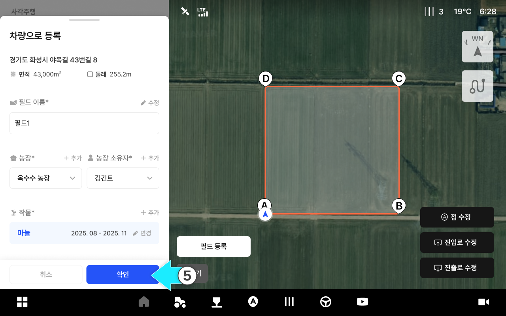
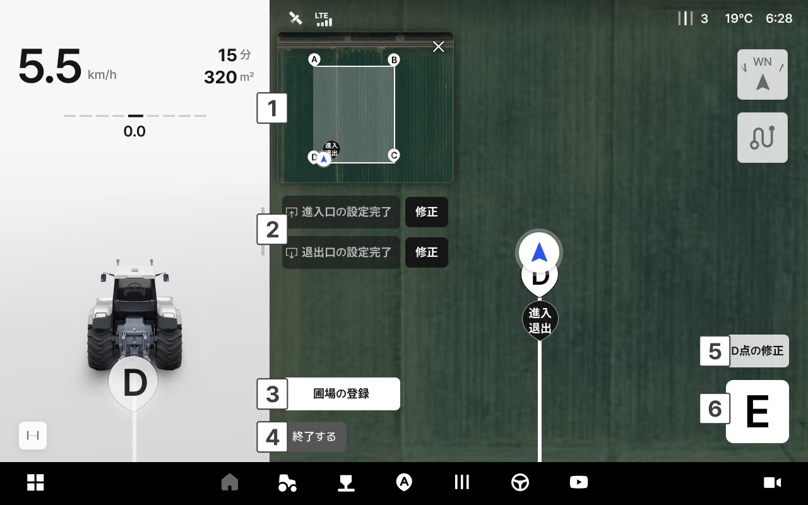

---
layout:
  width: default
  title:
    visible: true
  description:
    visible: false
  tableOfContents:
    visible: true
  outline:
    visible: true
  pagination:
    visible: true
  metadata:
    visible: true
  tags:
    visible: true
metaLinks:
  alternates:
    - >-
      https://app.gitbook.com/s/YgZGmmCCfllSmVLHO3Uz/order-installation/quick-setup/farm-setting
---

# 圃場の設定

圃場の設定は、お客様が作業する農場、農場主、圃場、枕地を登録および設定するプロセスです。

圃場の設定は、以下のプロセスで行われます。

1. **農場の登録**

* 現在地をもとに初期設定されます。
*

    <figure><figcaption></figcaption></figure>

2. **農場主の登録**

* お客様アカウントをもとに初期設定されます。
*

    <figure><figcaption></figcaption></figure>

3. **圃場の登録**

* 作業を開始するためには、圃場を登録する必要があります。
* 下記の[圃場の登録](farm-setting.md#field)をご参照ください。

4. **枕地の登録**

* 作業環境に合わせて枕地を登録します。
* 下記の[枕地](farm-setting.md#headland)をご参照ください。

***

### 圃場の登録 

**圃場とは？**

> 圃場は、実際の作業が行われる作業エリアのことです。地図から登録、または境界を直接描いて登録できます。

#### 「圃場の登録」機能へのアクセス



\[登録する]をタップします。

<figure><figcaption></figcaption></figure>


「後で登録」を選択した場合、農場管理 > 圃場へ接続し、\[+]をタップして登録できます。





\[確認]をクリックします。

<figure><figcaption></figcaption></figure>



***

#### 地図から登録



「地図から登録」オプションを選択し、\[確認]をクリックします。

<figure><figcaption></figcaption></figure>



地図から圃場を選択します。

<figure><figcaption></figcaption></figure>


圃場登録の基本設定は\[地図から選択]になっています。
境界を直接作成するには、\[直接描く]をクリックします。




境界の生成後、\[進入口の設定]をクリックし、ご希望の場所を選択します。

<figure><figcaption></figcaption></figure>



進入・退出口の位置設定ポップアップから\[同じ場所に設定]を選択します。

<figure><figcaption></figcaption></figure>


\[退出口を別途設定]を選択した場合は、進入/退出口をそれぞれ指定する必要があります。





進入・退出口の設定が完了したら圃場情報を入力し、\[登録]をクリックします。

<figure><figcaption></figcaption></figure>



圃場の登録が完了します。

<figure><figcaption></figcaption></figure>



#### 地図から圃場登録の画面のご案内

<figure><figcaption></figcaption></figure>

 **住所を検索し圃場を選択**

* アドレス検索で圃場を選択します。

<figure><figcaption></figcaption></figure>

 **直接描く**

* 圃場エリアに直接点を打って生成します。

<figure><figcaption></figcaption></figure>

 **地図から選択**

* 地図上で圃場を直接クリックして選択します。\[地図から登録]が基本設定になっています。

 **前へ**

* 前へ戻ります。

 **次へ**

* 次へ進みます。

 **終了する**

* 「圃場を追加する」画面から出ます。

 **現在地へ移動する**

* 現在地に地図を移動させます。

 **進入/退出口の設定**

* 進入/退出口の位置を設定します。圃場を選択すると、そのボタンが使用できます。進入/退出口は同じ位置に設定するか、別々に設定することができます。なお、修正ボタンから位置変更ができます。

 **境界の登録完了**

* 境界登録を完了します。進入/退出口を選択するとそのクリックが可能になります。

#### 地図から圃場登録モーダルのご案内

<figure><figcaption></figcaption></figure>

 **圃場名**

* 代表として表記する圃場の名前を入力します。

 **農場**

* 圃場と紐づく農場を選択します。

 **農場主**

* 圃場と紐づく農場主を選択します。

 **作物**

* 現在の圃場で作業中の作物を追加します。

 **メモ**

* メモに追加情報を記入できます

***

#### 車両から登録

直接車両を運転し、圃場の境界を走行しながらポイントを設定する方法です。地図に表示されない圃場や境界が不明確な場合に適してます。



圃場の登録オプションから「車両から登録」を選択し、\[確認]をタップします。

<figure><figcaption></figcaption></figure>



「車両から登録」画面にアクセスできます。車両を圃場の各ポイントへ移動させ、ボタンを押してポイントを登録します。

<figure><figcaption></figcaption></figure>


設定直後に、該当するポイントの修正ボタンが表示されます。位置が不正確な場合は、修正ボタンを押して再設定してください。



各ポイントは順番通りに設定してください。任意に順番を変えて設定すると、境界が正しく生成されません。




Dポイント以上の設定が完了すると、車両を進入・退出口に移動させ、進入口と退出口の設定ボタンを押して登録します。

<figure><figcaption></figcaption></figure>


退出口は、作業完了後に出ていく経路です。設定後にも修正できます。



ポイントは最大6地点まで設定できます。




各ポイントと退出口の設定が完了したら、「圃場の登録」ボタンが表示されます。**圃場の登録**をタップします。

<figure><figcaption></figcaption></figure>



圃場に関する情報入力画面から、圃場名、農場、作物などを入力します。入力後に**登録**をタップすると圃場の登録が完了します。

<figure><figcaption></figcaption></figure>



#### 画面のボタンに関するご案内

<figure><figcaption></figcaption></figure>

 **ミニ地図**

* 現在登録中の圃場の境界を全体画面から確認できます。

 **退出口の設定**

* 退出口を車両の現在地に設定します。

 **圃場の登録**

* 全てのポイントを設定し終わったら、圃場を登録します。

 **終了する**

* 登録を中断し、前の画面に戻ります。

 **修正**

* 既に設定したポイントを現在地に変更します。

 **A / B / C / D**

* 該当するポイントを車両の現在地に設定します。

#### 車両から圃場登録モーダルに関するご案内

<figure><figcaption></figcaption></figure>

 **圃場名**

* 表示したい圃場名を入力します。

 **農場**

* 圃場と紐づける農場を選択します。

 **農場主**

* 圃場と紐づける農場主を選択します。

 **作物**

* 現在の圃場で作業中の作物を追加します。

 **メモ**

* 補足情報をメモします。

***

### 枕地の登録 

**枕地とは？**

> 枕地は、圃場の端で安全に旋回したり、作業機を操作したりするために確保する余白エリアです。圃場の境界から設定した距離の内側に作成され、作業環境に合わせて幅を調整することができます。

#### 「枕地の登録」へのアクセス



My Farmから「枕地」を選択します。

<figure><figcaption></figcaption></figure>



 「枕地の追加」ボタンをタップします。

<figure><figcaption></figcaption></figure>



ご希望の設定オプションを選択し確認を押すと、枕地の作成に入ります。

<figure><figcaption></figcaption></figure>



枕地の設定モーダルから、詳細設定を入力後\[確認]をタップします。

<figure><figcaption></figcaption></figure>



枕地の作成が完了します。

<figure><figcaption></figcaption></figure>



***

#### 枕地の設定オプション

<figure><figcaption></figcaption></figure>

#### 枕地の表示ラインのご案内

<figure><figcaption></figcaption></figure>

.svg>) **圃場の境界オフセットの表示ライン**

* 赤の実線で表示されます。

.svg>) **圃場の境界線**

* 白の実線で表示されます。

.svg>) **枕地の表示ライン**

* 白の点線で表示されます。

***

#### 枕地全体

全方向に同一の枕地を適用します。スピーディーに設定を完了できます。

<figure><figcaption></figcaption></figure>

**枕地全体の設定モーダル**

<figure><figcaption></figcaption></figure>

.svg>) **圃場の選択**

* 枕地を適用する圃場を選択します。

.svg>) **枕地名**

* 識別するための枕地名を入力します。

.svg>) **枕地の長さ**

* 枕地の幅を数値入力で設定します。
  * 

.svg>) **枕地の数**

* 枕地の周回数を設定します。
  * 枕地を1周に設定した場合\
    
  * 枕地を2周に設定した場合\
    

 **圃場の境界オフセット**

* 数値入力で圃場境界を調整します。ON/OFFの切り替えが可能で
* +は外側、-は内側へ境界線が移動します。
  * プラス（+）で数値設定の場合\
    
  * マイナス（-）で数値設定の場合\
    

 **作業機**

* 作業に使用する作業機を選択します。

 **メモ**

* 追加情報をメモします。

***

#### 一部の枕地

設定したい場所だけ枕地を作れます。危険な場所は安全に注意して、それ以外の場所は作業面積を最大限に確保して作成できます。

<figure><figcaption></figcaption></figure>

**一部の枕地の設定モーダル**

<figure><figcaption></figcaption></figure>

.svg>) **圃場の選択**

* 枕地を適用する圃場を選択します。

.svg>) **枕地名**

* 識別するための枕地名を入力します。

.svg>) **作業機**

* 作業に使う作業機を選択します。

.svg>) **枕地の本数**

* 枕地の本数を設定します。
  *  番ラインに枕地を1本設定の場合\
    
  *  番ラインに枕地を3本設定の場合\
    

 **枕地の長さ**

* 枕地の幅を数値入力で設定します。
  * 

 **圃場の境界オフセット**

* 数値入力で圃場境界を調整します。ON/OFFの切り替えが可能で、
* +は外側、-は内側へ境界線が移動します。
* プラス（+）で数値設定の場合\
  
* マイナス（-）で数値設定の場合\
  

 **メモ**

* 追加情報をメモします。
