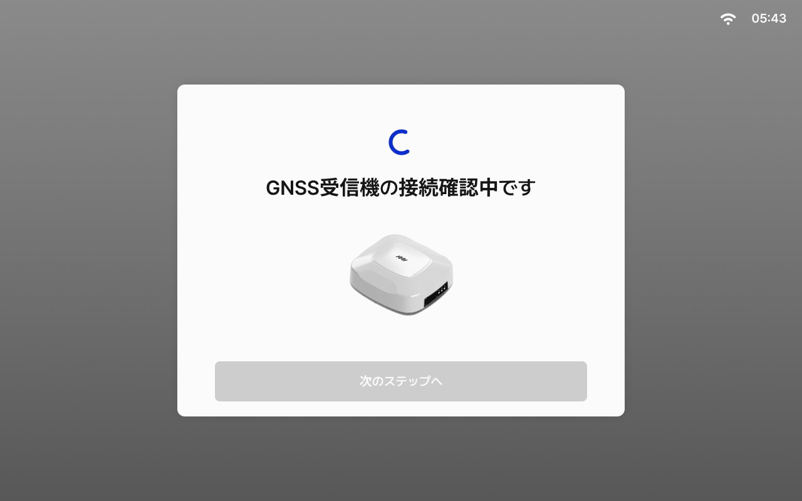
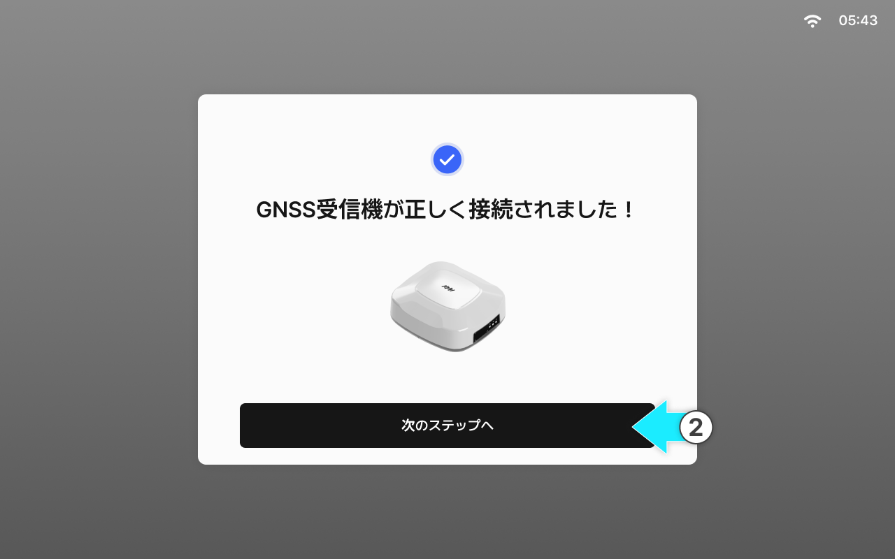
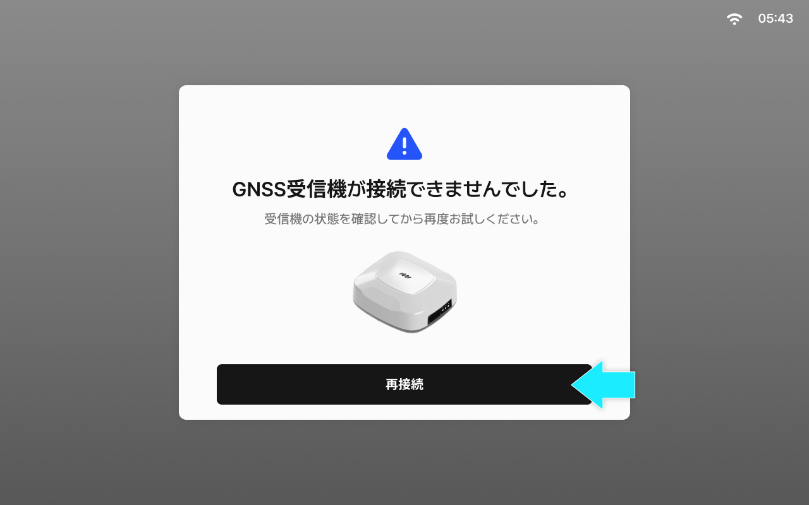

---
layout:
  width: default
  title:
    visible: true
  description:
    visible: false
  tableOfContents:
    visible: true
  outline:
    visible: true
  pagination:
    visible: true
  metadata:
    visible: true
  tags:
    visible: true
metaLinks:
  alternates:
    - /broken/spaces/YgZGmmCCfllSmVLHO3Uz/pages/qWBYBiSP5o4a0wiNGKRH
---

# GNSS受信機の接続確認

タブレットとGNSS受信機の接続状態を確認するステップです。


設定値は、タブレットのGNSS受信機の設定メニューから確認および変更ができます。


***

#### GNSS受信機の接続確認



GNSS受信機の接続確認画面にアクセスします。画面が表示されると、接続確認が自動的に開始されます。

<figure><figcaption></figcaption></figure>



\[次のステップへ]をタップすると、GNSS受信機の接続確認が完了します。

<figure><figcaption></figcaption></figure>


接続に失敗した場合は、受信機側面のLEDステータスを確認のうえ「再試行」をタップし、もう一度実行してください。




