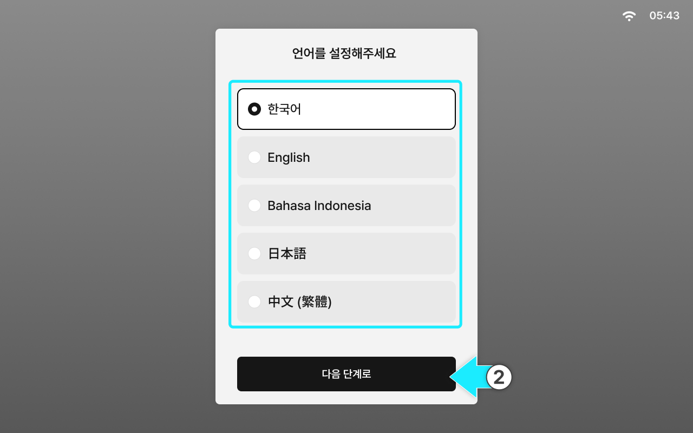

---
layout:
  width: default
  title:
    visible: true
  description:
    visible: false
  tableOfContents:
    visible: true
  outline:
    visible: true
  pagination:
    visible: true
  metadata:
    visible: true
  tags:
    visible: true
metaLinks:
  alternates:
    - /broken/spaces/YgZGmmCCfllSmVLHO3Uz/pages/gZ9unvyc40Y86VaIN8zK
---

# 言語設定

簡単セットアップの開始に向けて、使用言語を設定するステップです。



タブレットの電源を入れます。

<figure><figcaption></figcaption></figure>



使用言語を選択します。\[次のステップへ]をクリックすると、言語設定が完了します。

<figure><figcaption></figcaption></figure>


