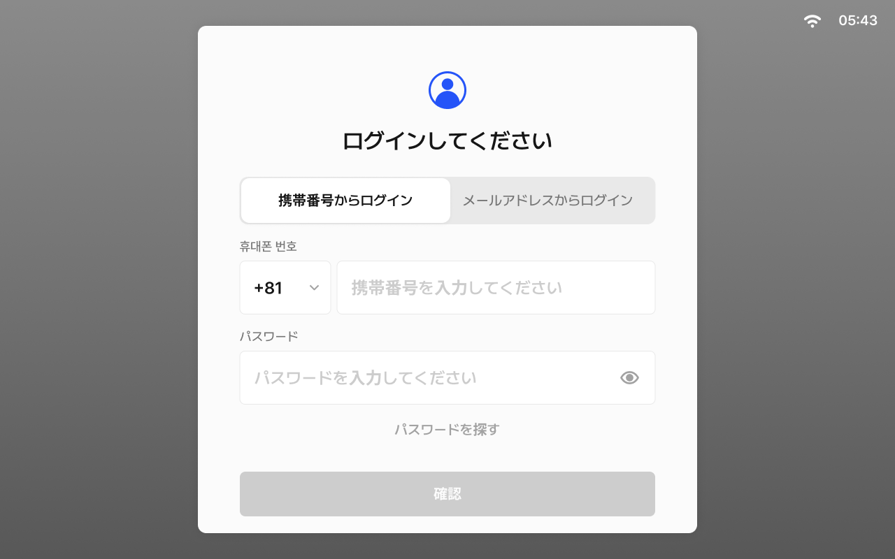
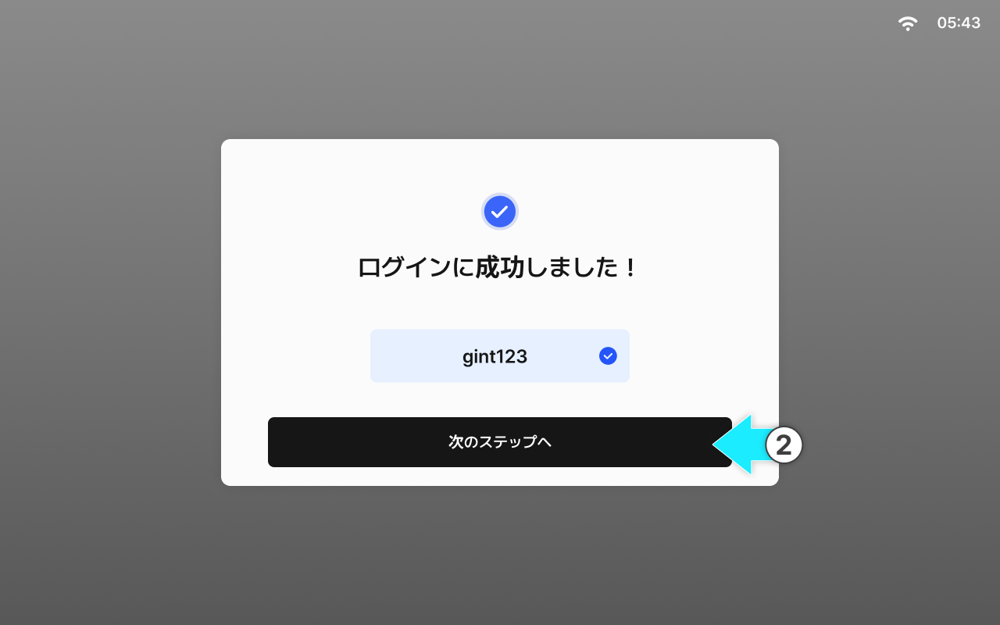
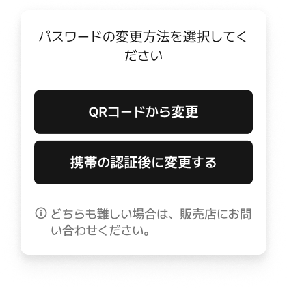

---
layout:
  width: default
  title:
    visible: true
  description:
    visible: false
  tableOfContents:
    visible: true
  outline:
    visible: true
  pagination:
    visible: true
  metadata:
    visible: true
  tags:
    visible: true
metaLinks:
  alternates:
    - >-
      https://app.gitbook.com/s/YgZGmmCCfllSmVLHO3Uz/order-installation/quick-setup/login
---

# ログイン


* ログイン前に、**会員登録サイトにてアカウントの作成**を行ってください。
* お客様アカウントがない場合、登録情報を基にしたパーソナライズ機能（自動操舵など）をご提供できないため、**サービスのご利用が制限**されます。




IDとパスワードを入力し、\[確認]をタップします。

<figure><figcaption></figcaption></figure>



\[次のステップへ]をタップすると、ログインが完了します。

<figure><figcaption></figcaption></figure>




パスワードをお忘れの場合は、パスワードの再設定を進めてください。

以下の2つの方法で再設定が可能です。

* QRコードによる変更
* 携帯電話番号認証による変更


