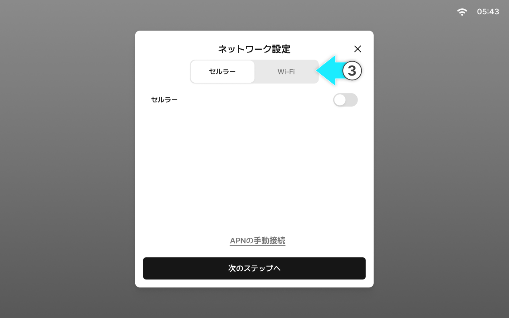
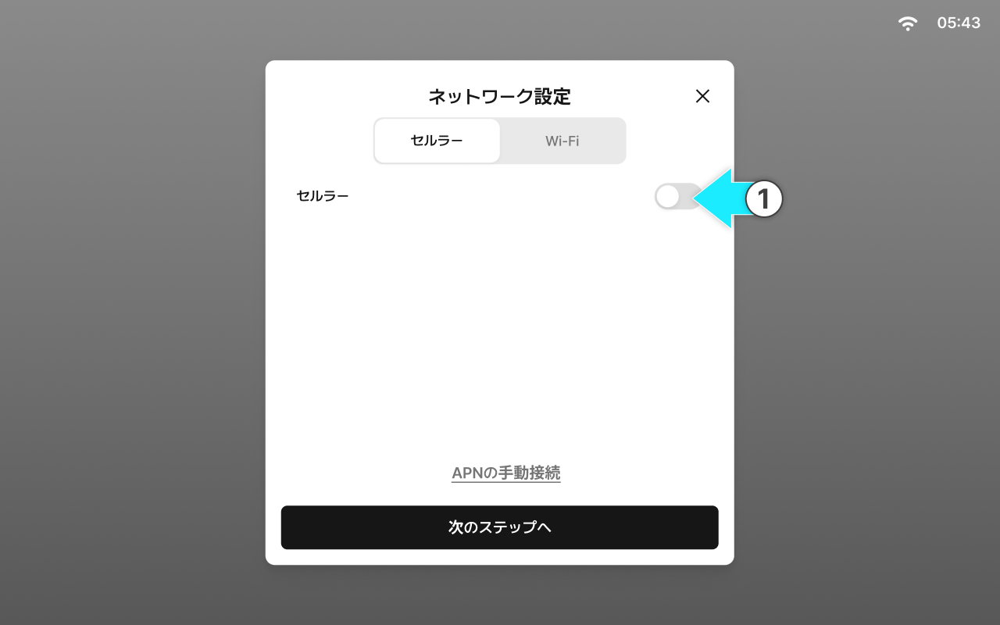
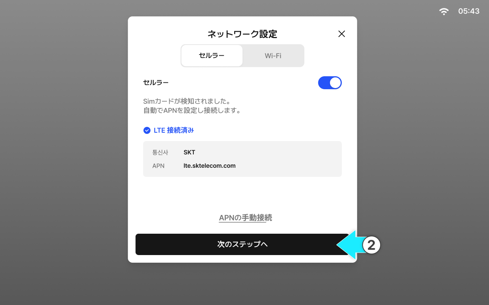
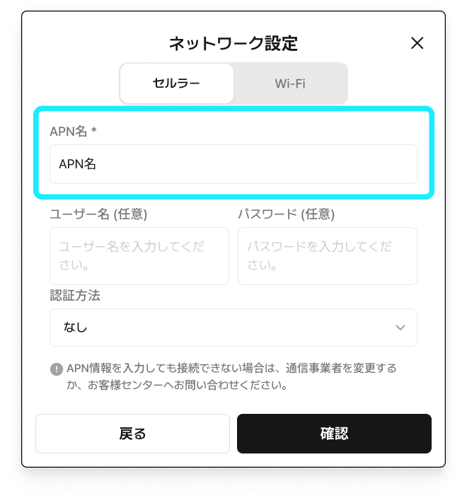
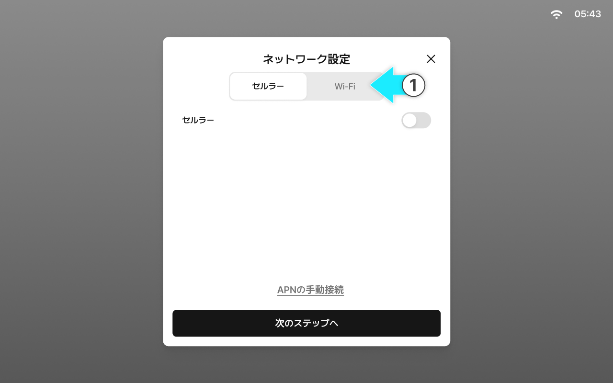
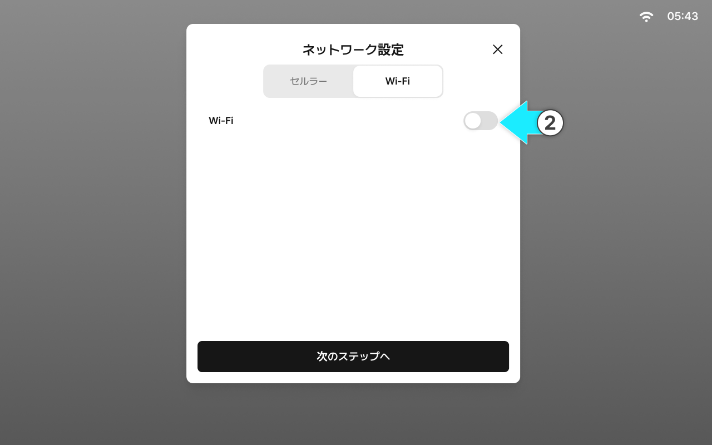
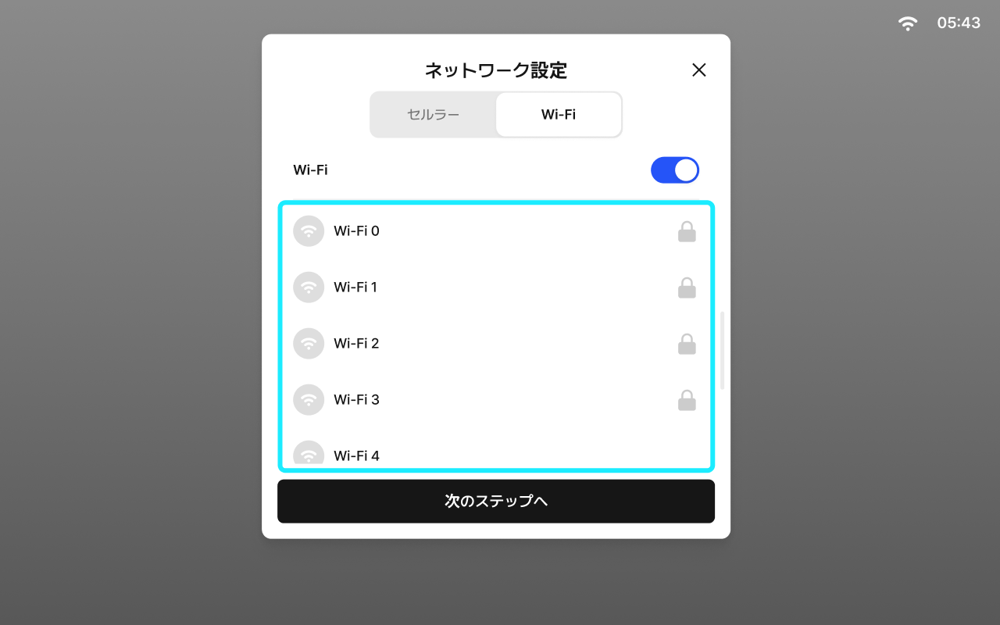
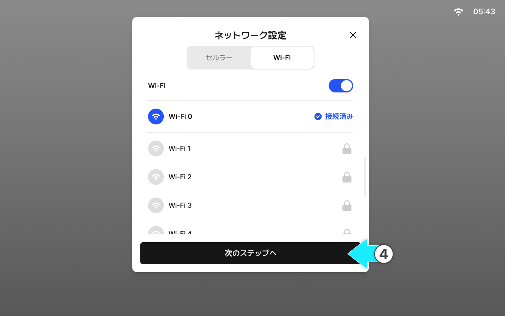

---
layout:
  width: default
  title:
    visible: true
  description:
    visible: false
  tableOfContents:
    visible: true
  outline:
    visible: true
  pagination:
    visible: true
  metadata:
    visible: true
  tags:
    visible: true
metaLinks:
  alternates:
    - >-
      https://app.gitbook.com/s/YgZGmmCCfllSmVLHO3Uz/order-installation/quick-setup/network-settings
---

# ネットワーク設定

簡単セットアップの開始には、ネットワーク設定が必要です。

ネットワークに接続されていない場合、簡単セットアップを開始できませんので、必ず設定してください。

***

#### ネットワーク設定項目

1. セルラー（モバイルデータ通信）
2. Wi-Fi


簡単セットアップ完了後も、タブレットのネットワーク設定よりネットワーク環境を確認及び設定変更できます。


***

#### セルラー接続

セルラーは、タブレットに挿入されたSimカードを介してモバイルネットワークに接続する方法です。


セルラーは接続が安定しているため、リアルタイム補正信号が必要な精密作業には、セルラーの使用を推奨します。



料金プランやデータ使用量に応じて費用が発生する場合があります。作業前に、Simカードの開通状態、データ残量、有効期限を必ずご確認ください。




セルラートグルをオンにします。

<figure><figcaption></figcaption></figure>



APNが自動的に接続されます。

<figure><figcaption></figcaption></figure>


セルラー設定は、タブレットにSIｍカードが装着されている場合にのみ設定可能です。



USIMカード挿入後、通信開始まで数分かかる場合があります。接続が確認できるまで電源を切らずにお待ちください。




\[次のステップへ]をタップするとネットワーク設定が完了します。

<figure><figcaption></figcaption></figure>



#### セルラーが自動接続されない場合


自動接続されない、または長時間接続が完了しない場合は、\[APN手動接続]を行ってください。


<figure><figcaption></figcaption></figure>

1. APN名の入力

* ppsim.jp を入力します。

2. 名前、パスワードなどの任意項目を入力してから\[確認]をタップすると、手動接続できます。

***

#### Wi-Fi接続

Wi-Fiは、周辺の無線ルーターやスマートフォンのテザリングに接続して、インターネットを利用する方式です。


通信環境によって信号が不安定、または範囲外になると接続が切れるおそれがあるため、限られた作業範囲内での使用を推奨します。



テザリング使用時には、スマートフォンのバッテリー消耗やデータ使用量が増える場合があります。作業前にバッテリー残量や省電力設定をご確認ください。




\[Wi-Fi]タブをタップします。

<figure><figcaption></figcaption></figure>



Wi-Fiのトグルをオンにします。

<figure><figcaption></figcaption></figure>



接続するWi-Fiネットワークを選択します。

<figure><figcaption></figcaption></figure>



\[次のステップへ]をタップすると、ネットワーク設定が完了します。

<figure><figcaption></figcaption></figure>


Wi-Fiの通信範囲から離れると、接続が切断されるおそれがありますのでご注意ください。



