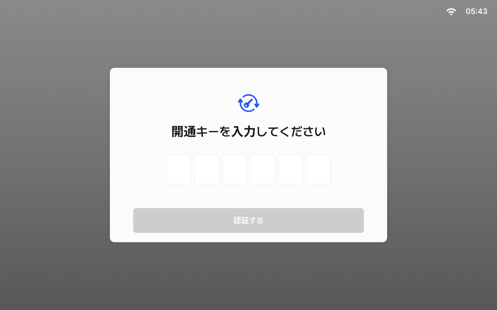
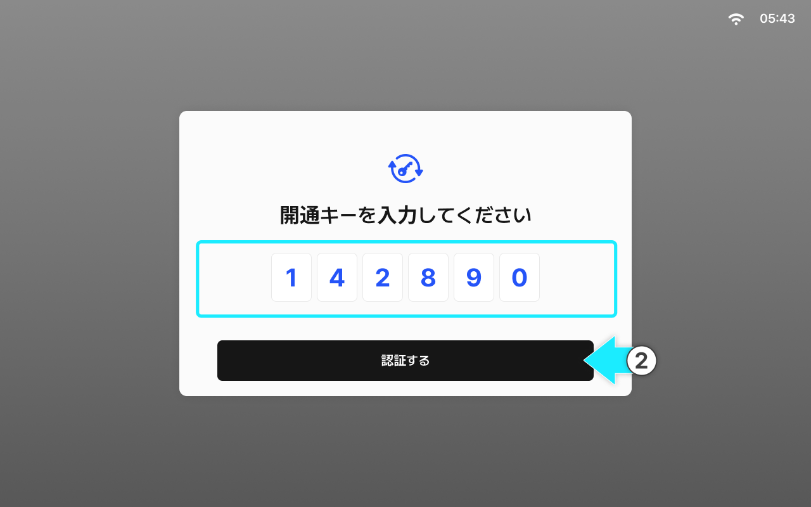
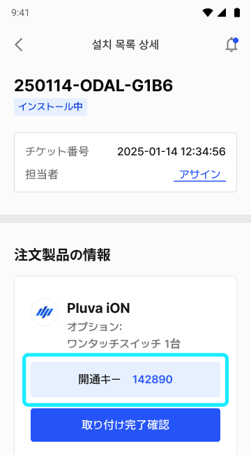
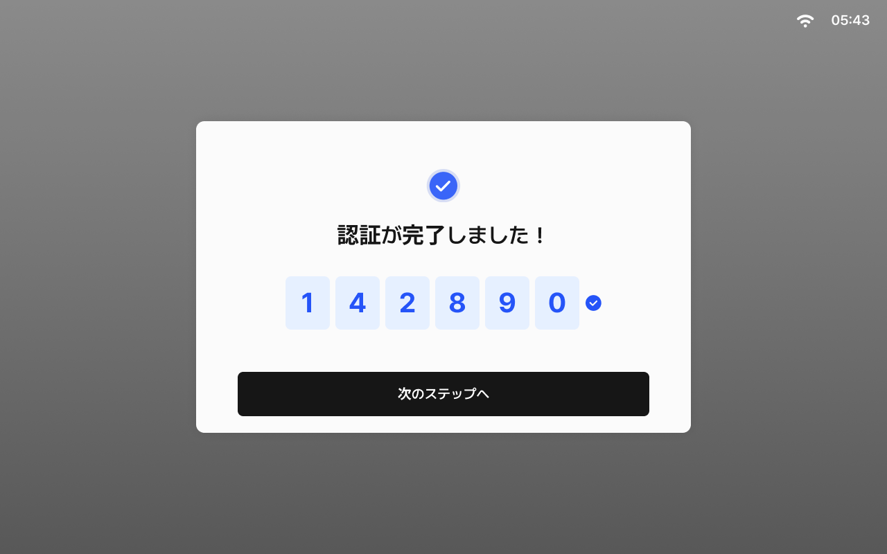

---
layout:
  width: default
  title:
    visible: true
  description:
    visible: false
  tableOfContents:
    visible: true
  outline:
    visible: true
  pagination:
    visible: true
  metadata:
    visible: true
  tags:
    visible: true
metaLinks:
  alternates:
    - >-
      https://app.gitbook.com/s/256Umh24fJVf6zNkZpSa/order-installation/quick-setup/opening-key
---

# 開通キーの入力

お客様アカウントと登録製品を紐づけるため、取り付けチケットの開通キーを入力します。\
開通キーは取り付けチケットの詳細ページにて製品登録後に表示されます。必ず先に製品登録を完了してください。

***

#### 開通キーの入力方法



開通キーの入力画面にアクセスします。

<figure><figcaption></figcaption></figure>



取り付けチケットで発行された開通キーを入力し、\[認証する]をタップします。

<figure><figcaption></figcaption></figure>


取り付けチケットと開通キー

* 取り付けチケットの詳細から、取り付け項目の開通キーを確認できます。
* 繰り返しになりますが、開通キーは製品登録後に表示されるため、事前に製品登録が必須です。





\[次のステップへ]をタップすると、開通キーの認証が完了します。

<figure><figcaption></figcaption></figure>


