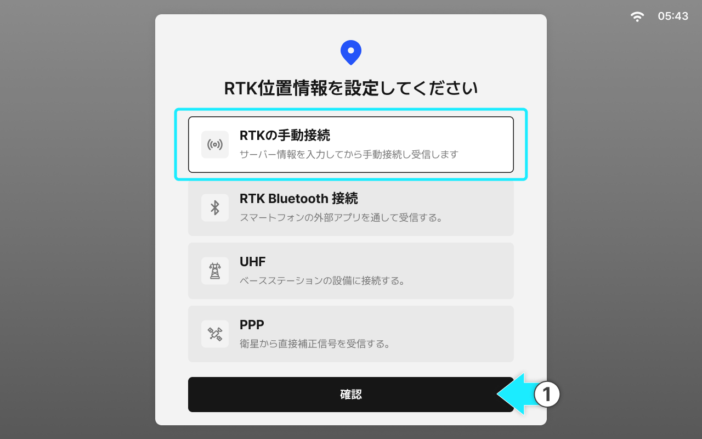
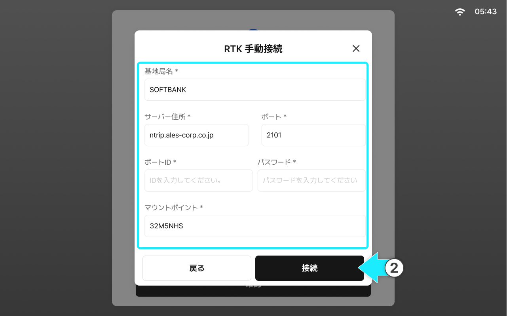
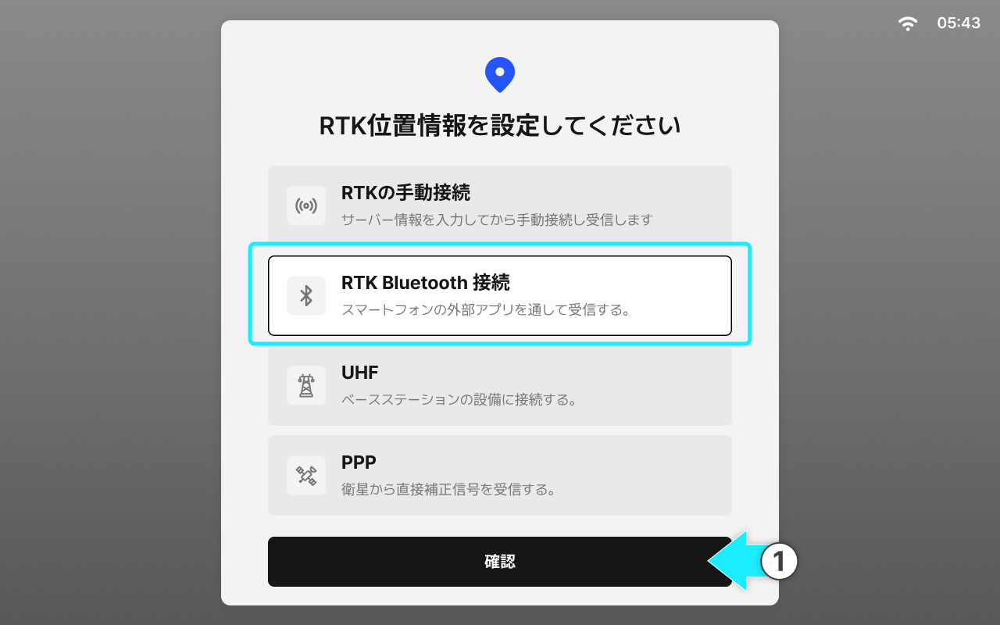
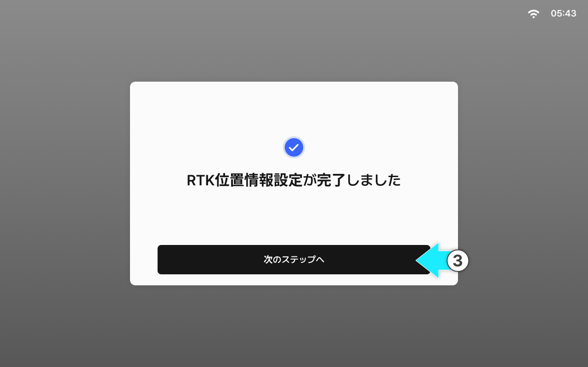

---
layout:
  width: default
  title:
    visible: true
  description:
    visible: false
  tableOfContents:
    visible: true
  outline:
    visible: true
  pagination:
    visible: true
  metadata:
    visible: true
  tags:
    visible: true
metaLinks:
  alternates:
    - >-
      https://app.gitbook.com/s/256Umh24fJVf6zNkZpSa/order-installation/quick-setup/rtk-setting
---

# 位置補正の設定

位置補正は、RTK補正信号を利用して測位精度を向上させる設定です。利用環境に合わせて接続方法を選んでください。

#### 位置補正とは？

衛星信号から測定された「基本位置」の誤差を軽減するため、補正情報を取得し測位精度を向上させる作業です。\
ネットワーク状態が不安定な場合、精度が低下したり接続が切断されたりすることがあります。


設定値は、タブレットの位置補正の設定メニューから確認および変更が可能です。


***

#### RTK手動接続

RTK手動接続は、タブレットから直接RTKサービスに接続し、補正信号を受信する方法です。



RTK手動接続を選択し、\[確認]をタップします。

<figure><figcaption></figcaption></figure>



基地局およびサーバー情報を入力し、\[接続]をタップします。

<figure><figcaption></figcaption></figure>


接続できない、または頻繁に切断される場合は、ネットワーク状態と入力情報（アドレス/ポート/アカウント/マウントポイント）を最初にご確認ください。アルファベットの大文字・小文字を正確に入力し、不要なスペースを入れないように注意してください。正しく入力するとサービスをご利用できます。




&#x20;\[次のステップへ]をタップするとRTK手動接続の設定が完了します。

<figure><figcaption></figcaption></figure>




お客様自身でRTKのアカウントを発行していただくよう、事前に案内してください。アカウント情報をお忘れの場合は、RTKサービス登録時のメールアドレスに受信された、案内メールを確認するよう案内してください。


***

#### RTK Bluetooth接続

RTK Bluetooth接続は、スマートフォンのRTKアプリとBluetoothでペアリングし、RTK補正信号をGNSS受信機へ送信する設定です。



RTK Bluetooth接続を選択し、\[確認]をタップします。

<figure><figcaption></figcaption></figure>



以下の手順に従い、RTKアプリからRTK Bluetooth接続の設定を行ってください。

1. スマートフォンのBluetooth機能をオンにします。
2. スマートフォンのRTKアプリを起動します。
3. アプリの設定で、基地局信号の入力方式としてBluetoothを選択します。
4. 使用可能なデバイスリストから「PLUVA iON」を選択します。
5. パスワードを入力し、ペアリングを完了させます。
6. アプリ、またはスマートフォンのBluetooth設定画面に「接続済み」と表示されることを確認します。



\[次のステップへ]をタップすると、RTK Bluetooth接続が完了します。

<figure><figcaption></figcaption></figure>



#### RTK Bluetooth接続に関する注意事項

PLUVA iONの正確な自動操舵を維持するため、作業中は外部のRTKアプリを常に起動させておく必要があります。RTKが受信できない場合は、まずアプリが起動中であることをご確認ください。

> **アプリが終了する主な原因**
>
> 1. ユーザーによる操作
>
> * 最近使用したアプリ一覧画面で、アプリをスワイプして閉じた場合
> * 最近使用したアプリ一覧画面で、\[すべて閉じる]をタップして一括終了させた場合
> * メモリ最適化アプリによって終了させられた場合
>
> 2．Androidシステムによる自動終了
>
> * バッテリー節約機能により、バックグランドアプリが強制終了される場合
> * 対策1：アプリ設定から**バッテリーの最適化をOFF**にしてください。
> * 対策2：Android設定で**省電力設定の対象外アプリ**として登録してください。
>
>
>
> **アプリ終了の予防策**
>
> * 作業時間に合わせてモバイルバッテリーを用意するか、充電しながら使用してください。
> * 定期的にRTKの接続状態をご確認ください。


お客様がアカウント情報をお忘れの場合、RTK登録時のメールアドレスからログインし、登録当時に受信したメールを確認してもらうよう案内してください。メールにはID、パスワード、基地局情報などが記載してあります。



アプリの接続エラーが発生する場合、RTK事業者が提供した情報が正確に入力されているかご確認ください。\
ID、パスワード、ポート番号などRTK事業者が提供した情報を正確に入力すると、サービスをご利用できます。

