---
metaLinks:
  alternates:
    - >-
      https://app.gitbook.com/s/256Umh24fJVf6zNkZpSa/order-installation/quick-setup/vehicle-calibration
---

# 車両設定および補正 \_トラクター(차량 설정 및 보정 \_트랙터)

### 차량 설정 및 보정\_트랙터

정확한 자율주행을 위한 차량 보정 작업을 진행합니다. 차량 보정은 총 세가지로 한번에 시작하기를 통해 한번에 진행할 수 있습니다.

***

#### 차량 유형별 보정 항목

**트랙터**

1. [GNSS 수신기 위치 설정](vehicle-calibration.md#gnss)
2. [오토스티어 보정](vehicle-calibration.md#undefined-4)
   1.  배속턴 옵션 미탑재 차량

       1. 오토스티어 보정
       2. 핸들 범위 보정
       3. 직진 조향 보정

   2. 배속턴 옵션 탑재 차량
      1.  배속턴 옵션 탑재 차량은 **배속턴 OFF/ON 각각의 상태**에서 오토스티어 보정을 진행합니다.\
          따라서 오토스티어 보정은 **총 2회** 수행됩니다.

          

차량 추가 시 <strong>[배속턴 차량] 토글을 반드시 ON</strong> 으로 설정해 등록해 주세요. 토글 설정에 따라 보정 절차가 배속턴 차량에 맞게 진행됩니다.

          1. OFF 상태 설정
             1. 오토스티어링 보정
             2. 핸들 범위 보정
             3. 직진 조향 보정
             4. 2차 직진 조향 보정
          2.  ON 상태 설정

              1. 직진 조향 보정

           

***

#### 차량 보정 시작하기



\[전체 한번에 시작하기] 버튼을 눌러 보정을 시작합니다.

<figure>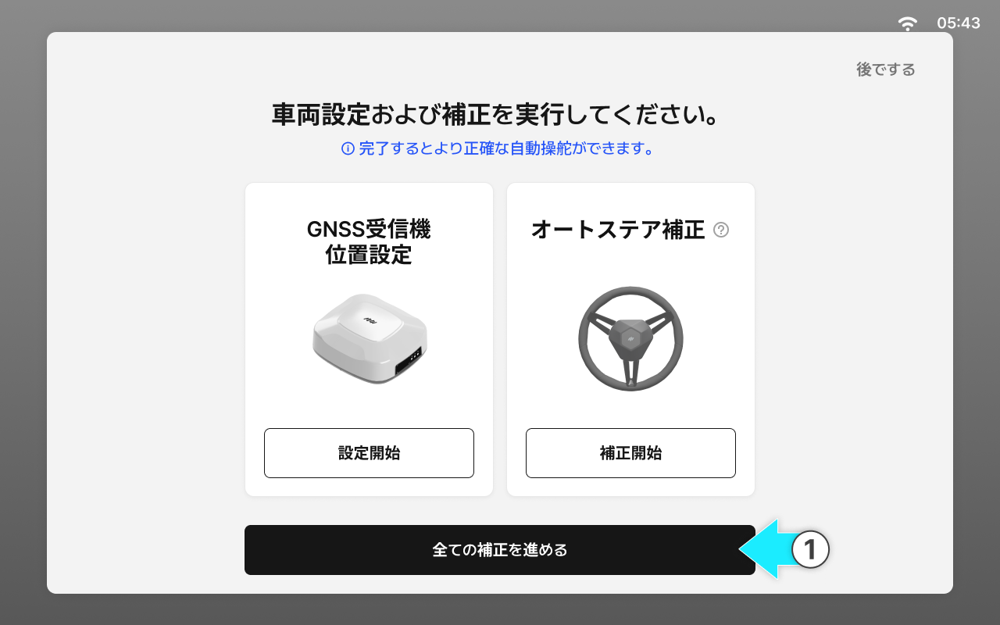<figcaption></figcaption></figure>



***

#### GNSS 수신기 위치 설정

경사지나 불규칙한 지형에서도 정확한 방향과 자세를 유지하기 위해, GNSS수신기의 기준값을 조정하는 기능입니다. 설치 상태에 따라 기울어짐이 큰 경우 값을 입력해 보정할 수 있습니다.



GNSS 수신기의 종방향, 횡방향, 설치 높이를 입력하고 \[확인]을 누릅니다.

<figure>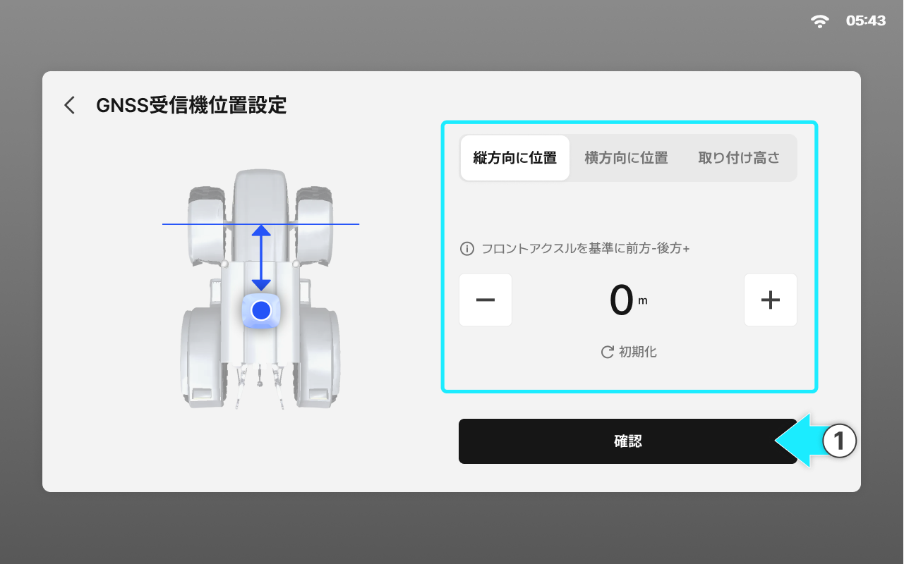<figcaption></figcaption></figure>



롤, 피치, 요 값을 입력하고 \[확인]을 누르면 오토스티어 보정 화면으로 진입합니다.

<figure>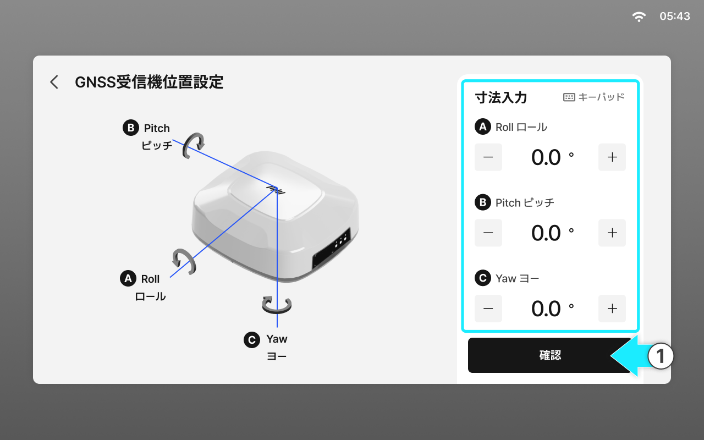<figcaption></figcaption></figure>



#### GNSS 수신기 위치 설정 설명

1. **종방향, 횡방향, 설치 높이 설정**

* 종방향 위치: 프론트액슬 기준 전측 - 후측 +
  *

      <figure>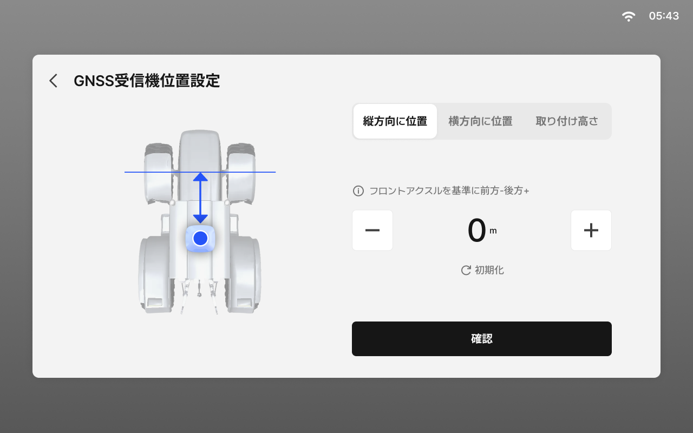<figcaption></figcaption></figure>
  *

      <figure><figcaption></figcaption></figure>
* 횡방향 위치: 액슬 중앙 기준 우측 + 좌측 -
  *

      <figure>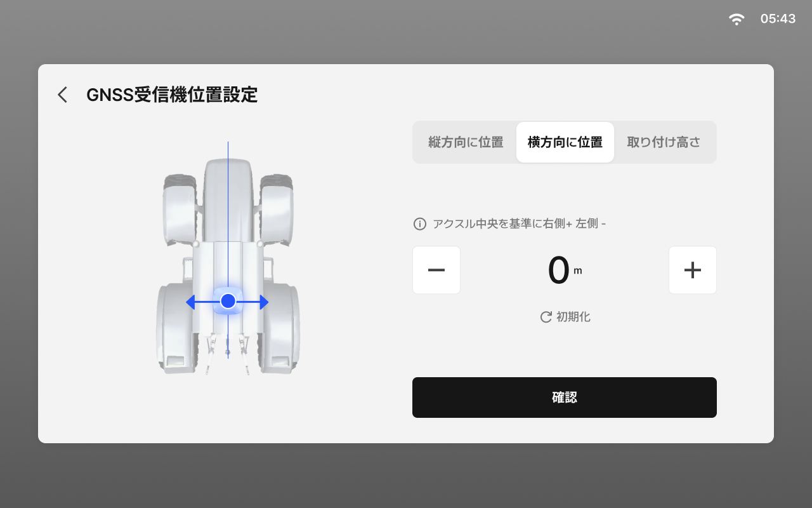<figcaption></figcaption></figure>
  *

      <figure>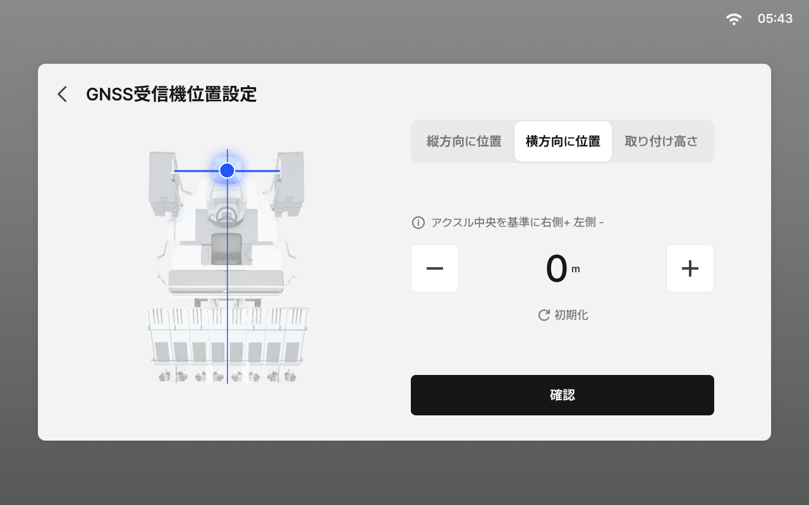<figcaption></figcaption></figure>
* 설치 높이: 지면에서 수신 설치 위치까지 거리
  *

      <figure>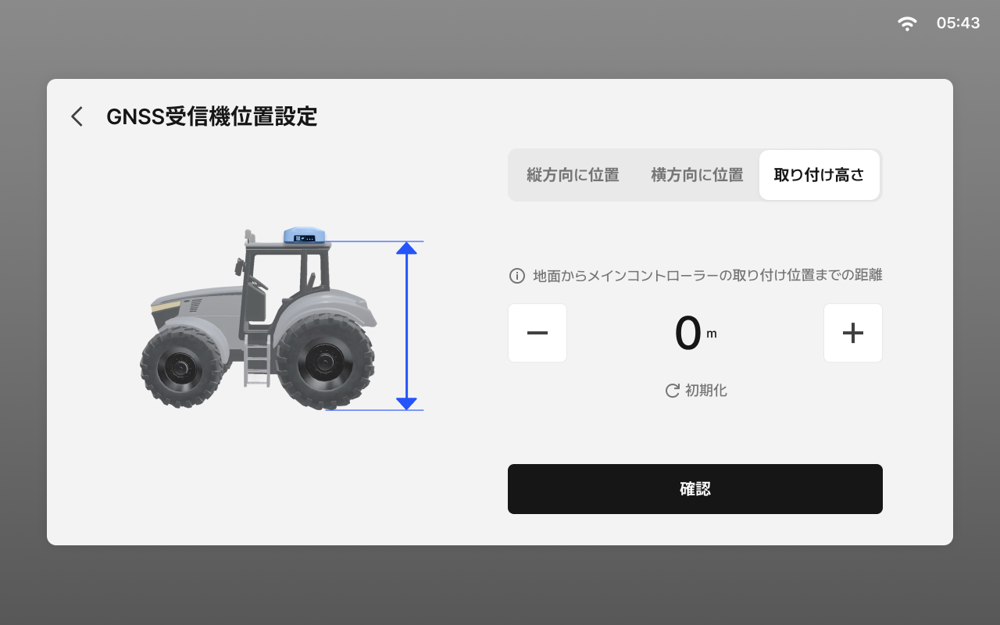<figcaption></figcaption></figure>
  *

      <figure>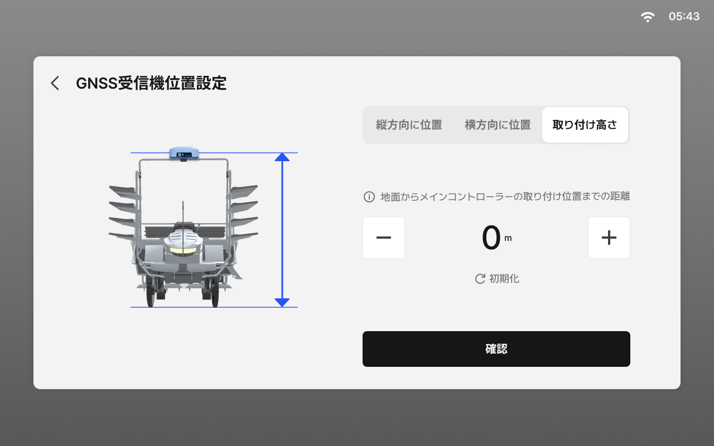<figcaption></figcaption></figure>

2. **롤/피치/요 설정**

<figure>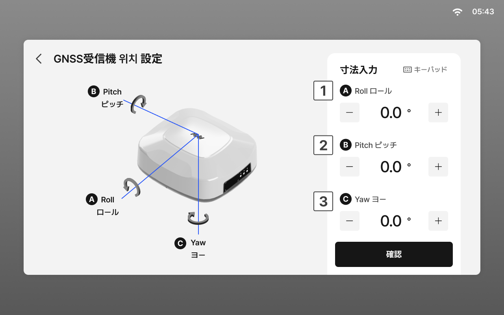<figcaption></figcaption></figure>

&#x20; **ROll 롤**

* GNSS 수신기가 좌/우 방향으로 기울어진 각도를 의미합니다.

&#x20; **Pitch 피치**

* GNSS 수신기가 앞/뒤 방향으로 기울어진 각도를 의미합니다.

&#x20; **Yaw 요**

* GNSS 수신기가 수직축을 기준으로 회전한 각도를 의미합니다.

***

#### 일반 차량 오토스티어 보정

오토스티어 보정은 설정된 경로를 안정적으로 추종할 수 있도록 조향 범위와 직진 기준값을\
보정하는 절차입니다. 트랙터는 2단계, 이앙기는 3단계로 진행됩니다.

**트랙터 (2단계)**

* 핸들 범위 보정 - 직진 조향 보정
*

    <figure>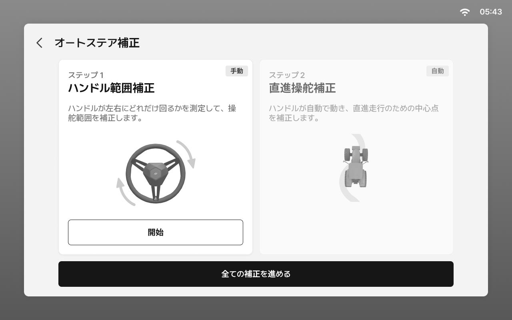<figcaption></figcaption></figure>

**이앙기 (3단계)**

* 핸들 범위 보정 - 직진 조향 보정 - 조향 각도 보정
*

    <figure>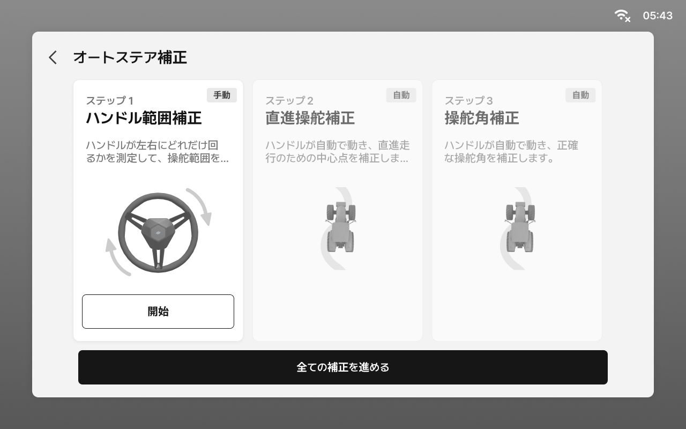<figcaption></figcaption></figure>

***

#### 트랙터 오토스티어 보정

1. **핸들 범위 보정**



\[전체 한번에 진행] 버튼을 누르면 오토스티어 보정이 시작됩니다.

<figure>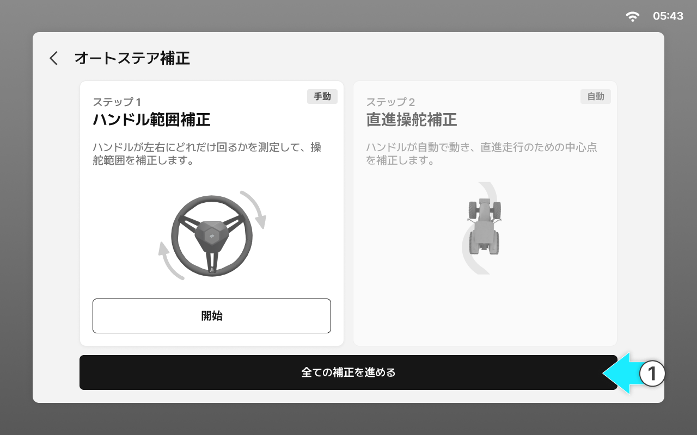<figcaption></figcaption></figure>


각 단계 시작 버튼을 누르면 해당 단계 보정만 진행할 수 있습니다.




안내에 따라 핸들을 왼쪽으로 끝까지 돌린 후 차량을 멈추고 \[확인] 버튼을 누릅니다.

<figure>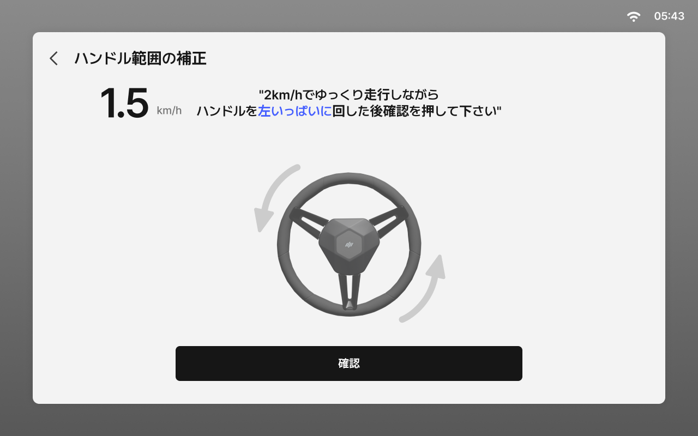<figcaption></figcaption></figure>



안내에 따라 핸들을 오른쪽으로 끝까지 돌린 후 차량을 멈추고 \[확인] 버튼을 누릅니다.

<figure><figcaption></figcaption></figure>



안내에 따라 핸들을 이용하여 바퀴를 중앙에 위치시키고 차량을 멈추고 \[확인] 버튼을 누릅니다.

<figure>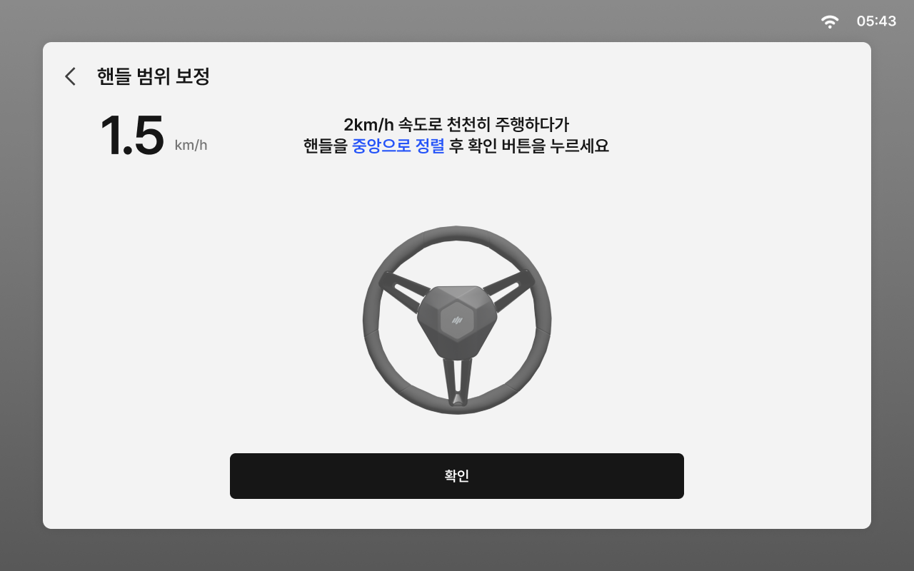<figcaption></figcaption></figure>



핸들 범위 보정 완료됩니다.

<figure><figcaption></figcaption></figure>



2. **직진 조향 보정**



직진 조향 보정에 필요한 설명을 읽은 후 \[확인]을 누릅니다.

<figure>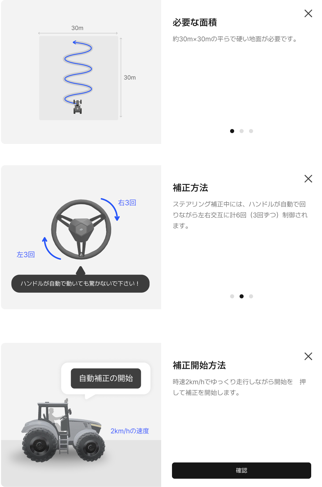<figcaption></figcaption></figure>



안내에 따라 \[2km 시속]으로 주행하고 \[자동 보정 시작] 버튼을 누릅니다.

<figure><figcaption></figcaption></figure>


트랙터 제한 속도는 2km로 초과 시 버튼이 활성화 되지않습니다.



트랙터 정지 시 직진 조향 보정의 처음부터 다시 시작합니다.



직진 조향 보정 중에는 핸들이 자동으로 움직입니다. 자동 조작 중에는 핸들을 강제로 조작하지 마세요.




지속해서 2km 이하로 주행합니다.

<figure>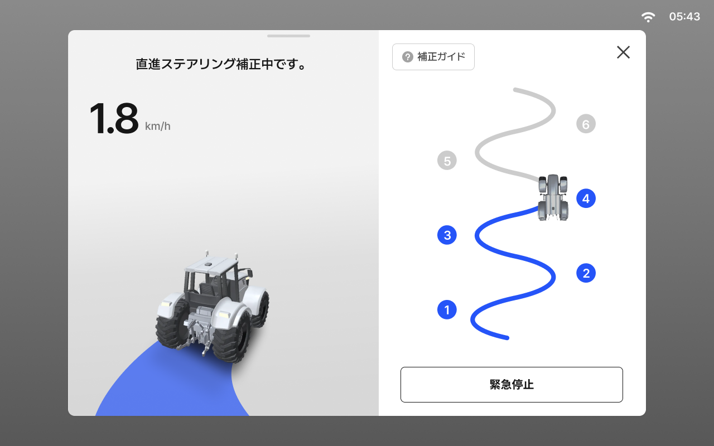<figcaption></figcaption></figure>


보정 시 필요 면적이 확보되지않거나 주행이 불가능할 경우 긴급 정지를 누릅니다.




보정 과정이 끝나면 \[확인] 버튼이 활성화됩니다. 버튼을 눌러 보정을 완료하세요.

<figure>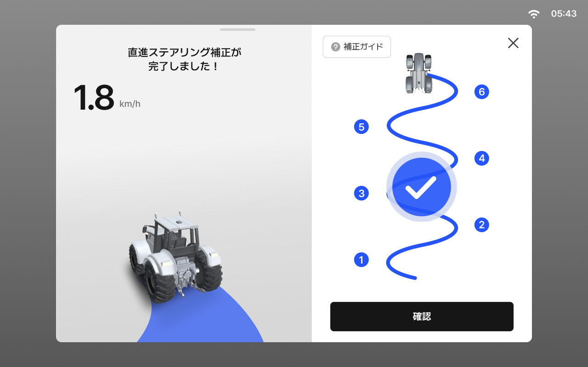<figcaption></figcaption></figure>



***

#### 이앙기 오토스티어 보정

1. **핸들 범위 보정**



\[전체 한번에 진행] 버튼을 누르면 오토스티어 보정이 시작됩니다.

<figure>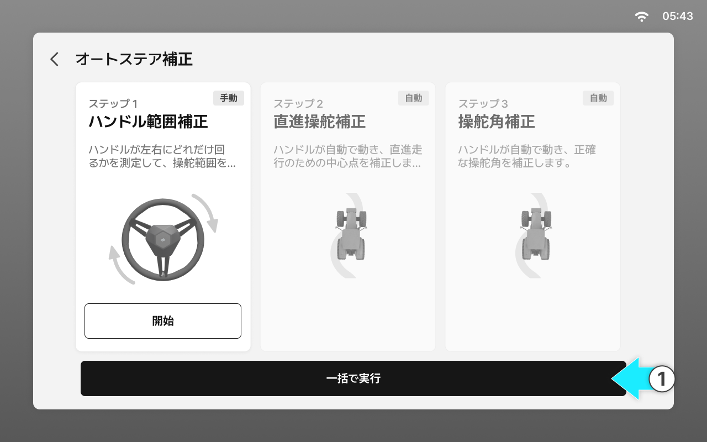<figcaption></figcaption></figure>


각 단계 시작 버튼을 누르면 해당 단계 보정만 진행할 수 있습니다.




안내에 따라 핸들을 왼쪽으로 끝까지 돌린 후 차량을 멈추고 \[확인] 버튼을 누릅니다.

<figure><figcaption></figcaption></figure>



안내에 따라 핸들을 오른쪽으로 끝까지 돌린 후 차량을 멈추고 \[확인] 버튼을 누릅니다.

<figure>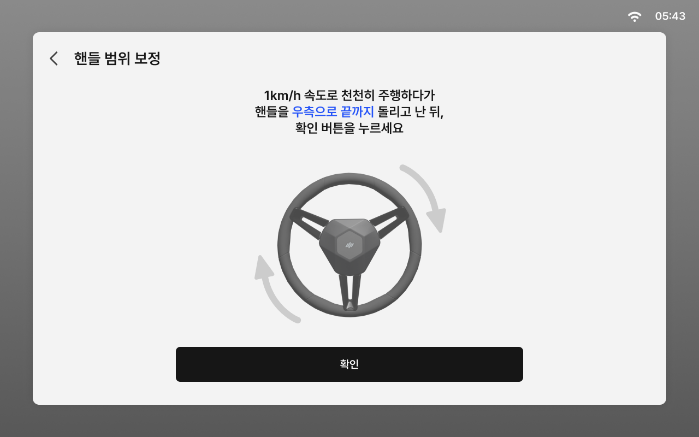<figcaption></figcaption></figure>



안내에 따라 핸들을 이용하여 바퀴를 중앙에 위치시키고 차량을 멈추고 \[확인] 버튼을 누릅니다.

<figure>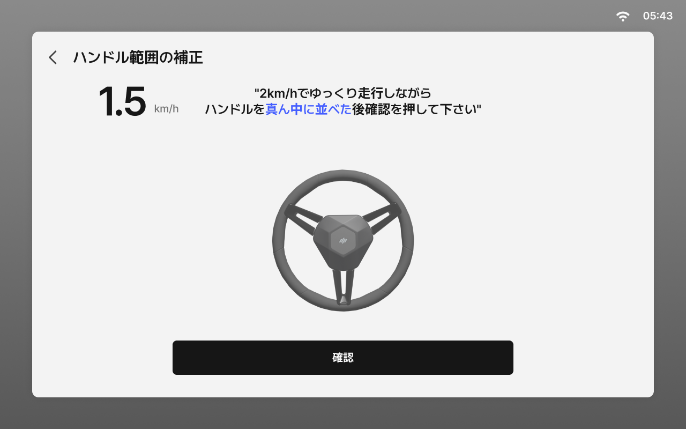<figcaption></figcaption></figure>



핸들 범위 보정 완료됩니다.

<figure>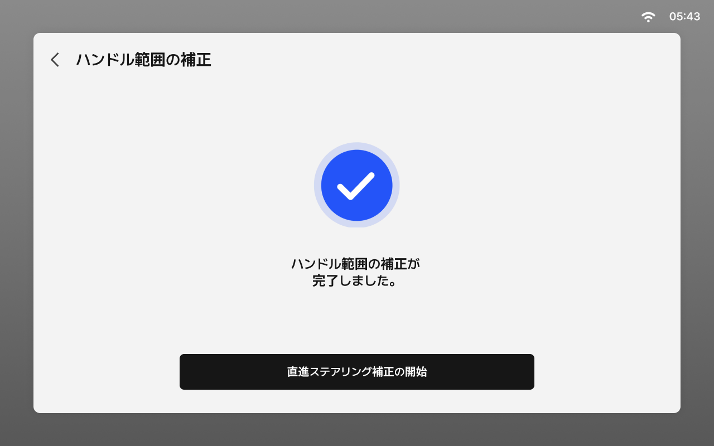<figcaption></figcaption></figure>



2. **직진 조향 보정**



직진 조향 보정에 필요한 설명을 읽은 후 \[확인]을 누릅니다.

<figure>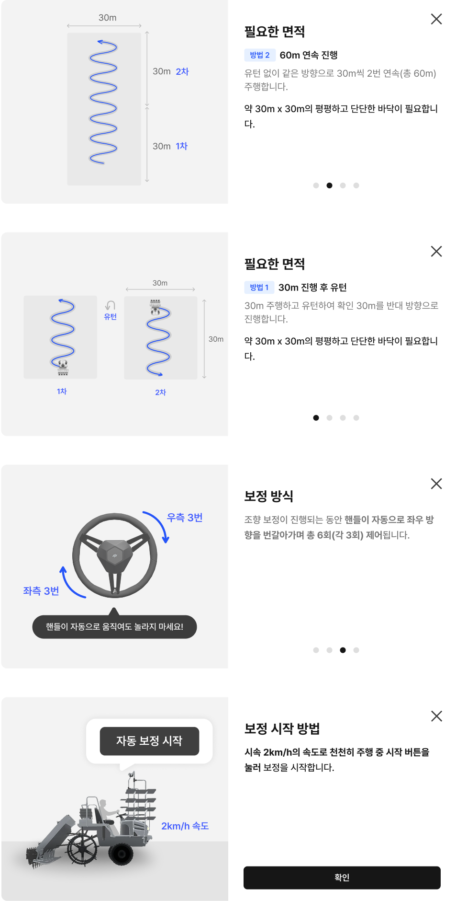<figcaption></figcaption></figure>



안내에 따라 \[1km 시속]으로 주행하고 \[자동 보정 시작] 버튼을 누릅니다.

<figure>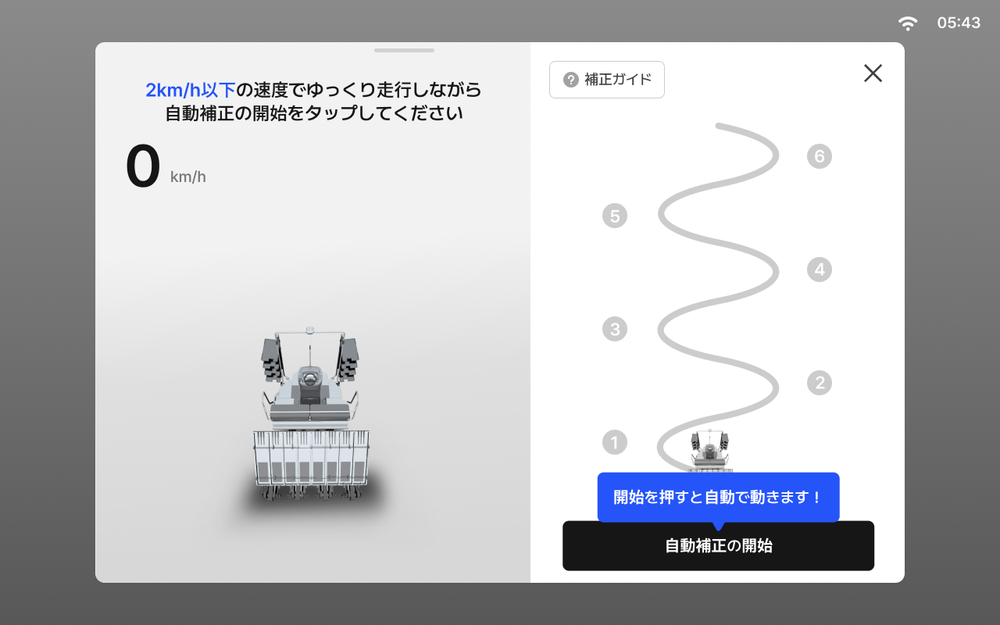<figcaption></figcaption></figure>


이앙기 제한 속도는 1km로 초과 시 버튼이 활성화 되지않습니다.



이앙기 정지 시 직진 조향 보정의 처음부터 다시 시작합니다.



직진 조향 보정 중에는 핸들이 자동으로 움직입니다. 자동 조작 중에는 핸들을 강제로 조작하지 마세요.




지속해서 1km이하로 주행한다.

<figure>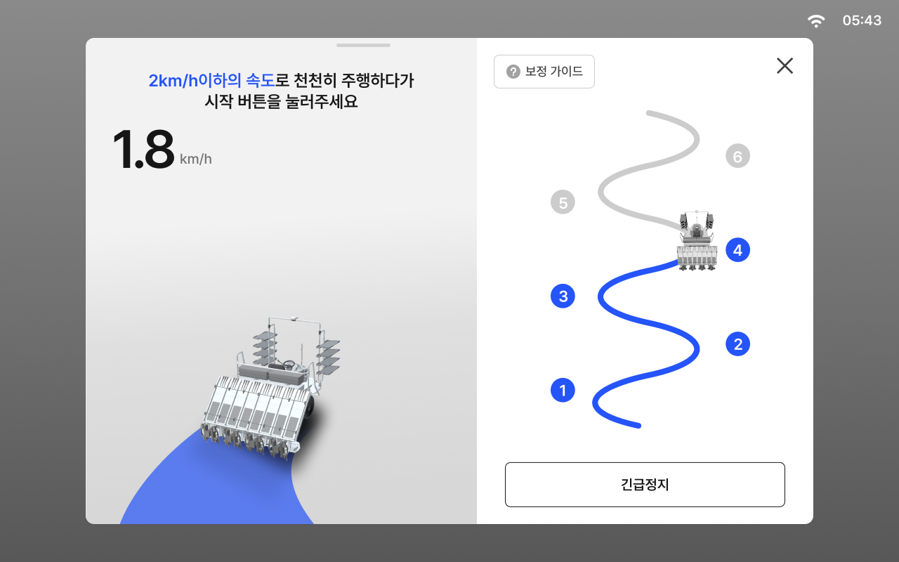<figcaption></figcaption></figure>


보정 시 필요 면적이 확보되지않거나 주행이 불가능할 경우 긴급 정지를 누릅니다.




보정이 완료되면 \[조향 각도 보정 시작] 버튼이 표시됩니다. 버튼을 눌러 다음 보정을 진행합니다.

<figure>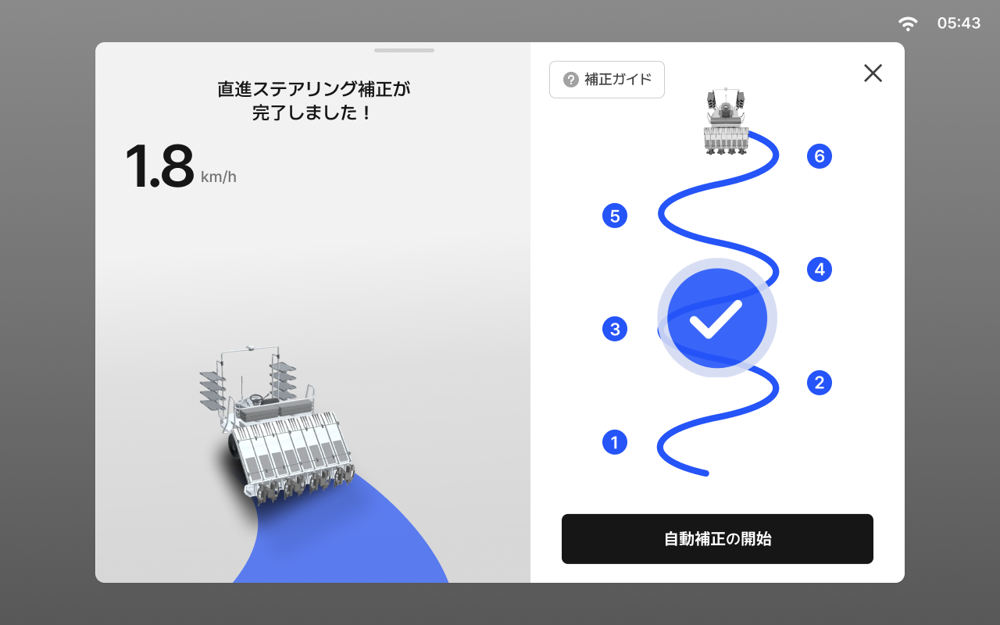<figcaption></figcaption></figure>



3. **조향 각도 보정**



안내에 따라 \[1km 시속]으로 주행하고 \[자동 보정 시작] 버튼을 누릅니다.

<figure><figcaption></figcaption></figure>


이앙기 제한 속도는 1km로 초과 시 버튼이 활성화 되지않습니다.



이앙기 정지 시 직진 조향 보정의 처음부터 다시 시작합니다.



직진 조향 보정 중에는 핸들이 자동으로 움직입니다. 자동 조작 중에는 핸들을 강제로 조작하지 마세요.




지속해서 1km이하로 주행합니다.

<figure><figcaption></figcaption></figure>


보정 시 필요 면적이 확보되지않거나 주행이 불가능할 경우 긴급 정지를 누릅니다.




보정 과정이 끝나면 \[확인] 버튼이 활성화됩니다. 버튼을 눌러 보정을 완료하면 작업지 설정으로 진입합니다.

<figure><figcaption></figcaption></figure>



***

### 배속턴 차량 오토스티어 보정

배속턴 차량은 **배속턴 OFF/ON 두 상태**에서 동일한 보정을 각각 진행합니다.


배속턴 오토스티어 보정은 차량 추가 시 \[배속턴 차량] 토글을 ON으로 설정한 경우에만 진행할 수 있습니다.\
배속턴 차량이라면 반드시 해당 옵션을 ON으로 설정해 주세요.



배속턴은 트랙터에만 적용되는 옵션입니다. 이앙기에서는 배속턴 옵션이 표시되지 않습니다.


***

#### 배속턴 보정 진행 방식

오토스티어 보정은 **총 2회차**로 진행되며, 2회차까지 완료해야 보정이 완료됩니다.

* **1회차 (배속턴 OFF 상태)**
  * 핸들 범위 보정
  * 직진 조향 보정
* **2회차 (배속턴 ON 상태)**
  * 직진 조향 보정



\[전체 한번에 진행]을 누릅니다.

<figure>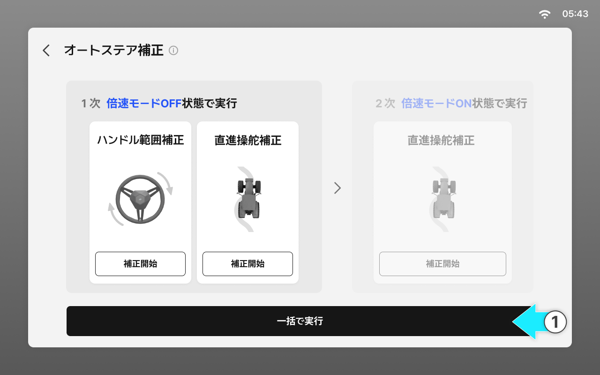<figcaption></figcaption></figure>



배속턴을 **OFF**으로 전환하고 **\[확인]** 을 누릅니다.

<figure>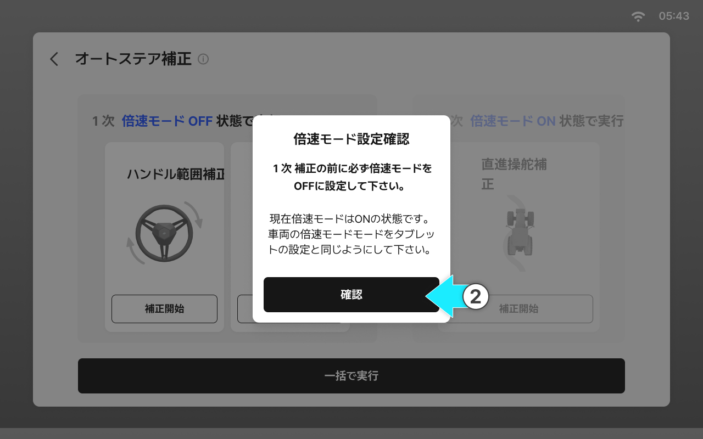<figcaption></figcaption></figure>



핸들 범위 보정을 진행합니다.

<figure>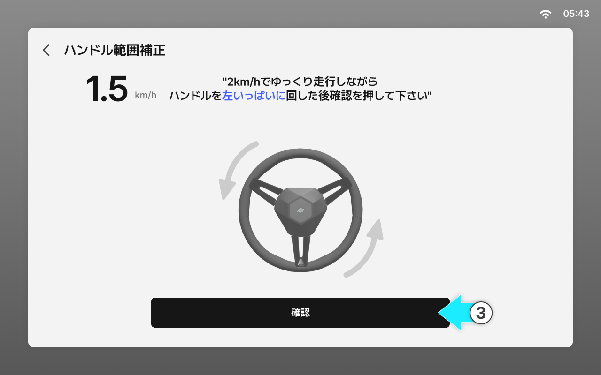<figcaption></figcaption></figure>



안내에 따라 **핸들 범위 보정**을 완료합니다. **\[직진 조향 보정 시작]** 을 누릅니다.

<figure>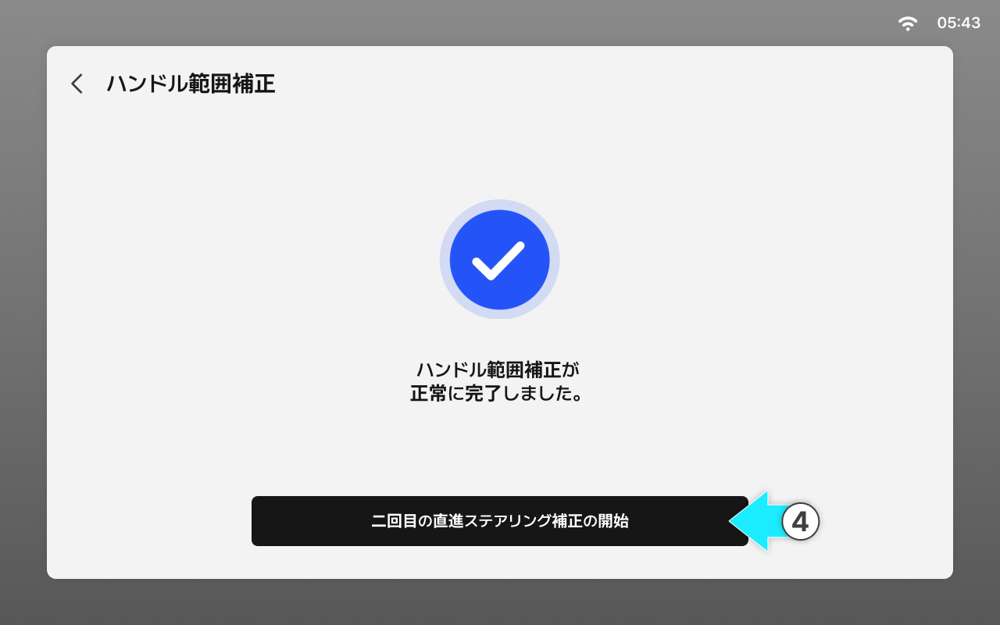<figcaption></figcaption></figure>



직진 조향 보정 화면에서 안내를 확인합니다.

<figure>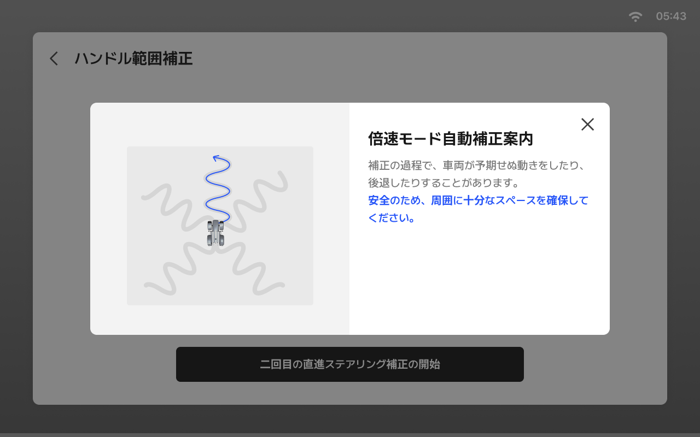<figcaption></figcaption></figure>



1차 직진 조향 보정을 진행합니다.

<figure>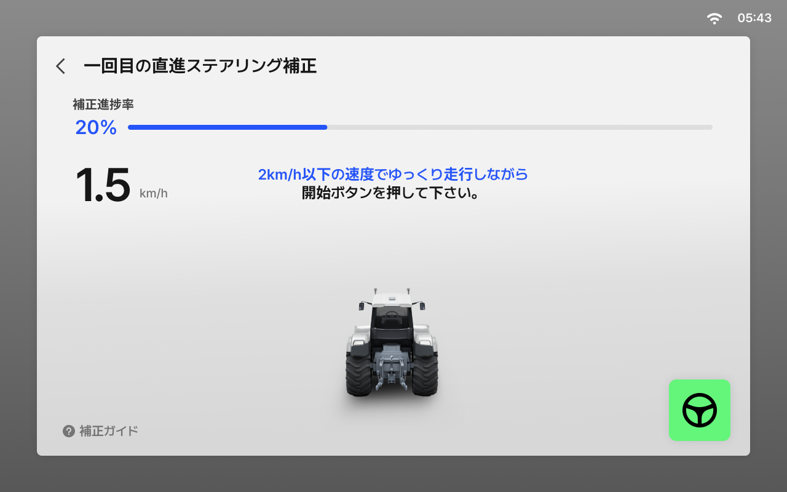<figcaption></figcaption></figure>



1차 직진 조향 보정이 완료되면 \[2차 직진 조향 보정 시작]을 누릅니다.

<figure>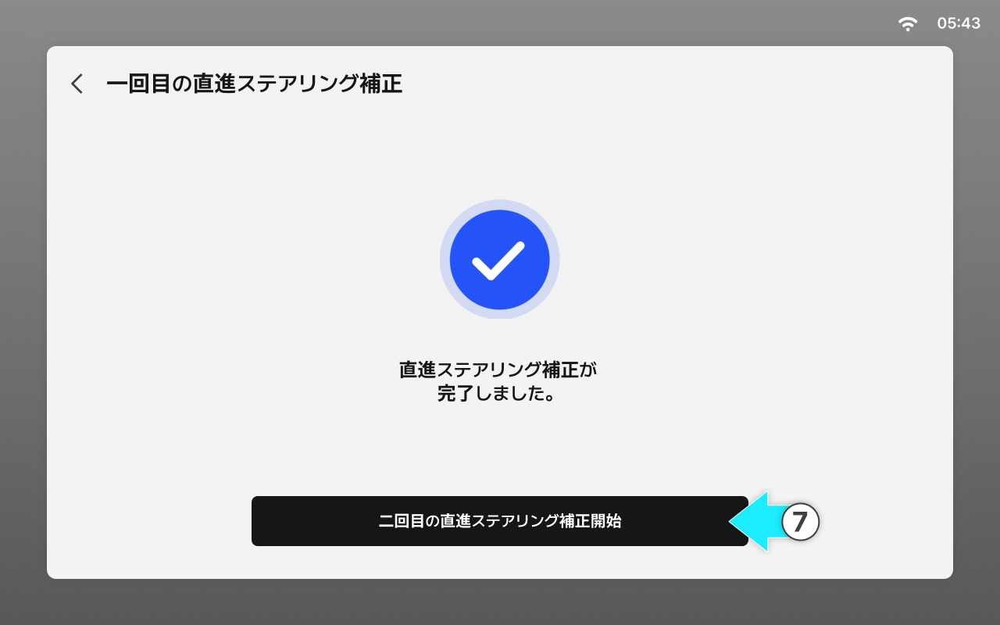<figcaption></figcaption></figure>



**배속턴 설정 확인** 팝업이 표시됩니다. 배속턴을 **ON으**로 전환하고 \[확인]을 누릅니다.

<figure>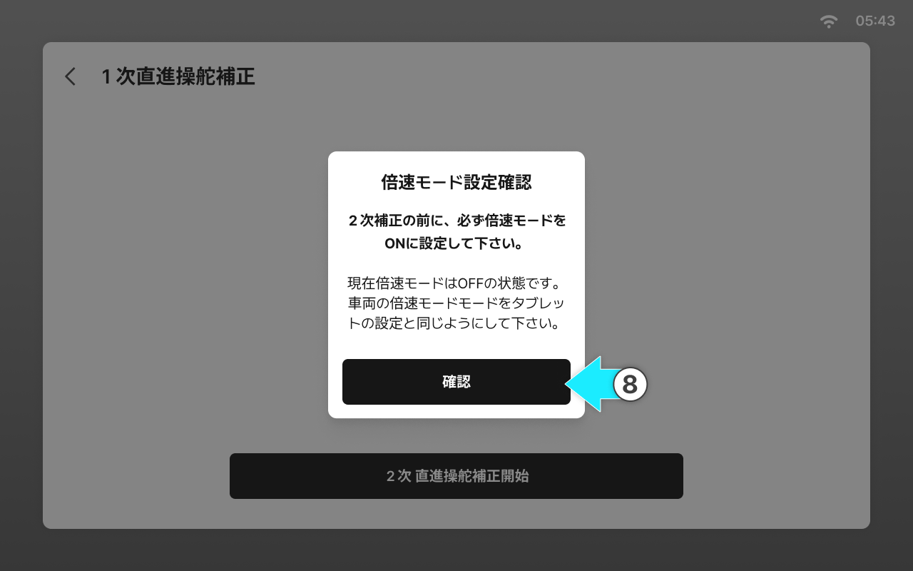<figcaption></figcaption></figure>



**2차 직진 조향 보정**을 진행합니다.

<figure><figcaption></figcaption></figure>



**2차 직진 조향 보정**을 완료하면 배속턴 차량 오토스티어 보정이 완료됩니다.\
&#xNAN;**\[다음 단계로]** 를 눌러 **작업지 설정**으로 진입합니다.

<figure>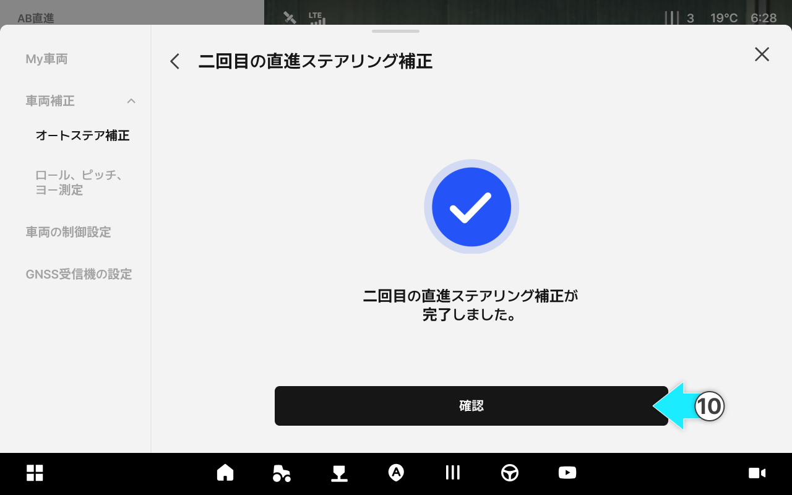<figcaption></figcaption></figure>


