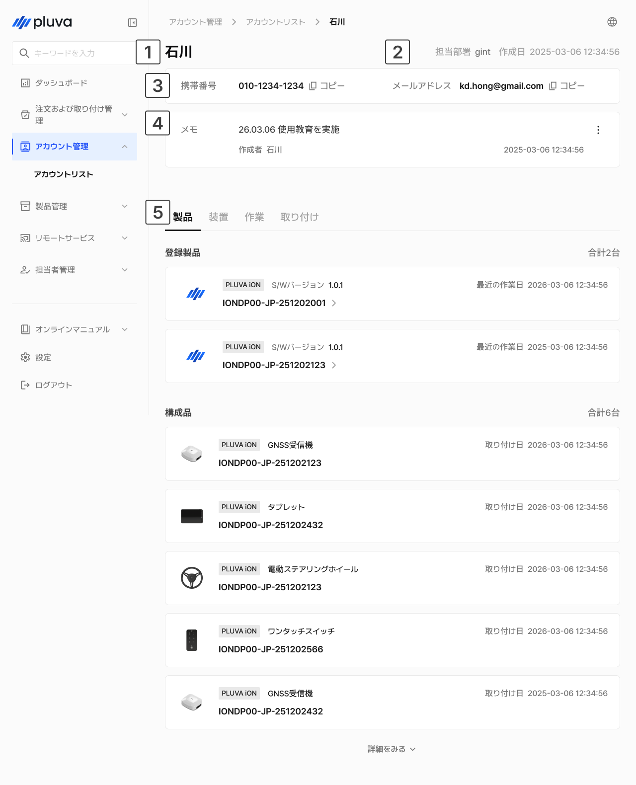
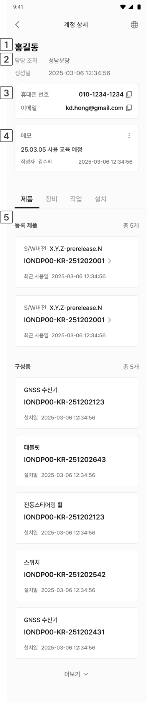

---
metaLinks:
  alternates:
    - https://app.gitbook.com/s/YgZGmmCCfllSmVLHO3Uz/others/account-management
---

# アカウント管理

お客様のアカウントの基本情報および保有する製品・機器・取り付け履歴を確認できます。


アカウントの作成、修正及び削除は、この画面ではできません。お客様のアカウントは、統合会員登録ページにて作成できます。なお、アカウント情報の変更が必要な場合は、統合会員登録ページにてお客様の方で直接修正していただくよう案内してください。


***

### アクセス方法



左側のメニューから**アカウント管理**を選択します。

<figure><figcaption></figcaption></figure>



ご希望のアカウントを選択すると、アカウントの詳細へアクセスできます。

<figure><figcaption></figcaption></figure>



***

### アカウントの詳細情報

アカウントリストからお客様を選択すると、該当するアカウントの詳細情報の確認画面へ移動します。

#### PC環境

<figure><figcaption></figcaption></figure>

 アカウント名

 所属部署および作成日

 アカウント情報

* 該当するアカウントに登録されている、携帯電話番号とメールアドレスが表示されます。


**ご参照：**&#x643A;帯電話番号とメールアドレスの右側にあるコピーアイコンをクリックすると、クリップボードにコピーされます。


 メモ

* **⋮ ボタン**をクリックし、内容を修正及び削除できます。
* **作成者名**と**作成日時**が併せて表示されます。

 アカウントの詳細情報

* アカウントの詳細画面の下部にある「**製品、機器、作業、取り付け**」タブを選択すると、それぞれの履歴を確認できます。\
  リストの確認のみが可能であり、直接追加及び修正はできません。
  * 製品タブ： お客様がお持ちの製品の情報を確認できます。
    * **登録製品**：お客様の名義で登録された、製品リストおよび数量が表示されます。
    * **構成品**：登録された構成品のリストおよび数量が表示されます。
  * 機器タブ：お客様がお持ちの機器の情報を確認できます。
    * **車両**：登録済みの車両リスト及び数量が表示されます。
    * **作業機**：登録済みの作業機リストと数量が表示されます。
  * 作業タブ：お客様の作業に関する履歴を確認できます。
    * **圃場**：登録済みの圃場リストと数量が表示されます。
  * 取り付けタブ：お客様の製品の取り付け履歴を確認できます。
    * **取り付け履歴**：取り付け完了した作業リストと件数が表示されます。

#### モバイル環境

<figure><figcaption></figcaption></figure>

 アカウント名

 所属部署及び作成日

 アカウント情報

* 該当するアカウントに登録済みの携帯電話番号とメールアドレスが表示されます。


**ご参照：**&#x643A;帯電話番号とメールアドレスの右側にあるコピーアイコンをクリックすると、クリップボードにコピーされます。


 メモ

* **⋮ ボタン**をクリックし、内容を修正及び削除できます。
* **作成者名**と**作成日時**が併せて表示されます。

 アカウントの詳細情報

* アカウントの詳細画面の下部にある「**製品、機器、作業、取り付け**」タブを選択し、それぞれの履歴を確認できます。\
  リストの確認のみが可能であり、直接追加及び修正はできません。
  * 製品タブ： お客様がお持ちの製品の情報を確認できます。
    * **登録製品**：お客様の名義で登録された製品リストおよび数量が表示されます。
    * **構成品**：登録された構成品のリストおよび数量が表示されます。
  * 機器タブ：お客様がお持ちの機器の情報を確認できます。
    * **車両**：登録済みの車両リスト及び数量が表示されます。
    * **作業機**：登録済みの作業機リストと数量が表示されます。
  * 作業タブ：お客様の作業に関する履歴を確認できます。
    * **圃場**：登録済みの圃場リストと数量が表示されます。
  * 取り付けタブ：お客様の製品の取り付け履歴を確認できます。
    * **取り付け履歴**：取り付け完了した作業リストと件数が表示されます。
