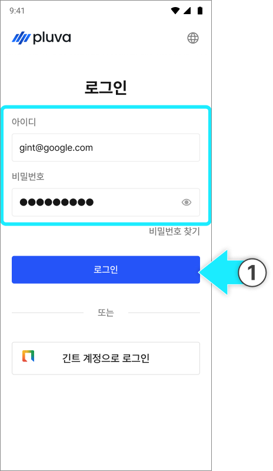
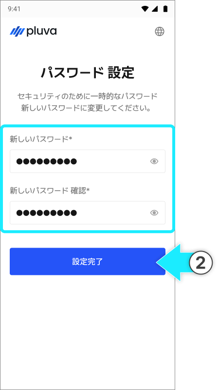

---
layout:
  width: default
  title:
    visible: true
  description:
    visible: false
  tableOfContents:
    visible: true
  outline:
    visible: true
  pagination:
    visible: true
  metadata:
    visible: true
  tags:
    visible: true
metaLinks:
  alternates:
    - /broken/spaces/YgZGmmCCfllSmVLHO3Uz/pages/3Pd5X570IS2y8BjV7WQ1
---

# アドミンへのログイン

注文、開通、リモートサポートなどのサービスをご利用いただくため、アドミンへのログインを進めます。



pluva ionの製造元である(株)GINTあてに以下の情報を送信し、アカウントの発行を依頼します。

1. **名前**
2. **メールアドレス**
3. **購入先名**



アカウントの発行が完了したら[アドミンページ](https://gint-admin.pluva.jp/auth/operators/login)へアクセスします。\
受信されたメールアドレスとパスワードを入力し、\[ログイン]をタップします。

<figure><figcaption></figcaption></figure>


発行されたアカウントでログインできない場合は、(株)GINTへお問い合わせください。




初回ログイン時に、新しいパスワードを設定し、\[設定完了]を押すとログインが完了します。

<figure><figcaption></figcaption></figure>


