---
layout:
  width: default
  title:
    visible: true
  description:
    visible: false
  tableOfContents:
    visible: true
  outline:
    visible: true
  pagination:
    visible: true
  metadata:
    visible: true
  tags:
    visible: true
metaLinks:
  alternates:
    - https://app.gitbook.com/s/YgZGmmCCfllSmVLHO3Uz/others/monitorning
---

# リモートサポート

リモートサポートは、エンジニアがタブレット画面を遠隔で確認し、トラブル解決に向けてご案内する機能です。お客様がタブレットからコードを発行しその情報をエンジニアに共有すると、担当エンジニアが確認後リモートサポートを開始します。

***

#### リモートサポートのご利用手順

リモートサポートのご利用にあたり、以下の事項をご確認ください。


**通話状態の維持**

* リモートサポートは、必ず**お客様と通話を維持した状態**で進めてください。**開始と終了時にもお客様へご案内**する必要があります。
* 遠隔での機器操作を伴いますので、周囲の安全を確保し、操作内容を十分にご認識いただいたうえで進める必要があります。



**ネットワークのご確認**

* 画面のフリーズや通信エラーを防ぐため、**お客様のネットワーク状態をご確認**ください。
* **セルラー（モバイル通信）や通信信号が安定した状態で実施することを推奨**します。



**ご乗車の確認**

* 安全確保のため、リモートサポートは**必ずお客様が車両に乗車した状態**で行ってください。


***

### リモートサポートの対応手順



お客様よりお問い合わせをいただいた際、まずは現状をヒアリングします。



ヒアリング内容に基づき、リモートサポートが必要な状況か判断します。

* リモートサポートが必要な場合、次のステップへ進んでください。



お客様にタブレット上で「リモートサポートコード」を発行するよう案内してください。

* タブレットの操作ガイド
  * 左下のメニュー一覧 > カスタマーサポート > リモートサポート > リモートサポートのコード発行
* お客様のタブレット画面に表示された、リモートサポート画面を確認します。

<figure>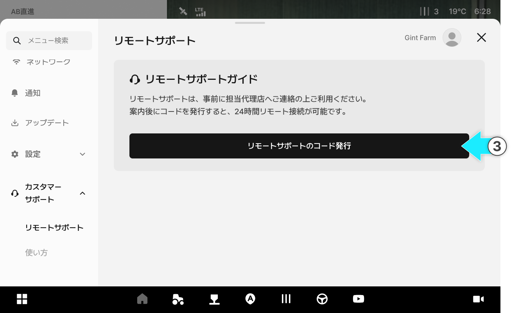<figcaption></figcaption></figure>


コードは発行から**24時間有効**です。



お客様がアプリ上で「リモートサポートを終了する」を押すと、コードは即座に無効になります。その場合、コードを再発行する必要があります。




アドミンへログイン後、リモートサポート一覧から該当するお客様&#x306E;**\[リモート接続]**&#x3092;クリックします。

<figure>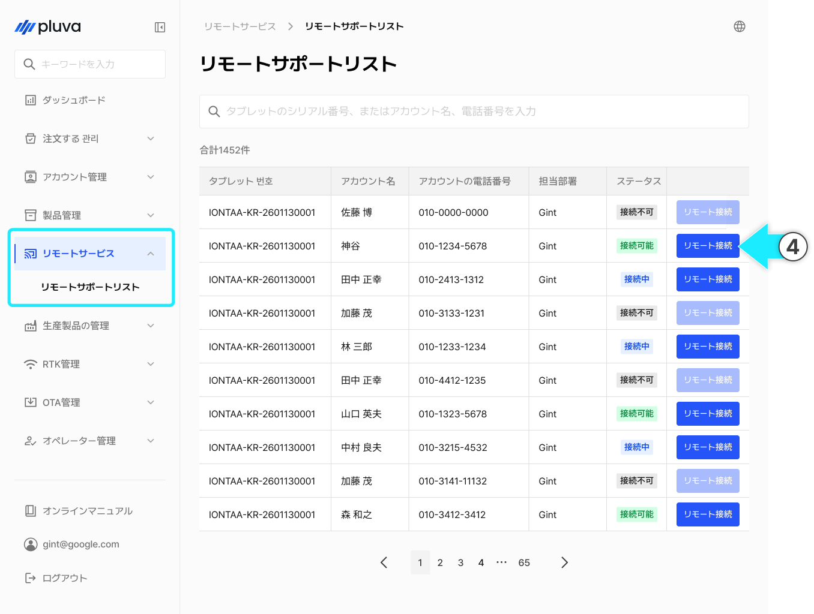<figcaption></figcaption></figure>



お客様から受け取ったリモートサポートコードを入力し、**\[入力完了]**&#x3092;押します。

<figure><figcaption></figcaption></figure>


接続できない場合、次の内容を確認してください。

1. **\[リモート接続]ボタンが無効**
   1. 原因： コードが発行されていないか、期限切れ。
   2. 対応策：お客様へコードの再発行を依頼する。<br>
2. **重複接続の案内モーダルが表示**
   1. 原因：別の担当者がすでにリモート接続中
   2. 対応策：すでにリモートサポート中の担当者が対応を続けるか、その担当者に\[リモートサポートを終了する]を依頼する。




接続画面にリモートガイドに関するポップアップが表示されたら、内容を確認&#x3057;**\[確認]**&#x3092;押します。

<figure>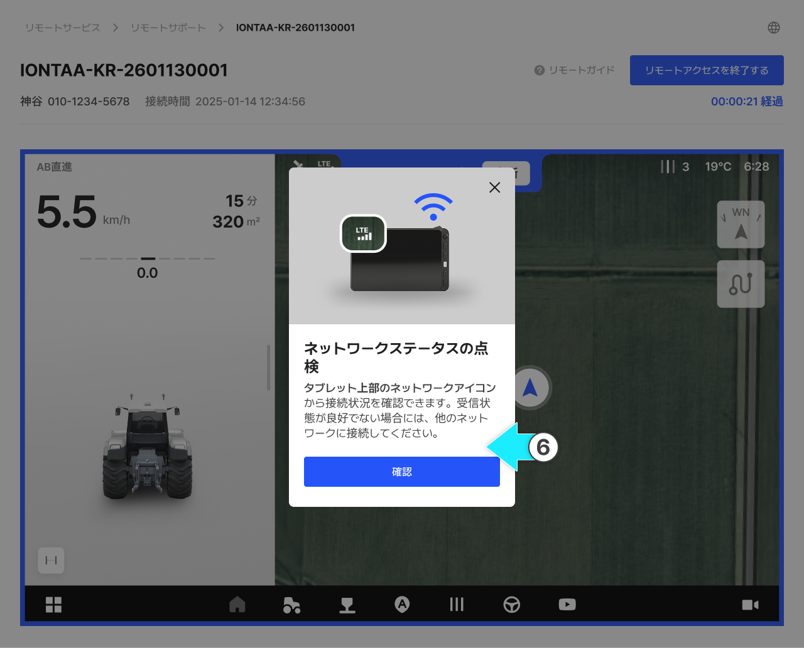<figcaption></figcaption></figure>



タブレットとの接続が完了したら、お客様との通話を維持したまま画面を確認し、必要に応じて設定を直接操作します。


**操作時には以下の内容を必ず遵守してください。**

* 車両を停止させた状態で設定を行ってください。（オートステア補正など、車両の移動を伴う設定は除きます。）
* 走行開始、停止など、車両を動かす操作は、必ずお客様自身で行うよう案内してください。


<figure>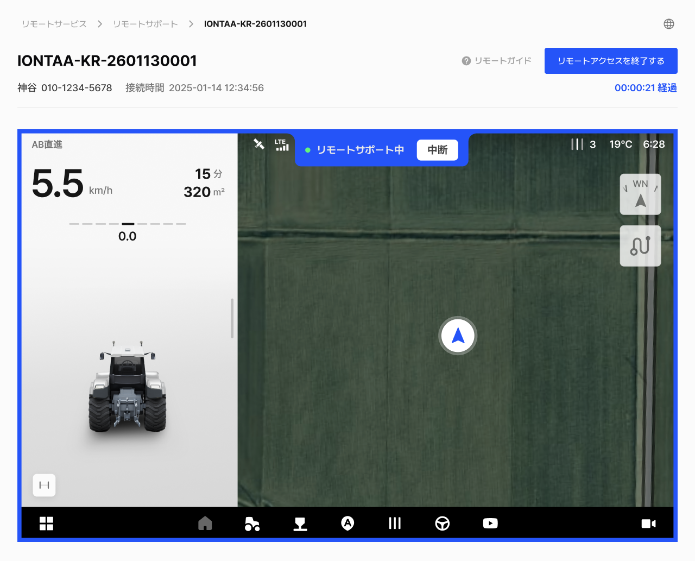<figcaption></figcaption></figure>



対応が完了したら、お客様に終了の旨を伝え、**\[リモートサポートを終了する]**&#x3092;押します。

<figure>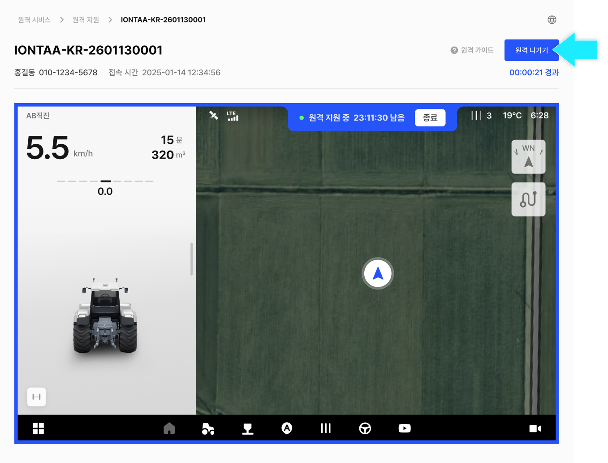<figcaption></figcaption></figure>

<figure>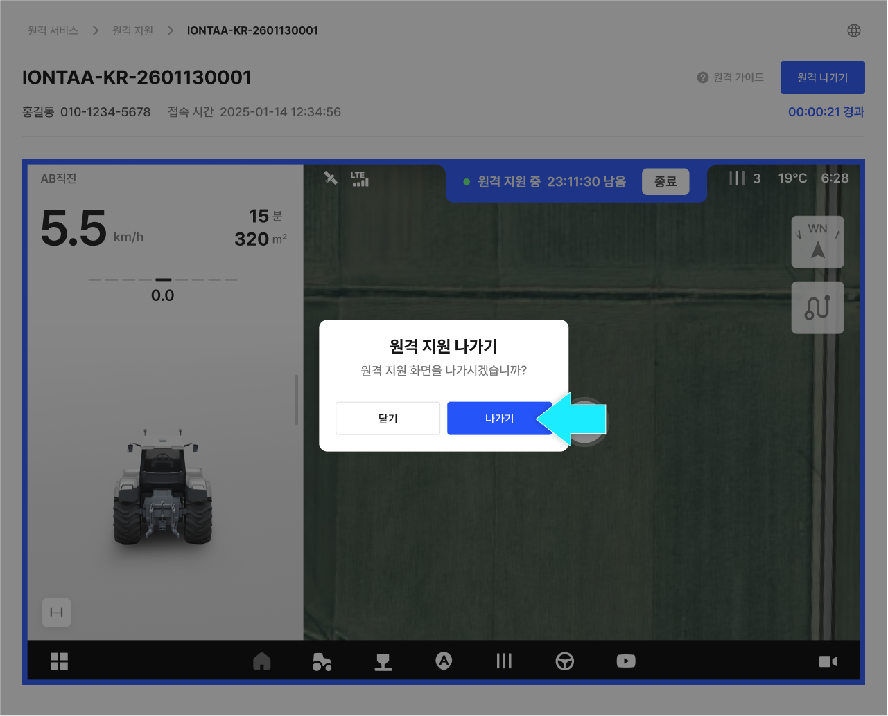<figcaption></figcaption></figure>


\[リモートサポートを終了する]をクリックした後も、コードの発行から24時間内であれば再接続が可能です。

* 再接続の際には、再度コードの入力手順が必要となります。



事後モニタリングが必要な場合は、終了案内の際に「24時間以内に再接続を行う可能性があること」を事前にお客様へお伝えください。




#### リモート接続状態

1. **接続可能**

* お客様がリモートサポートコードを発行された状態です。
* **コード発行から24時間以内に接続ができます。**

2. **接続中**

* 担当者がお客様のリモートサポート画面に接続した状態です。
* 接続中には、別の担当者が同時に接続することはできません。


別の担当者が接続中&#x306B;**\[リモート接続]**&#x30DC;タンをクリックすると、重複接続の案内モーダルが表示されます。

* 重複接続はできません。接続が必要な場合は、現在接続中の担当者に「リモートサポートを終了する」を依頼してください。

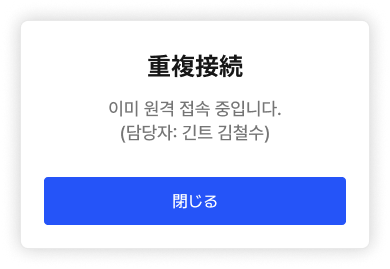


3. **接続不可**

* リモートサポートコードが発行されていない、もしくは期限切れの状態です。
* この場合、**\[リモート接続]**&#x30DC;タンは無効になります。


リモート接続が不可能な状態で接続を行うには、お客様にリモートサポートコードの発行を依頼する必要があります。


***

### リモートサポート画面のご案内

#### デスクトップ版

<figure>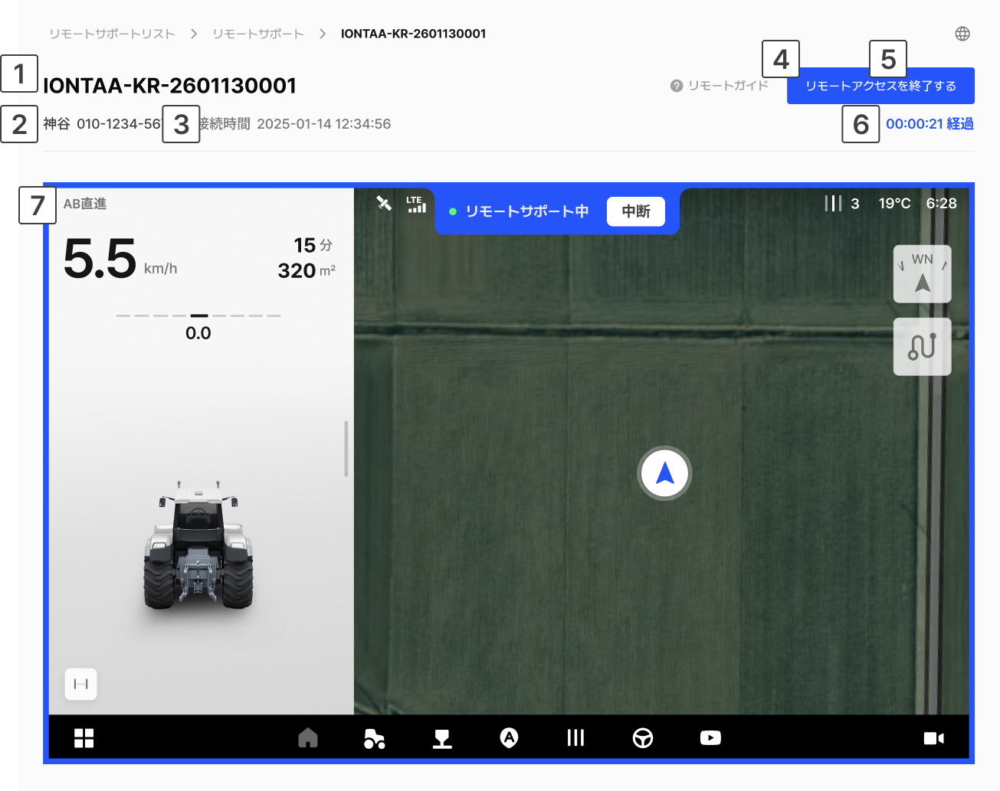<figcaption></figcaption></figure>

 **タブレットのシリアル番号**：リモートサポート中のタブレットのシリアル番号が表示されます。

 **お客様情報**：リモートサポートを依頼したお客様のお名前と連絡先が表示されます。

 **接続時間**：リモートサポート画面に接続した時間が表示されます。

 **リモートガイドボタン**：リモートサポート時の注意事項および基本的な案内内容を確認できます。

*

```
<figure>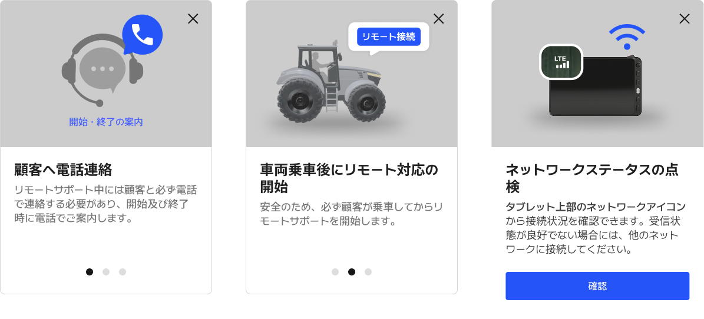<figcaption></figcaption></figure>
```

 「**リモートサポートを終了する」ボタン**：現在、接続中のリモートサポート画面を終了します。

 **経過時間**：リモートサポート開始からの経過時間が表示されます。

 **リモートサポートの画面**：現在のお客様のタブレット画面が確認できます。

#### アプリ版

<div align="left"><figure>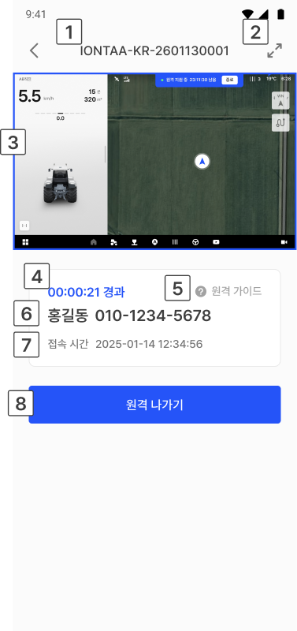<figcaption></figcaption></figure></div>

 **タブレットのシリアル番号**：リモートサポート中のタブレットのシリアル番号が表示されます。

 **「拡大する」ボタン**：リモートサポート画面を横に切り替え、拡大できます。

<figure>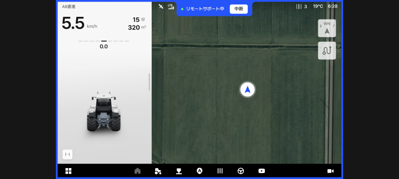<figcaption></figcaption></figure>

 **リモートサポートの画面**：現在のお客様のタブレット画面が確認できます。

 **経過時間**：リモートサポート開始からの経過時間が表示されます。

 **リモートガイドボタン**：リモートサポート時の注意事項および基本的な案内内容を確認できます。

 **お客様情報**：リモートサポートを依頼したお客様のお名前と連絡先が表示されます。

 **接続時間**：リモートサポート画面に接続した時間が表示されます。

 「**リモートサポートを終了する」ボタン**：現在、接続中のリモートサポート画面を終了します。
