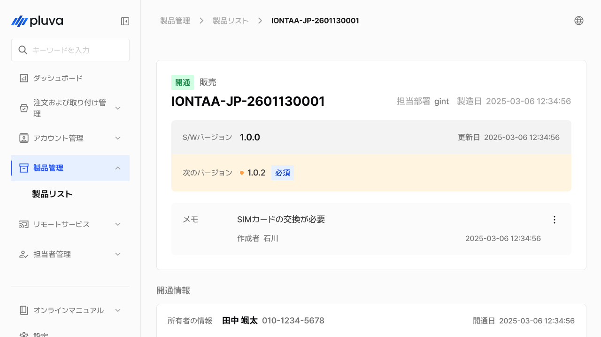

---
metaLinks:
  alternates:
    - https://app.gitbook.com/s/YgZGmmCCfllSmVLHO3Uz/others/product-management
---

# 製品管理

製品管理は、各部署で担当する製品を一元管理するメニューです。管理者の所属部署に登録された製品のみが表示され、各製品の開通状況やソフトウェアのバージョン、関連した履歴を確認できます。

***

### アクセス方法



サイドバーから\[製品管理]をタップし、ご希望の項目を選択します。

<figure><figcaption></figcaption></figure>



製品リストの詳細へアクセスできます。

<figure><figcaption></figcaption></figure>



***

### 製品の詳細画面に関するご案内

#### PC環境

<figure><figcaption></figcaption></figure>

.svg>) **ステータス**

* 区分：開通、未開通


取り付けチケットから、該当する製品が開通状態かどうかが表示されます。

ステータスは直接変更できません。取り付け完了時に自動で反映されます。


.svg>) **用途**

* 区分：販売、サービス、テスト

.svg>) **担当部署**

.svg>) **製造日**

 **タブレットのシリアル番号**

 **現在のソフトウェアバージョン**

* 現在の製品のアップデートバージョン

 **次のソフトウェアバージョン**

* アップデート予定のバージョン（予定としているアップデートがない場合は未表示）

 **メモ**

* 最新の作成者の名前が表示されます。メモは削除・修正でき、作成していない場合は、作成のボタンが表示されます。

 **開通情報**

* 所有者の情報、開通日、Simカードの情報が表示されます。


開通日は、取り付けチケットの完了処理日と同じ日付になります。


 **アップデート履歴**

* ソフトウェアがアップデートされた日付とバージョンの情報が確認できます。

#### モバイル環境

<figure><figcaption></figcaption></figure>

.svg>) **ステータス**

* 区分：開通、未開通


取り付けチケットから、該当する製品が開通状態かどうかが表示されます。

ステータスは直接変更できません。取り付け完了時に自動で反映されます。


.svg>) **用途**

* 区分：販売、サービス、テスト

.svg>) **タブレットのシリアル番号**

.svg>) **担当部署**

 **製造日**

 **現在のソフトウェアバージョン**

 **次のソフトウェアバージョン**

* 現在のバージョンが最新でない場合、次のアップデート予定のバージョンが表示されます。

 **メモ**

* 最新の作成者の名前が表示されます。メモは削除・修正でき、作成していない場合は、作成のボタンが表示されます。

 **開通情報**

* 所有者の情報、開通日、Simカードの情報が表示されます。


開通日は、取り付けチケットの完了処理日と同じ日付になります。


 **アップデート履歴**

* ソフトウェアがアップデートされた日付とバージョンの情報が確認できます。
