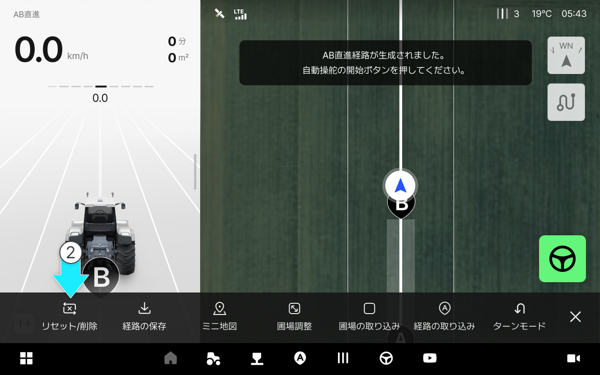
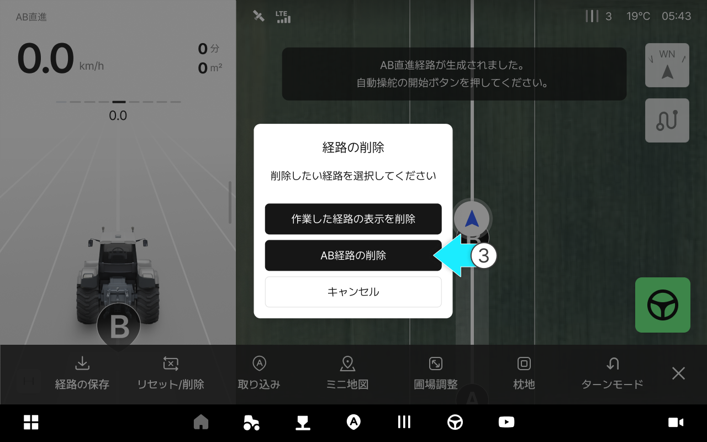

---
metaLinks:
  alternates:
    - >-
      https://app.gitbook.com/s/256Umh24fJVf6zNkZpSa/usage/driving-convenience-function/delete-path
---

# 経路のリセット及び削除

### 経路のリセット及び削除

生成したAB経路を削除、またはこれまで作業した経路の表示のみを削除することができます。



ABラインを生成した状態で  \[作業]をタップしてください。

<figure><figcaption></figcaption></figure>



\[リセット/削除]を選択します。

<figure><figcaption></figcaption></figure>



\[AB経路の削除]を選択します。

<figure><figcaption></figcaption></figure>


作業した経路の表示を削除：これまで作業した経路を全て削除します。 AB経路は維持されます。



AB経路の削除：AB経路と作業した経路を全て削除します。




\[確認]を選択するとAB経路が削除されます。

<figure><figcaption></figcaption></figure>


AB経路は、削除後に再度生成できます。



