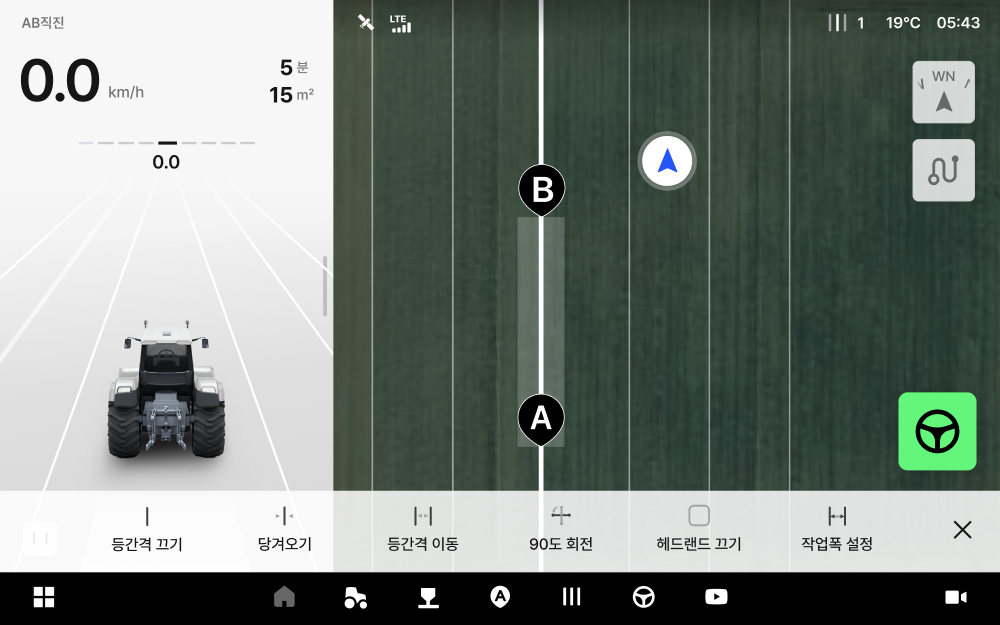
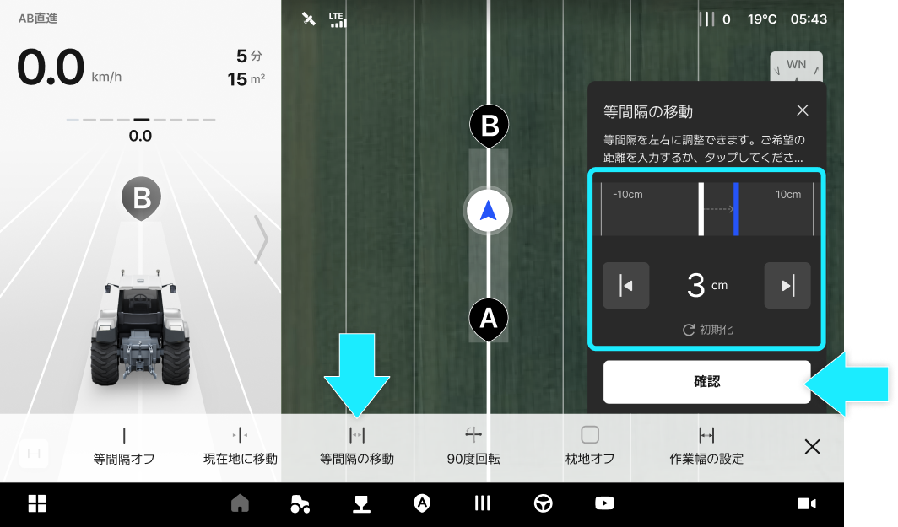
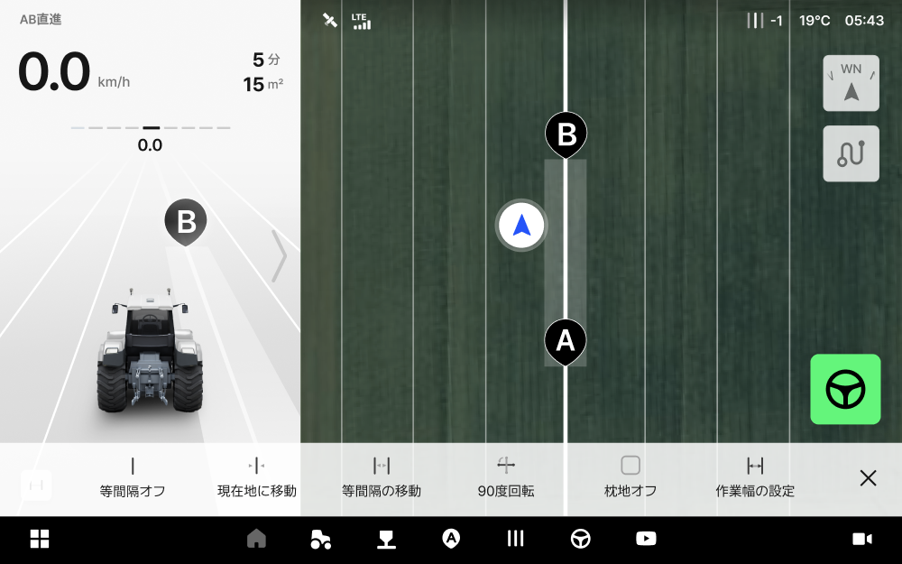
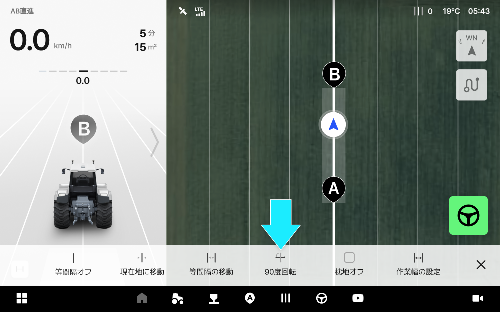
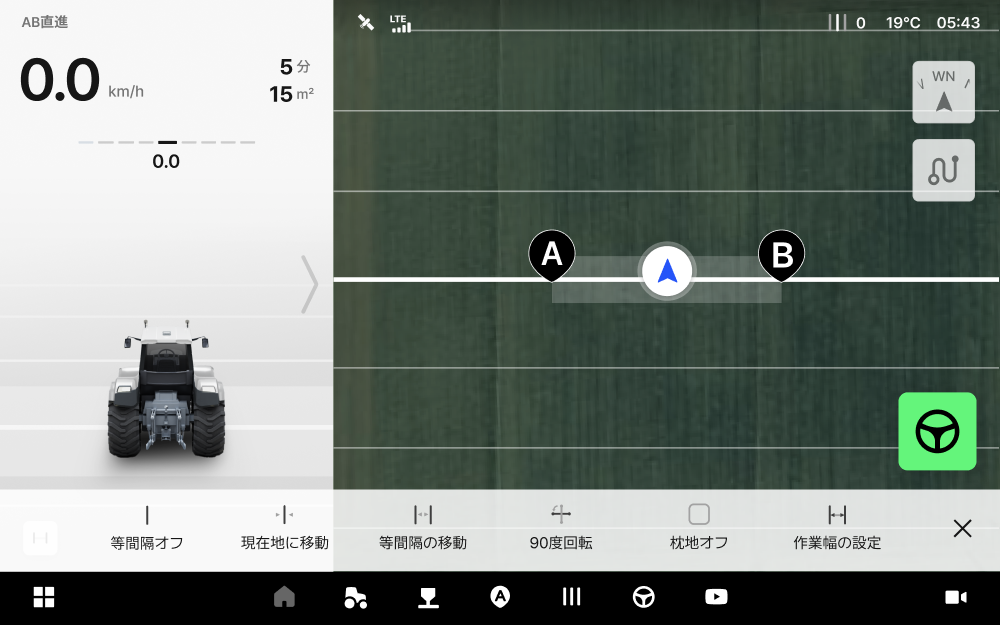
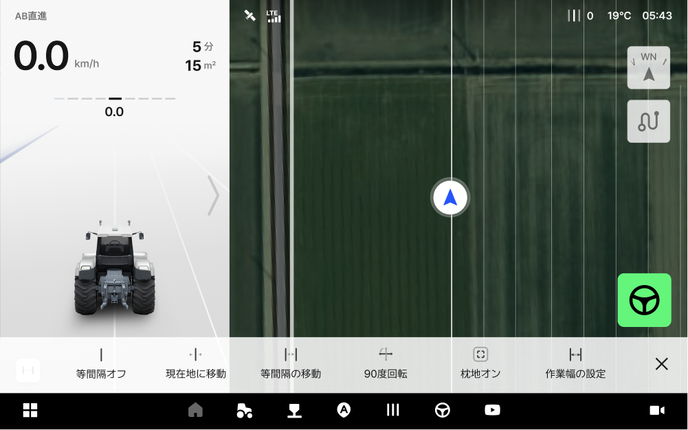
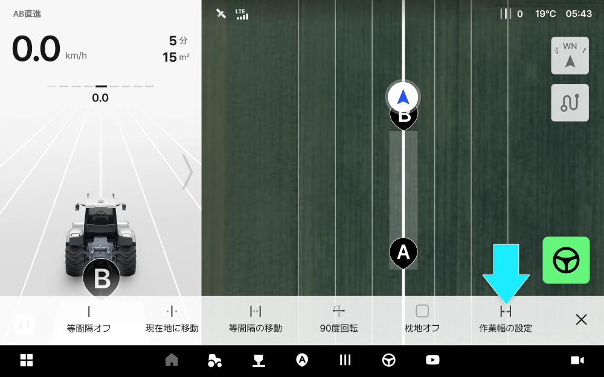
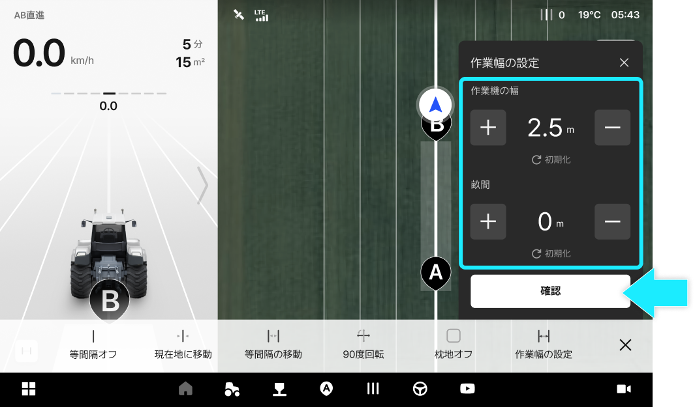
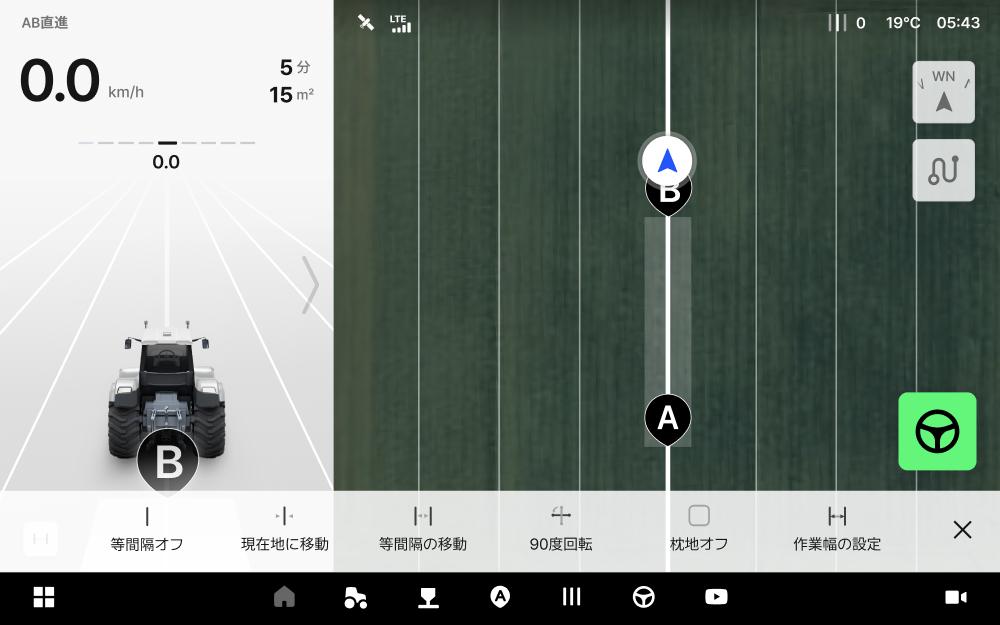

---
metaLinks:
  alternates:
    - >-
      https://app.gitbook.com/s/256Umh24fJVf6zNkZpSa/usage/driving-convenience-function/equal-interval
---

# 等間隔に関する便利な機能

### 等間隔に関する便利な機能

等間隔ラインの移動、ラインを引っ張ってくる、90度回転などの関連機能を自由に利用できます。
この機能は、AB経路を生成してから利用できます。

***

#### 等間隔に関する便利な機能へのアクセス



AB経路を設定した後  \[等間隔に関する便利な機能]をクリックします。

<figure><figcaption></figcaption></figure>



ご希望の等間隔メニューを選択します。

<figure><figcaption></figcaption></figure>



***

#### 等間隔に関する便利な機能のご案内

<figure><figcaption></figcaption></figure>

&#x20; **等間隔オン/オフ**

* 生成した等間隔をオン、またはオフにします。
  * 自動操舵中には使用できません。手動走行でのみ使用できます。
  *   &#x20;  **タップ時のイメージ**

      <figure><figcaption></figcaption></figure>
  *   &#x20;  タップ時のイメージ

      <figure><figcaption></figcaption></figure>

&#x20; 現在地に移動

* 生成されたAB経路を車両の現在地に移動できます。\
  移動した位置を基基準に、間隔ラインが再設定されます。
  * 自動操舵中には使用できません。手動走行でのみ使用できます。
  *   **現在地に移動機能の使用前**

      <figure><figcaption></figcaption></figure>
  *   &#x20;**現在地に移動機能の使用後**

      <figure><figcaption></figcaption></figure>

&#x20; 等間隔の移動

* 入力した数値分だけAB経路が平行移動します。
  *   等間隔の移動前\
      : ご希望の等間隔移動の数値を入力し、\[確認]をクリックします。

      <figure><figcaption></figcaption></figure>
  *   等間隔の移動後\
      : 等間隔の移動が完了します。

      <figure><figcaption></figcaption></figure>

&#x20; 90度回転

* 車両のある場所から生成した走行経路を垂直方向（90度）に回転します。
  * 自動操舵中には使用できません。手動走行でのみ使用できます。
  *   90度回転の使用前

      <figure><figcaption></figcaption></figure>
  *   &#x20;90度回転の使用後

      <figure><figcaption></figcaption></figure>

&#x20; 枕地オン/オフ

* 枕地の表示をオン、またはオフにします。
  * 枕地は点線で表示されます。
  *   &#x20; 枕地をオンにする 

      <figure><figcaption></figcaption></figure>
  *    枕地をオフにする 

      <figure><figcaption></figcaption></figure>

&#x20; 作業幅の設定

* 等間隔の幅の目安となる、作業幅の数値設定を行います。
入力した作業機の幅や畝間によって自動で作業幅が設定されます。
  * 作業中に作業機の幅や畝間を変更したことで作業幅が変わった場合、
\[引っ張ってくる]機能を使用してから作業を再開してください。
  *   &#x20;作業幅の設定前\
      : 等間隔の移動が完了します。

      <figure><figcaption></figcaption></figure>
  *   作業幅の設定中\
      :作業機の幅、畝間の数値を入力し、\[確認]をクリックします。

      <figure><figcaption></figcaption></figure>
  *   作業幅の設定後

      <figure><figcaption></figcaption></figure>
