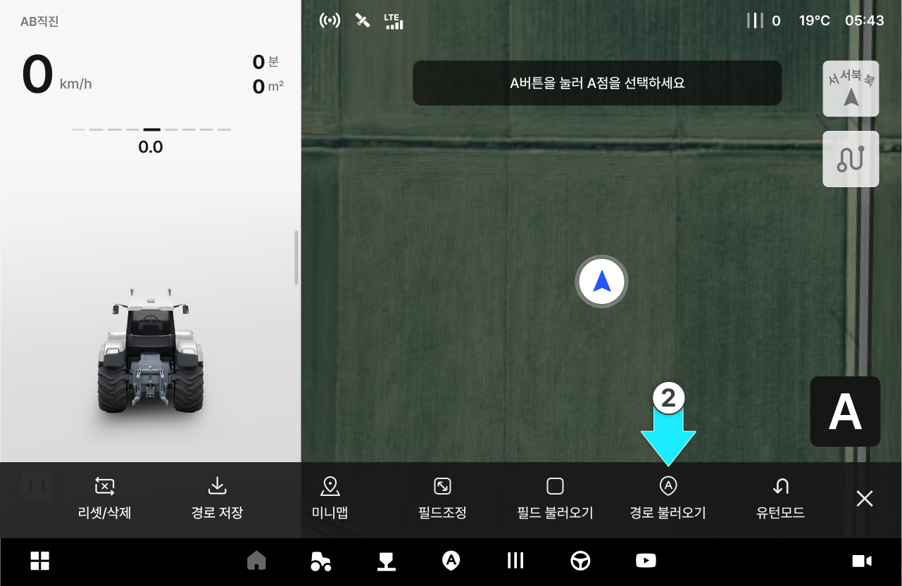
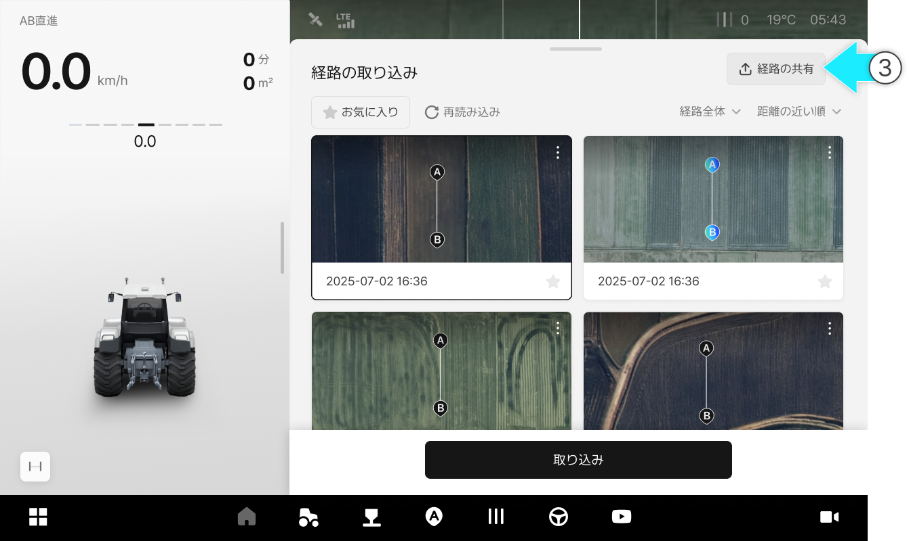
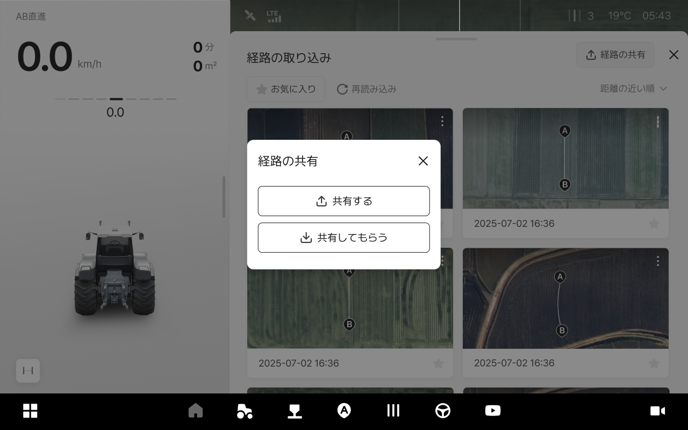
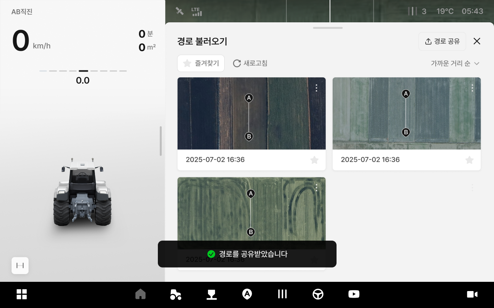

---
metaLinks:
  alternates:
    - >-
      https://app.gitbook.com/s/256Umh24fJVf6zNkZpSa/usage/driving-convenience-function/path-sharing
---

# 経路の共有

### 経路の共有

共有コードを用いて保存した経路を他のユーザーと共有できます。
また、GPX/ISOXML形式のファイルも共有できます。

***

#### 経路の共有へのアクセス



 \[作業]をタップしてください。

<figure><figcaption></figcaption></figure>



\[経路の取り込み]をタップします。

<figure><figcaption></figcaption></figure>



\[経路の共有]をタップします。

<figure><figcaption></figcaption></figure>



ご希望のオプションを選択してください。

<figure><figcaption></figcaption></figure>



***

#### 経路の共有



\[共有する]を選択します。

<figure><figcaption></figcaption></figure>



経路コードを相手に共有し、経路を共有します。

<figure><figcaption></figcaption></figure>



***

#### 経路を共有してもらう



\[共有してもらう]を選択します。

<figure><figcaption></figcaption></figure>



共有してもらう経路のコードを入力してから\[確認]を選択してください。

<figure><figcaption></figcaption></figure>


ファイルの取り込みを選択した場合は、ファイル形式を選び経路を取り込みます。





経路の共有が完了します。

<figure><figcaption></figcaption></figure>


