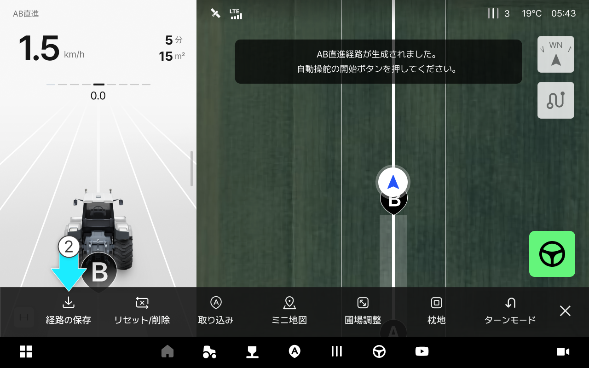

---
layout:
  width: default
  title:
    visible: true
  description:
    visible: false
  tableOfContents:
    visible: true
  outline:
    visible: true
  pagination:
    visible: true
  metadata:
    visible: true
  tags:
    visible: true
metaLinks:
  alternates:
    - >-
      https://app.gitbook.com/s/YgZGmmCCfllSmVLHO3Uz/usage/driving-convenience-function/save-path
---

# 経路の保存

生成した走行経路を保存しておく機能です。保存された経路は\[経路の取り込み]機能を通じて再度使用できます。



ABラインを生成した状態で  \[作業]をタップしてください。

<figure><figcaption></figcaption></figure>



経路の保存を押してください。

<figure><figcaption></figcaption></figure>



\[保存]をタップします。

<figure><figcaption></figcaption></figure>



保存が完了します。

<figure><figcaption></figcaption></figure>


保存された経路は経路の取り込み機能を通じてご利用できます。\
詳細につきましては、[経路の取り込み](/broken/pages/njfHSBPPe2nnkrg3zvvP)をご参照ください。




