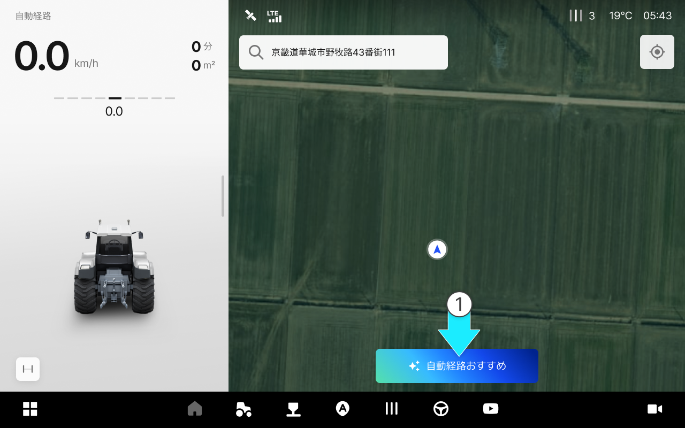

---
layout:
  width: default
  title:
    visible: true
  description:
    visible: false
  tableOfContents:
    visible: true
  outline:
    visible: true
  pagination:
    visible: true
  metadata:
    visible: true
  tags:
    visible: true
metaLinks:
  alternates:
    - /broken/spaces/YgZGmmCCfllSmVLHO3Uz/pages/k9niWFg939Qnm4PFJDIZ
---

# 自動経路（Pluva AI）

自動経路（Pluva AI）

* ユーザーの圃場や車両条件を基に、最適な作業経路を自動生成する機能です。

<figure><figcaption></figcaption></figure>



「自動経路おすすめ」を選択します。

<figure><figcaption></figcaption></figure>



Pluva AIが経路を生成します。

<figure><figcaption></figcaption></figure>



経路生成が完了したら「おすすめの経路で走行開始」をタップしてください。

<figure><figcaption></figcaption></figure>



開始点に移動した後「自動操舵の開始」をタップすると走行が始まります。

<figure><figcaption></figcaption></figure>




\[経路の修正]を選択し、おすすめ経路を修正できます。


<figure><figcaption></figcaption></figure>
