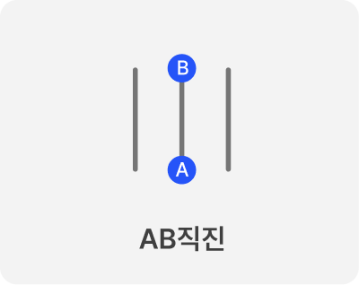
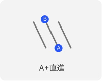
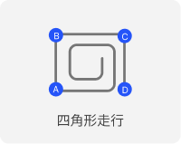
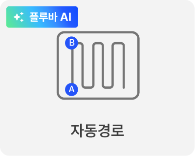
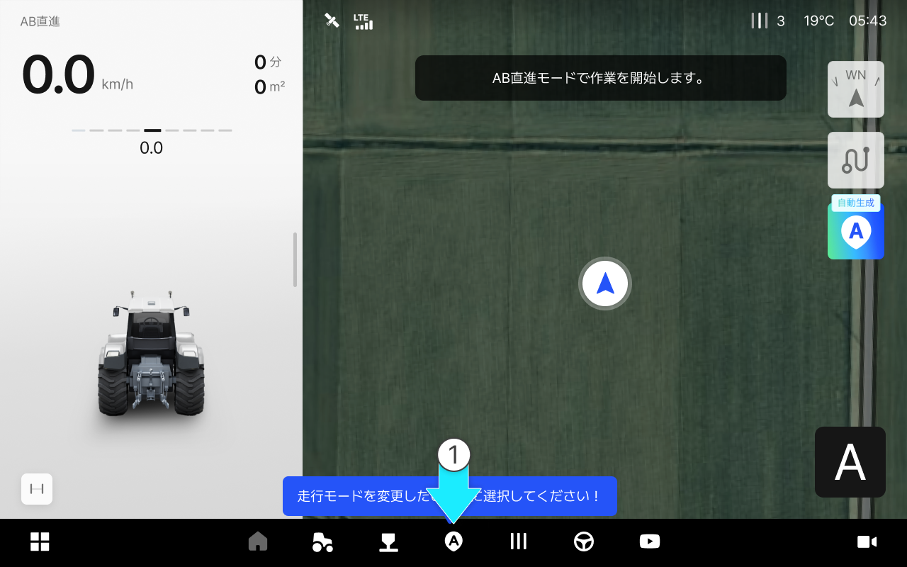

---
metaLinks:
  alternates:
    - >-
      https://app.gitbook.com/s/256Umh24fJVf6zNkZpSa/usage/driving/route-planning-settings
---

# 경로플래닝 설정 방법

### 경로플래닝 설정 방법

경로 플래닝은 AB 직진, A+, 사각 주행 등 다양한 작업 패턴을 한곳에서 확인하고, 필요한 모드를 선택·설정하는 메뉴입니다. 필드 형태에 맞는 경로를 제안해 겹치는 구간과 누락 구간을 줄이고, 작업을 더 안정적이고 수월하게 진행할 수 있도록 돕습니다.

***

#### 경로 플래닝 모드 종류

AB 직진

* A점과 B점을 잇는 방향으로 직진 주행합니다.

<figure><figcaption></figcaption></figure>

A+직진

* A점을 기준으로 설정한 각도의 대각선 직선 경로로 주행합니다.

<figure><figcaption></figcaption></figure>

사각주행

* A-B 라인 기준으로 90도 직각 방향의 자율주행 경로를 생성하여 사각형 패턴으로 주행합니다.

<figure><figcaption></figcaption></figure>

자동 경로 (Pluva AI)

* 사용자의 필드/차량 조건을 바탕으로 최적의 작업 경로를 자동 생성하는 기능입니다.

<figure><figcaption></figcaption></figure>

***

#### 경로 플래닝 기능 진입



 \[경로 플래닝] 버튼을 누릅니다.

<figure><figcaption></figcaption></figure>



원하는 주행 모드를 선택한 후 \[확인]을 누릅니다.

<figure><figcaption></figcaption></figure>




기본 주행 모드는 AB 직진입니다.
다른 주행 모드를 사용하려면 원하는 모드를 선택한 후 \[확인]을 누르세요.



현재 선택된 주행 모드는 화면 왼쪽 상단의 주행 정보 영역에서 확인할 수 있습니다.




배속턴 설정은 오른쪽 상단의 주행 정보 영역에서 확인할 수 있습니다. 해당 영역에서 배속턴 ON/OFF 상태를 확인합니다.


{% embed url="https://www.figma.com/design/3caVmkxMdvjppUG5NWSjbb/%EC%B0%A8%EC%84%B8%EB%8C%80-%EB%8C%80%EB%A6%AC%EC%A0%90-%EB%A9%94%EB%89%B4%EC%96%BC?node-id=8074-95134&t=2tAc6CEtfh7Fv5fV-1" %}


주행 모드에 진입하면 배속턴 설정 안내 팝업이 표시됩니다. \
안내에 따라 **배속턴을 ON으로 설정**한 뒤 **\[주행 시작]** 을 누르면 주행 모드 진입이 완료됩니다.


{% embed url="https://www.figma.com/design/3caVmkxMdvjppUG5NWSjbb/%EC%B0%A8%EC%84%B8%EB%8C%80-%EB%8C%80%EB%A6%AC%EC%A0%90-%EB%A9%94%EB%89%B4%EC%96%BC?node-id=8074-95412&t=2tAc6CEtfh7Fv5fV-1" %}
