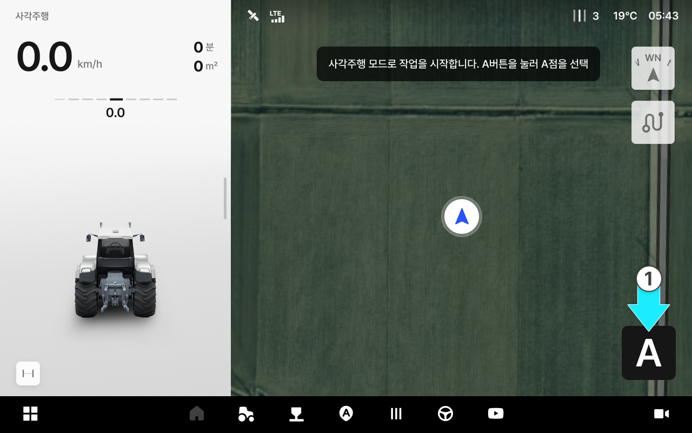
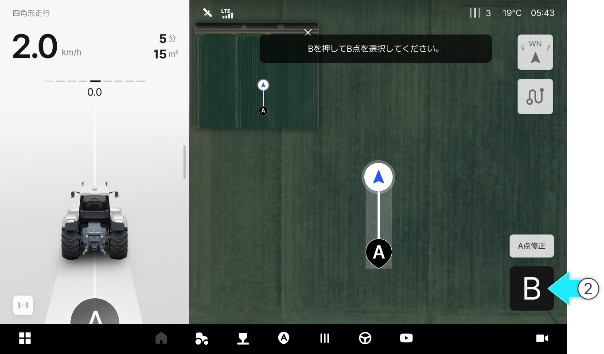
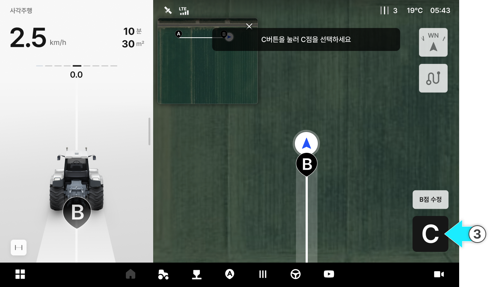
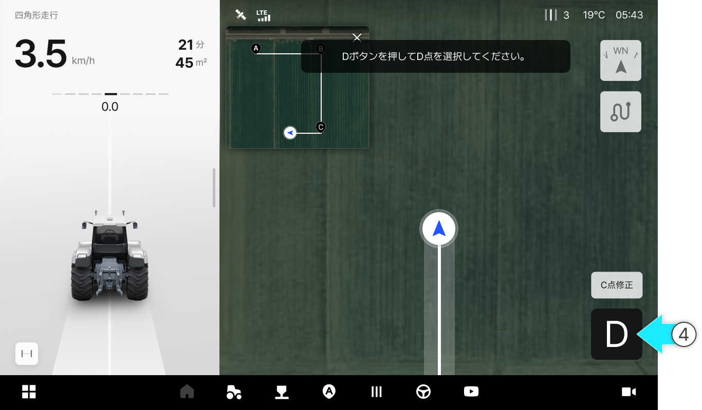
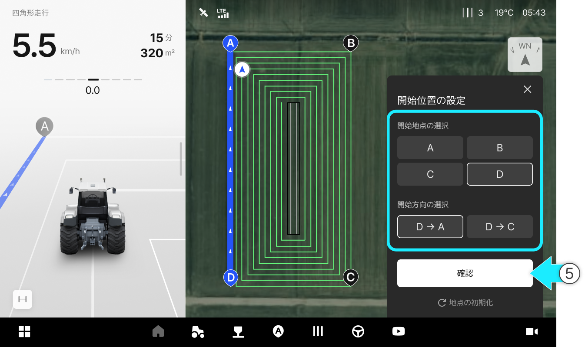

---
metaLinks:
  alternates:
    - https://app.gitbook.com/s/256Umh24fJVf6zNkZpSa/usage/driving/square-drive
---

# 四角形走行

### 四角形走行

四角形走行

* A-Bラインを基準に90度直角方向の自動操舵経路を生成し、四角形パターンで\
  走行します。

<figure><figcaption></figcaption></figure>



を押しA地点を生成します。

<figure><figcaption></figcaption></figure>



10m以上直進走行した後、ご希望での地点でを押してB地点を生成します。

<figure><figcaption></figcaption></figure>


A点を生成するとミニ地図が表示されます。




生成した点は\[X点修正]をタップし調整することができます。




を押してC地点を生成します。

<figure><figcaption></figcaption></figure>



を押してD地点を生成します。

<figure><figcaption></figcaption></figure>



四角形走行ラインが生成されたら、開始点と開始方向を選択し\[確認]を押します。

<figure><figcaption></figcaption></figure>



スタート地点に移動し\[自動操舵の開始] ボタンを押します。

<figure><figcaption></figcaption></figure>



