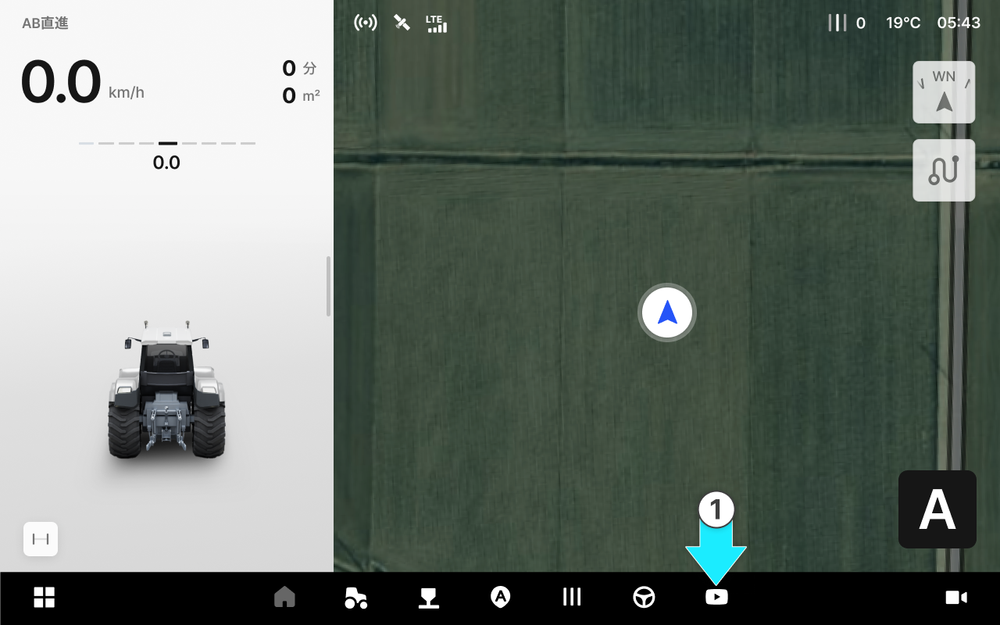
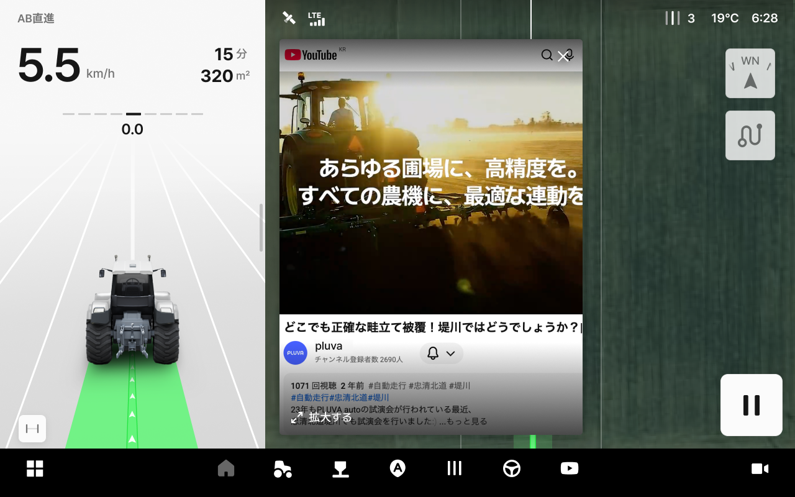
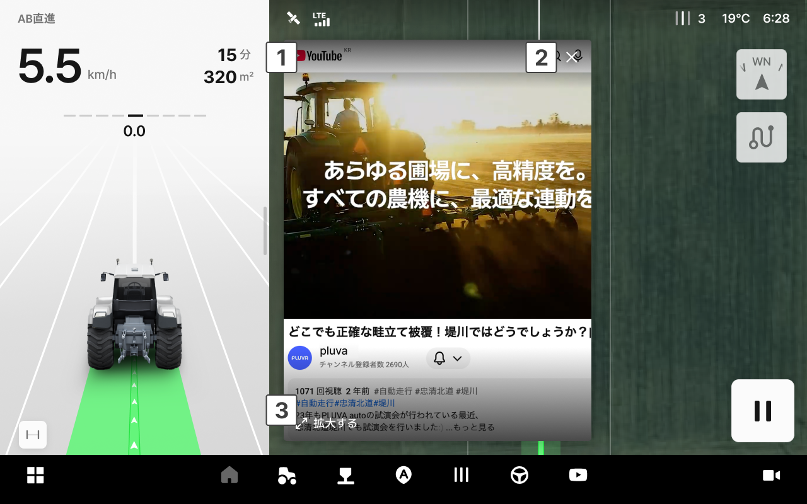

---
metaLinks:
  alternates:
    - https://app.gitbook.com/s/YgZGmmCCfllSmVLHO3Uz/ion/entertainment
---

# エンターテインメント

エンターテインメント項目ではYouTubeを視聴できます。走行画面の右側にYouTube画面が表示されます。


**エンターテインメント機能は、自動操舵中の快適さを向上させるためのものですが、ドライバーは常に車両の状況を注視しなければなりません。**

* 自動操舵中にも前方および周辺の状況（障害物、人、動物など）を常にご確認ください。
* メディアの操作は、車両を停止し、または安全が確保された状態で行ってください。
* 音量が大きすぎると、外部の警告音や周囲の音が聞こえない恐れがあります。安全のため、適度な音量でご使用ください。


***

### アクセス方法



アプリ下部の項目蘭の「YouTube」アイコンをタップします。

<figure><figcaption></figcaption></figure>



走行画面の右側にYouTube画面が表示されます。

<figure><figcaption></figcaption></figure>



***

### エンターテインメント画面

<figure><figcaption></figcaption></figure>

.svg>) **YouTube動画画面**

* YouTubeの動画を検索および再生します。再生中にも走行画面はリアルタイムでアップデートされます。

.svg>) **閉じる**

* YouTube画面を閉じます。

.svg>) **拡大する**

* YouTube画面を全体画面に拡大します。
