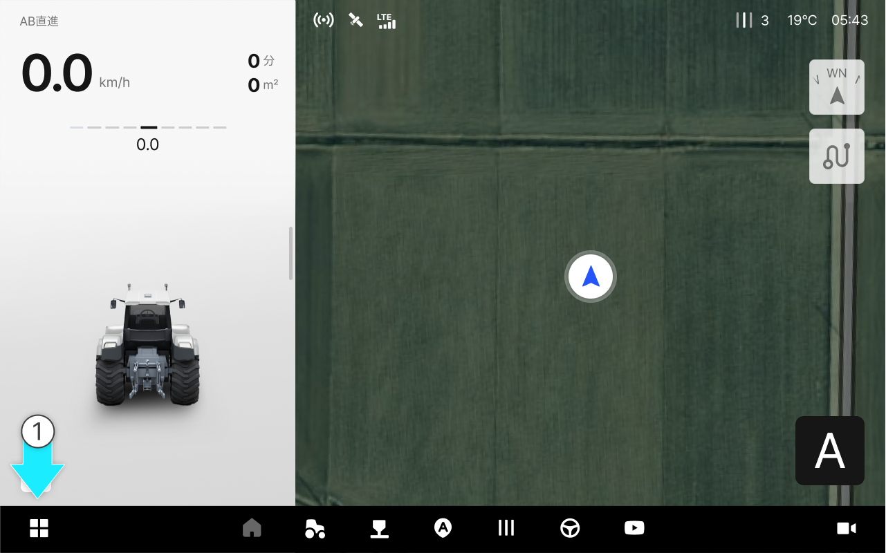
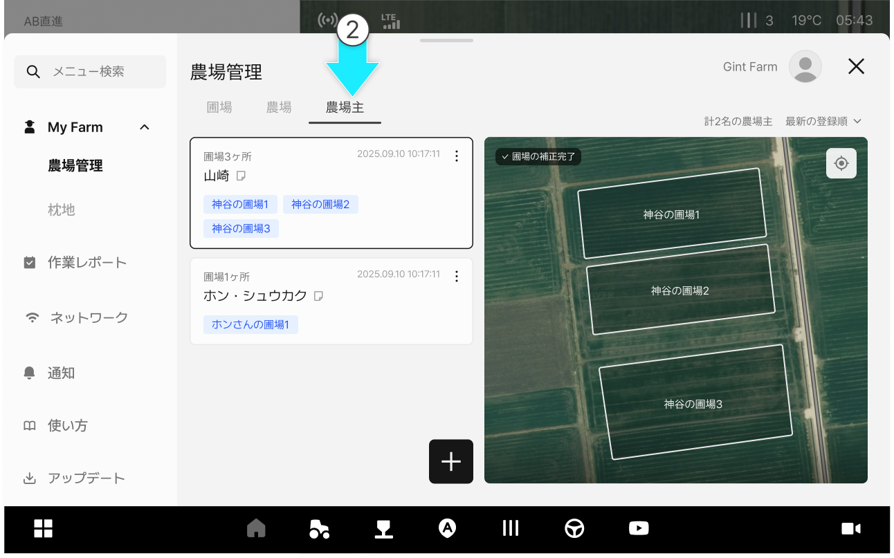
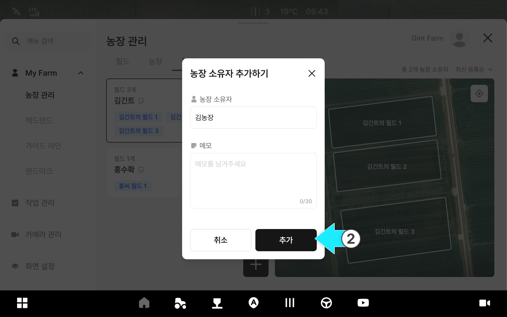
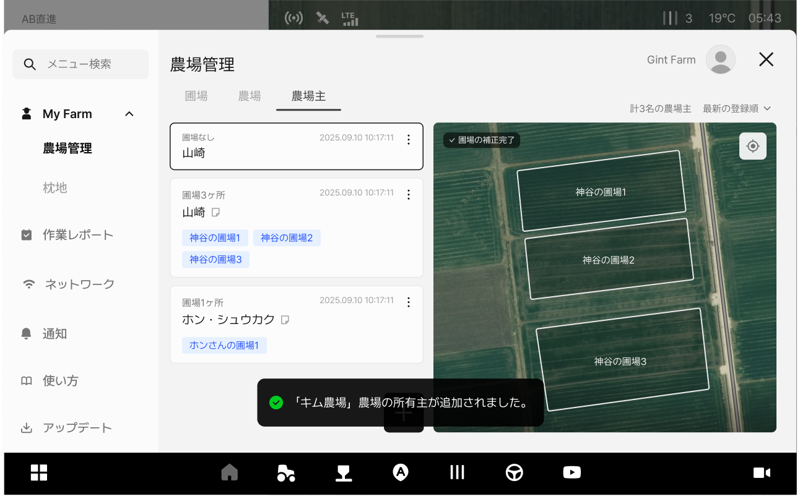
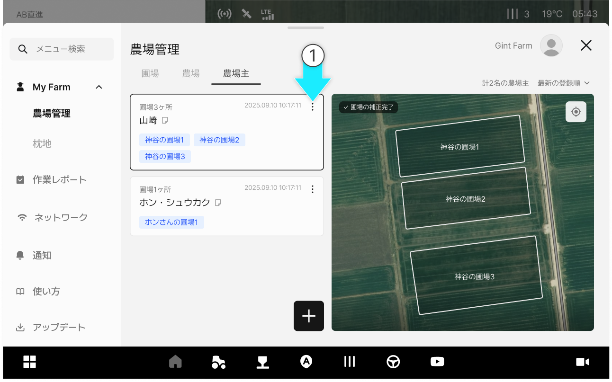
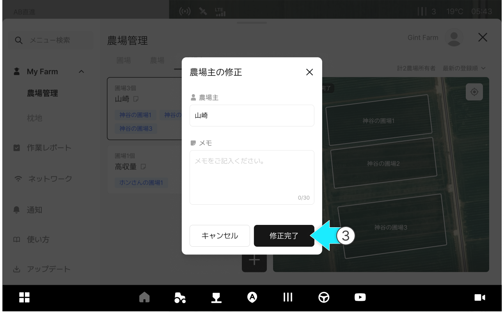
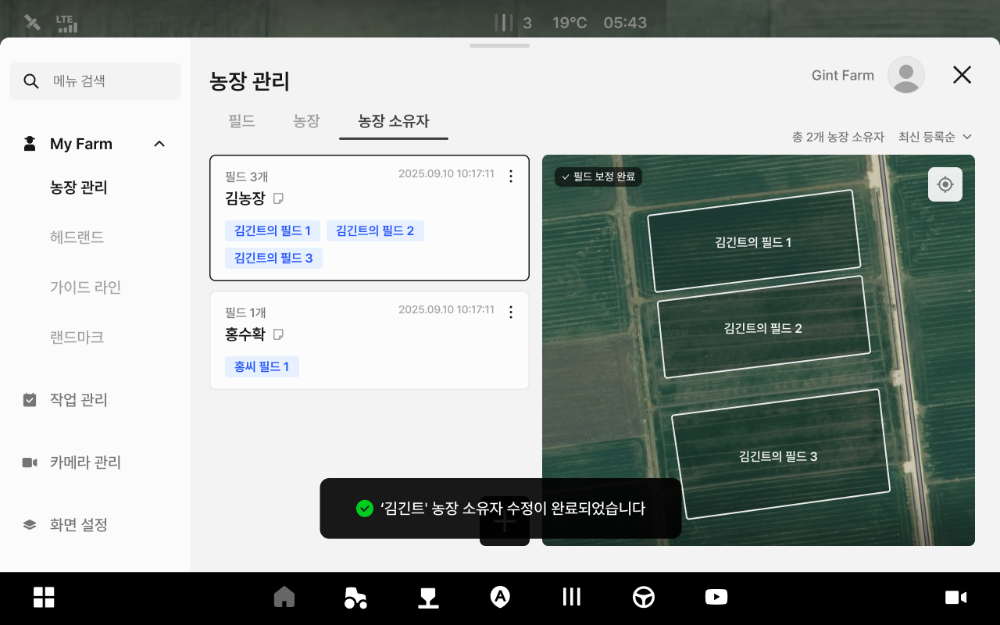
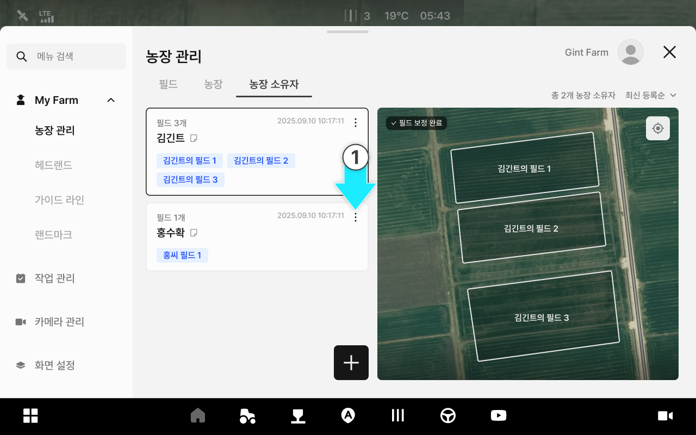
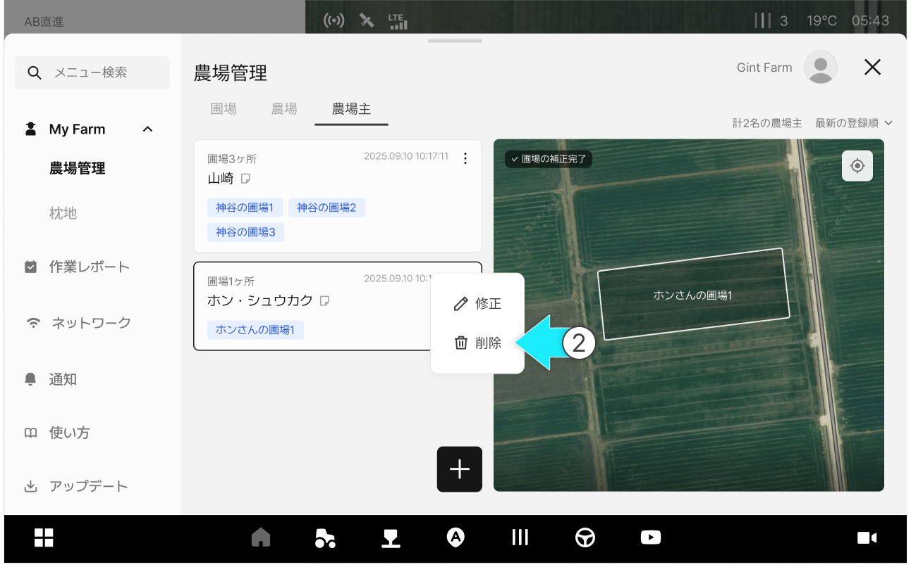
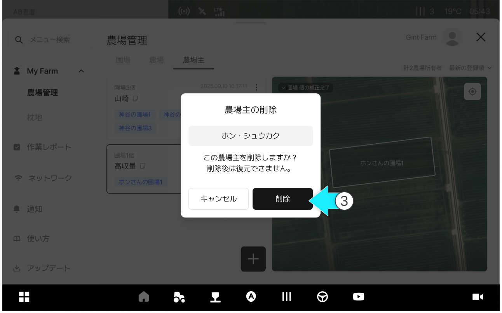

---
metaLinks:
  alternates:
    - >-
      https://app.gitbook.com/s/256Umh24fJVf6zNkZpSa/usage/my-farm/farm-owner-management
---

# 農場主の管理

### 農場主の管理

農場主の管理では、所有者情報を追加・修正・削除できます。
所有者ごとに登録された圃場の現状をも一緒に確認することができます。

***

#### 農場主の管理へアクセス



 \[メニュー一覧のアイコン]をクリックします。

<figure><figcaption></figcaption></figure>



My Farmの農場管理の\[農場主]タブをクリックすると、農場主の管理へアクセスできます。

<figure><figcaption></figcaption></figure>



***

#### 農場主の追加



 農場主の追加ボタンを押します。

<figure><figcaption></figcaption></figure>



\[農場主の追加]ポップアップ上に内容を入力し、\[追加]ボタンを押します。

<figure><figcaption></figcaption></figure>



農場主の追加が完了します。

<figure><figcaption></figcaption></figure>



***

#### 農場主の修正



ご希望の農場主項目の  アイコンをクリックします。

<figure><figcaption></figcaption></figure>



\[修正]をクリックします。

<figure><figcaption></figcaption></figure>



内容を修正し、\[修正完了]をクリックします。

<figure><figcaption></figcaption></figure>



修正が完了します。

<figure><figcaption></figcaption></figure>



***

#### 農場主の削除



ご希望の農場主項目の  アイコンをクリックします。

<figure><figcaption></figcaption></figure>



\[削除]をクリックします。

<figure><figcaption></figcaption></figure>



\[農場主の削除]ポップアップから\[削除] をクリックします。

<figure><figcaption></figcaption></figure>



農場主の削除が完了します。

<figure><figcaption></figcaption></figure>


