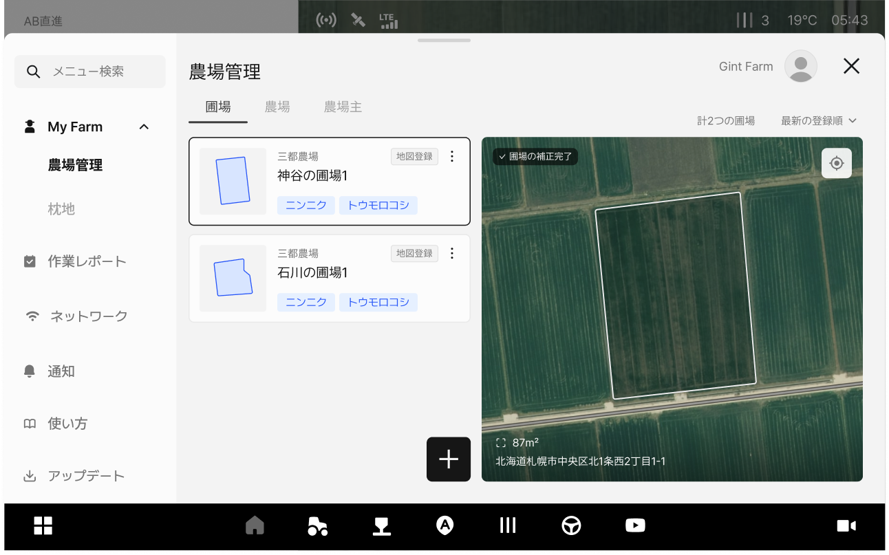
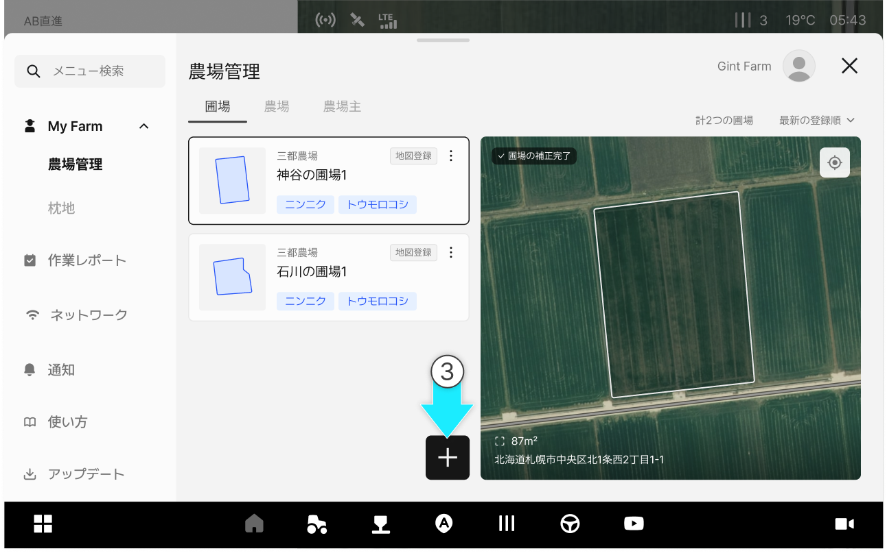
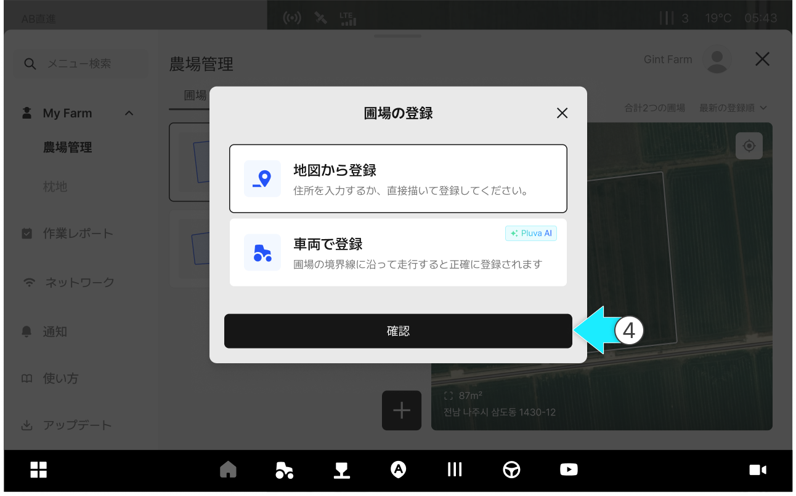
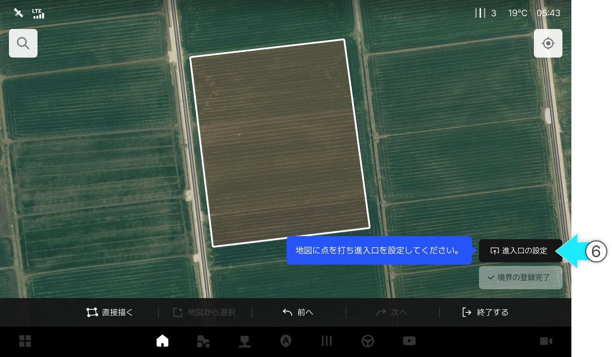
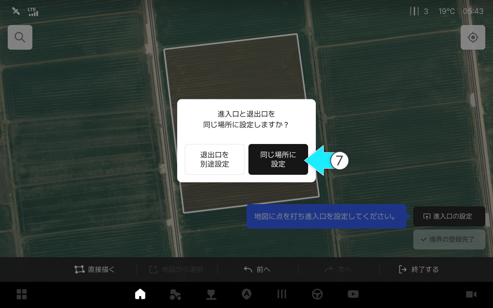
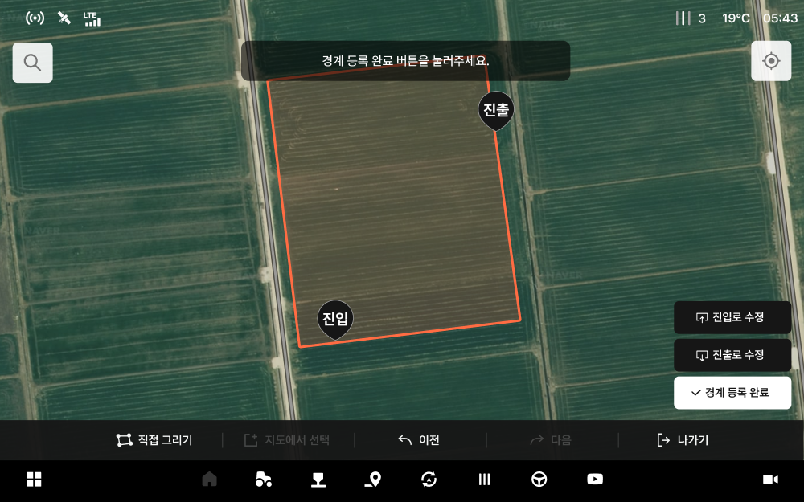
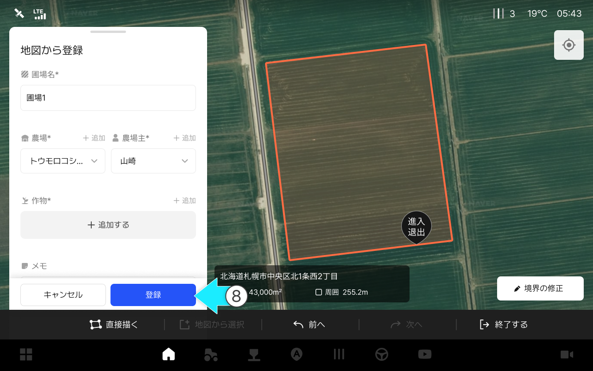
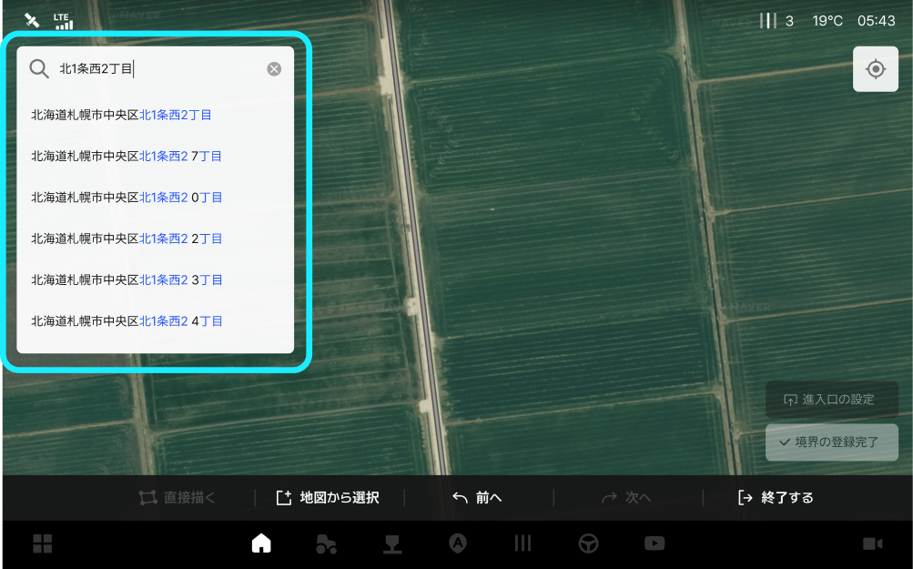
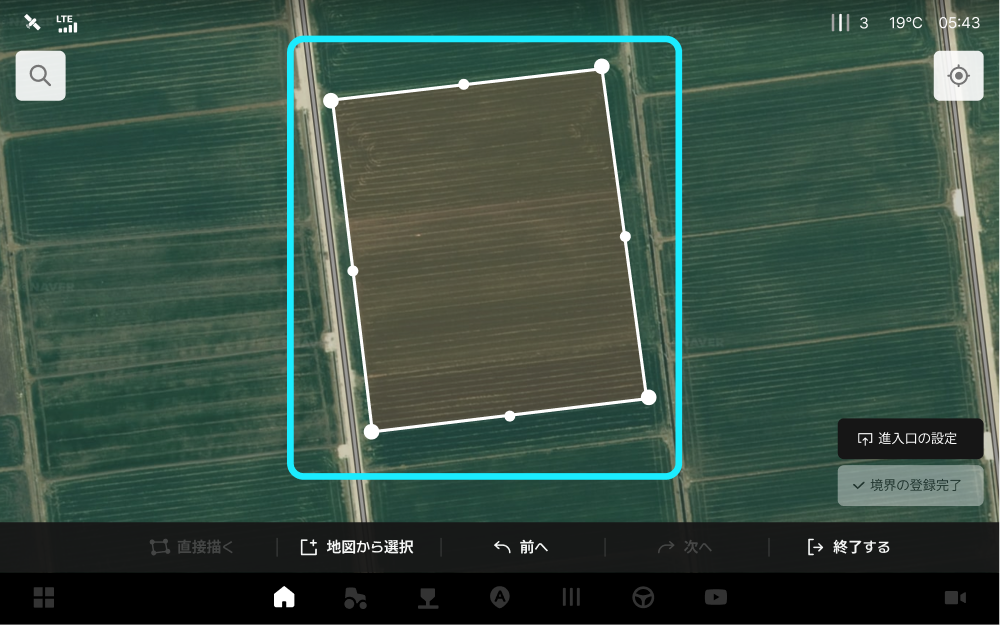
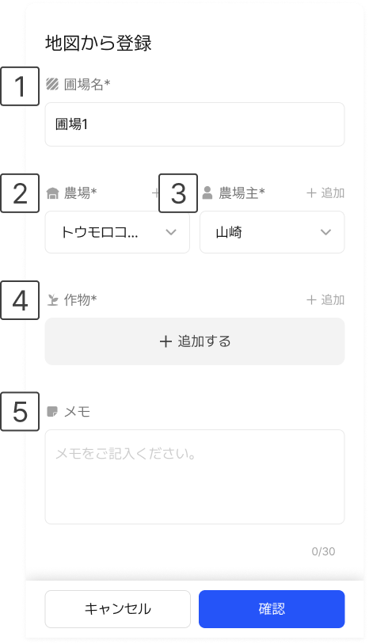

---
metaLinks:
  alternates:
    - >-
      https://app.gitbook.com/s/256Umh24fJVf6zNkZpSa/usage/my-farm/managing-field-information
---

# 圃場の登録

### 圃場の登録

一度圃場を登録すれば、各作業で同一の基準を適用できるため、作業準備時間を短縮し、繰り返しの設定を最小限に抑えることができます。また、作業履歴が圃場単位で蓄積・照会されるため、圃場ごとの作業記録を簡単に確認でき、農作業の体系的な管理が可能です。

***

#### 圃場登録機能へアクセス



 \[メニュー一覧のアイコン]をクリックします。

<figure><figcaption></figcaption></figure>



My Farmの農場管理の\[圃場]タブをクリックすると圃場の管理へアクセスできます。

<figure><figcaption></figcaption></figure>



 \[圃場の追加]ボタンをクリックします。

<figure><figcaption></figcaption></figure>



「地図から登録」オプションを選択し、\[確認]をクリックします。

<figure><figcaption></figcaption></figure>



地図から圃場を選択します。

<figure><figcaption></figcaption></figure>


圃場登録の基本設定は\[地図から選択]になっています。
境界を直接作成するには、\[直接描く]をクリックします。




境界の生成後、\[進入口の設定]をクリックし、ご希望の場所を選択します。

<figure><figcaption></figcaption></figure>



進入・退出口の位置設定ポップアップから\[同じ場所に設定]を選択します。

<figure><figcaption></figcaption></figure>


\[退出口を別途設定]を選択した場合は、進入/退出口をそれぞれ指定する必要があります。





進入・退出口の設定が完了したら圃場情報を入力し、\[登録]をクリックします。

<figure><figcaption></figcaption></figure>



圃場の登録が完了します。

<figure><figcaption></figcaption></figure>



***

#### 地図から圃場登録の画面のご案内

<figure><figcaption></figcaption></figure>

&#x20; **住所を検索し圃場を選択**

* アドレス検索で圃場を選択します。
  *

      <figure><figcaption></figcaption></figure>

&#x20; **直接描く**

* 圃場エリアに直接点を打って生成します。
  *

      <figure><figcaption></figcaption></figure>

&#x20; **地図から選択**

* 地図上で圃場を直接クリックして選択します。\[地図から登録]が基本設定になっています。

&#x20; **前へ**

* 前へ戻ります。

&#x20; **次へ**

* 次へ進みます。

&#x20; **終了する**

* 「圃場を追加する」画面から出ます。

&#x20; **現在地へ移動する**

* 現在地に地図を移動させます。

&#x20; **進入/退出口の設定**

* 進入/退出口の位置を設定します。圃場を選択すると、そのボタンが使用できます。進入/退出口は同じ位置に設定するか、別々に設定することができます。なお、修正ボタンから位置変更ができます。

&#x20; **境界の登録完了**

* 境界登録を完了します。進入/退出口を選択するとそのクリックが可能になります。

***

#### 地図から圃場登録モーダルのご案内

<figure><figcaption></figcaption></figure>

&#x20; **圃場名**

* 代表として表記する圃場の名前を入力します。

&#x20; **農場**

* 圃場と紐づく農場を選択します。

&#x20; **農場主**

* 圃場と紐づく農場主を選択します。

&#x20; **作物**

* 現在の圃場で作業中の作物を追加します。

&#x20; **メモ**

* メモに追加情報を記入できます
