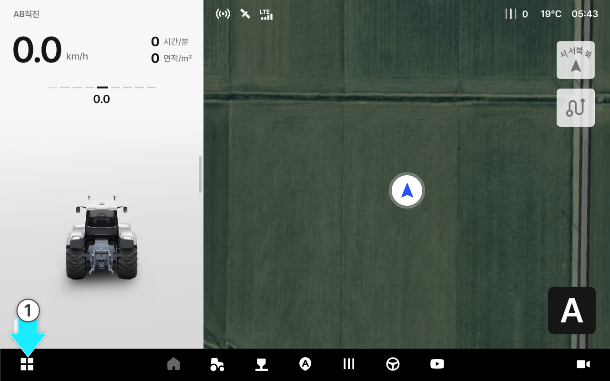
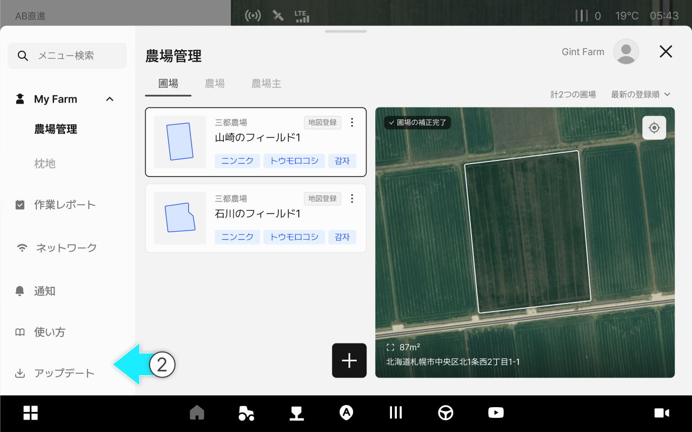
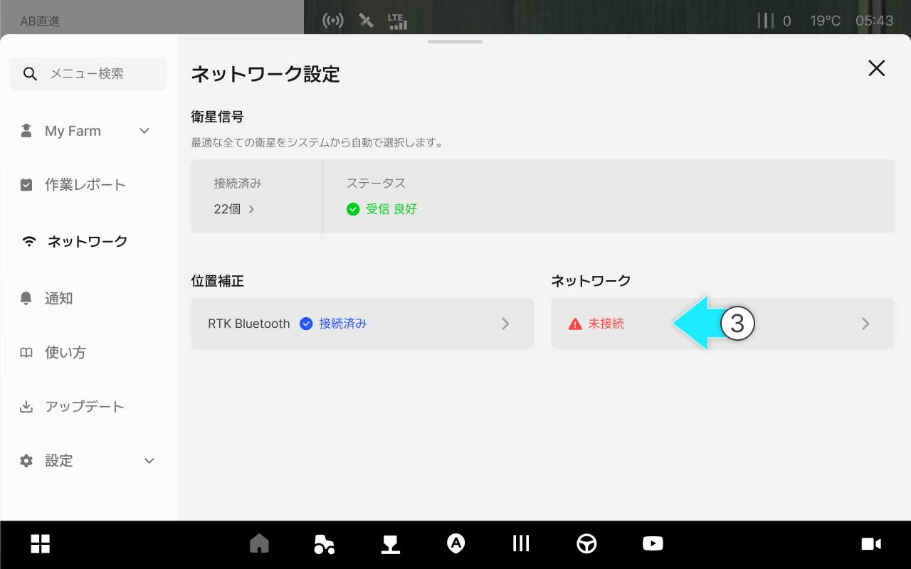
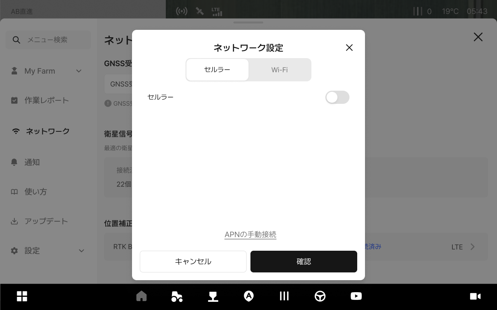
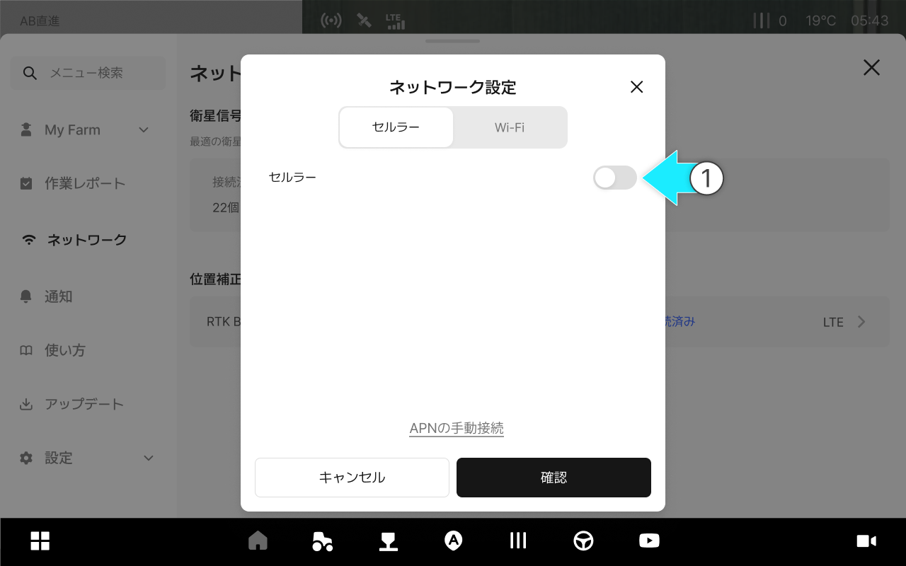
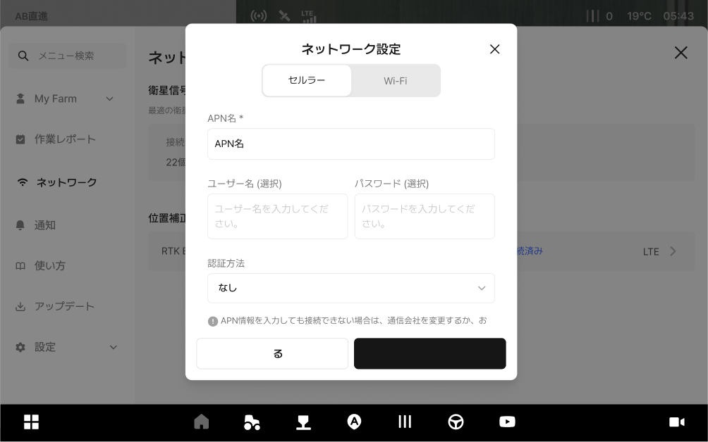
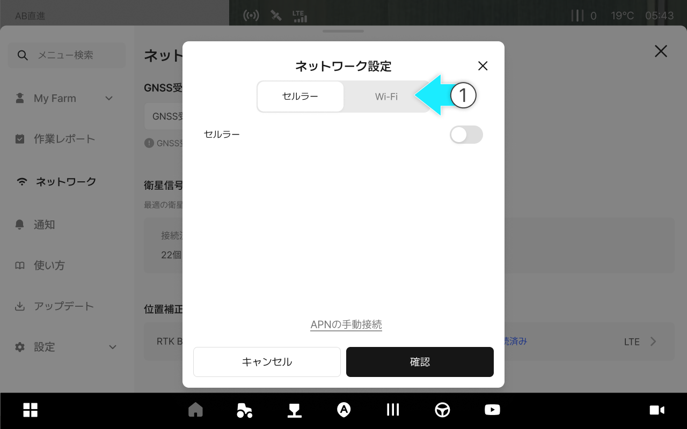
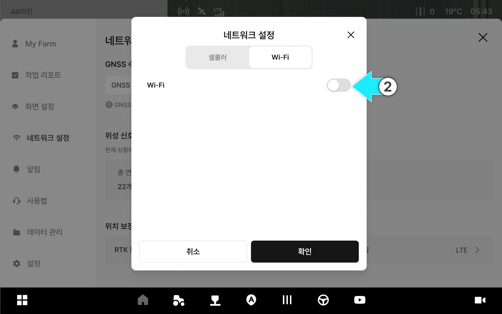
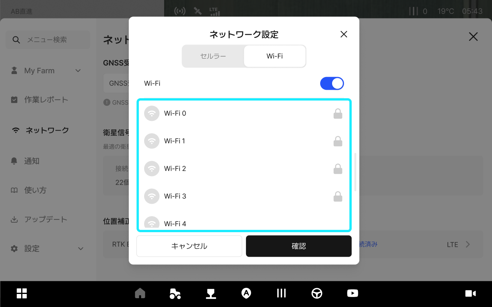
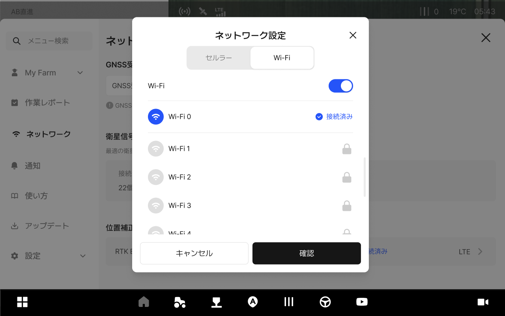

---
metaLinks:
  alternates:
    - >-
      https://app.gitbook.com/s/256Umh24fJVf6zNkZpSa/usage/network-settings/network-setting
---

# ネットワーク設定

### ネットワーク設定

タブレットのネットワークをWi-Fiまたはセルラー通信に接続します。ネットワークが不安定になると位置補正信号の受信が途切れる恐れがありますので、作業前に接続状態を先に確認してください。接続が不安定な場合は、APN設定を確認するか、別のネットワークに切り替えて接続してください。

***

#### ネットワーク設定へのアクセス



 メニュー一覧のアイコンをクリックします。

<figure><figcaption></figcaption></figure>



\[ネットワーク設定]をクリックします。

<figure><figcaption></figcaption></figure>



ネットワーク項目をクリックします。

<figure><figcaption></figcaption></figure>



ネットワーク設定のポップアップから、ご希望のオプションを設定してください。

<figure><figcaption></figcaption></figure>



***

#### セルラー接続

セルラー通信とは、タブレットに挿入されたSIMカードを使用して、移動通信ネットワーク経由でインターネットに接続する通信方式です。


移動の多い作業中でも比較的安定した接続を保てるので、精密作業（RTKなど）にはセルラー通信のご使用をおすすめします。



料金プランやデータ使用量によって費用が発生することがありますので、作業前にSIMカードの状態や使用期限をご確認ください。




セルラーをオンにします。

<figure><figcaption></figcaption></figure>



APNが自動で設定および接続されます。

<figure><figcaption></figcaption></figure>



接続完了後、\[確認]をクリックするとセルラー設定が完了します。

<figure><figcaption></figcaption></figure>


自動で接続できない場合は、\[APNの手動接続]を行ってください。\
入力に必要なAPN情報は、SIMカードからの提供資料（または、通信会社の案内）\
をご参照ください。





***

#### Wi-Fi接続

Wi-Fiは周辺の無線LANルーターやスマートフォンのテザリングに接続して、インターネットを使用する通信方式です。


周辺の環境によっては、信号が弱くなったり通信範囲を外れることで接続が切断される場合がありますので、屋内でのテストや作業範囲が限られた環境での使用をおすすめします。



テザリングを使用する場合、スマートフォンのバッテリー消費やデータ使用量が増えることがありますので、作業前に充電状態や省電力設定を確認してください。




\[Wi-Fi]タブをクリックします。

<figure><figcaption></figcaption></figure>



Wi-Fiをオンにします。

<figure><figcaption></figcaption></figure>



接続したいWi-Fiを選択します。

<figure><figcaption></figcaption></figure>



Wi-Fi接続が完了します。

<figure><figcaption></figcaption></figure>


Wi-Fiの通信範囲外になると、接続が切断される恐れがあります。



