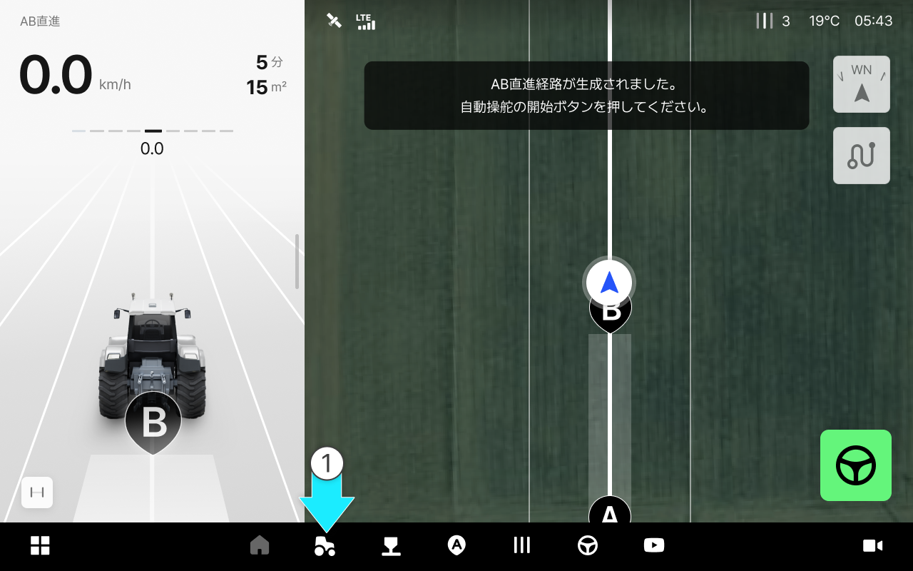
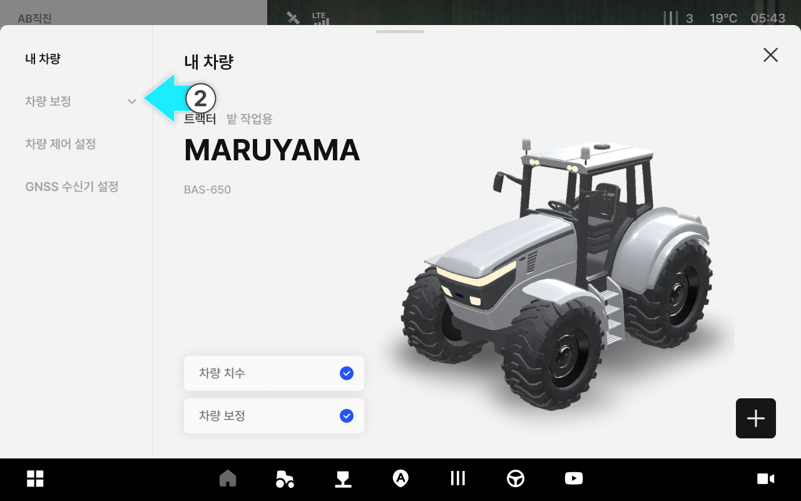
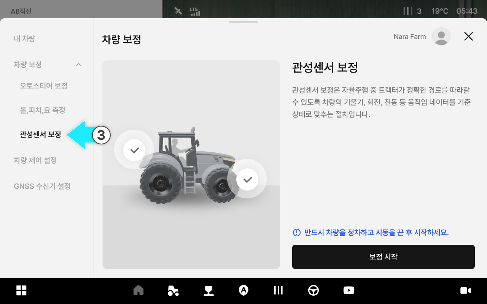
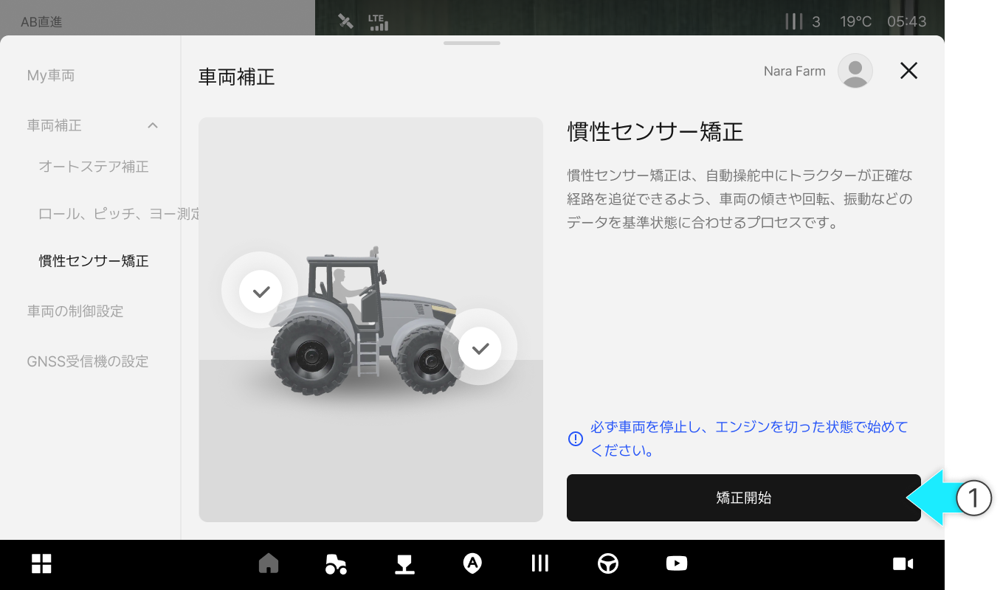
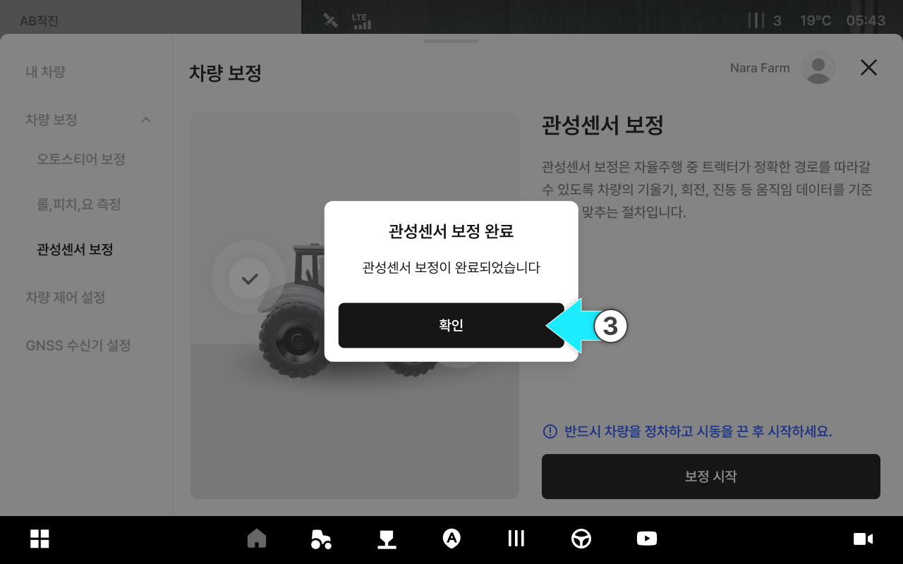
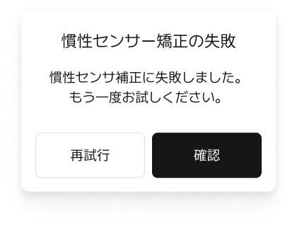

---
metaLinks:
  alternates:
    - >-
      https://app.gitbook.com/s/256Umh24fJVf6zNkZpSa/usage/vehicle-settings/imu-calibration
---

# 慣性センサー矯正

### 慣性センサー矯正

慣性センサー矯正は、車両の傾きや回転、振動データを基準値として補正し、自動操舵時の経路追従の精度を高めるための手順です。必ず車両を停止し、エンジンを切った状態で作業を進めてください。



 \[車両]をタップします。

<figure><figcaption></figcaption></figure>



車両補正をタップしてください。

<figure><figcaption></figcaption></figure>



慣性センサー矯正をタップするとアクセスできます。

<figure><figcaption></figcaption></figure>



***

#### 慣性センサー矯正のご案内



\[矯正開始]をタップしてください。

<figure><figcaption></figcaption></figure>


必ず車両を停止し、エンジンを切ってから始めてください。




慣性センサー矯正が始まります。

<figure><figcaption></figcaption></figure>



矯正が完了したら、\[確認]を押して終了します。

<figure><figcaption></figcaption></figure>


矯正できなった場合は、再度お試しいただくか、購入先にお問い合わせください。




