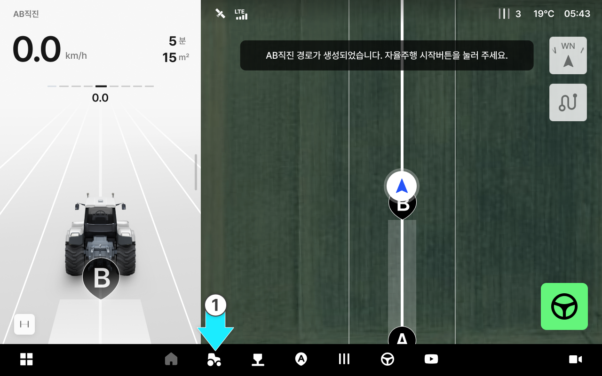
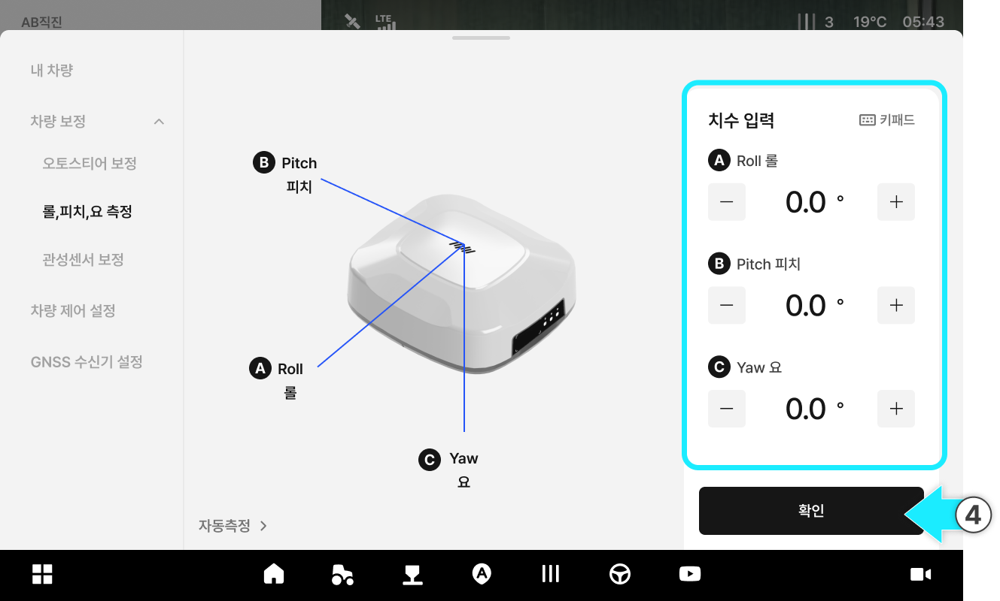

---
metaLinks:
  alternates:
    - >-
      https://app.gitbook.com/s/256Umh24fJVf6zNkZpSa/usage/vehicle-settings/autostere-calibration
---

# ロール／ピッチ／ヨー補正

### ロール／ピッチ／ヨー補正

ロール／ピッチ／ヨー補正は、傾斜地や不整地でも車両が正確な方向と姿勢を維持するために、GNSS受信機の基準値を調整する機能です。取り付け状態によって傾きが大きい場合は、値を入力して補正することができます。



 \[車両]をタップします。

<figure><figcaption></figcaption></figure>



車両補正をタップしてください。

<figure><figcaption></figcaption></figure>



ロール、ピッチ、ヨー測定をタップするとアクセスできます。

<figure><figcaption></figcaption></figure>



ご希望の寸法を入力し、\[確認]を押すと適用されます。

<figure><figcaption></figcaption></figure>



***

#### ロール、ピッチ、ヨー 補正のご案内

<figure><figcaption></figcaption></figure>

&#x20; **ROll ロール**

* GNSS受信機が左右方向に傾いている角度を意味します。

&#x20; **Pitch ピッチ**

* GNSS受信機が左右方向に傾いている角度を意味します。

&#x20; **Yaw ヨー**

* GNSS受信機が垂直軸を基準に回転した角度を意味します。
