---
metaLinks:
  alternates:
    - >-
      https://app.gitbook.com/s/256Umh24fJVf6zNkZpSa/usage/vehicle-settings/modifying-vehicle-information
---

# オートステア補正

### オートステア補正

オートステア補正とは、設定された経路を安定して追従できるよう、ステアリング範囲と　直進基準値を補正するプロセスです。トラクターは2段階、田植え機は3段階の補正を行います。

**トラクター（2段階）**

* ハンドル範囲の補正 - 直進ステアリング補正

<figure><figcaption></figcaption></figure>

**田植え機（3段階）**

* ハンドル範囲の補正 - 直進ステアリング補正 - ステアリング角度補正

<figure>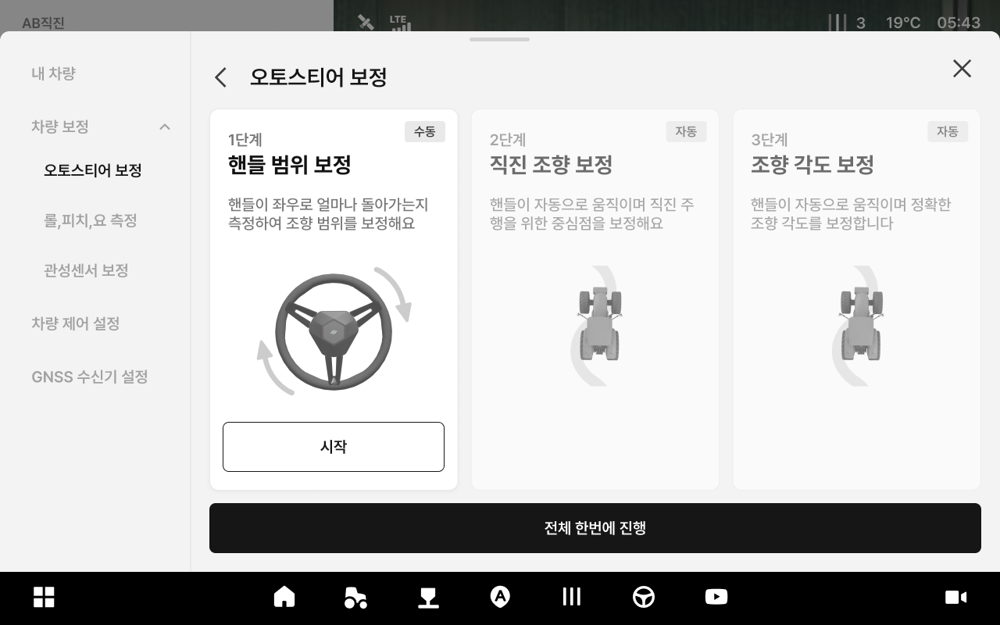<figcaption></figcaption></figure>

***

#### オートステア補正へのアクセス



 \[車両]をタップします。

<figure><figcaption></figcaption></figure>



車両補正をタップしてください。

<figure>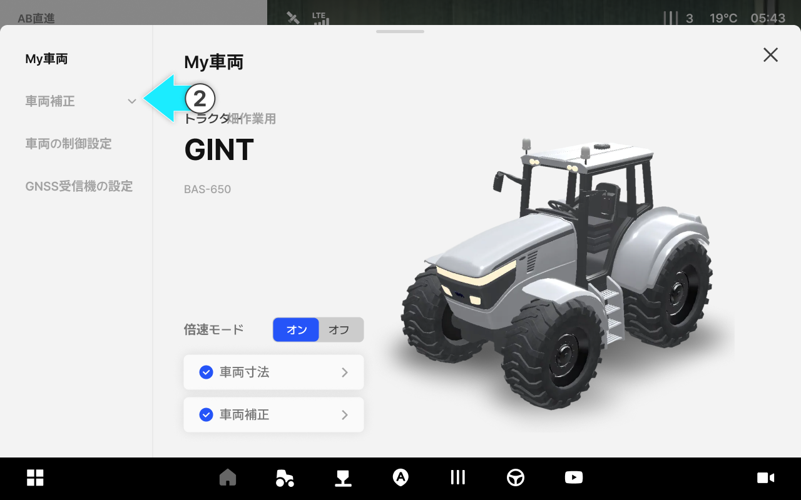<figcaption></figcaption></figure>



オートステア補正をタップすると、アクセスが完了します。

<figure>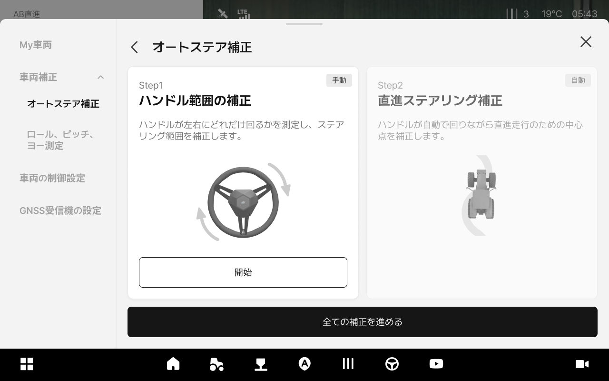<figcaption></figcaption></figure>



***

#### トラクターのオートステア補正

1. ハンドル範囲の補正



「全ての補正を進める」をタップするとオートステア補正が開始されます。

<figure>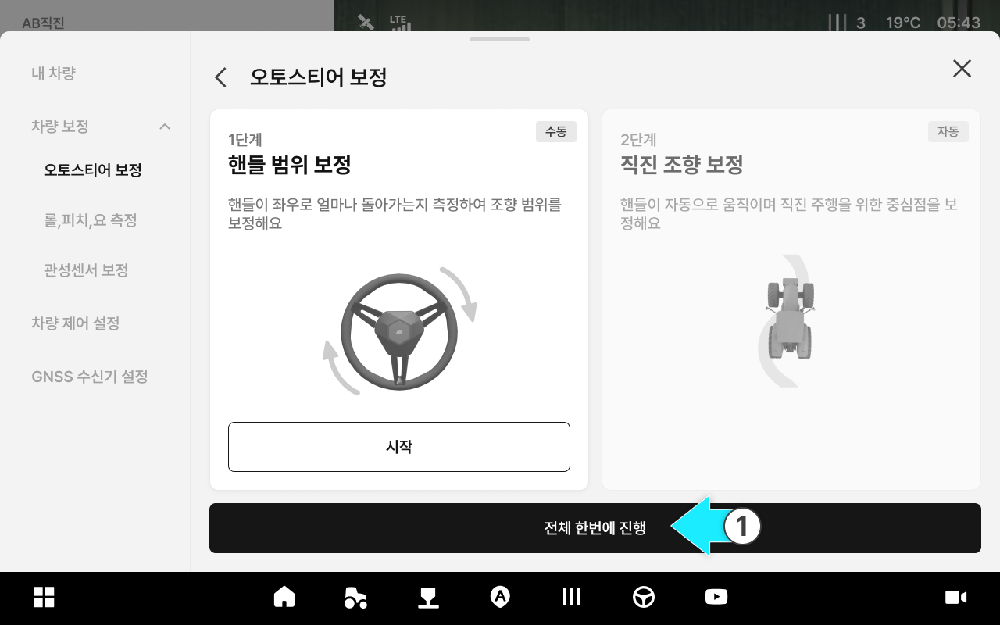<figcaption></figcaption></figure>


各段階の開始ボタンをタップすると、その段階の補正のみを進めることができます。




案内に従ってハンドルを左いっぱいに切った後、車両を止めて\[確認]をタップしてください。

<figure>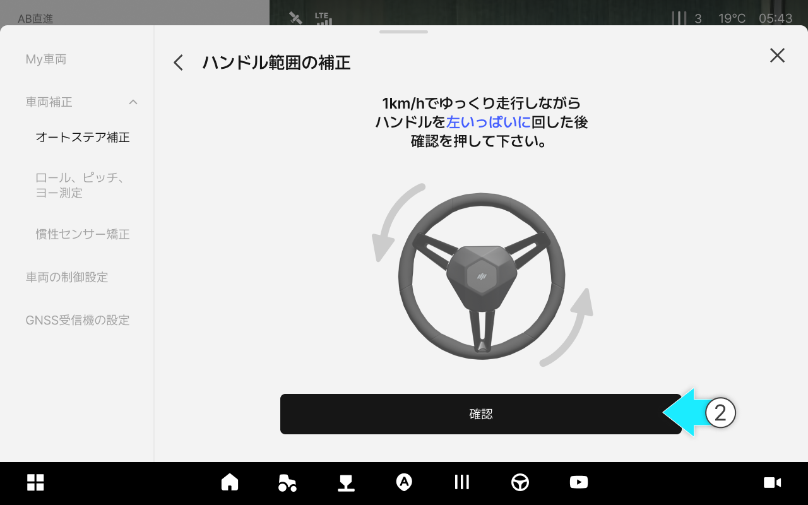<figcaption></figcaption></figure>



案内に従ってハンドルを右いっぱいに切った後、車両を止めて\[確認]をタップしてください。

<figure>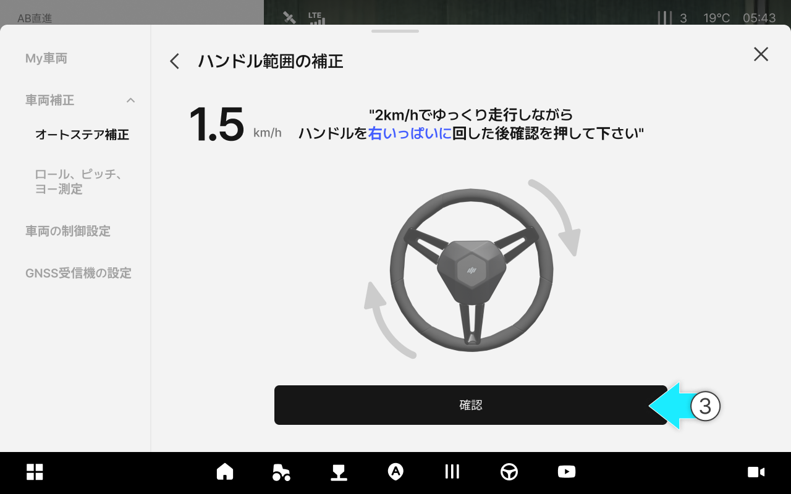<figcaption></figcaption></figure>



案内に従ってハンドルを回し、車輪を中央に位置させます。\
その後車両を停止し、\[確認]をタップしてください。

<figure>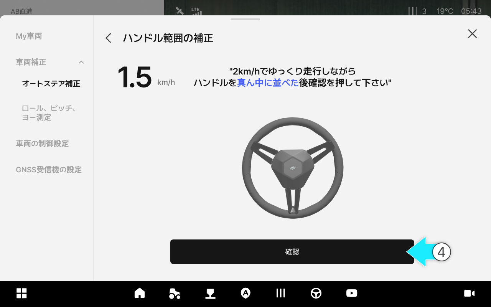<figcaption></figcaption></figure>



ハンドル範囲の補正が完了します。

<figure>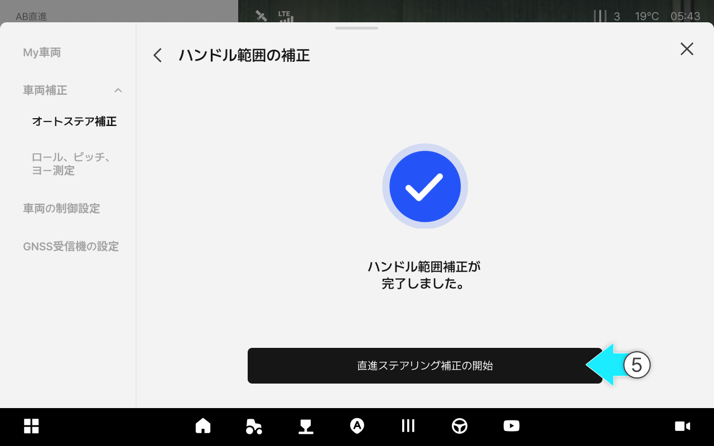<figcaption></figcaption></figure>



2. **直進ステアリング補正**



直進ステアリング補正に必要なご案内をお読みになった後、\[確認]をタップしてください。

<figure>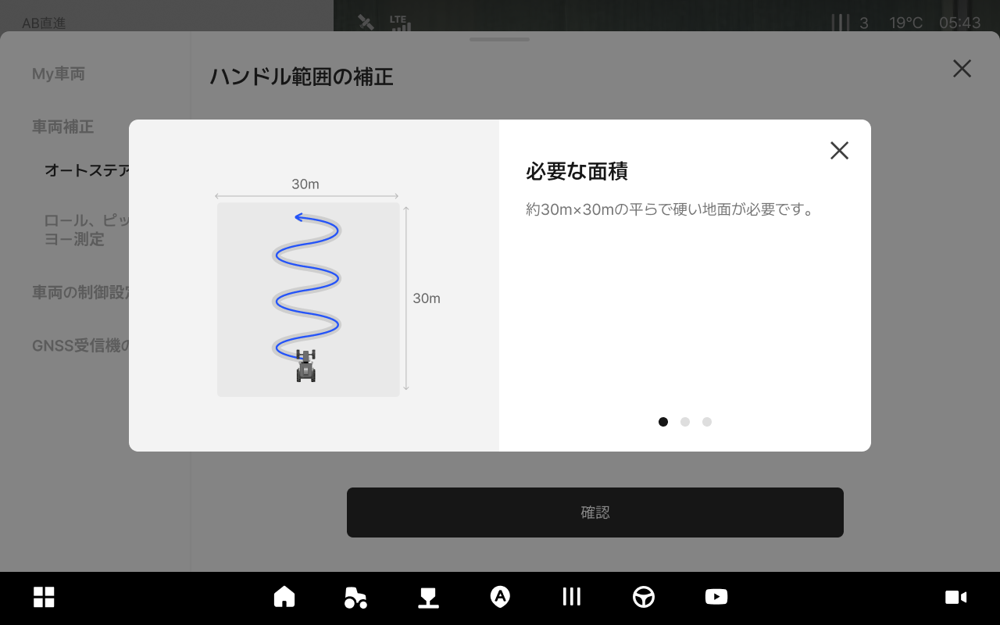<figcaption></figcaption></figure>

<figure><figcaption></figcaption></figure>

<figure>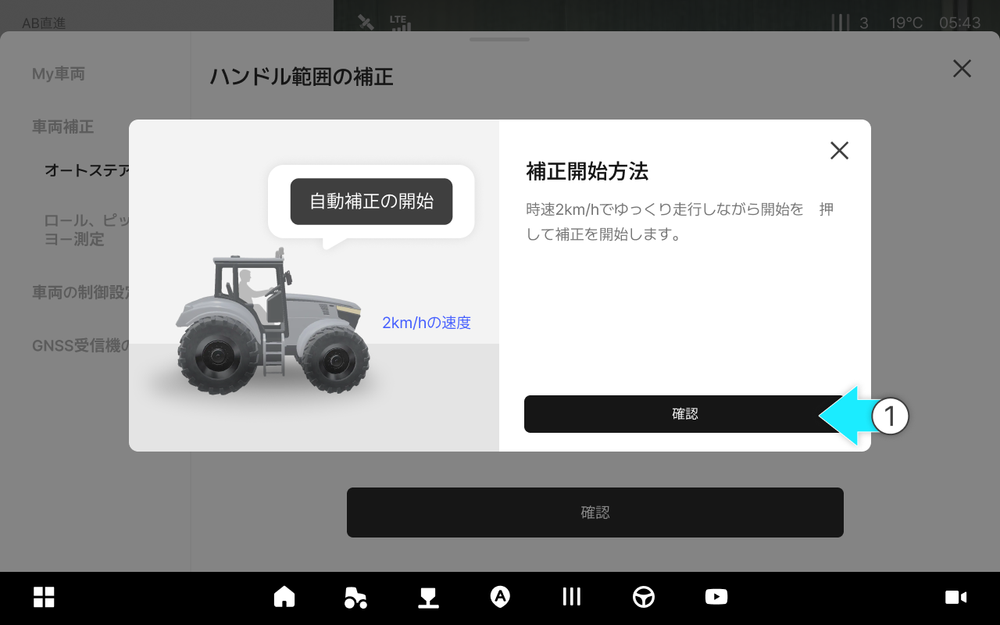<figcaption></figcaption></figure>



案内に従って\[時速2km]で走行しながら、\[自動補正の開始]を押してください。

<figure>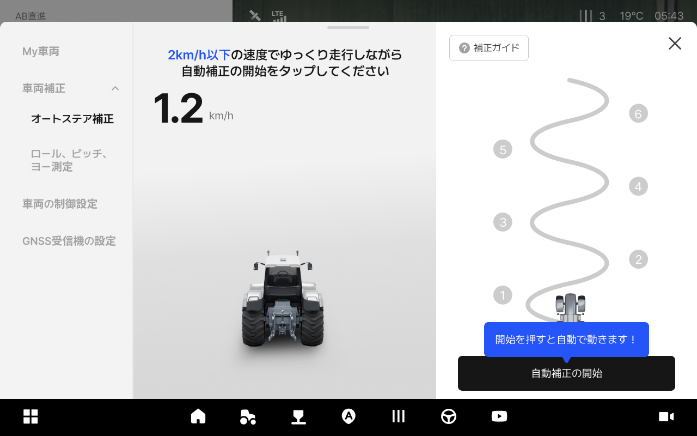<figcaption></figcaption></figure>


トラクターの制限速度である2km/hを超過すると、ボタンは有効になりません。



トラクターが停止した場合、直進ステアリング補正は最初から再スタートとなります。



直進ステアリング補正中にはハンドルが自動で動きます。 自動操作中にはハンドルを無理に操作しないでください。




引き続き2km/h以下で走行してください。

<figure><figcaption></figcaption></figure>


補正に必要な面積が確保できない場合や、走行不可の場合は緊急停止を押してください。




補正が完了すると\[確認]ボタンが有効になります。ボタンを押して補正を完了してください。

<figure>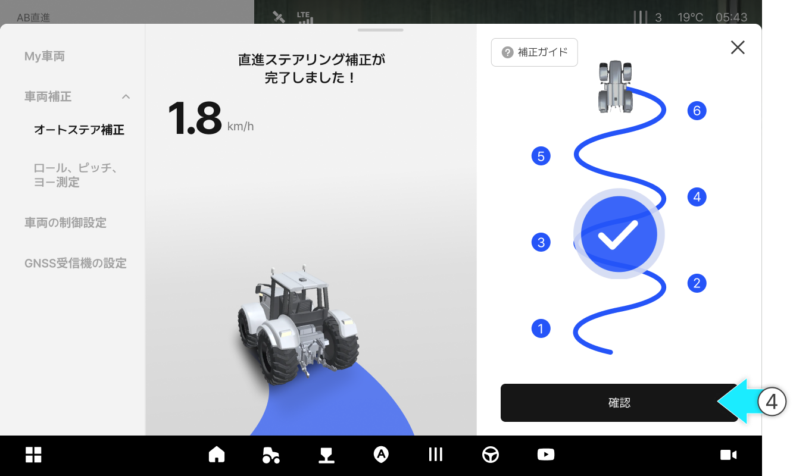<figcaption></figcaption></figure>



***

#### 田植え機のオートステア補正

1. ハンドル範囲の補正



「全ての補正を進める」をタップするとオートステア補正が開始されます。

<figure>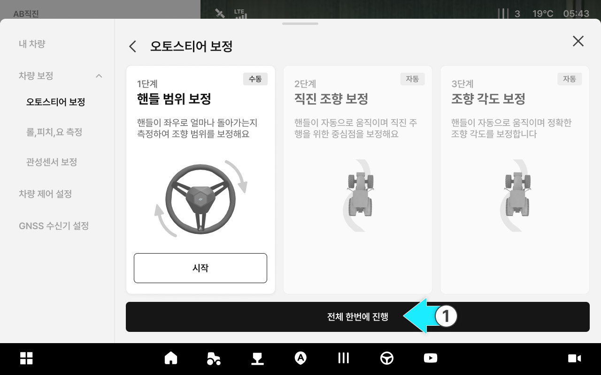<figcaption></figcaption></figure>


各段階の開始ボタンをタップすると、その段階の補正のみを進めることができます。




案内に従ってハンドルを左いっぱいに切った後、車両を止めて\[確認]をタップしてください。

<figure><figcaption></figcaption></figure>



案内に従ってハンドルを右いっぱいに切った後、車両を止めて\[確認]をタップしてください。

<figure><figcaption></figcaption></figure>



案内に従ってハンドルを回し、車輪を中央に位置させます。\
その後車両を停止し、\[確認]をタップしてください。

<figure><figcaption></figcaption></figure>



ハンドル範囲の補正が完了します。 \[直進ステアリング補正]をタップし、\
次の補正を開始してください。

<figure><figcaption></figcaption></figure>



2. 直進ステアリング補正



直進ステアリング補正に必要なご案内をお読みになった後、\[確認]をタップしてください。

<figure>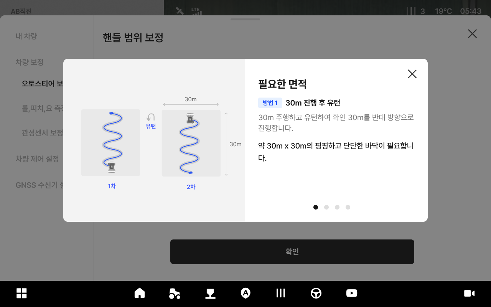<figcaption></figcaption></figure>

<figure><figcaption></figcaption></figure>

<figure>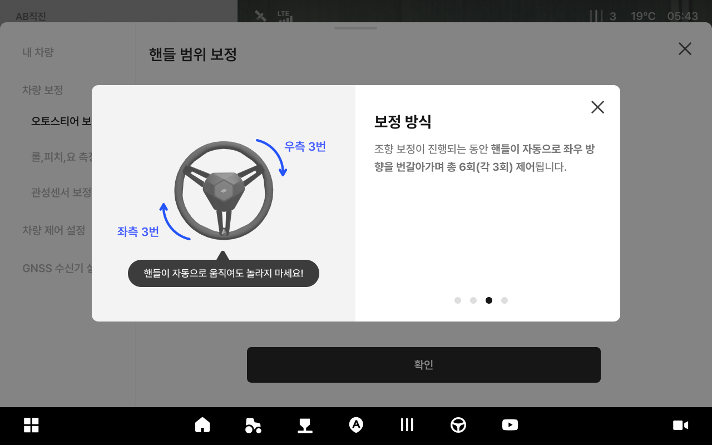<figcaption></figcaption></figure>

<figure>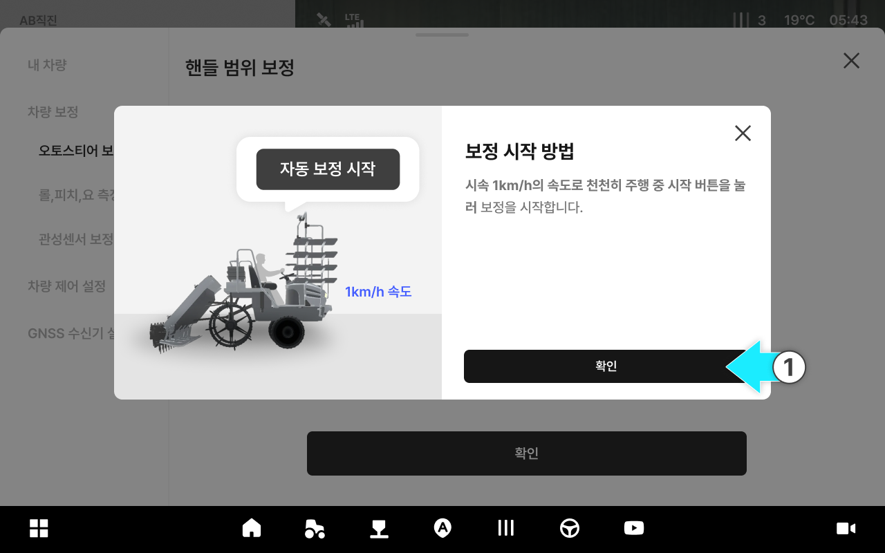<figcaption></figcaption></figure>



案内に従って\[時速1km]で走行しながら、\[自動補正の開始]を押してください。

<figure><figcaption></figcaption></figure>


田植え機の制限速度である1km/hを超過すると、ボタンは有効になりません。



田植え機が停止した場合、直進ステアリング補正は最初から再スタートとなります。



直進ステアリング補正中にはハンドルが自動で動きます。\
自動操作中にはハンドルを無理に操作しないでください。




지속해서 1km이하로 주행한다.

<figure><figcaption></figcaption></figure>


補正に必要な面積が確保できない場合や、走行不可の場合は緊急停止を押してください。




補正が完了すると、\[ステアリング角度補正の開始]ボタンが有効になります。ボタンを押して次の補正を進めてください。

<figure>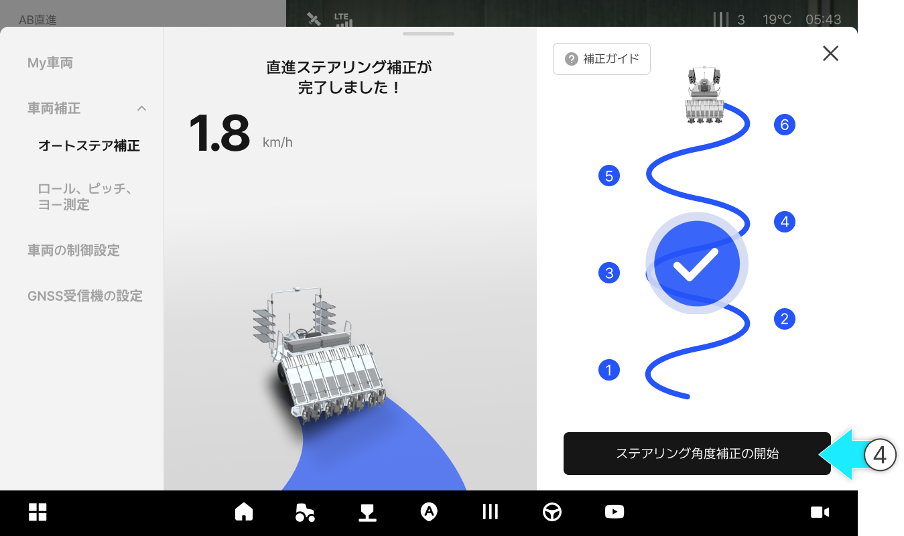<figcaption></figcaption></figure>



3. ステアリング角度補正



案内に従って\[時速1km]で走行し、\[自動補正の開始]をタップしてください。

<figure>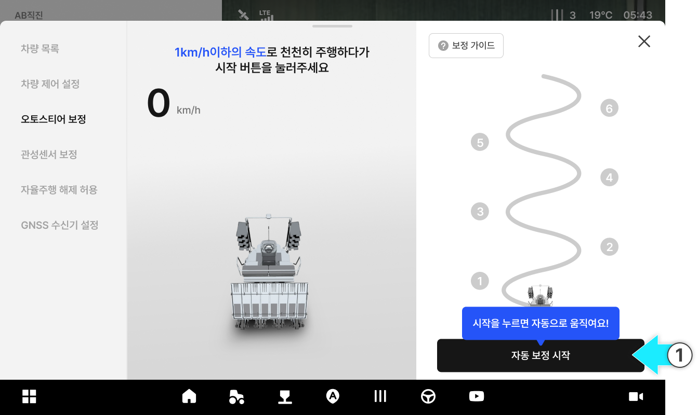<figcaption></figcaption></figure>


田植機の制限速度である1km/hを超過すると、ボタンは有効になりません。



田植え機が停止した場合、ステアリング角度補正は最初から再スタートとなります。



ステアリング確度補正中にはハンドルが自動で動きます。\
自動操作中にはハンドルを無理に操作しないでください。




引き続き1km/h未満で走行してください。

<figure>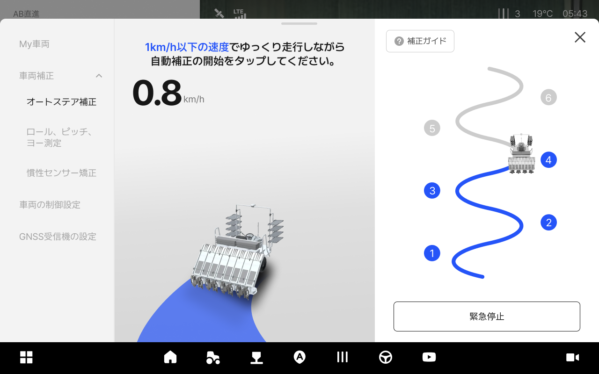<figcaption></figcaption></figure>


補正に必要な面積が確保できない場合や、走行不可の場合は、緊急停止を押してください。




補正が完了すると\[確認]ボタンが有効になります。 ボタンを押して補正を完了してください。

<figure>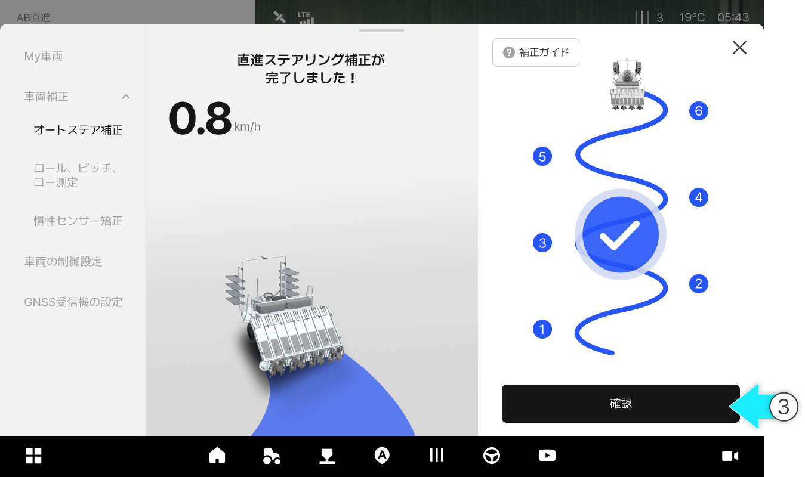<figcaption></figcaption></figure>


