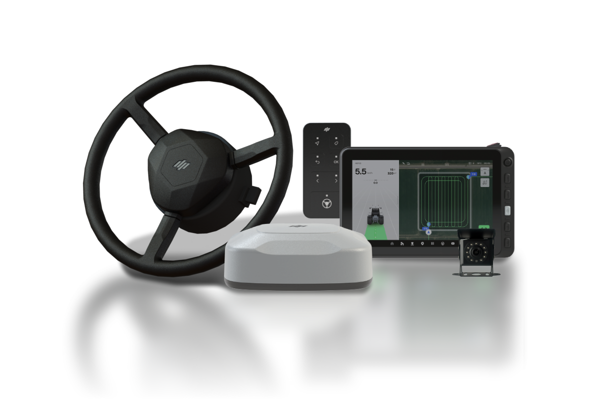

---
metaLinks:
  alternates:
    - https://app.gitbook.com/s/8Sqfw92xyQ8XV1LQEpTt/
---

# 플루바 아이온 Service Manual

<figure><figcaption></figcaption></figure>

### 목차

<a href="user-manual-info.md">서비스 메뉴얼 정보</a>

<table data-card-size="large" data-view="cards" data-full-width="true"><thead><tr><th></th><th data-hidden data-card-target data-type="content-ref"></th></tr></thead><tbody><tr><td>서비스 메뉴얼 기본 정보</td><td><a href="user-manual-info.md">user-manual-info.md</a></td></tr><tr><td>영상 가이드</td><td><a href="/broken/pages/Sjzm5X0JNymkkikqASjO">Broken link</a></td></tr></tbody></table>

<a href="/broken/pages/Hnq5ps1PTfVnthyiDkv2">주문/설치</a>

<table data-card-size="large" data-view="cards" data-full-width="true"><thead><tr><th></th><th data-hidden data-card-target data-type="content-ref"></th></tr></thead><tbody><tr><td>플루바 아이온 소개</td><td><a href="/broken/pages/PeFefyuWBLnYcWnunFJ7">Broken link</a></td></tr><tr><td>전동 스티어링 휠</td><td><a href="order-installation/overview/electric-steering-wheel.md">electric-steering-wheel.md</a></td></tr><tr><td>GNSS 수신기</td><td><a href="order-installation/overview/gnss-receiver.md">gnss-receiver.md</a></td></tr><tr><td>태블릿</td><td><a href="order-installation/overview/tablet.md">tablet.md</a></td></tr><tr><td>스위치</td><td><a href="order-installation/overview/switch.md">switch.md</a></td></tr><tr><td>카메라</td><td><a href="order-installation/overview/camera.md">camera.md</a></td></tr></tbody></table>

<a href="/broken/pages/LJm8CV0ry1K8NPVMKZ2f">사용법</a>

<table data-card-size="large" data-view="cards" data-full-width="true"><thead><tr><th></th><th data-hidden data-card-target data-type="content-ref"></th></tr></thead><tbody><tr><td>소프트웨어 업데이트(OTA)</td><td><a href="/broken/pages/ts8JHILNFE1wyzk0Wc2I">Broken link</a></td></tr></tbody></table>

<a href="others/initial-setup.md">고객 불편사항 대응 방법</a>

<table data-card-size="large" data-view="cards" data-full-width="true"><thead><tr><th></th><th data-hidden data-card-target data-type="content-ref"></th></tr></thead><tbody><tr><td>경로플래닝 설정 방법</td><td><a href="order-installation/driving-1/route-planning-settings.md">route-planning-settings.md</a></td></tr><tr><td>AB직진</td><td><a href="/broken/pages/pMgMOUYtTr3Zpc0qQTSV">Broken link</a></td></tr><tr><td>A+직진</td><td><a href="order-installation/driving-1/a-plus-straight.md">a-plus-straight.md</a></td></tr><tr><td>사각주행</td><td><a href="order-installation/driving-1/square-drive.md">square-drive.md</a></td></tr><tr><td>자동 경로 (Pluava AI)</td><td><a href="/broken/pages/l3Dz43CGw2vLUKVgwhPl">Broken link</a></td></tr></tbody></table>

<a href="others/driving/">기타 어드민 사용 방법</a>

<table data-card-size="large" data-view="cards" data-full-width="true"><thead><tr><th></th><th data-hidden data-card-target data-type="content-ref"></th></tr></thead><tbody><tr><td>유턴 설정 방법</td><td><a href="/broken/pages/1Al7u3hGNO6iuC0fCoct">Broken link</a></td></tr></tbody></table>

