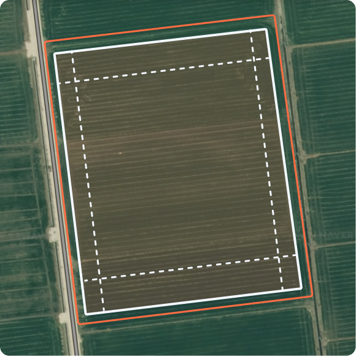

---
metaLinks:
  alternates:
    - >-
      https://app.gitbook.com/s/8Sqfw92xyQ8XV1LQEpTt/undefined/driving-1/farm-management
---

# 작업지 설정

### 작업지 설정

작업지 설정은 고객이 사용할 농장, 농장 소유자, 필드, 헤드랜드를 등록·설정하는 과정입니다.

작업지 설정은 아래 순서로 진행합니다.

1. **농장 등록**

* 현재 위치를 기준으로 기본 생성됩니다.

{% embed url="https://www.figma.com/design/3caVmkxMdvjppUG5NWSjbb/%EC%B0%A8%EC%84%B8%EB%8C%80-%EB%8C%80%EB%A6%AC%EC%A0%90-%EB%A9%94%EB%89%B4%EC%96%BC?node-id=1614-12566&t=Z6KsYEEodpFnLnOH-1" %}

2. **농장 소유자 등록**

* 고객 계정을 기준으로 기본 생성됩니다.

{% embed url="https://www.figma.com/design/3caVmkxMdvjppUG5NWSjbb/%EC%B0%A8%EC%84%B8%EB%8C%80-%EB%8C%80%EB%A6%AC%EC%A0%90-%EB%A9%94%EB%89%B4%EC%96%BC?node-id=1614-12447&t=Z6KsYEEodpFnLnOH-1" %}

3. **필드 등록**

* 작업을 진행하려면 필드를 등록해야 합니다.
* 아래 [필드 등록](farm-management.md#undefined-1)을 참고하세요.

4. **헤드랜드 등록**

* 작업 환경에 맞게 헤드랜드를 등록합니다.
* 아래 [헤드랜드](farm-management.md#undefined-5)를 참고하세요.

***

### 필드 등록

**필드는 무엇인가요?**

> 필드는 실제로 작업이 이루어지는 작업 구역입니다.
지도에서 선택하거나, 경계를 직접 만들어 등록할 수 있습니다.

#### 필드 등록 기능 진입



필드 탭을 선택합니다.

{% embed url="https://www.figma.com/design/3caVmkxMdvjppUG5NWSjbb/%EC%B0%A8%EC%84%B8%EB%8C%80-%EB%8C%80%EB%A6%AC%EC%A0%90-%EB%A9%94%EB%89%B4%EC%96%BC?node-id=1614-10526&t=Z6KsYEEodpFnLnOH-1" %}



 필드 추가 버튼을 누릅니다.

{% embed url="https://www.figma.com/design/3caVmkxMdvjppUG5NWSjbb/%EC%B0%A8%EC%84%B8%EB%8C%80-%EB%8C%80%EB%A6%AC%EC%A0%90-%EB%A9%94%EB%89%B4%EC%96%BC?node-id=1614-9454&t=Z6KsYEEodpFnLnOH-1" %}



지도에서 등록 옵션을 선택한 후 \[확인]을 누릅니다.

{% embed url="https://www.figma.com/design/3caVmkxMdvjppUG5NWSjbb/%EC%B0%A8%EC%84%B8%EB%8C%80-%EB%8C%80%EB%A6%AC%EC%A0%90-%EB%A9%94%EB%89%B4%EC%96%BC?node-id=1665-12910&t=Z6KsYEEodpFnLnOH-1" %}



지도에서 필드를 선택합니다.

<figure><figcaption></figcaption></figure>


기본 필드 등록은 \[지도에서 선택]으로 설정되어 있습니다.
경계를 직접 만들려면 \[직접 그리기]를 누릅니다.




경계 생성 후 \[진입로 설정]을 누른 다음, 원하는 위치를 선택합니다.

{% embed url="https://www.figma.com/design/3caVmkxMdvjppUG5NWSjbb/%EC%B0%A8%EC%84%B8%EB%8C%80-%EB%8C%80%EB%A6%AC%EC%A0%90-%EB%A9%94%EB%89%B4%EC%96%BC?node-id=1614-11904&t=Z6KsYEEodpFnLnOH-1" %}



진입출로 위치 설정 팝업에서 \[같은 위치로 설정]을 선택합니다.

{% embed url="https://www.figma.com/design/3caVmkxMdvjppUG5NWSjbb/%EC%B0%A8%EC%84%B8%EB%8C%80-%EB%8C%80%EB%A6%AC%EC%A0%90-%EB%A9%94%EB%89%B4%EC%96%BC?node-id=1614-11307&t=Z6KsYEEodpFnLnOH-1" %}


\[진출로 따로 설정]을 선택한 경우, 진입/진출 위치를 각각 지정해야 합니다.





진출입로 설정이 완료되고 필드 정보를 입력한 뒤 \[등록]을 누릅니다.

{% embed url="https://www.figma.com/design/3caVmkxMdvjppUG5NWSjbb/%EC%B0%A8%EC%84%B8%EB%8C%80-%EB%8C%80%EB%A6%AC%EC%A0%90-%EB%A9%94%EB%89%B4%EC%96%BC?node-id=1614-11476&t=Z6KsYEEodpFnLnOH-1" %}



필드 등록이 완료됩니다.

<figure><figcaption></figcaption></figure>



***

#### 지도에서 필드 등록 화면 설명

<figure><figcaption></figcaption></figure>

&#x20;.svg>) **주소 검색으로 필드 선택**

* 주소 검색으로 필드를 선택합니다.
  *

      <figure><figcaption></figcaption></figure>

&#x20;.svg>) **직접 그리기**

* 필드 영역을 직접 점을 찍어 생성합니다.
  *

      <figure><figcaption></figcaption></figure>

&#x20;.svg>) **지도에서 선택**

* 지도에서 필드를 직접 눌러 선택합니다. \[지도에서 등록]이 기본으로 설정되어있습니다.

&#x20;.svg>) **이전**

* 이전 단계로 돌아갑니다.

&#x20;.svg>) **다음**

* 다음 단계로 넘어갑니다.

&#x20;.svg>) **나가기**

* 필드 추가하기 화면에서 나갑니다.

&#x20; **내 위치로 가기**

* 현재 내 위치로 지도를 이동합니다.

&#x20; **진(출)입로 설정**

* 진출입로 위치를 설정합니다. 필드를 선택한 후 해당 버튼을 사용할 수 있습니다.
진출입로는 같은 위치로 설정하거나, 각각 따로 설정할 수 있으며, 수정 버튼을 통해\
  위치를 변경할 수 있습니다.

&#x20; **경계 등록 완료**

* 경계 등록을 완료합니다. 진출입로를 선택한 후 해당 버튼을 사용할 수 있습니다.

***

#### 지도에서 필드 등록 모달 설명

<figure><figcaption></figcaption></figure>

&#x20;.svg>) **필드 이름**

* 대표로 표기할 필드 이름을 입력합니다.

&#x20;.svg>) **농장**

* 필드와 연결할 농장을 선택합니다.

&#x20;.svg>) **농장 소유자**

* 필드와 연결할 농장 소유자를 선택합니다.

&#x20;.svg>) **작물**

* 현재 필드에서 작업 중인 작물을 추가합니다.

&#x20;.svg>) **메모**

* 추가적인 정보를 메모로 남깁니다.

***

### 헤드랜드 등록

**헤드랜드는 무엇인가요?**

> 헤드랜드는 필드 가장자리에서 안전하게 회전하거나 작업기를 조작할 수 있도록 확보하는 여유 구간입니다.
 필드 경계에서 설정한 거리만큼 안쪽으로 만들어지며, 작업 환경에 맞춰 폭(거리)을 조정할 수 있습니다.

***

#### 헤드랜드 등록 진입



My Farm의 헤드랜드 항목을 누릅니다.

{% embed url="https://www.figma.com/design/3caVmkxMdvjppUG5NWSjbb/%EC%B0%A8%EC%84%B8%EB%8C%80-%EB%8C%80%EB%A6%AC%EC%A0%90-%EB%A9%94%EB%89%B4%EC%96%BC?node-id=1665-12944&t=Z6KsYEEodpFnLnOH-1" %}



 헤드랜드 생성 버튼을 누릅니다.

{% embed url="https://www.figma.com/design/3caVmkxMdvjppUG5NWSjbb/%EC%B0%A8%EC%84%B8%EB%8C%80-%EB%8C%80%EB%A6%AC%EC%A0%90-%EB%A9%94%EB%89%B4%EC%96%BC?node-id=1665-14226&t=Z6KsYEEodpFnLnOH-1" %}



원하는 설정 옵션을 선택하고 확인을 누르면 헤드랜드 생성이 시작됩니다.

{% embed url="https://www.figma.com/design/3caVmkxMdvjppUG5NWSjbb/%EC%B0%A8%EC%84%B8%EB%8C%80-%EB%8C%80%EB%A6%AC%EC%A0%90-%EB%A9%94%EB%89%B4%EC%96%BC?node-id=1665-14984&t=Z6KsYEEodpFnLnOH-1" %}



헤드랜드 설정 모달에서 세부 설정을 입력 후 \[확인]을 누릅니다.

{% embed url="https://www.figma.com/design/3caVmkxMdvjppUG5NWSjbb/%EC%B0%A8%EC%84%B8%EB%8C%80-%EB%8C%80%EB%A6%AC%EC%A0%90-%EB%A9%94%EB%89%B4%EC%96%BC?node-id=1665-15740&t=Z6KsYEEodpFnLnOH-1" %}



헤드랜드 생성이 완료됩니다.

{% embed url="https://www.figma.com/design/3caVmkxMdvjppUG5NWSjbb/%EC%B0%A8%EC%84%B8%EB%8C%80-%EB%8C%80%EB%A6%AC%EC%A0%90-%EB%A9%94%EB%89%B4%EC%96%BC?node-id=1665-16476&t=Z6KsYEEodpFnLnOH-1" %}



***

#### 헤드랜드 설정 옵션

<figure><figcaption></figcaption></figure>

#### 헤드랜드 표시 라인 설명

<figure><figcaption></figcaption></figure>

&#x20;.svg>) **필드 경계 오프셋 표시선**

* 붉은 실선으로 표시됩니다.

&#x20;.svg>) **필드 경계선**

* 흰 실선으로 표시됩니다.

&#x20;.svg>) **헤드랜드 표시선**

* 흰 점선으로 표시됩니다.

***

#### 전체 헤드랜드

모든 방향에 동일한 헤드랜드 적용합니다. 빠르고 간단한 설정이 가능합니다.

<figure><figcaption></figcaption></figure>

**전체 헤드랜드 설정 모달**

<figure><figcaption></figcaption></figure>

&#x20;.svg>) **필드 선택**

* 적용할 헤드랜드 필드를 선택합니다.

&#x20;.svg>) **헤드랜드 이름**

* 구분할 헤드랜드 이름을 표기합니다.

&#x20;.svg>) **헤드랜드 거리**

* 헤드랜드 거리를 수치로 조정합니다.
  * 

&#x20;.svg>) **헤드랜드 개수**

* 헤드랜드 갯수를 조정합니다.
  * 헤드랜드 1개 설정 시\
    
  * 헤드랜드 2개 설정 시\
    

&#x20;.svg>) **필드 경계 오프셋**

* 수치로 필드 경계를 조정합니다. On/off로 끄고 킬 수 있으며\
  +는 바깥쪽, -는 안쪽으로 이동합니다.
  * +로 수치 설정 시\
    
  * -로 수치 설정 시\
    

&#x20;.svg>) **작업기**

* 작업할 작업기를 선택합니다.

&#x20; **메모**

* 추가적인 정보를 메모로 남깁니다.

***

#### 부분 헤드랜드

필요한 구간만 선택해서 헤드랜드를 생성합니다. 위험 구간만 안전하게, 나머지는 최대 작업 면적 확보할 수 있습니다.

<figure><figcaption></figcaption></figure>

**부분 헤드랜드 설정 모달**

<figure><figcaption></figcaption></figure>

&#x20;.svg>) **필드 선택**

* 적용할 헤드랜드 필드를 선택합니다.

&#x20;.svg>) **헤드랜드 이름**

* 구분할 헤드랜드 이름을 표기합니다.

&#x20;.svg>) **작업기**

* 작업할 작업기를 선택합니다.

&#x20;.svg>) **헤드랜드 개수**

* 헤드랜드 갯수를 조정합니다.
  *  번의 헤드랜드 1개 설정 시\
    
  *  번의 헤드랜드 3개 설정 시\
    

&#x20;.svg>) **헤드랜드 거리**

* 헤드랜드 거리를 수치로 조정합니다.
  * 

&#x20;.svg>) **필드 경계 오프셋**

* 수치로 필드 경계를 조정합니다. On/off로 끄고 킬 수 있으며\
  +는 바깥쪽, -는 안쪽으로 이동합니다.
  * +로 수치 설정 시\
    
  * -로 수치 설정 시\
    

&#x20; **메모**

* 추가적인 정보를 메모로 남깁니다.
