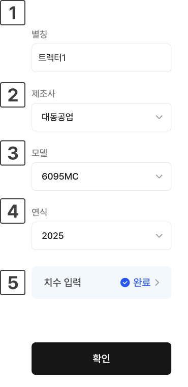

---
metaLinks:
  alternates:
    - >-
      https://app.gitbook.com/s/8Sqfw92xyQ8XV1LQEpTt/undefined/driving-1/undefined-3
---

# 차량 추가

### 차량 추가

작업에 사용할 차량을 추가합니다.


설정된 차량 수치 값은 태블릿의 [내 차량](../../usage/vehicle-settings/modifying-vehicle-information.md)에서 확인하고 변경할 수 있습니다.


***

#### 차량 추가 방법



등록할 차량 타입을 선택한 후 \[선택 완료]를 누릅니다.

{% embed url="https://www.figma.com/design/3caVmkxMdvjppUG5NWSjbb/%EC%B0%A8%EC%84%B8%EB%8C%80-%EB%8C%80%EB%A6%AC%EC%A0%90-%EB%A9%94%EB%89%B4%EC%96%BC?node-id=394-13433&t=PM760HAi58K4ZabD-1" %}



별칭, 제조사, 모델, 연식, 차량 치수를 입력한 뒤 \[차량 추가 완료]를 누릅니다.

{% embed url="https://www.figma.com/design/3caVmkxMdvjppUG5NWSjbb/%EC%B0%A8%EC%84%B8%EB%8C%80-%EB%8C%80%EB%A6%AC%EC%A0%90-%EB%A9%94%EB%89%B4%EC%96%BC?node-id=394-13677&t=PM760HAi58K4ZabD-1" %}



차량이 등록되고 GNSS 수신기와 연동됩니다. \[다음 단계로]를 누르면 작업기 추가로 이동합니다.

{% embed url="https://www.figma.com/design/3caVmkxMdvjppUG5NWSjbb/%EC%B0%A8%EC%84%B8%EB%8C%80-%EB%8C%80%EB%A6%AC%EC%A0%90-%EB%A9%94%EB%89%B4%EC%96%BC?node-id=394-13730&t=PM760HAi58K4ZabD-1" %}



***

#### 차량 추가 항목 설명

<figure><figcaption></figcaption></figure>

&#x20;.svg>) **별칭**

* 차량을 별칭을 표시합니다.

&#x20;.svg>) **제조사**

* 차량의 제조사를 선택합니다.

&#x20;.svg>) **모델**

* 차량의 모델을 선택합니다.

&#x20;.svg>) **연식**

* 차량의 연식을 선택합니다.

&#x20;.svg>) **치수 입력**

* 차량의 치수를 입력합니다. 차량 타입에 따라 입력 항목이 달라집니다.

***

#### 차량 치수 설정 항목


차량 치수 측정은 평평한 바닥에서 측정해야합니다.

경사지나 흙바닥에서 측정 시 정확하지 않을 수 있습니다.


#### 트랙터

{% embed url="https://www.figma.com/design/3caVmkxMdvjppUG5NWSjbb/%EC%B0%A8%EC%84%B8%EB%8C%80-%EB%8C%80%EB%A6%AC%EC%A0%90-%EB%A9%94%EB%89%B4%EC%96%BC?node-id=4564-12653&t=SwZxMUaCLKxCsKdr-1" %}

&#x20;.svg>) 전폭

* 트랙터의 폭을 의미하며 타이어 너비를 포함합니다.

{% embed url="https://www.figma.com/design/3caVmkxMdvjppUG5NWSjbb/%EC%B0%A8%EC%84%B8%EB%8C%80-%EB%8C%80%EB%A6%AC%EC%A0%90-%EB%A9%94%EB%89%B4%EC%96%BC?node-id=4564-12297&t=SwZxMUaCLKxCsKdr-1" %}

&#x20;.svg>) 전방-전륙 축

* 트랙터의 본네트 가장 앞에서부터(웨이트 미포함) 전륜 축 중심까지의 거리입니다.

{% embed url="https://www.figma.com/design/3caVmkxMdvjppUG5NWSjbb/%EC%B0%A8%EC%84%B8%EB%8C%80-%EB%8C%80%EB%A6%AC%EC%A0%90-%EB%A9%94%EB%89%B4%EC%96%BC?node-id=4564-12387&t=SwZxMUaCLKxCsKdr-1" %}

&#x20;.svg>) 휠 베이스

* 트랙터의 앞바퀴 중심과 뒷바퀴 중심 간의 거리입니다.

{% embed url="https://www.figma.com/design/3caVmkxMdvjppUG5NWSjbb/%EC%B0%A8%EC%84%B8%EB%8C%80-%EB%8C%80%EB%A6%AC%EC%A0%90-%EB%A9%94%EB%89%B4%EC%96%BC?node-id=4564-12331&t=SwZxMUaCLKxCsKdr-1" %}

&#x20;.svg>) 후륜 축-히치

* 트랙터의 후륜 축 중심에서 히치까지의 수평 거리입니다.

{% embed url="https://www.figma.com/design/3caVmkxMdvjppUG5NWSjbb/%EC%B0%A8%EC%84%B8%EB%8C%80-%EB%8C%80%EB%A6%AC%EC%A0%90-%EB%A9%94%EB%89%B4%EC%96%BC?node-id=4564-12355&t=SwZxMUaCLKxCsKdr-1" %}

&#x20;.svg>) 지면-후륜축

* 지면에서부터 트랙터의 후륜 축까지의 수직 거리입니다.

{% embed url="https://www.figma.com/design/3caVmkxMdvjppUG5NWSjbb/%EC%B0%A8%EC%84%B8%EB%8C%80-%EB%8C%80%EB%A6%AC%EC%A0%90-%EB%A9%94%EB%89%B4%EC%96%BC?node-id=4564-12378&t=SwZxMUaCLKxCsKdr-1" %}

&#x20;.svg>) 지면-상부링크

* 지면에서부터 트랙터의 상부 링크까지의 수직 거리입니다.

{% embed url="https://www.figma.com/design/3caVmkxMdvjppUG5NWSjbb/%EC%B0%A8%EC%84%B8%EB%8C%80-%EB%8C%80%EB%A6%AC%EC%A0%90-%EB%A9%94%EB%89%B4%EC%96%BC?node-id=4564-12319&t=SwZxMUaCLKxCsKdr-1" %}

#### 이앙기

{% embed url="https://www.figma.com/design/3caVmkxMdvjppUG5NWSjbb/%EC%B0%A8%EC%84%B8%EB%8C%80-%EB%8C%80%EB%A6%AC%EC%A0%90-%EB%A9%94%EB%89%B4%EC%96%BC?node-id=4564-12652&t=SwZxMUaCLKxCsKdr-1" %}

&#x20;.svg>) 휠베이스

* 이앙기의 앞바퀴 중심과 뒷바퀴 중심 간의 거리입니다.

{% embed url="https://www.figma.com/design/3caVmkxMdvjppUG5NWSjbb/%EC%B0%A8%EC%84%B8%EB%8C%80-%EB%8C%80%EB%A6%AC%EC%A0%90-%EB%A9%94%EB%89%B4%EC%96%BC?node-id=4564-12344&t=SwZxMUaCLKxCsKdr-1" %}

&#x20;.svg>) 전방-전륙 축

* 이앙기의 가장 앞 부분에서부터 전륜 축 중심까지의 거리입니다.

{% embed url="https://www.figma.com/design/3caVmkxMdvjppUG5NWSjbb/%EC%B0%A8%EC%84%B8%EB%8C%80-%EB%8C%80%EB%A6%AC%EC%A0%90-%EB%A9%94%EB%89%B4%EC%96%BC?node-id=4564-12405&t=SwZxMUaCLKxCsKdr-1" %}

&#x20;.svg>) 후륜 축-차량 끝

* 이앙기의 후륜 축 중심에서 차량 끝까지의 수평 거리입니다.

{% embed url="https://www.figma.com/design/3caVmkxMdvjppUG5NWSjbb/%EC%B0%A8%EC%84%B8%EB%8C%80-%EB%8C%80%EB%A6%AC%EC%A0%90-%EB%A9%94%EB%89%B4%EC%96%BC?node-id=4564-12367&t=SwZxMUaCLKxCsKdr-1" %}

&#x20;.svg>) 전폭

* 이앙기의 폭을 의미하며 타이어 너비를 포함합니다.

{% embed url="https://www.figma.com/design/3caVmkxMdvjppUG5NWSjbb/%EC%B0%A8%EC%84%B8%EB%8C%80-%EB%8C%80%EB%A6%AC%EC%A0%90-%EB%A9%94%EB%89%B4%EC%96%BC?node-id=4564-12307&t=SwZxMUaCLKxCsKdr-1" %}

&#x20;.svg>) 지면-후륜축

* 지면에서부터 이앙기의 후륜 축까지의 수직거리입니다.

{% embed url="https://www.figma.com/design/3caVmkxMdvjppUG5NWSjbb/%EC%B0%A8%EC%84%B8%EB%8C%80-%EB%8C%80%EB%A6%AC%EC%A0%90-%EB%A9%94%EB%89%B4%EC%96%BC?node-id=4564-12421&t=SwZxMUaCLKxCsKdr-1" %}

&#x20;.svg>) 간격 편차

* 양방향 작업 주행 시 간격이 일정하지 않을 때 보정하기 위한 수치값입니다. (간격 편차의 절대값을 4로 나눈 수치를 입력)
