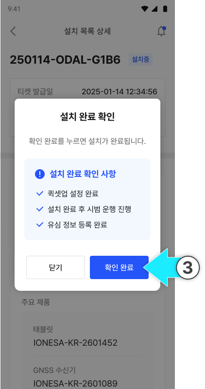
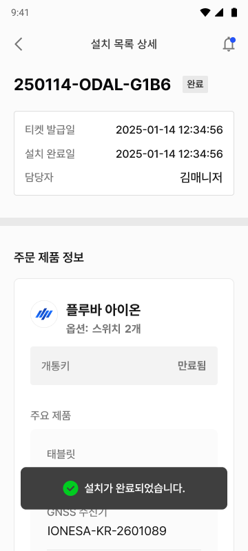
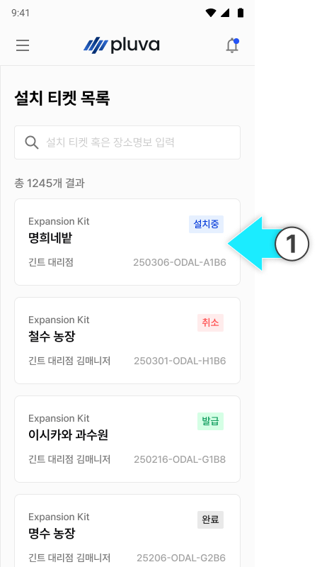
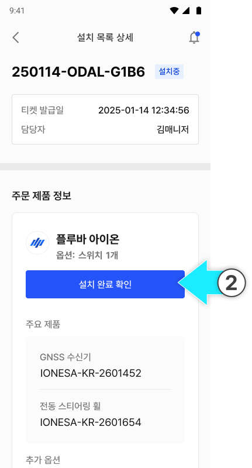
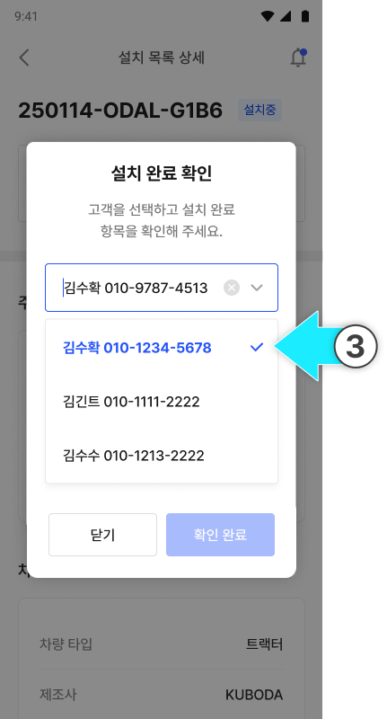
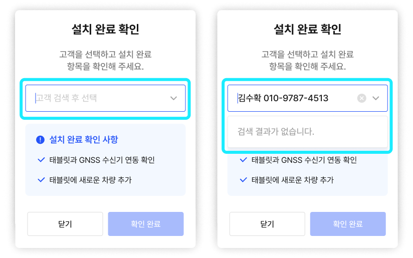

---
layout:
  width: default
  title:
    visible: true
  description:
    visible: false
  tableOfContents:
    visible: true
  outline:
    visible: true
  pagination:
    visible: true
  metadata:
    visible: true
  tags:
    visible: true
metaLinks:
  alternates:
    - >-
      https://app.gitbook.com/s/256Umh24fJVf6zNkZpSa/order-installation/installation-completed
---

# 설치 완료 확인

설치 및 퀵셋업 작업의 완료 항목을 점검하고, 설치 티켓 상태를 설치 완료로 변경하는 작업입니다.


**모든 설치 작업을 완료한 후 \[확인 완료]를 누릅니다.**&#x20;

* 제품이 정상적으로 장착되었습니다.
* 필요한 소프트웨어 설정이 모두 완료되었습니다.
* 고객이 즉시 서비스를 사용할 수 있는 상태입니다.


### 플루바 아이온(완제품)의 경우



설치 티켓 목록에서 설치 완료한 설치 티켓을 누릅니다.

<figure><figcaption></figcaption></figure>



\[설치 완료 확인]을 누릅니다.

<figure><figcaption></figcaption></figure>



설치 완료 확인 사항을 확인하고 \[확인 완료]를 누릅니다.

<figure><figcaption></figcaption></figure>



설치가 완료됩니다.

<figure><figcaption></figcaption></figure>



***

### 확장키트의 경우



설치 티켓 목록에서 설치 완료한 설치 티켓을 누릅니다.

<figure><figcaption></figcaption></figure>



\[설치 완료 확인]을 누릅니다.

<figure><figcaption></figcaption></figure>



제품을 설치한 고객 계정을 선택합니다.

<figure><figcaption></figcaption></figure>


고객 이름 또는 전화번호로 검색 시 고객 명단이 표시됩니다. 명단이 표시되지 않을 경우 검색어가 올바르게 입력되었는지 확인합니다.





설치 완료 확인 사항을 검토한 후 \[확인 완료]를 누릅니다.

<figure><figcaption></figcaption></figure>



설치가 완료됩니다.

<figure><figcaption></figcaption></figure>


