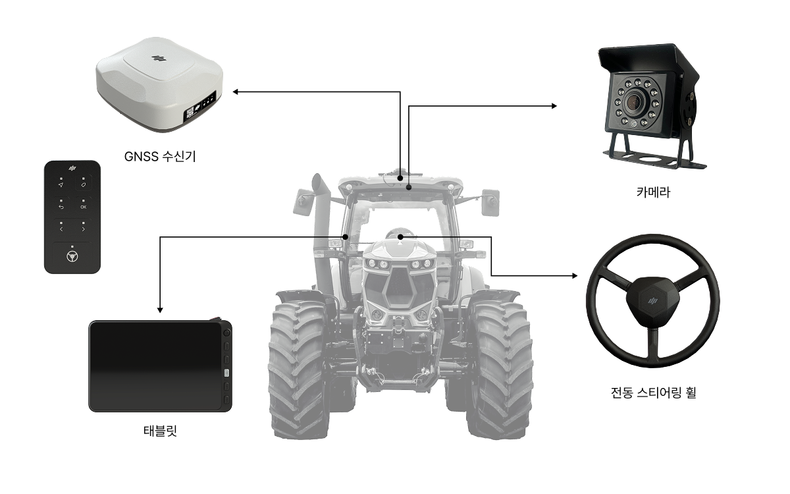

---
metaLinks:
  alternates:
    - >-
      https://app.gitbook.com/s/8Sqfw92xyQ8XV1LQEpTt/undefined/overview/pluva-ion-introduction
---

# 제품 설치 위치

### 제품 설치

각 구성품은 농기계에 지정된 위치에 설치됩니다.\
단, 실제 장착 위치는 차량 모델 및 장착 키트 구성에 따라 달라질 수 있습니다.

<figure><figcaption></figcaption></figure>

***

### 농기계 듀얼 사용법(Expansion Kit)

트랙터 및 이앙기에 모두 장착 가능하며, 필요에 따라 농기계 간 탈착 및 이동이 가능합니다.

<figure><figcaption></figcaption></figure>
