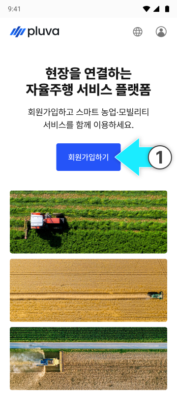
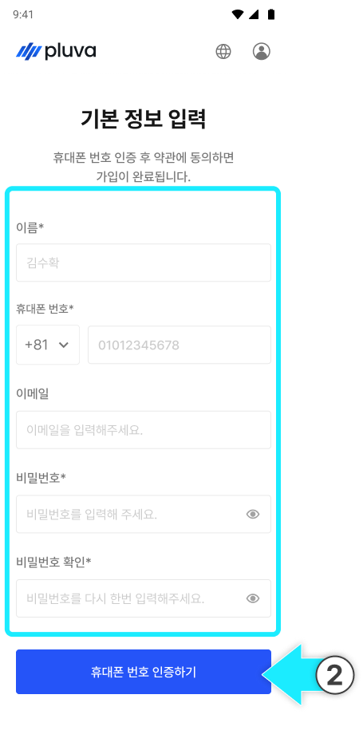
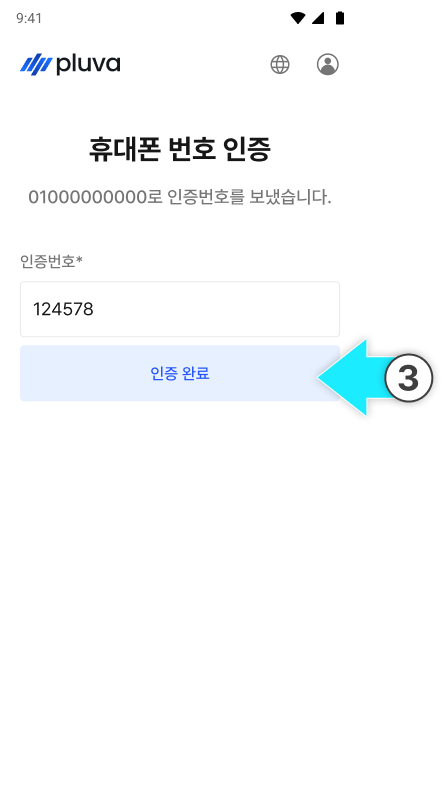
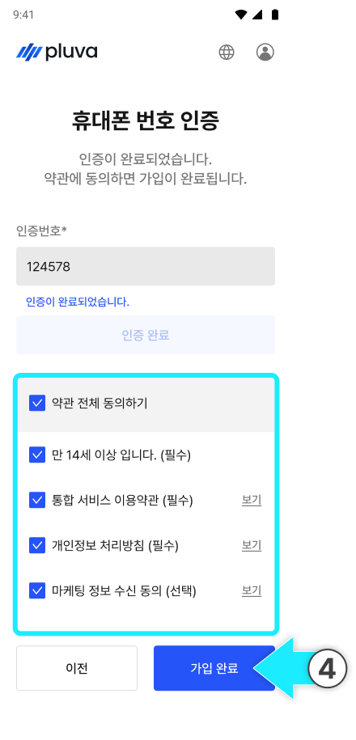
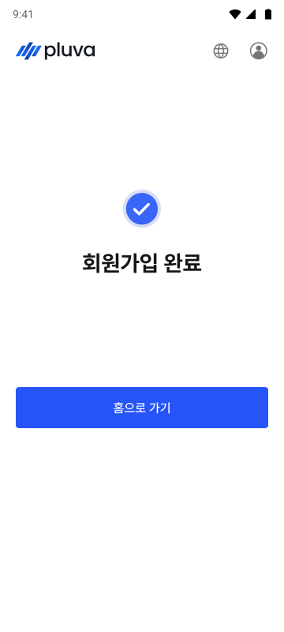

---
layout:
  width: default
  title:
    visible: false
  description:
    visible: false
  tableOfContents:
    visible: true
  outline:
    visible: true
  pagination:
    visible: true
  metadata:
    visible: true
  tags:
    visible: true
---

# 고객 계정 준비

### 고객 계정 준비

고객이 플루바 아이온을 사용하려면 미리 계정을 생성해야 합니다.\
고객의 계정 보유 여부를 확인하고, 아직 계정이 없다면 다음 내용을 참고하여 고객에게 안내합니다.



000페이지에 접속해 \[회원가입]을 누릅니다.

<figure><figcaption></figcaption></figure>



이름, 휴대폰 번호, 비밀번호를 입력한 후 \[휴대폰 번호 인증하기]를 누릅니다.

<figure><figcaption></figcaption></figure>


이메일은 선택 항목으로, 입력하지 않아도 회원가입을 진행할 수 있습니다.




휴대폰 번호로 전송된 인증번호 6자리를 입력하고 \[인증완료]를 누릅니다.

<figure><figcaption></figcaption></figure>



휴대폰 번호 인증이 완료되면 약관 동의를 체크하고 \[가입완료]를 누릅니다.

<figure><figcaption></figcaption></figure>



회원가입이 완료됩니다.

<figure><figcaption></figcaption></figure>


